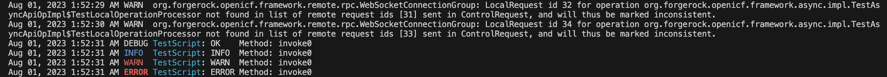

# Java Remote Connector Server Logging Configuration for Developing Connectors

In the ForgeRock Java Remote Connector Server (RCS), the logging is implemented with the classic version of [Logback](https://logback.qos.ch/index.html); currently, at [version 1.2.8](https://logback.qos.ch/news.html#1.2.8).

The official [Logback manual](https://logback.qos.ch/manual/index.html) can serve as a comprehensive guide on configuring debug logging with Logback. However, the manual also provides implementation details not needed for developing connectors and some of the configuration options it describes are not supported in RCS. To streamline the configuration process in the context of RCS, below, find an overview of applicable configuration options you can use in your remote connectors development.

> Use the links under the Contents section to quickly navigate to an area of interest. If you feel lost in a long chapter, navigate to the closest [Back to contents](#heading--contents) link and try again.
>
> The quoted paragraphs, such as this one, indicate that the content they provide is supplementary and optional.

## <a id="heading--contents" name="heading--contents"></a>Contents

* [Logback Configuration File](#heading--developing-logback-configuration-file)
    * [RCS version 1.5.20.18 and below](#heading--developing-logback-configuration-file-1.5.20.18-)
    * [RCS version 1.5.20.19 and above](#heading--developing-logback-configuration-file-1.5.20.19+)
* [Logback Configuration Elements](#heading--developing-logback-configuration-elements)
    * [`<configuration>` (allow for live  configuration updates)](#heading--developing-logback-configuration-elements-configuration)
    * [`<appender>` (choose destination, persistence, and appearance of logs)](#heading--developing-logback-configuration-elements-appender)
        * [`name`](#heading--developing-logback-configuration-elements-appender-name)
        * [`class`](#heading--developing-logback-configuration-elements-appender-class)
        * [`<file>`](#heading--developing-logback-configuration-elements-appender-file)
        * [`<rollingPolicy>`](#heading--developing-logback-configuration-elements-appender-rollingPolicy)
        * [`<encoder>`](#heading--developing-logback-configuration-elements-appender-encoder)
        * [`<filter>`](#heading--developing-logback-configuration-elements-appender-filter)
    * [`<logger>` (select debug level, logger (package/class), and appender(s))](#heading--developing-logback-configuration-elements-logger)
        * [`name`](#heading--developing-logback-configuration-elements-logger-name)
        * [`level`](#heading--developing-logback-configuration-elements-logger-level)
        * [`additivity`](#heading--developing-logback-configuration-elements-logger-additivity)
    * [`<root>` (default logger element)](#heading--developing-logback-configuration-elements-root)
* [Conclusion](#heading--developing-logback-conclusion)
* [Appendix](#heading--appendix)
    * [List of ICF Packages](#heading--appendix-icf-packages)
    * [Example Debug Logs](#heading--appendix-debug-logs)

## <a id="heading--developing-logback-configuration-file" name="heading--developing-logback-configuration-file"></a>Logback Configuration File

[Back to Contents](#heading--contents)

In order to load its logging configuration, RCS relies on `NOMINAL STEP` described in Logback's [Configuration at initialization](https://logback.qos.ch/manual/configuration.html#auto_configuration) doc.

The logging configuration defined in the default `logback.xml` file could be optionally changed/optimized for production use, as described in the [How do I enable debug logging and log rotation for the Java Remote Connector Server (RCS)?](https://backstage.forgerock.com/knowledge/kb/article/a38411747) Knowledge Base (KB) article.

For development purposes, however, you might want to create a separate Logback configuration file with the option to discard it after the development phase.

Starting with the version `1.5.20.19`, the location of the Logback configuration file is going to change.

> At the time of writing the currently available latest RCS version is `1.5.20.17`.

* <a id="heading--developing-logback-configuration-file-1.5.20.18-" name="heading--developing-logback-configuration-file-1.5.20.18-"></a>RCS version `1.5.20.18` and below

    [Back to Contents](#heading--contents)

    In RCS versions below `1.5.20.18`, by default, Logback in RCS is configured with an XML file deployed directly under a classpath location:

    `<connector-server-installation>/lib/framework/logback.xml`

    If you place a `logback-test.xml` file directly under RCS' classpath, the test version will take precedence over the default configuration saved in `logback.xml`.

    Alternatively, you can specify an arbitrary location for your debugging configuration file via a system property defined in the `OPENICF_OPTS` environment variable, which is accounted for by the Java RCS startup scripts.

    For example:

    ```sh
    export OPENICF_OPTS=-Dlogback.configurationFile=file:/opt/openicf/conf/logback-test.xml [ . . . ]
    ```

    > In order to take effect, the `OPENICF_OPTS` environment variable needs to be defined before Java RCS starts.

* <a id="heading--developing-logback-configuration-file-1.5.20.19+" name="heading--developing-logback-configuration-file-1.5.20.19+"></a>RCS version `1.5.20.19` and above

    [Back to Contents](#heading--contents)

    Starting with the version `1.5.20.19`, by default, RCS loads Logback configuration from:

    `<connector-server-installation>/conf/logback.xml`

    You can specify an alternative path to the configuration file via the `connectorserver.loggingConfigFile`:

    * You can save this configuration in `<connector-server-installation>/conf/ConnectorServer.properties`.

        For example:

        ```sh
        connectorserver.scope=fr:idm:*
        connectorserver.loggerClass=org.forgerock.openicf.common.logging.slf4j.SLF4JLog
        connectorserver.loggingConfigFile=conf/logback-test.xml
        ```

    * You can override the default value for `connectorserver.loggingConfigFile` and/or the one saved in `ConnectorServer.properties` with a namesake argument included in the `OPENICF_OPTS` environment variable—the same way you can override any property specified in the RCS configuration file.

        For example:

        ```sh
        OPENICF_OPTS=-Dconnectorserver.loggingConfigFile=conf/logback-test.xml [ . . . ]
        ```

You can start your development version of Logback configuration file with a copy of the default configuration included in a connector server installation (under one of the locations described above) or in the [General Access Connectors](https://stash.forgerock.org/projects/GA/repos/connectors-customers-ga/browse/openicf-zip/src/main/resources/lib/framework/logback.xml?at=refs%2Ftags%2F1.5.20.17) repository. Then, you can modify the default configuration according to your development needs.


## <a id="heading--developing-logback-configuration-elements" name="heading--developing-logback-configuration-elements"></a>Logback Configuration Elements

[Back to Contents](#heading--contents)

* <a id="heading--developing-logback-configuration-elements-configuration" name="heading--developing-logback-configuration-elements-configuration"></a>`<configuration( [ . . . ])>[ . . . ]</configuration>`

    [Back to Contents](#heading--contents)

    Optionally, in your development configuration, you can instruct Logback to [automatically reload configuration file upon modification](https://logback.qos.ch/manual/configuration.html#autoScan) and specify custom scanning period for monitoring the changes. You can also enable debug mode, which will reliably output status messages about logback configuration every time it changes.

    For example:

    `logback-test.xml`

    ```xml
    <configuration scan="true" scanPeriod="5 seconds" debug="true">

    [ . . . ]

    </configuration>
    ```

    With the `scan="true"` option, when a change in the configuration file is detected after the specified `scanPeriod`, the Logback configuration is going to be updated; the updated configuration will be displayed in the system output if `debug="true"`:

    ```sh
    19:57:19,137 |-INFO in ReconfigureOnChangeTask(born:1691006212156) - Detected change in configuration files.
    19:57:19,137 |-INFO in ReconfigureOnChangeTask(born:1691006212156) - Will reset and reconfigure context named [default]
    19:57:19,143 |-INFO in ch.qos.logback.classic.joran.action.ConfigurationAction - Will scan for changes in [file:/opt/openicf/conf/logback-test.xml]
    19:57:19,143 |-INFO in ch.qos.logback.classic.joran.action.ConfigurationAction - Setting ReconfigureOnChangeTask scanning period to 5 seconds
    [ . . . ]
    19:57:19,155 |-INFO in ch.qos.logback.classic.joran.action.ConfigurationAction - End of configuration.
    19:57:19,156 |-INFO in ch.qos.logback.classic.joran.JoranConfigurator@4d0984ed - Registering current configuration as safe fallback point
    ```

* <a id="heading--developing-logback-configuration-elements-appender" name="heading--developing-logback-configuration-elements-appender"></a>`<appender [ . . . ]>[ . . . ]</appender>`

    [Back to Contents](#heading--contents)

    An [appender configuration](https://logback.qos.ch/manual/configuration.html#configuringAppenders) can specify logs' destination, persistence, and appearance. It can also implement additional appender-specific format, layout, and filtering of the debug output.

    You have to define an appender in order to output your logs. However, changing the default appenders configuration shipped with RCS might not be your first priority. You can continue to use the existing appenders in new and existing [logger elements](#heading--developing-logback-configuration-elements-logger) described in the next chapter.

    If you need to improve the logs' appearance and readability or change the way they are preserved, you can modify the existing appender definitions and/or define new appender elements for use with particular loggers.

    You can change an appender behavior by using its attributes and nested elements:

    * <a id="heading--developing-logback-configuration-elements-appender-name" name="heading--developing-logback-configuration-elements-appender-name"></a>`name="<custom-name>"`

        [Back to Contents](#heading--contents)

        This name will be used as a reference to the appender element in logger elements, which will be described later.

    * <a id="heading--developing-logback-configuration-elements-appender-class" name="heading--developing-logback-configuration-elements-appender-class"></a>`class="<appender-class>"`

        [Back to Contents](#heading--contents)

        You can send debug information to the standard output using the [ch.qos.logback.core.ConsoleAppender](https://logback.qos.ch/manual/appenders.html#ConsoleAppender) class for immediate feedback and quick debugging.

        Saving debug output in log files with the [ch.qos.logback.core.FileAppender](https://logback.qos.ch/manual/appenders.html#FileAppender) or [ch.qos.logback.core.rolling.RollingFileAppender](https://logback.qos.ch/manual/appenders.html#RollingFileAppender) class, however, can yield the following advantages:

        * You can reliably collect logs over a period of time.

        * You can organize logs by packages and classes, "physically" separating them in files, including the option to do so by different connectors and/or different scripts.

        * Your IDE might be able to automatically apply coloring schema to the logs content, which can make it easier to digest.

    * <a id="heading--developing-logback-configuration-elements-appender-file" name="heading--developing-logback-configuration-elements-appender-file"></a>`<file>{path-to-log-file}</file>`

        [Back to Contents](#heading--contents)

        Under a `FileAppender` or a `RollingFileAppender`, in a `<file>` element, you can specify a system path relative to your RCS installation or an absolute path to the file where the new logs will be saved.

        You can use [Variable Substitution](https://logback.qos.ch/manual/configuration.html#variableSubstitution) inside the element. This will allow for [Uniquely named files](https://logback.qos.ch/manual/appenders.html#uniquelyNamed) for your logs, which can  help correlate the debug messages with the changes you introduce during development. When Logback configuration is re-instantiated, the variables set in the configuration file will be reset; thus, if you use these variables in the file names, you will be able to easily discern logging cycles in the file system.

    * <a id="heading--developing-logback-configuration-elements-appender-rollingPolicy" name="heading--developing-logback-configuration-elements-appender-rollingPolicy"></a>`<rollingPolicy [ . . . ]>[ . . . ]</rollingPolicy>`

        [Back to Contents](#heading--contents)

        In addition to or instead of uniquely named log files, you can implement a [ch.qos.logback.core.rolling.RollingFileAppender](https://logback.qos.ch/manual/appenders.html#RollingFileAppender), as described in the [How do I enable debug logging and log rotation for the Java Remote Connector Server (RCS)?](https://backstage.forgerock.com/knowledge/kb/article/a38411747) KB article and exampled in the default `logback.xml`.

        Note, that [ch.qos.logback.core.rolling.TimeBasedRollingPolicy](https://logback.qos.ch/manual/appenders.html#TimeBasedRollingPolicy) used in the KB article example, as a _time-based_ policy, defines _both_ archiving logic (that is, moving older logs to a separate file) _and_ the moment when the rollover event is triggered; hence, a separate [TriggeringPolicy](https://logback.qos.ch/manual/appenders.html#TriggeringPolicy) MUST NOT be added to the appender configuration in this case.

        For example:

        `logback-test.xml`

        ```xml
        <configuration scan="true" scanPeriod="4 seconds" debug="true">
            <timestamp key="timestampBySecond" datePattern="yyyyMMdd'T'HHmmss"></timestamp>

            <appender name="SCRIPT-FILE" class="ch.qos.logback.core.rolling.RollingFileAppender">
                <file>/opt/openicf/logs/Script-${timestampBySecond}.log</file>
                <append>true</append>
                <rollingPolicy class="ch.qos.logback.core.rolling.TimeBasedRollingPolicy">
                    <fileNamePattern>logs/Script-${timestampBySecond}-%d{yyyyMMdd-HH}.log</fileNamePattern>
                    <maxHistory>20</maxHistory>
                    <totalSizeCap>128KB</totalSizeCap>
                </rollingPolicy>
                <encoder>
                    <pattern>%date{"MMM dd, yyyy h:mm:ss a"} %-5level %logger: %msg %n</pattern>
                </encoder>
            </appender>

            [ . . . ]
        </configuration>
        ```

        `File system`

        ```
        openicf/logs/Script-20231013T015855-20231013-19.log
        openicf/logs/Script-20231013T015855-20231013-21.log
        openicf/logs/Script-20231013T015855.log
        ```

        Note that `<maxHistory>` in a time-based rolling policy defines a time span that can fit the number of time units used in the `%d` conversion specifier, and not the number of files to keep. This means that in the aforementioned example logs collected in the last twenty hours or up to 128 KB of the log content (specified in `<totalSizeCap>`) will be kept in the archive, whichever limitation comes first. Removing both properties or setting them to `0` will allow to collect logs indefinitely.

        To limit size of individual log files in an archive defined by a time-based policy, you can use [ch.qos.logback.core.rolling.SizeAndTimeBasedRollingPolicy](https://logback.qos.ch/manual/appenders.html#SizeAndTimeBasedRollingPolicy), which accepts an additional `<maxFileSize>` element.

        The time-based rolling policies will help correlate log files and runtime events; as such, these policies might prove the most effective log preservation strategy for both development and production.

        > If you need fixed number of log files archive window (instead of a time span-worth of logs defined in a time-based policy), you can use the highly inefficient and thus deprecated [FixedWindowRollingPolicy](https://logback.qos.ch/manual/appenders.html#FixedWindowRollingPolicy). In this case, you MUST include a separate [TriggeringPolicy](https://logback.qos.ch/manual/appenders.html#TriggeringPolicy) in your appender configuration.

    * <a id="heading--developing-logback-configuration-elements-appender-encoder" name="heading--developing-logback-configuration-elements-appender-encoder"></a>`<encoder [ . . . ]>[ . . . ]</encoder>`

        [Back to Contents](#heading--contents)

        As [stated in the Logback docs](https://logback.qos.ch/codes.html#layoutInsteadOfEncoder), you should use an [encoder](https://logback.qos.ch/manual/encoders.html) element inside an appender definition for writing events and controlling layout of the log content.

        > For example:
        >
        > `logback-test.xml`
        >
        > ```xml
        > [ . . . ]
        >
        > <appender name="SCRIPT-STDOUT" class="ch.qos.logback.core.ConsoleAppender">
        >     <encoder>
        >         <pattern>%date{"MMM dd, yyyy h:mm:ss a"} %highlight(%-5level) %cyan(%logger{35}): %msg %n</pattern><!-- 1 -->
        >     </encoder>
        > </appender>
        >
        > [ . . . ]
        >
        > <root level="OK"><!-- 2 -->
        >     <appender-ref ref="SCRIPT-STDOUT" />
        > </root>
        > ```
        >
        > `TestScript.groovy`
        >
        > ```groovy
        > log.ok 'OK'
        > log.info 'INFO'
        > log.warn 'WARN'
        > log.error 'ERROR'
        > ```
        >
        > `RCS logs`
        >
        > 
        >
        > 1. Logs' appearance can be defined in the `pattern` element.
        >
        >     In this example:
        >
        >     * [Coloring](https://logback.qos.ch/manual/layouts.html#coloring) can help visually distinguish logs produced by certain appenders, such as scripts, from the rest of debugging output in the terminal.
        >
        >         Coloring, however, could also come from external tools, such as IDE or deployment system.
        >
        >     * Adding character padding at the end of the level names, `%-5`, will result in the rest of the output being visually alined.
        >
        > 2. The [root](https://logback.qos.ch/manual/configuration.html#rootElement) logger element matches all packages and classes; and thus, by default, it outputs logs from script instances, unless more specifically named [non-additive](https://logback.qos.ch/manual/configuration.html#cumulative) logger elements are defined for particular [script packages](https://groovy-lang.org/structure.html#_package_names) and classes.

    * <a id="heading--developing-logback-configuration-elements-appender-filter" name="heading--developing-logback-configuration-elements-appender-filter"></a>`<filter [ . . . ]>[ . . . ]</filter>`

        [Back to Contents](#heading--contents)

        Out of the box, RCS supports [LevelFilter](https://logback.qos.ch/manual/filters.html#levelFilter) and [ThresholdFilter](https://logback.qos.ch/manual/filters.html#thresholdFilter). Using these filters, you can limit debugging output by a log level for all logger elements using this appender.

        For example:

        `logback-test.xml`

        ```xml
        [ . . . ]

        <appender name="STDOUT" class="ch.qos.logback.core.ConsoleAppender">
            <filter class="ch.qos.logback.classic.filter.LevelFilter">
                <level>OK</level><!-- 1 -->
            </filter>
            <encoder>
                <pattern>%date{"MMM dd, yyyy h:mm:ss a"} %-5level %logger: %msg %n</pattern><!-- 2 -->
            </encoder>
        </appender>

        [ . . . ]
        ```

        1. The output from every logger using this appender can be easily restricted to a particular debugging level with a [LevelFilter](https://logback.qos.ch/manual/filters.html#levelFilter) (or a log level threshold with a [ThresholdFilter](https://logback.qos.ch/manual/filters.html#thresholdFilter)) or turned "OFF".

        2. During development, you might want to remove restrictions from the logger name output; thus, allowing for full package names to be included in the logs, which can help to discern them.

            > The default [logger conversion word](https://logback.qos.ch/manual/layouts.html#logger) currently used in RCS, `%logger{35}`, allows for 35 characters output before abbreviating the logger package prefix segments starting from the left. The right-most class name is never abbreviated.
            >
            > For example, while log entries such as `o.i.f.i.a.l.LocalConnectorInfoManagerImpl` and `o.f.o.f.client.ConnectionManager` uniquely map to `org.identityconnectors.framework` and `org.forgerock.openicf.framework` packages respectively, outputting full package prefixes might still improve reading logs experience.
            >
            > On the other hand, you also have an option to reduce the clutter in the logs output by removing parts of the pattern and limiting the output to the particular most-specific logger information you are interested in.

    > The above examples are just that, and do not exhaust all the possibilities that [configuring appenders](https://logback.qos.ch/manual/configuration.html#configuringAppenders) in Logback provides.

* <a id="heading--developing-logback-configuration-elements-logger" name="heading--developing-logback-configuration-elements-logger"></a>`<logger [ . . . ]>[ . . . ]</logger>`

    [Back to Contents](#heading--contents)

    A logger element allows you to specify a threshold debug level and appender(s) for logs produced by select packages and classes.

    Find some brief notes on using the attributes of a logger element below, and consult the [configuring loggers](https://logback.qos.ch/manual/configuration.html#loggerElement) section of the Logback docs for additional details.

    * <a id="heading--developing-logback-configuration-elements-logger-name" name="heading--developing-logback-configuration-elements-logger-name"></a>`name="<fully-qualified-package-or-class-name>"`

        [Back to Contents](#heading--contents)

        In your Logback configuration, you refer to loggers running in the RCS code and in your scripts by the loggers' names. Traditionally, a logger in ICF is named after the class it is instantiated in. Thus, matching a [logger context](https://logback.qos.ch/manual/architecture.html#LoggerContext) in RCS' Logback configuration file is based on matching the the name of a package or a class producing the logs. This means that if you use a package prefix in a logger element name, it will match actual loggers in classes included in the package and having this prefix in their fully-qualified names.

        > You can find current list of ICF packages and examples of debug logs in the [Appendix](#heading--appendix).

        A Groovy script class name is based on the script file name, which could be reused across other scripted connectors, but you have an option to define an (arbitrary) [package name](https://groovy-lang.org/structure.html#_package_names) for your connector script, and use this package name in your Logback configuration as the identifier for the connection this script is used for; doing so will allow for the following:

        * Messages from this scripted connection can be easily discerned in the logs.

            For example:

            `TestScript.groovy used by '/openidm/system/csv' connection in IDM on an RCS hosted on my.org`

            ```groovy
            package org.my.scripted.csv

            [ . . . ]

            log.ok 'ok'
            ```

            `logback-test.xml`

            ```xml
            [ . . . ]

            <root>
                <appender-ref ref="STDOUT"/>
                <appender-ref ref="CONNECTOR-FILE"/>
            </root>

            [ . . . ]
            ```

            > The `<root>` element matches all packages and classes.

            `Connector.log`

            ```sh
            [ . . . ]
            Aug 29, 2023 2:08:55 AM DEBUG org.my.scripted.csv.TestScript: ok	Method: invoke0
            [ . . . ]
            ```

        * You can specify connection-specific logger element(s).

            For example:

            `logback-test.xml`

            ```xml
            [ . . . ]

            <appender name="SCRIPT-FILE" class="ch.qos.logback.core.rolling.RollingFileAppender">
                <file>logs/Script.log</file>
                [ . . . ]
            </appender>

            [ . . . ]

            <logger name="org.my.scripted.csv" level="OK" additivity="false">
                <appender-ref ref="SCRIPT-FILE"/>
            </logger>

            [ . . . ]
            ```

            `Script.log`

            ```sh
            Aug 29, 2023 2:21:09 AM DEBUG org.my.scripted.csv.TestScript: ok	Method: invoke0
            ```

    * <a id="heading--developing-logback-configuration-elements-logger-level" name="heading--developing-logback-configuration-elements-logger-level"></a>`level="<value-of-a-log-level-or-OFF>"`

        [Back to Contents](#heading--contents)

        Assignment of [effective debug level](https://logback.qos.ch/manual/architecture.html#effectiveLevel) to logger elements sets a threshold under which loggers of matching level become active. In RCS' Logback configuration file, you can refer to the four [log levels](https://backstage.forgerock.com/docs/openicf/latest/_attachments/apidocs/org/identityconnectors/common/logging/Log.Level.html) listed below in the order of enabling corresponding methods of the [Log](https://backstage.forgerock.com/docs/openicf/latest/_attachments/apidocs/org/identityconnectors/common/logging/Log.html) class:

        * "ERROR"

            Enables: `.error()`

        * "WARN"

            Enables: `.error()`, `.warn()`

        * "INFO"

            Enables: `.error()`, `warn()`, `.info()`

        * "OK" - corresponds to Logback's `DEBUG` level, which is how it is going to appear in the log output.

            Enables: `.error()`, `.warn()`, `.info()`, `.ok()`

        You can find more information on using these methods in [The Basics of Developing Scripted Connectors for Java Remote Connector Server > Methods of the `Log` class](https://community.forgerock.com/t/the-basics-of-developing-scripted-connectors-for-java-remote-connector-server-part-1/3159#heading--developing-custom-logs-log) blog published on the ForgeRock Community site.

        In addition, to disable log output, you can use "OFF" as the level value.

        Assigning a debug level follows the aforementioned ancestry logic; if the level attribute is omitted or its value is empty, the next populated log level in the logger element naming hierarchy, up to the root, will take effect.

        For example:

        `logback-test.xml`

        ```xml
        [ . . . ]

        <logger name="org.my.scripted.csv" additivity="false">
            <appender-ref ref="SCRIPT-FILE"/>
        </logger>

        <root level="WARN">
            <appender-ref ref="STDOUT"/>
        </root>

        [ . . . ]
        ```

        `TestScript.groovy`

        ```groovy
        log.ok 'OK'
        log.info 'INFO'
        log.warn 'WARN'
        log.error 'ERROR'
        ```

        `Script.log`

        ```sh
        Aug 29, 2023 11:25:31 PM ERROR org.my.scripted.csv.TestScript: error
        Aug 29, 2023 11:25:31 PM WARN  org.my.scripted.csv.TestScript: warn
        ```

        If a log level value is not recognized—for example, "JOLLY ALRIGHT" or "TRACE"—log statements of all levels will become loggable, to the same effect as choosing "OK" for the level name.

    * <a id="heading--developing-logback-configuration-elements-logger-additivity" name="heading--developing-logback-configuration-elements-logger-additivity"></a>`additivity="false"`

        [Back to Contents](#heading--contents)

        By default, when you add an appender to the `<root>` logger element, it will be used by your Groovy scripts, but not by any `<logger>` element with the additivity flag set to "false".

        > Ultimately, a logger element defines loggable output (that is, logs at the enabled levels from the classes matching the logger element name), which will be send to any included in the logger element appender(s).
        >
        > By default, due to [appender additivity](https://logback.qos.ch/manual/configuration.html#cumulative), this output would be sent to all appenders referenced under the logger element _and_ to appenders of the logger element ancestors (that is, logger elements with less specific matching names), up to the `<root>` element, which matches everything. In other words (and coming from the opposite direction), by default, appenders of a less specific logger element will be used by its descendants (that is, logger elements with more specific names using this logger element name as a prefix).
        >
        > While this inheritance could be used to your advantage, it might make the configuration file harder to read and manage, and if the same appender is used in different logger elements in a hierarchical chain, the debug output will be duplicated. Hence, in RCS' default `logback.xml`, every logger element has its additivity flag set to "false", which stops propagating their log output to the appenders of logger elements with less specific names. This makes application of the configuration rules easier to predict.

        Thus, if you decide to define specific logger elements for particular script packages or classes, you might want to set their additivity flag to "false" to avoid duplication of their debug output by appenders referenced in the root logger element.

        > If you do allow for additivity in a package or class-specific logger element, the debug messages can be sent to both the logger-specific appender(s) and to the one(s) referenced from `<root>` at the level selected in the logger element.
        >
        >  For example:
        >
        >  `logback-test.xml`
        >
        >  ```xml
        > [ . . . ]
        >
        > <logger name="org.my.scripted.csv" level="OK">
        >     <appender-ref ref="SCRIPT-FILE"/>
        > </logger>
        >
        > <root level="WARN">
        >     <appender-ref ref="STDOUT"/>
        > </root>
        >
        > [ . . . ]
        >  ```
        >
        >
        > `Script.log`
        >
        > ```sh
        > Oct 06, 2023 11:33:10 PM ERROR org.my.scripted.csv.TestScript: > error	Method: invoke0
        > Oct 06, 2023 11:33:10 PM WARN  org.my.scripted.csv.TestScript: warn	> Method: invoke0
        > Oct 06, 2023 11:33:10 PM INFO  org.my.scripted.csv.TestScript: info	> Method: invoke0
        > Oct 06, 2023 11:33:10 PM DEBUG org.my.scripted.csv.TestScript: ok	> Method: invoke0
        > ```
        >
        > `Terminal`
        >
        > ```sh
        > Oct 06, 2023 11:33:10 PM ERROR org.my.scripted.csv.TestScript: > error	Method: invoke0
        > Oct 06, 2023 11:33:10 PM WARN  org.my.scripted.csv.TestScript: warn	> Method: invoke0
        > Oct 06, 2023 11:33:10 PM INFO  org.my.scripted.csv.TestScript: info	> Method: invoke0
        > Oct 06, 2023 11:33:10 PM DEBUG org.my.scripted.csv.TestScript: ok	> Method: invoke0
        > ```

* <a id="heading--developing-logback-configuration-elements-root" name="heading--developing-logback-configuration-elements-root"></a>`<root ([ . . . ])>` (logger)

    [Back to Contents](#heading--contents)

    Creating loggers for your script packages or classes is an option, but if you don't need to separate debug logs from different scripted connectors and/or individual scripts, you can customize debug output only via the `<root>` logger element, which matches every class, including all the scripts. The `<root>` logger element is unused for the rest of the framework due to the more specific logger elements configured for all common ICF packages (in the default `logback.xml` configuration file) with their additivity set to "false".

## <a id="heading--developing-logback-conclusion" name="heading--developing-logback-conclusion"></a>Conclusion

[Back to Contents](#heading--contents)

Methods of the [Log](https://backstage.forgerock.com/docs/openicf/latest/_attachments/apidocs/org/identityconnectors/common/logging/Log.html) class respond to settings defined in [Logback Configuration](https://logback.qos.ch/manual/configuration.html), which makes them suitable for permanent placement in the code and for production use. But they also provide flexibility and customization options in controlling debug output, making them a valuable addition to your developments tools.

In RCS' Logback configuration you can:

* Use a custom configuration file.

* Modify its `<configuration>` element so that changes in configuration can be applied at run time without restarting RCS.

* Use `<appender>` and `<logger>` elements to control debug output appearance and persistence depending on combination of:

    * Package or class producing the logs.

    * Desired log level.

In addition to the notes in this chapter, you can find more details on controlling debug output in RCS in the [Logback manual](https://logback.qos.ch/manual/).

> Some of the functionality described in the Logback docs might not be implemented in RCS; for example, there are limited options available for a filter implementation in appenders.

## <a id="heading--appendix" name="heading--appendix"></a>Appendix

[Back to Contents](#heading--contents)

### <a id="heading--appendix-icf-packages" name="heading--appendix-icf-packages"></a>List of ICF Packages

[Back to Contents](#heading--contents)

#### 1.5.20.17

* org.identityconnectors.databasetable
* org.identityconnectors.ldap
* org.forgerock.openicf.acm
* org.forgerock.openicf.csvfile
* org.forgerock.openicf.framework
* org.forgerock.openicf.common
* org.forgerock.openicf.misc.saascommon
* org.forgerock.openicf.connectors.as400
* org.forgerock.openicf.connectors.aws
* org.forgerock.openicf.connectors.box
* org.forgerock.openicf.connectors.cerner
* org.forgerock.openicf.connectors.docusign
* org.forgerock.openicf.connectors.dropbox
* org.forgerock.openicf.connectors.epic
* org.forgerock.openicf.connectors.gcp
* org.forgerock.openicf.connectors.googleapps
* org.forgerock.openicf.connectors.groovy
* org.forgerock.openicf.connectors.hubspot
* org.forgerock.openicf.connectors.kerberos
* org.forgerock.openicf.connectors.marketo
* org.forgerock.openicf.connectors.mongodb
* org.forgerock.openicf.connectors.msgraphapi
* org.forgerock.openicf.connectors.oracleebs
* org.forgerock.openicf.connectors.peoplesoft
* org.forgerock.openicf.connectors.racf
* org.forgerock.openicf.connectors.salesforce
* org.forgerock.openicf.connectors.sap
* org.forgerock.openicf.connectors.saphana
* org.forgerock.openicf.connectors.scim
* org.forgerock.openicf.connectors.scriptedrest
* org.forgerock.openicf.connectors.scriptedsql
* org.forgerock.openicf.connectors.servicenow
* org.forgerock.openicf.connectors.ssh
* org.forgerock.openicf.connectors.successfactors
* org.forgerock.openicf.connectors.workday

### <a id="heading--appendix-debug-logs" name="heading--appendix-debug-logs"></a>Example Debug Logs

[Back to Contents](#heading--contents)

* `org.identityconnectors`

    Matches everything that starts with this prefix, including [LDAP](https://backstage.forgerock.com/docs/openicf/latest/connector-reference/ldap.html)  and [DatabaseTable](https://backstage.forgerock.com/docs/openicf/latest/connector-reference/dbtable.html) connectors delivered in `org.identityconnectors.ldap` and `org.identityconnectors.databasetable` packages respectively.

    For example:

    `RCS logs`

    ```sh
    Aug 07, 2023 7:50:20 PM DEBUG org.identityconnectors.ldap.search.PagedSearchStrategy: Searching in [CN=Users,DC=dc01,DC=workforce,DC=test] with filter (objectClass=User) and SearchControls: {returningAttributes=[cn, description, employeeType, givenName, mail, memberOf, msDS-User-Account-Control-Computed, objectClass, objectGUID, sn, telephoneNumber, uid, userAccountControl], scope=SUBTREE}	Method: doSearch
    ```

    To define different debug output behavior for ICF's [org.identityconnectors.*](https://backstage.forgerock.com/docs/openicf/latest/_attachments/apidocs/index.html) packages, you can (continue to) use more specifically-named logger elements with the additivity flag set to "false".

* `org.identityconnectors.framework.impl.api.LoggingProxy` and `org.identityconnectors.framework.api.operations`

    These two commented out by default entires when uncommented together can output parameters, returns, and stack traces from the [org.identityconnectors.framework.api.operations](https://backstage.forgerock.com/docs/openicf/latest/_attachments/apidocs/org/identityconnectors/framework/api/operations/package-summary.html) package at the `DEBUG` level.

    For example:

    `IDM Admin Browser Console`

    ```js
    (async function () {
        var data = await $.ajax('/openidm/system/groovyDocker/users?_queryFilter=true', {
            method: 'GET'
        });

        console.log(JSON.stringify(data, null, 4));
    }());
    ```

    `logs/ConnectorServerTrace.log`

    `Success`

    ```sh
    [ . . . ]
    Aug 03, 2023 12:22:28 AM DEBUG org.identityconnectors.framework.api.operations.SearchApiOp: Enter: search(ObjectClass: users, null, org.forgerock.openicf.framework.async.impl.SearchAsyncApiOpImpl$InternalLocalOperationProcessor$1@342b63d3, OperationOptions: {SORT_KEYS:[],PAGED_RESULTS_OFFSET:0,ATTRS_TO_GET:[displayName,familyName,givenName,active,__NAME__,middleName,primaryEmail],CAUD_TRANSACTION_ID:1691022148717-ad113fcd37ca66868d89-29415/0/2}) Method: search
    Aug 03, 2023 12:22:29 AM DEBUG org.identityconnectors.framework.api.operations.SearchApiOp: Return: org.identityconnectors.framework.common.objects.SearchResult@a5cd9479       Method: search
    ```

    `Exception`

    ```sh
    [ . . . ]
    Aug 03, 2023 12:12:43 AM DEBUG org.identityconnectors.framework.api.operations.SearchApiOp: Enter: search(ObjectClass: users, null, org.forgerock.openicf.framework.async.impl.SearchAsyncApiOpImpl$InternalLocalOperationProcessor$1@66795c76, OperationOptions: {SORT_KEYS:[],PAGED_RESULTS_OFFSET:0,ATTRS_TO_GET:[displayName,familyName,givenName,active,__NAME__,middleName,primaryEmail],CAUD_TRANSACTION_ID:1691021563415-3fee4bc13413b4865732-11094/0/1}) Method: search
    Aug 03, 2023 12:12:43 AM DEBUG org.identityconnectors.framework.api.operations.SearchApiOp: Exception:  Method: search
    java.lang.IllegalArgumentException: The Attribute set must contain a 'Uid'.
            at org.identityconnectors.framework.common.objects.ConnectorObject.<init>(ConnectorObject.java:65)
            at org.identityconnectors.framework.common.objects.ConnectorObjectBuilder.build(ConnectorObjectBuilder.java:213)
            at org.forgerock.openicf.connectors.groovy.ICFObjectBuilder.co(ICFObjectBuilder.groovy:54)
            at org.codehaus.groovy.vmplugin.v8.IndyInterface.selectMethod(IndyInterface.java:346)
            [ . . . ]
            at java.base/java.lang.reflect.Method.invoke(Unknown Source)
            at org.identityconnectors.framework.impl.api.BufferedResultsProxy$BufferedResultsHandler.run(BufferedResultsProxy.java:157)
    ```

    This can be used to retrieve the stack trace information associated with an error.

    > Otherwise, during the development phase, you will already be aware of the arguments you submit into an operation, and the return value and the exception _message_ could be printed out with a Log method, and both will also be delivered to the client side by IDM's APIs.
    >
    > For example:
    >
    > `IDM Admin Browser Console`
    >
    > ```js
    > (async function () {
    >     var data = await $.ajax('/openidm/system/groovyDocker/users?> _queryFilter=true', {
    >         method: 'GET'
    >     });
    >
    >     console.log(JSON.stringify(data, null, 4));
    > }());
    > ```
    >
    > `Success`
    >
    > ```json
    > {
    >     "result": [
    >         {
    >             "_id": "2819c223-7f76-453a-919d-413861904646",
    >             "middleName": "Jane",
    >             "givenName": "Barbara",
    >             "primaryEmail": "bjensen@example.com",
    >             "__NAME__": "bjensen",
    >             "displayName": "Ms. Barbara J Jensen III",
    >             "familyName": "Jensen"
    >         },
    >     [ . . . ]
    >     ],
    >     "resultCount": 19,
    >     "pagedResultsCookie": null,
    >     "totalPagedResultsPolicy": "NONE",
    >     "totalPagedResults": -1,
    >     "remainingPagedResults": -1
    > }
    > ```
    >
    > `Exception`
    >
    > ```json
    > {"code":400,"reason":"Bad Request","message":"The Attribute set must contain a &> #39;Uid&#39;."}
    > ```

* `org.forgerock.openicf.framework`

    Outputs messages related to the connector server functionality, such as connecting to the IDM host, initializing a connector, maintaining connections, etc. At the default `INFO` level, the `org.forgerock.openicf.framework.ConnectionManager` class will provide connection status updates every sixty seconds (since version  [1.5.20.15](https://backstage.forgerock.com/docs/openicf/latest/connector-release-notes/connector-server.html#1_5_20_15)).

    For example:

    `RCS logs`

    ```sh
    Oct 09, 2023 7:42:15 PM INFO  org.forgerock.openicf.framework.server.Main: ConnectorAgent connecting to : wss://openam-dx-kl04.forgeblocks.com:443/openicf/0#

    RCS 1.5.20.16 started.
    Oct 09, 2023 7:43:15 PM INFO  org.forgerock.openicf.framework.client.ConnectionManager: [rcs-docker] GroupChecker executing for ConnectionManager: 1,118,041,946
    Oct 09, 2023 7:43:15 PM INFO  org.forgerock.openicf.framework.client.ConnectionManager: [rcs-docker] Check ConnectionManager: 1,118,041,946, Session: 785410C4FC616C329FBD6178F9EE68C54B1A7050, ConnectionGroup:rcs-docker:785410C4FC616C329FBD6178F9EE68C54B1A7050 - operational=true
    ```

    A failed connection to a connector server may manifest in the following logs:

    `RCS logs`

    ```sh
    Oct 09, 2023 7:20:28 PM WARN  o.f.o.f.c.ClientRemoteConnectorInfoManager: [rcs-1] StaggeredConnectionCreator: exception while connecting WebSocket
    Oct 09, 2023 7:20:48 PM INFO  o.f.o.f.client.ConnectionManager: [rcs-1] GroupChecker executing for ConnectionManager: 666,328,551
    Oct 09, 2023 7:20:48 PM INFO  o.f.o.f.client.ConnectionManager: [rcs-1] No ConnectionGroup currently defined...
    ```

    These will coincide with the `Waiting to connect...` status in the Platform admin UI > _realm_ > Identities > Connect > Connect Identities > Connector Servers, and `"ok": false` connector server status returned from the `/openidm/system?_action=testConnectorServers` endpoint described in the [Test connector servers](https://backstage.forgerock.com/docs/openicf/latest/connector-reference/systems-over-rest.html#test_connector_servers) doc. Connectors from _this_ connector server will not be available for creating connections; but, if there are other (redundant) connector servers with a functional connection to the IDM host, the server cluster under which they are registered can still be used in the Platform admin UI, and their connectors will appear in the IDM admin UI under CONFIGURE > Connectors.

    `RCS logs`

    ```
    Aug 13, 2023 10:59:21 AM ERROR org.forgerock.openicf.framework.client.ClientRemoteConnectorInfoManager: [rcs-docker-1] Exception caught replacing WebSocket ec: Network is unreachable
    [ . . . ]
    Aug 14, 2023 5:17:31 PM WARN  org.forgerock.openicf.common.rpc.RemoteConnectionGroup: Unable to send message over any of the available WebSocket connections	Method: trySendMessage
    Aug 14, 2023 5:56:08 PM WARN  org.forgerock.openicf.framework.client.ClientRemoteConnectorInfoManager: [rcs-docker-1] StaggeredConnectionCreator: timed out resolving connection promise
    [ . . . ]
    Aug 14, 2023 6:30:05 PM ERROR org.forgerock.openicf.common.rpc.RemoteConnectionGroup: Exception caught in trySendMessage: null	Method: trySendMessage
    Aug 14, 2023 6:31:55 PM WARN  org.forgerock.openicf.framework.client.ConnectionManager: [rcs-docker-1] Exception while running ConnectionGroup check: Failed to acquire a functional connection to send a message within 120000 milliseconds
    ```

    These will coincide with "No remote Connector Server is available at this moment", "Not found", and "Connection failed during operation ACTION on system object" messages and from IDM's REST when you are trying to use a connection to this connector server, and if supported, these messages could also appear in the UIs.

    When IDM host itself becomes unavailable, you can see the following message:

    `RCS logs`

    ```sh
    Aug 09, 2023 8:37:36 PM WARN  org.forgerock.openicf.framework.client.ClientRemoteConnectorInfoManager: [rcs-docker-1] StaggeredConnectionCreator: timed out resolving connection promise
    ```

    If your RCS [connectorserver.connectorServerName](https://backstage.forgerock.com/docs/openicf/latest/connector-reference/configure-server.html#rcs-properties) has NOT been registered in IDM's connector info provider—for example, as a Connector Server or Server Cluster in the Platform admin UI under Identities > Connect—you will the following error:

    `RCS logs`

    ```sh
    RCS 1.5.20.16 started.
    Sep 08, 2023 9:51:49 PM WARN  org.forgerock.openicf.framework.client.ClientRemoteConnectorInfoManager: [rcs-docker] StaggeredConnectionCreator: exception while connecting WebSocket: org.identityconnectors.framework.common.exceptions.InvalidCredentialException: 403 - Access Forbidden
    ```

    At the `OK` level, you can observe additional information about connection status to the IDM host. The `GroupChecker` validates that a ConnectionGroup is operational, which is determined by whether or not there are websockets in the connection group and whether those websockets are in a connected state.

    For example:

    `RCS logs`

    ```sh
    Sep 28, 2023 7:26:36 PM DEBUG org.forgerock.openicf.framework.client.ClientRemoteConnectorInfoManager: [rcs-docker] Sending a Ping to remote connection(s)	Method: lambda$0
    Sep 28, 2023 7:26:36 PM DEBUG org.forgerock.openicf.framework.client.ClientRemoteConnectorInfoManager: [rcs-docker] Ping sending using websocket 5	Method: lambda$0
    Sep 28, 2023 7:26:36 PM DEBUG org.forgerock.openicf.framework.client.ClientRemoteConnectorInfoManager: [rcs-docker] Ping sending using websocket 6	Method: lambda$0
    Sep 28, 2023 7:26:36 PM DEBUG org.forgerock.openicf.framework.client.ClientRemoteConnectorInfoManager: [rcs-docker] Ping sending using websocket 7	Method: lambda$0
    Sep 28, 2023 7:26:36 PM DEBUG org.forgerock.openicf.framework.client.ClientRemoteConnectorInfoManager: [rcs-docker] Entering connection housekeeping for wss://openam-dx-kl04.forgeblocks.com:443/openicf/0# - 3 active WebSocket(s)	Method: lambda$1
    Sep 28, 2023 7:26:36 PM DEBUG org.forgerock.openicf.framework.client.ClientRemoteConnectorInfoManager: [rcs-docker] activeConnections: 3, non-operationalConnections: 0, expiredConnections: 0.	Method: lambda$1
    Sep 28, 2023 7:26:36 PM DEBUG org.forgerock.openicf.framework.remote.OpenICFServerAdapter: Client onPong()	Method: onPong
    Sep 28, 2023 7:26:36 PM DEBUG org.forgerock.openicf.framework.remote.OpenICFServerAdapter: Client onPong()	Method: onPong
    Sep 28, 2023 7:26:36 PM DEBUG org.forgerock.openicf.framework.remote.OpenICFServerAdapter: Pong received - 35 ms on websocket 5	Method: onPong
    Sep 28, 2023 7:26:36 PM DEBUG org.forgerock.openicf.framework.remote.OpenICFServerAdapter: Pong received - 35 ms on websocket 6	Method: onPong
    Sep 28, 2023 7:26:36 PM DEBUG org.forgerock.openicf.framework.remote.OpenICFServerAdapter: Client onPong()	Method: onPong
    Sep 28, 2023 7:26:36 PM DEBUG org.forgerock.openicf.framework.remote.OpenICFServerAdapter: Pong received - 39 ms on websocket 7	Method: onPong
    Sep 28, 2023 7:26:56 PM DEBUG org.forgerock.openicf.framework.client.ClientRemoteConnectorInfoManager: [rcs-docker] Entering connection housekeeping for wss://openam-dx-kl04.forgeblocks.com:443/openicf/0# - 3 active WebSocket(s)	Method: lambda$1
    Sep 28, 2023 7:26:56 PM DEBUG org.forgerock.openicf.framework.client.ClientRemoteConnectorInfoManager: [rcs-docker] activeConnections: 3, non-operationalConnections: 0, expiredConnections: 0.	Method: lambda$1
    Sep 28, 2023 7:27:16 PM DEBUG org.forgerock.openicf.framework.client.ClientRemoteConnectorInfoManager: [rcs-docker] Entering connection housekeeping for wss://openam-dx-kl04.forgeblocks.com:443/openicf/0# - 3 active WebSocket(s)	Method: lambda$1
    Sep 28, 2023 7:27:16 PM DEBUG org.forgerock.openicf.framework.client.ClientRemoteConnectorInfoManager: [rcs-docker] activeConnections: 3, non-operationalConnections: 0, expiredConnections: 0.	Method: lambda$1
    Sep 28, 2023 7:27:24 PM INFO  org.forgerock.openicf.framework.client.ConnectionManager: [rcs-docker] GroupChecker executing for ConnectionManager: 689,599,233
    Sep 28, 2023 7:27:24 PM INFO  org.forgerock.openicf.framework.client.ConnectionManager: [rcs-docker] Check ConnectionManager: 689,599,233, Session: 99012A3B650D40B54C7C1865F0A208A938CDD5A3, ConnectionGroup:rcs-docker:99012A3B650D40B54C7C1865F0A208A938CDD5A3 - operational=true
    ```

    Setting this logger element to `OK` level, however, will also result in massive data dumps in the debugging output; hence, if you are interested in the `OK` level logs, you might want to define more specific logger elements at this level.

    > In the [Client mode](https://backstage.forgerock.com/docs/openicf/latest/connector-reference/configure-server.html), it is possible that connection to IDM host is lost and restored and appears to be functional on the RCS side, but IDM does not seem to be aware of the restored connection. The only known at the time of writing way of detecting such situation is checking the connector server status from the IDM side; for example, as described in the [Test connector servers](https://backstage.forgerock.com/docs/openicf/latest/connector-reference/systems-over-rest.html#test_connector_servers) doc.
    >
    > See [OPENICF-2511](https://bugster.forgerock.org/jira/browse/OPENICF-2511) for details.

* `org.forgerock.openicf.common`

    Outputs logs for general functionality including connectivity.

    For example:

    `RCS logs`

    ```sh
    Aug 08, 2023 5:07:38 PM DEBUG org.forgerock.openicf.common.rpc.RemoteConnectionGroup: Skipping unusable WebSocket 564,681,569 connection; isClosing: false, isOperational: false	Method: trySendMessage
    Aug 08, 2023 5:07:37 PM ERROR org.forgerock.openicf.common.rpc.RemoteConnectionGroup: Exception caught in trySendMessage: java.io.IOException: Connection closed	Method: trySendMessage
    java.util.concurrent.ExecutionException: java.io.IOException: Connection closed
        at org.glassfish.grizzly.impl.SafeFutureImpl$Sync.innerGet(SafeFutureImpl.java:349)
        at org.glassfish.grizzly.impl.SafeFutureImpl.get(SafeFutureImpl.java:255)
        [ . . . ]
        at org.glassfish.grizzly.strategies.WorkerThreadIOStrategy$WorkerThreadRunnable.run(WorkerThreadIOStrategy.java:137)
        ... 3 common frames omitted
    Aug 08, 2023 5:07:37 PM WARN  org.forgerock.openicf.common.rpc.RemoteConnectionGroup: Unable to send message over any of the available WebSocket connections	Method: trySendMessage
    ```

    This will coincide with the "No remote Connector Server is available at this moment" and connection "Not found" errors in the IDM admin UI and "Connection failed during operation ACTION on system object" from IDM's REST when you are trying to use a connection to this connector server.

* `org.forgerock.openicf.connectors`

    Outputs logs for connector life cycle events and functionality.

    For example:

    `RCS logs`

    ```sh
    Aug 08, 2023 4:22:57 PM INFO  org.forgerock.openicf.connectors.groovy.ScriptedConfiguration: Load and compile configured scripts	Method: validate
    Aug 08, 2023 4:23:19 PM INFO  org.forgerock.openicf.connectors.groovy.ScriptedConfiguration: Load and compile of scripts are successful	Method: validate
    Aug 08, 2023 4:23:19 PM DEBUG org.forgerock.openicf.connectors.groovy.ScriptedConnectorBase: Invoke Test	Method: test
    Aug 08, 2023 4:23:19 PM DEBUG org.forgerock.openicf.connectors.groovy.ScriptedConnectorBase: Test ok	Method: test
    Aug 08, 2023 6:22:32 PM DEBUG org.forgerock.openicf.connectors.groovy.ScriptedConfiguration: Shared state ScriptedConfiguration is successfully released	Method: release
    ```

***

#### QUICK LINKS

* [Backstage Customer Portal](https://backstage.forgerock.com/)
* [Marketplace](https://backstage.forgerock.com/marketplace/)
* [Knowledge Base](https://backstage.forgerock.com/knowledge/)
* [Technical Blog](https://community.forgerock.com/tag/blog)
* [Training & Certification](https://www.forgerock.com/university)
