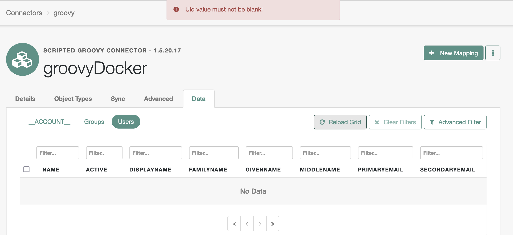

# The Basics of Developing Scripted Connectors for Java Remote Connector Server (Part 1 of 2)

Continues in [The Basics of Developing Scripted Connectors for Java Remote Connector Server (Part 2)](https://community.forgerock.com/t/the-basics-of-developing-scripted-connectors-for-java-remote-connector-server-part-2/3160).

In the [ForgeRock Identity Cloud](https://backstage.forgerock.com/docs/idcloud/latest/home.html) (Identity Cloud) managed environment, [syncing identities](https://backstage.forgerock.com/docs/idcloud/latest/identities/sync-identities.html) via a remote connector server provides necessary flexibility in integrating the [ForgeRock Identity Platform](https://backstage.forgerock.com/docs/platform) (Platform) with external systems.

Scripted implementations present a relatively easy way to extend this flexibility further and almost indefinitely, including the option to develop a new connector when the [available solutions](https://backstage.forgerock.com/docs/openicf/latest/connector-reference/preface.html) do not meet one's requirements. Thus, a scripted connector can address edge cases, aid with proofing a concept, serve as a demo, and potentially outline future development plans for a standard feature.

The following content overlays the existing ever-evolving [official docs](https://backstage.forgerock.com/docs/openicf/latest) with additional details on developing connectors based on the [Groovy Connector Toolkit](https://backstage.forgerock.com/docs/openicf/latest/connector-reference/groovy.html) for the [Java Remote Connector Server (RCS)](https://backstage.forgerock.com/docs/openicf/latest/connector-reference/remote-connector.html) built on top of [ForgeRock Open Identity Connector Framework (ICF)](https://backstage.forgerock.com/docs/openicf/latest/index.html).

Additional information could also be found on the [ForgeRock Backstage](https://backstage.forgerock.com/search/?t=all&q=remote%20connector&page=1&sort=_score:desc&scope=sub) site.

> Use the links under the Contents section to quickly navigate to an area of interest. If you feel lost in a long chapter, navigate to the closest [Back to contents](#heading--contents) link and try again.
>
> The quoted paragraphs, such as this one, indicate that the content they provide is supplementary and optional.

## <a id="heading--contents" name="heading--contents"></a>Contents

* [Choosing IDE](#heading--developing-ide)
* [Interacting with RCS via IDM's REST](#heading--developing-idm-rest)
* [Error Handling](#heading--developing-error-handling)
* [Custom Logging](#heading--developing-custom-logs)
    * [Methods of the `Log` class](#heading--developing-custom-logs-log)
    * [Controlling Debug Output](#heading--developing-custom-logs-logback)
    * [Temporary Logs with `println`](#heading--developing-custom-logs-println)
* [Attaching Debugger](#heading--developing-debugger)
    * [Enabling Remote Debugging in Kubernetes](#heading--developing-debugger-k8s)
        * [Invoking RCS JVM for Debugging](#heading--developing-debugger-k8s-jdwp)
        * [Publishing Debugging Port](#heading--developing-debugger-k8s-port)
    * [Enabling Remote Debugging in Docker](#heading--developing-debugger-docker)
    * [Configuring and Starting Debugger](#heading--developing-debugger-configuration)
* [Scripting Context](#heading--developing-connector-context)
    * [Bindings](#heading--developing-connector-context-bindings)
    * [Global Variables](#heading--developing-connector-context-globals)
* [Scripted Groovy Connector Bindings](#heading--developing-connector-bindings)
    * [configuration](#heading--developing-connector-bindings-configuration)
        * [configuration.propertyBag](#heading--developing-connector-bindings-configuration-property-bag)
            * [In Connection Configuration](#heading--developing-connector-bindings-configuration-property-bag-connection-configuration)
            * [In Customizer Script](#heading--developing-connector-bindings-configuration-property-bag-scripts-customizer)
                * [For Groovy Connector](#heading--developing-connector-bindings-configuration-property-bag-scripts-customizer-groovy)
                * [For Scripted SQL Connector](#heading--developing-connector-bindings-configuration-property-bag-scripts-customizer-sql)
                * [For Scripted REST Connector](#heading--developing-connector-bindings-configuration-property-bag-scripts-customizer-rest)
            * [In Scripts at Runtime](#heading--developing-connector-bindings-configuration-property-bag-scripts-runtime)
* [Scripted Groovy Connection Configuration](#heading--developing-connector-configuration)
    * ["configurationProperties"](#heading--developing-connector-configuration-configuration-properties)
        * ["customConfiguration" and "customSensitiveConfiguration"](#heading--developing-connector-configuration-configuration-properties-custom-configuration)
    * ["systemActions"](#heading--developing-connector-configuration-system-actions)
        * [Defining System Action](#heading--developing-connector-configuration-system-actions-definition)
            * ["scriptId"](#heading--developing-connector-configuration-system-actions-definition-script-id)
            * ["actions"](#heading--developing-connector-configuration-system-actions-definition-actions)
                * ["systemType"](#heading--developing-connector-configuration-system-actions-definition-actions-system-type)
                * ["actionType"](#heading--developing-connector-configuration-system-actions-definition-actions-action-type)
                * ["actionSource" _or_ "actionFile"](#heading--developing-connector-configuration-system-actions-definition-actions-action-source-or-file)
        * [Invoking via IDM's REST](#heading--developing-connector-configuration-system-actions-rest)
            * [Parts of the Request](#heading--developing-connector-configuration-system-actions-rest-parts)
                * [/openidm/system/\<connection-name\> (connection endpoint)](#heading--developing-connector-configuration-system-actions-rest-parts-path)
                * [?_action=script (request to execute script)](#heading--developing-connector-configuration-system-actions-rest-parts-action)
                * [&scriptId=\<script_id\> (system action to execute and return from)](#heading--developing-connector-configuration-system-actions-rest-parts-script-id)
                * [&arg1=value1&arg2=value2 . . . (script arguments)](#heading--developing-connector-configuration-system-actions-rest-parts-request-params)
                * [request body (script arguments)](#heading--developing-connector-configuration-system-actions-rest-parts-request-body)
                * [&scriptExecuteMode=resource ("run on resource")](#heading--developing-connector-configuration-system-actions-rest-parts-execute-mode)
                    * [Executed Script](#heading--developing-connector-configuration-system-actions-rest-parts-execute-mode-script-reference)
                    * [Context of Executed Script](#heading--developing-connector-configuration-system-actions-rest-parts-execute-mode-script-context)
                    * [Evaluating `scriptText`](#heading--developing-connector-configuration-system-actions-rest-parts-execute-mode-evaluate)
                    * [Other Applications of `scriptText`](#heading--developing-connector-configuration-system-actions-rest-parts-execute-mode-interpret)
        * [Invoking from an IDM Script](#heading--developing-connector-configuration-system-actions-script)
            * [Syntax](#heading--developing-connector-configuration-system-actions-script-syntax)
            * [Examples](#heading--developing-connector-configuration-system-actions-script-examples)
                * ["run on connector"](#heading--developing-connector-configuration-system-actions-script-examples-on-connector)
                * ["run on resource"](#heading--developing-connector-configuration-system-actions-script-examples-on-resource)
        * ["run on resource" vs "run on connector"](#heading--developing-connector-configuration-system-actions-execute-modes)
        * [Support in Connectors](#heading--developing-connector-configuration-system-actions-support)
* [Commonly Used References](#heading--references)
* [Part 2](https://community.forgerock.com/t/the-basics-of-developing-scripted-connectors-for-java-remote-connector-server-part-2/3160)
    * Scripted Groovy Connector (Toolkit)
        * Registering Connection in IDM
            * Deployment Requirements
            * Platform UI
            * IDM's REST
                * Create Configuration
                * Use a Provisioner File
                * Example
        * Schema Script
            * Object Classes
                * objectClass(Closure closure)
                    * type(String type)
                    * attribute(String name[, Class type[, Set flags]])
                    * attribute(AttributeInfo attributeInfo)
                    * attributes(Closure closure)
                * defineObjectClass(ObjectClassInfo objectClassInfo[, . . . ])
            * Example Data
                * Users
                * Groups
            * Example Schema Script
                * Original Data Structure
                * Flat Representation of Data
        * Search Script
            * Requesting Search Operation
                * IDM's REST
                * IDM Script
            * Responding with Data
            * Filtering Results
                * Read by Resource ID
                * Query Definition
            * Paging and Sorting
                * Page Size
                * Sorting
                * Tracking Position in Paged Results
            * Attributes to Get
            * Example Search Script
                * Flat Representation of Data
        * Test Script
    * Conclusion

## <a id="heading--developing-ide" name="heading--developing-ide"></a>Choosing IDE

[Back to Contents](#heading--contents)

For a Java RCS, you will write scripts in [the Apache Groovy programming language](https://groovy-lang.org/) (Groovy). Consult the [IDE integration support for Groovy](https://groovy-lang.org/ides.html) document when you choose an IDE for your scripted RCS development.

In general, you can get a better support for Groovy in a Java-specialized IDE, like [IntelliJ IDEA](https://www.jetbrains.com/idea/) (IntelliJ).

In a non-Java or a polyglottal IDE, you might be able to effectively maintain your RCS scripts, but Groovy-related features may not be readily available or have limited functionality and support available.

> For example, as of this writing, no Groovy debugger extension is available for Visual Code Studio—a very popular code editor. This means that if you want to do remote debugging and attach a debugger to your RCS process, you will have to use something like IntelliJ.

## <a id="heading--developing-idm-rest" name="heading--developing-idm-rest"></a>Interacting with RCS via IDM's REST

[Back to Contents](#heading--contents)

A remote connector is a [system object](https://backstage.forgerock.com/docs/idcloud-idm/latest/objects-guide/appendix-system-objects.html), and as such, you can interact with it via [IDM's REST](https://backstage.forgerock.com/docs/idcloud-idm/latest/rest-api-reference/endpoints/rest-system-objects.html)—which is a convenient option to validate your work during development.

You will need to authorize your requests to IDM's REST as an IDM administrator. In Identity Cloud, this means including an OAuth 2.0 bearer token in the `Authorization` header of your request. The token needs to be obtained with a client mapped to an IDM subject associated with the admin role.

The easiest way of accomplishing this type of authorization is signing in to the IDM admin UI, and using the browser console for making HTTP request with `jQuery`. Internally, `jQuery` uses `XMLHttpRequest` (XHR), and such requests are automatically authorized by the IDM admin UI. In addition, browser console can serve well as a JavaScript text editor. It will provide an interactive playground with code highlighting, autocompletion, and error checking. It will add necessary headers to your requests.

For example (where `[ . . . ]` denotes omission from the original content), you could check what scripted connectors are bundled with your connector server:

`IDM admin UI browser console`

```javascript
(async function () {
    var connectorServerName = 'rcs';
    /**
     * Get an array of available connector references.
     */
    var { connectorRef } = await $.ajax({
        method: 'POST',
        url: '/openidm/system?_action=availableConnectors'
    });
    /**
     * Get a list of scripted connectors for an RCS.
     */
    var scriptedConnectorRef = connectorRef.filter((connectorRef) => {
        return connectorRef.connectorHostRef === connectorServerName;
    }).filter((connectorRef) => {
        return connectorRef.connectorName.toLowerCase().includes('scripted');
    });
    console.log('scriptedConnectorRef', JSON.stringify(scriptedConnectorRef, null, 4));
}());
```

```json
[
    {
        "connectorHostRef": "rcs",
        "displayName": "Scripted SQL Connector",
        "bundleVersion": "1.5.20.15",
        "systemType": "provisioner.openicf",
        "bundleName": "org.forgerock.openicf.connectors.scriptedsql-connector",
        "connectorName": "org.forgerock.openicf.connectors.scriptedsql.ScriptedSQLConnector"
    },
    {
        "connectorHostRef": "rcs",
        "displayName": "Scripted REST Connector",
        "bundleVersion": "1.5.20.15",
        "systemType": "provisioner.openicf",
        "bundleName": "org.forgerock.openicf.connectors.scriptedrest-connector",
        "connectorName": "org.forgerock.openicf.connectors.scriptedrest.ScriptedRESTConnector"
    },
    {
        "connectorHostRef": "rcs",
        "displayName": "Scripted Poolable Groovy Connector",
        "bundleVersion": "1.5.20.15",
        "systemType": "provisioner.openicf",
        "bundleName": "org.forgerock.openicf.connectors.groovy-connector",
        "connectorName": "org.forgerock.openicf.connectors.groovy.ScriptedPoolableConnector"
    },
    {
        "connectorHostRef": "rcs",
        "displayName": "Scripted Groovy Connector",
        "bundleVersion": "1.5.20.15",
        "systemType": "provisioner.openicf",
        "bundleName": "org.forgerock.openicf.connectors.groovy-connector",
        "connectorName": "org.forgerock.openicf.connectors.groovy.ScriptedConnector"
    }
]
```

> In this example, the `connectorServerName` variable corresponds to the namesake setting in the `ConnectorServer.properties` file described in the [Configure a remote server](https://backstage.forgerock.com/docs/idcloud/latest/identities/sync-identities.html#configure_a_remote_server) doc. In Identity Cloud, you can see individual Connector Servers and Server Clusters in the Platform admin UI under Identities > Connect; you can use either a server or a cluster name to identify your RCS.

This technique will be used in the examples included in this writing.

Alternatively, you could use an actual IDE like [Postman](https://www.postman.com/) for crafting your requests to IDM's REST.

You can also obtain your access token separately and use it with [cURL](https://curl.se/).

For example:

```sh
curl 'https://openam-dx-kl03.forgeblocks.com/openidm/system?_action=availableConnectors' \
-X POST \
-H 'Authorization: Bearer $ACCESS_TOKEN' \
-H 'Content-Length: 0'
```

## <a id="heading--developing-error-handling" name="heading--developing-error-handling"></a> Error Handling

[Back to Contents](#heading--contents)

The connector will catch an unhandled exception in your scripts and try to provide a helpful message in the response sent to IDM.

For example:

`SearchScript.groovy`

```groovy
[ . . . ]
            handler {
                // uid resource.uid
                id resource.id
                resource.each { entry ->
                    if (!['uid', 'id'].find { it == entry.key }) {
                        attribute entry.key, entry.value
                    }
                }
            }
[ . . . ]
```

`Response`

```json
{"code":400,"reason":"Bad Request","message":"Uid value must not be blank!"}
```

If it is supported, the browser response will be reflected in the UI, for example:



If you want to respond with a custom error message from your script, you can throw an exception to inform the client about a particular situation during your script execution.

For example:

`SearchScript.groovy`

```groovy
[ . . . ]

switch (objectClass.objectClassValue) {
    case 'users':

    [ . . . ]

    case 'groups'

    [ . . . ]

    default:
        throw new UnsupportedOperationException(operation.name() + ' operation of type: ' + objectClass.getObjectClassValue() + ' is not supported.')
}
```

`Response`

```json
{"code":404,"reason":"Not Found","message":"SEARCH operation of type: __ACCOUNT__ is not supported."}
```

> [UnsupportedOperationException](https://docs.oracle.com/en/java/javase/11/docs/api/java.base/java/lang/UnsupportedOperationException.html) is a Java exception, which, among some other most commonly used Java classes, is [automatically provided in Groovy scripts](https://groovy-lang.org/structure.html#_default_imports).

You also have the ability to handle unexpected exceptions in your scripts with `try/catch`, and respond with custom error messages relevant to your scripted functionality with desired level of details included in the response sent to the client.

For example:

`SearchScript.groovy`

```groovy
try {

    // code

} catch (e) {

    // logging

    throw new UnsupportedOperationException('Error occurred during ' + operation + ' operation')
}
```

Should an exception occur, a request for search operation would respond with the predefined error content—in this case, a very generic error message:

```json
{"code":404,"reason":"Not Found","message":"Error occurred during SEARCH operation"}
```

For debugging purposes, you can output additional information to the RCS logs from any place in your script, including the `catch` block.

## <a id="heading--developing-custom-logs" name="heading--developing-custom-logs"></a>Custom Logging

[Back to Contents](#heading--contents)

### <a id="heading--developing-custom-logs-log" name="heading--developing-custom-logs-log"></a>Custom Logging > Methods of the `Log` class

[Back to Contents](#heading--contents)

In RCS scripts, you can use methods of the [Log](https://backstage.forgerock.com/docs/openicf/latest/_attachments/apidocs/org/identityconnectors/common/logging/Log.html) class, an instance of which is provided via the `log` binding, to output custom logs from your connector scripts. Normally, you would use one the following methods, listed below in order they become active with respect to the [Log.Level](https://backstage.forgerock.com/docs/openicf/latest/_attachments/apidocs/org/identityconnectors/common/logging/Log.Level.html) selected in the logging configuration:

* `error(java.lang.String format, java.lang.Object... args)` - loggable at any debug level (except when it is set to "OFF").

* `warn(java.lang.String format, java.lang.Object... args)` - loggable at `WARN`, `INFO`, and `OK` levels.

* `info(java.lang.String format, java.lang.Object... args)` - loggable at `INFO` and `OK` levels.

* `ok(java.lang.String format, java.lang.Object... args)`- loggable at the `OK` level.

During development of your scripts, you will have an opportunity to change debug levels for different parts of the framework and your scripts, as will be explained in the [Controlling Debug Output](#heading--developing-custom-logs-logback) chapter. By default, RCS is configured to output logs at the `INFO` level.

The first argument passed into a method of the [Log](https://backstage.forgerock.com/docs/openicf/latest/_attachments/apidocs/org/identityconnectors/common/logging/Log.html) class is the actual content of your debug message, which can be optionally parameterized using placeholders referring to additional arguments.

The additional arguments are a comma-separated [Arbitrary Number of Arguments](https://docs.oracle.com/javase/tutorial/java/javaOO/arguments.html#varargs), which can be used to parameterize your message, but otherwise optional.

For example with just a message passed in (and no additional arguments):

`SearchScript.groovy`

```groovy
try {

    [ . . . ]

} catch (e) {
    log.error e.message

    throw new UnsupportedOperationException('Error occurred during ' + operation + ' operation')
}
```

`RCS logs`

```
[rcs] Oct 20, 2022 12:41:12 AM INFO ERROR SearchScript: No such property: getResourceData for class: SearchScript
```

Eventually, all of these methods call the [log(Log.Level level, java.lang.Throwable ex, java.lang.String format, java.lang.Object... args)](https://backstage.forgerock.com/docs/openicf/latest/_attachments/apidocs/org/identityconnectors/common/logging/Log.html#log(org.identityconnectors.common.logging.Log.Level,java.lang.Throwable,java.lang.String,java.lang.Object...)) method, which uses the [java.text.MessageFormat](https://docs.oracle.com/en/java/javase/11/docs/api/java.base/java/text/MessageFormat.html#patterns) class to construct a log message from the passed in parameters.

This means:

* In order to output an object without referencing its individual properties, before you pass the object into one of the listed methods of the [Log](https://backstage.forgerock.com/docs/openicf/latest/_attachments/apidocs/org/identityconnectors/common/logging/Log.html) class as a single argument, you need to convert the object to a String. Or else, you might get a wordy error.

    For example:

    `TestScript.groovy`

    ```groovy
    try {
        log.ok operation
    } catch (e) {
        log.error e.message
    }
    ```

    `RCS logs`

    ```
    [rcs] Oct 20, 2022 11:43:45 PM ERROR TestScript: No signature of method: org.identityconnectors.common.logging.Log.info() is applicable for argument types: (org.forgerock.openicf.connectors.groovy.OperationType) values: [TEST]%0APossible solutions: info(java.lang.String, [Ljava.lang.Object;), isInfo(), info(java.lang.Throwable, java.lang.String, [Ljava.lang.Object;), isOk(), find(), any()
    ```

    You can convert an object to a String by using its `.toString()` method or by prepending your log message with a String:

    For example:

   `TestScript.groovy`

    ```groovy
    log.info '' + operation
    log.info operation.toString()
    ```

    `RCS logs`

    ```sh
    [rcs] Oct 20, 2022 11:47:24 PM DEBUG  TestScript: TEST
    [rcs] Oct 20, 2022 11:47:24 PM DEBUG  TestScript: TEST
    ```

    Alternatively, you can parameterize you message by adding a [FormatElement](https://docs.oracle.com/en/java/javase/11/docs/api/java.base/java/text/MessageFormat.html#patterns) in the message pattern and substituting it with one of the additional arguments, which are denoted in the API docs as log([ . . . ]`, java.lang.Object... args`). Doing so will automatically convert the argument into a String, and it can also help to make the log messages less redundant and easier to maintain.

    For example:

   `SearchScript.groovy`

    ```
    log.ok '{0}', operation
    log.ok '{0}/{1} {2}', configuration.scriptRoots.collect { it }, configuration.searchScriptFileName, objectClass
    ```

    `RCS logs`

    ```sh
    Jul 24, 2023 11:07:47 PM DEBUG SearchScript: SEARCH     Method: invoke0
    Jul 24, 2023 11:07:47 PM DEBUG SearchScript: [/opt/openicf/scripts/groovy]/SearchScript.groovy ObjectClass: users       Method: invoke0
    ```

* If you try to output raw JSON, its curly braces will be interpreted as a [FormatElement](https://docs.oracle.com/en/java/javase/11/docs/api/java.base/java/text/MessageFormat.html#patterns) and cause an error.

    For example, as reasoned on in the [Connection Configuration > "systemActions"](#heading--developing-connector-configuration-system-actions) chapter, a script that you "run on resource" can accept a configuration JSON defined in the system action source or passed in as an argument in a system action request, and you might want to output this JSON in your debug logs:

    `ScriptOnResourceScript.groovy`

    ```groovy
    [ . . . ]

    try {
        log.ok 'actionSource JSON: ' + scriptText

        [ . . . ]
    } catch (e) {
        log.error e.message
    }
    ```

    `RCS logs`

    ```
    Jul 25, 2023 7:13:09 PM ERROR ScriptOnResourceScript: cant parse argument number: "key": "value"        Method: invoke
    ```

    To mitigate this issue, you can firstly parse the JSON and then convert the resulting object to a String.

    For example:

    `ScriptOnResourceScript.groovy`

     ```groovy
    import groovy.json.JsonSlurper

    try {
        def jsonSlurper = new groovy.json.JsonSlurper()
        def actionSourceJson = jsonSlurper.parseText scriptText

        log.ok 'Parsed scriptText: ' + actionSourceJson

        [ . . . ]
    } catch (e) {
        log.error e.message
    }
    ```

    `RCS logs`

    ```
    Jul 25, 2023 7:19:50 PM INFO  ScriptOnResourceScript: Parsed scriptText: [key:value]    Method: invoke
    ```

    Since you are probably going to parse your JSON anyway for future use in the script, outputting the resulting object in the logs might be adequate. However, if you want to see the raw JSON in the debug output, you can do so with a [Message Format Pattern](https://docs.oracle.com/en/java/javase/11/docs/api/java.base/java/text/MessageFormat.html#patterns).

    For example:

    `ScriptOnResourceScript.groovy`

     ```groovy
    [ . . . ]

    log.info '{0}', scriptText

    [ . . . ]
    ```

    `RCS logs`

    ```sh
    Aug 28, 2023 9:59:55 PM INFO  ScriptOnResourceScript: scriptText: {"key": "value"}
    ```

### <a id="heading--developing-custom-logs-logback" name="heading--developing-custom-logs-logback"></a>Custom Logging > Controlling Debug Output

[Back to Contents](#heading--contents)

Adjusting debug output in RCS is described in the [Java Remote Connector Server Logging Configuration for Developing Connectors](https://community.forgerock.com/t/java-remote-connector-server-logging-configuration-for-developing-connectors) blog posted on the ForgeRock Community site.

### <a id="heading--developing-custom-logs-println" name="heading--developing-custom-logs-println"></a>Custom Logging > Temporary Logs with `println`

[Back to Contents](#heading--contents)

You should use methods of the [Log](https://backstage.forgerock.com/docs/openicf/latest/_attachments/apidocs/org/identityconnectors/common/logging/Log.html) class in your scripts for outputting debug logs that is to stay in the code and be used in the final application. Because this way you can control the debug output by setting appropriate [Log.Level](https://backstage.forgerock.com/docs/openicf/latest/_attachments/apidocs/org/identityconnectors/common/logging/Log.Level.html) in the `logback.xml` configuration file at different deployment stages of your application.

During the development phase, however, for a quick temporary output, you could use the [println](https://docs.oracle.com/en/java/javase/11/docs/api/java.base/java/io/PrintStream.html) method. `System.out.println` will automatically apply `.toString()` method available in all Java objects to the content it outputs. This will allow to print out content of any variables without additional processing or using special syntax.

> It will be up to you to provide any extra information in the output and you will loose ability to automatically collect logs across your debugging sessions for future analysis—comparing to techniques described in the [Methods of the `Log` class](#heading--developing-custom-logs-log) chapter.

For example:

`TestScript.groovy`

```groovy
println operation
```

`RCS logs`

```
[rcs] TEST
```

> Much of the commonly used Java functionality is [imported in Groovy by default](https://groovy-lang.org/structure.html#_default_imports), including the `java.lang.*` package where `println` comes from. Hence, you don't need to use the full `System.out.println` statement.

To outline string values in the printed out content of an object, you can use the [inspect()](https://docs.groovy-lang.org/latest/html/groovy-jdk/java/lang/Object.html#inspect()) method in Groovy.

For example:

`SearchScript.groovy`

```groovy
println binding.variables.query()
println binding.variables.query().inspect()
```

`RCS Logs`

```sh
[rcs] [not:false, operation:GREATERTHAN, left:__NAME__, right:m]
[rcs] ['not':false, 'operation':'GREATERTHAN', 'left':'__NAME__', 'right':'m']
```

## <a id="heading--developing-debugger" name="heading--developing-debugger"></a>Attaching Debugger

[Back to Contents](#heading--contents)

Attaching a debugger to your RCS process will allow to pause connector execution at select break points in your connector scripts and inspect the state of the scripting context in a more agile and dynamic way than by utilizing debug logging.

When developing scripts, you are likely to run RCS in a remote Java Virtual Machine (JVM). In order to be able to attach a debugger to this process from your local development setup, you will need to perform the following steps:

1. Invoke RCS JVM for debugging with the [Java Debug Wire Protocol (JDWP)](https://docs.oracle.com/en/java/javase/11/docs/specs/jpda/conninv.html#oracle-vm-invocation-options) options.

    In RCS, you can specify the JDWP options in a couple of alternative ways:

    * Engage the RCS' defaults.

        You could rely on the default JDWP options defined in RCS start-up scripts. You can do so by supplying a `jpda` argument in the start-up command for your RCS.

        For example, in a containerized deployment, the RCS' Docker [ENTRYPOINT](https://docs.docker.com/engine/reference/builder/#entrypoint) script expects an optional `jpda` argument; if one is detected, it constructs JDWP options for RCS' JVM:

        `/opt/openicf/bin/docker-entrypoint.sh`:

        ```sh
        [ . . . ]

        if [ "$1" = "jpda" ] ; then
        if [ -z "$JPDA_TRANSPORT" ]; then
            JPDA_TRANSPORT="dt_socket"
        fi
        if [ -z "$JPDA_ADDRESS" ]; then
            JPDA_ADDRESS="5005"
        fi
        if [ -z "$JPDA_SUSPEND" ]; then
            JPDA_SUSPEND="n"
        fi
        if [ -z "$JPDA_OPTS" ]; then
            JPDA_OPTS="-agentlib:jdwp=transport=$JPDA_TRANSPORT,address=$JPDA_ADDRESS,server=y,suspend=$JPDA_SUSPEND"
        fi
        OPENICF_OPTS="$OPENICF_OPTS $JPDA_OPTS"
        shift
        fi

        [ . . . ]

        exec java ${OPENICF_OPTS}  [ . . . ]

        [ . . . ]
        ```

        > JDWP is a part of Java Platform Debugger Architecture; hence, JPDA abbreviation is used in the RCS code.

    * Provide custom JDWP options at RCS launch.

        Alternatively, on a "*nix" machine, including containerized RCS deployments, you can define your custom JDWP options in optional `OPENICF_OPTS` environment variable, which the start-up scripts expect.

        For example:

        `rcs.yaml`

        ```sh
        export OPENICF_OPTS=-agentlib:jdwp=transport=dt_socket,address=*:5005,server=y,suspend=n [ . . . ]
        ```

        On Windows, the start-up script for Java RCS does not accept any additional JVM options, but you can define them if you [Install a Java RCS on Windows](https://backstage.forgerock.com/docs/openicf/latest/connector-reference/java-server.html#java-connector-server-windows) as a Windows service.

    In all cases, the JDWP `address` option defines the remote JVM's TCP/IP port, to which your local debugger will eventually connect. It will be a _local to the RCS instance_ port, but to distinguish it from the port on the debugger machine, we will call it "remote".

    > Optionally, you can include the host information in the address option, an IP or the `localhost` designation, to limit where the debugger connection could be made from; for example, `address=127.0.0.1:5005`.
    >
    > If you omit the host identifier in the Java Development Kit (JDK) 9 and above, the connection will be limited to `localhost`. In the older versions of JDK, if no host is specified, a connection would be allowed from any IP. To achieve the same behavior in JDK 9+, you can use a wildcard as the host value; for example, `address=*:5005`. It is considered the best practice to limit connections to a specific IP, but in some environments you might need to allow connections from any host and secure access to the debugging port by other means.
    >
    > Note, that the default JDWP `address` option in RCS does not include host information; and thus, connections to the debugging port might be allowed only from `localhost`:
    >
    > `/opt/openicf/bin/docker-entrypoint.sh`:
    >
    > ```sh
    > [ . . . ]
    > if [ -z "$JPDA_ADDRESS" ]; then
    >     JPDA_ADDRESS="5005"
    > fi
    > [ . . . ]
    > ```

2. Publishing Debugging Port.

    In your RCS deployment, you will need to have the remote debugging port accessible from your local debugger, so that it can communicate with the RCS process. This may require publishing the port specified in the JDWP options.

Execution of these steps will depend on how your RCS is deployed.

### <a id="heading--developing-debugger-k8s" name="heading--developing-debugger-k8s"></a>Attaching Debugger > Enabling Remote Debugging in Kubernetes

[Back to Contents](#heading--contents)

1. <a id="heading--developing-debugger-k8s-jdwp" name="heading--developing-debugger-k8s-jdwp"></a>Invoking RCS JVM for Debugging

    [Back to Contents](#heading--contents)

    In a [Kubernetes](https://kubernetes.io/) deployment, you can specify the JDWP options as follows:

    * Engage the RCS' defaults.

        In a Kubernetes manifest for your RCS, the `jpda` argument can be added to the command that calls the `/opt/openicf/bin/docker-entrypoint.sh` script.

        For example:

        `rcs.yaml`

        ```yaml
        [ . . . ]
        command: ['bash', '-c']
        args:
        - /opt/openicf/bin/docker-entrypoint.sh jpda;
        [ . . . ]
        ```

    * Provide custom JDWP options at RCS launch.

        You can define an `OPENICF_OPTS` environment variable in your Kubernetes manifest and include your custom JDWP options in its value.

        For example:

        `rcs.yaml`

        ```yaml
        [ . . . ]
        env:
        - name: OPENICF_OPTS
          value: "-agentlib:jdwp=transport=dt_socket,address=5005,server=y,suspend=n"
        [ . . . ]
        ```

        Alternatively, if you need to define RCS' JVM options dynamically, the command that calls the `/opt/openicf/bin/docker-entrypoint.sh` script in your Kubernetes manifest can be used for exporting (or updating) the `OPENICF_OPTS` environment variable prior to starting the RCS.

        For example:

        `rcs.yaml`

        ```yaml
        [ . . . ]
        spec:
          containers:
          - image:  rcs
            name: rcs
          command: ['bash', '-c']
          args:
          - export OPENICF_OPTS="$OPENICF_OPTS -Dconnectorserver.connectorServerName=$HOSTNAME [ . . . ]
            -agentlib:jdwp=transport=dt_socket,address=5005,server=y,suspend=n"
            && /opt/openicf/bin/docker-entrypoint.sh;
          [ . . . ]
        ```

        Adding the `$OPENICF_OPTS ` default to the export command will allow for extending the variable defined at the container level, either in the Kubernetes manifest file or, as will be shown later, in the Kubernetes cluster.

        For example:

        ```yaml
        [ . . . ]
        spec:
          containers:
          - image:  rcs
            name: rcs
            command: ['bash', '-c']
            args:
            - export OPENICF_OPTS="$OPENICF_OPTS -Dconnectorserver.connectorServerName=$HOSTNAME [ . . . ]"
              && /opt/openicf/bin/docker-entrypoint.sh;
            env:
            - name: OPENICF_OPTS
              value: "-agentlib:jdwp=transport=dt_socket,address=5005,server=y,suspend=n"
        [ . . . ]
        ```

        > In the case of attaching a debugger to RCS deployed within a Kubernetes cluster, you can leave the host information out of the `address` option, and thus limit the debugger connection to be made only from `localhost` in JDK 9+, which will be aligned with the RCS' JDWP defaults.

    In addition, in a Kubernetes cluster, you can add, update, or remove an environment variable using [kubectl set env](https://kubernetes.io/docs/reference/generated/kubectl/kubectl-commands#set) command. This way, you can add or update the `OPENICF_OPTS` variable with your custom JDWP options at runtime; doing so will automatically restart the container(s), and the updated `OPENICF_OPTS` content will be applied to the JVM options in the RCS container(s) after restart.

    For example:

    `Terminal`

    ```sh
    $ kubectl set env statefulsets/rcs -c rcs OPENICF_OPTS="-agentlib:jdwp=transport=dt_socket,address=5005,server=y,suspend=n"
    ```

    You can check the updated container environment with the `--list` option.

    For example:

    `Terminal`

    ```sh
    $ kubectl set env statefulsets/rcs -c rcs --list=true

    OPENICF_OPTS=-agentlib:jdwp=transport=dt_socket,address=5005,server=y,suspend=n
    ```

    You can remove the variable and its effects defined at the container level with the (negative) `OPENICF_OPTS-` option.

    For example:

    `Terminal`

    ```sh
    $ kubectl set env statefulsets/rcs -c rcs OPENICF_OPTS-
    ```

    > The export command you defined in your RCS manifest will still work, and the corresponding JVM options will still take effect after container restarts.


2. <a id="heading--developing-debugger-k8s-port" name="heading--developing-debugger-k8s-port"></a>Publishing Debugging Port

    [Back to Contents](#heading--contents)

    Deployed in Kubernetes, your RCS deployment in the [Client mode](https://backstage.forgerock.com/docs/openicf/latest/connector-reference/configure-server.html) and its debugging port are unlikely to be exposed externally. This means, you will need to let your debugger access the remote process by [forwarding connections made to a local port on your machine to a remote port on the RCS pods in your Kubernetes cluster](https://kubernetes.io/docs/tasks/access-application-cluster/port-forward-access-application-cluster/#forward-a-local-port-to-a-port-on-the-pod).

    Here, the local port is the one you will use in your debugger configuration; the remote port is the one that you specified in the JDWP `address` option. In the following example, the "local" port is on the left and the "remote" one is on the right:

    `Terminal`

    ```sh
    $ kubectl port-forward statefulsets/rcs 5005:5005

    Forwarding from 127.0.0.1:5005 -> 5005
    Forwarding from [::1]:5005 -> 5005
    ```

This concludes the specifics of enabling remote debugging for RCS running in a Kubernetes cluster. Adjust the examples according to your particular requirements.

### <a id="heading--developing-debugger-docker" name="heading--developing-debugger-docker"></a>Attaching Debugger > Enabling Remote Debugging in Docker

[Back to Contents](#heading--contents)

If you run RCS in a standalone Docker container not managed by a system such as Kubernetes, you can enable remote debugging as described in the [Deploying Java Remote Connector Server in a Docker Container](https://community.forgerock.com/t/deploying-java-remote-connector-server-in-a-docker-container) article.

## <a id="heading--developing-debugger-configuration" name="heading--developing-debugger-configuration"></a>Attaching Debugger > Configuring and Starting Debugger

[Back to Contents](#heading--contents)

IntelliJ is a popular IDE that has rich and refined support for Java and Groovy; and thus, it is probably going to be your best option for developing Groovy scripts for RCS. Below, find an example of how you can configure IntelliJ for remote debugging and attach its debugger to your RCS process:

1. Create a new IntelliJ project.

    For example, you can use `File > New > Project from Existing Sources...` and point it to the folder that contains your project files—such as README, configuration, etc.—and the actual scripts; then, the folder content could be accessed and maintained under `Project > Project Files`. Do not import any sources at this point; you will add the scripts you need to debug as a module in the next step.

    Open the project.

1. Add a new module with `File > New Module from Existing Sources...` and point it to your connector's scripts location.

    If/when you have more than one connector in your RCS, mark only the connector-specific scripts as the source files in the Import Module dialog. Creating a separate module for each connector from its existing scripts will let you reference the module in a debugging configuration and thus limit its scope to the scripts for a particular connector.

    > Otherwise, if you included files with the same name for more than one connector in a module, and set a breakpoint in one of the namesake scripts, the debugger could open a file with the same name for a different connector—the first script file with this name that was found in the module sources.

    The module files will serve as the [sources of your (RCS) application](https://www.jetbrains.com/help/idea/attaching-to-local-process.html#prerequisites), which is one of the prerequisites for attaching a debugger in IntelliJ.

    For example, two modules registered for a project might appear under the Project Files in the following manner:

    

1. Select `Run` > `Edit Configurations...`

1. Select `Add New Configuration` (`+`), then select `Remote JVM Debug` from the list of predefined configuration templates.

1. In the `Configuration` tab, provide values (or verify the defaults) for the following settings:

    1. `Name`: _your-rcs-connector-debugging-configuration-name_

    1. `Debugger mode`: Attach to remote JVM

    1. `Host`: localhost

        The host to which the debugger will connect. Choose localhost because we, actually, attempt to debug locally (that is, the debugger runs locally and connects to a local port, and then it is forwarded to a remote port in the Kubernetes cluster); you could also use `127.0.0.1` or `::1` as the Host value.

    1. `Port`: 5005

        The local port the debugger will connect to, from which connections will be forwarded (with the `kubectl port-forward [ . . . ]` command) to the remote port.

    1. `Command line arguments for remote JVM (for JDK 9 or later)`: JDK 9 or later

        This input is to provide a template for your JDWP options according to your previous choices, and you will see the following:

        `-agentlib:jdwp=transport=dt_socket,server=y,suspend=n,address=*:5005`

        Note, however, that:

        * The `*` prefix  in `JDK 9+` means that the connection will be allowed on the remote host from any IP.

            Leaving the host information out and having just the port specified will limit connections to the localhost only, which is the safest option that will work in this case.

            > Removing the wildcard or replacing it with a specific identifier (for example, an IP or `localhost`) is considered the best practice. In reality, however, it is unlikely that any IP/port will be made public on your RCS; hence, limiting debugging connections to your JVM might be a minor consideration in this case.

        * The remote JVM port is populated with the same number as your local debugger port, for it assumes that the two ports, local and remote, are the same.

            > _If_ the remote debugging port in your RCS were different from the local one, you could still use this input for getting your JDWP options template, and simply update the port with the actual remote port that you will use for debugging.
            >
            > Naturally, in such case, you would also need to port-forward your local connections to _that_ port with the `kubectl port-forward [ . . . ]` command.
            >
            > For example, if your remote JVM port is `5006`, your _actual_ JDWP options could look like the following:
            >
            > `Terminal`
            >
            > ```sh
            > $ kubectl set env statefulsets/rcs -c rcs JAVA_OPTS="$JAVA_OPTS -agentlib:jdwp=transport=dt_socket,server=y,suspend=n,address=5006"
            > ```
            >
            > and your port-forwarding command would be:
            >
            > `Terminal`
            >
            > ```
            > kubectl port-forward statefulsets/rcs 5005:5006
            > ```

    1. `Use module classpath`: _your-rcs-connector-module-name_

        Here, you reference the module created from your existing connector's scripts—so that the debugger looks for the breakpoints positions only in those files.

    1. The end result may look similar to the following:

        

        Select `Apply` or `OK`.

1. Start debugging.

    For example, you can select the bug button in the upper right of your IDE UI:

    

1. Add breakpoints.

    If everything is set up correctly, you should be able to see the breakpoints [verified](https://www.jetbrains.com/help/idea/using-breakpoints.html#breakpoint-icons) and employed when you are using your connector.

    For example:

    

1. If you want to use debugger with another scripted connector in the same IntelliJ project:

    * Add a new module via `File > New Module from Existing Sources...`, and point it to the other connector's scripts.

    * Under `Run > Edit Configurations...`, add a new remote JVM debugging configuration, and select the new module in the `Use module classpath:` input.

    * Select the new debug configuration before you start your debug session.

        For example:

        

For additional details, consult the IntelliJ docs on [setting debugging environment](https://www.jetbrains.com/help/idea/creating-and-editing-run-debug-configurations.html) and [debugging](https://www.jetbrains.com/help/idea/debugging-code.html#general-procedure).

##  <a id="heading--developing-connector-context" name="heading--developing-connector-context"></a>Scripting Context

[Back to Contents](#heading--contents)

### <a id="heading--developing-connector-context-bindings" name="heading--developing-connector-context-bindings"></a>Scripting Context > Bindings

[Back to Contents](#heading--contents)

A [Groovy script](https://docs.groovy-lang.org/latest/html/api/groovy/lang/Script.html) can receive externally defined content via the [binding](https://docs.groovy-lang.org/latest/html/api/groovy/lang/Binding.html) object defined in the script's top-level scope. In connector scripts, the variable bindings are defined according to the connector type ([Groovy](https://backstage.forgerock.com/docs/openicf/latest/connector-reference/groovy.html), [Scripted REST](https://backstage.forgerock.com/docs/openicf/latest/connector-reference/scripted-rest.html), or [Scripted SQL](https://backstage.forgerock.com/docs/openicf/latest/connector-reference/scripted-sql.html) for a scripted connector) and the [script operation type](https://backstage.forgerock.com/docs/openicf/latest/connector-dev-guide/groovy-operations.html), which are derived from the respective connection configuration registered in IDM and the requested ICF operation.

For example:

`provisioner.openicf-<connector-name>.json`

```json
{
    "connectorRef": {
        "bundleName": "org.forgerock.openicf.connectors.groovy-connector",
        "connectorName": "org.forgerock.openicf.connectors.groovy.ScriptedConnector",
        [ . . . ]
    },
    [ . . . ]
    "configurationProperties": {
        "scriptExtensions": [
            "groovy"
        ],
        "scriptRoots": [
            "/opt/openicf/scripts/groovy"
        ],
        "scriptOnResourceScriptFileName":  null,
        "authenticateScriptFileName":  null,
        "createScriptFileName":  null,
        "customizerScriptFileName": null,
        "deleteScriptFileName":  null,
        "resolveUsernameScriptFileName":  null,
        "schemaScriptFileName": "SchemaScript.groovy",
        "searchScriptFileName": "SearchScript.groovy",
        "syncScriptFileName":  null,
        "testScriptFileName": "TestScript.groovy",
        "updateScriptFileName":  null,
        "scriptBaseClass": null,
        [ . . . ]
    },
    "systemActions" : [
        {
            "scriptId" : "script-1",
            "actions" : [
                {
                    "systemType" : ".*ScriptedConnector",
                    "actionType" : "groovy",
                    "actionSource" : "println 'actionSource bindings: '; println binding.variables;"
                }
            ]
        }
    ],
    [ . . .]
}
```

You can inspect variable bindings passed to the script (and thus, directly accessible in the script top-level scope) as shown in the following example:

`SchemaScript.groovy`

```groovy
println 'operation: ' + operation
```

`RCS logs`

```
[rcs] operation: SCHEMA
```

You can also output the entire content of the `binding.variables` property:

`SchemaScript.groovy`

```groovy
println binding.variables.inspect()
```

`RCS logs`

```sh
['builder':org.forgerock.openicf.connectors.groovy.ICFObjectBuilder@290017f2, 'operation':SCHEMA, 'configuration':org.forgerock.openicf.connectors.groovy.ScriptedConfiguration@5a34f2f9, 'log':org.identityconnectors.common.logging.Log@32095aee]
```

The `binding.variables` property is an instance of the [java.util.LinkedHashMap](https://docs.oracle.com/en/java/javase/11/docs/api/java.base/java/util/LinkedHashMap.html) class. You can loop over its entries and get more detailed information about individual bindings:

For example:

`SchemaScript.groovy`

```groovy
binding.variables.each { key, value ->
    def className = value ? value.class.name : ''
    println key + ': ' + className
}
```

`RCS logs`

```
[rcs] Bindings:
[rcs] builder: org.forgerock.openicf.connectors.groovy.ICFObjectBuilder
[rcs] operation: org.forgerock.openicf.connectors.groovy.OperationType
[rcs] configuration: org.forgerock.openicf.connectors.groovy.ScriptedConfiguration
[rcs] log: org.identityconnectors.common.logging.Log
```

> [Registering Connection in IDM](https://community.forgerock.com/t/the-basics-of-developing-scripted-connectors-for-java-remote-connector-server-part-2/3160#heading--developing-scripted-connectors-groovy-connection) and [Schema Script](https://community.forgerock.com/t/the-basics-of-developing-scripted-connectors-for-java-remote-connector-server-part-2/3160#heading--developing-scripted-connectors-groovy-schema) (Part 2) chapters provide details on enabling and requesting schema operation, which invokes the schema script.

### <a id="heading--developing-connector-context-globals" name="heading--developing-connector-context-globals"></a>Global Variables

[Back to Contents](#heading--contents)

Bindings, both the `binding` instance and the individual variable bindings, behave as global variables. This opens a possibility of reassigning them accidentally and thus breaking something in your code.

To avoid a situation like this in complex and involved scripts, you could reassign variable bindings to the namesake local variables upfront. You can further clarify bindings' designations by referencing their types.

For example:

`TestScript.groovy`

```groovy
import org.identityconnectors.common.logging.Log
import org.forgerock.openicf.connectors.groovy.OperationType
import org.forgerock.openicf.connectors.groovy.ScriptedConfiguration

def operation = operation as OperationType
def configuration = configuration as ScriptedConfiguration
def log = log as Log

[ . . . ]
```

Doing so and adding corresponding dependencies to your scripted connector project can enable your IDE to show bindings' class information and provide additional code completion options.

> For example, [in IntelliJ, you can add your dependencies as modules](https://www.jetbrains.com/help/idea/working-with-module-dependencies.html). Even if you don't manage your connector scripts as a Java project, for the `identityconnectors` and `openicf` packages, you could import `java-framework` and `groovy-common` from the [General Access Connectors](https://stash.forgerock.org/projects/GA/repos/connectors-customers-ga/browse?at=refs%2Ftags%2F1.5.20.15) repository; and thus, allow your IDE to show the additional information about your variables.

## <a id="heading--developing-connector-bindings" name="heading--developing-connector-bindings"></a>Scripted Groovy Connector Bindings

[Back to Contents](#heading--contents)

In [ICF operations with Groovy scripts](https://backstage.forgerock.com/docs/openicf/latest/connector-dev-guide/groovy-operations.html#groovy-script-variables), you can navigate through descriptions and examples of use for common and operation-specific bindings (that is, externally defined input variables) available in connector scripts.

Below, find additional information about some common properties accessible from the scripting context:

### <a id="heading--developing-connector-bindings-configuration" name="heading--developing-connector-bindings-configuration"></a>Scripted Groovy Connector Bindings > `configuration`

[Back to Contents](#heading--contents)

The `configuration` binding is an instance of `org.forgerock.openicf.connectors.groovy.ScriptedConfiguration`, which provides access to connection properties registered in IDM and some additional properties defined by ICF.

You can print out the entire binding content by inspecting `configuration.properties`, which returns a map:

`SearchScript.groovy`

```groovy
println configuration.properties.inspect()
```

To make a map output more readable and/or informative, you could print the map keys individually and recursively when a key itself is a map.

For example:

`SearchScript.groovy`

```groovy
/**
 * @param object    Any variable.
 * @param label     String
 *                  Optional label to precede the output.
 * @param space     int
 *                  Optional indentation size.
 * @todo            Extend to handle complex types other than Map.
 */
def printObjectProperties = { object, label='Map', space=4 ->
    def printProperties
    printProperties = { propertyValue, propertyName, indent ->
        def message = indent + propertyName +  ' (' + propertyValue.getClass().name + '):'
        if (propertyValue instanceof Map) {
            println message

            propertyValue.each { entry ->
                printProperties entry.value, entry.key, indent + ' ' * space
            }
        } else {
            println message + ' ' + propertyValue.inspect()
        }
    }
    printProperties object, label, ''
}

printObjectProperties configuration.properties, 'configuration.properties'
```

`RCS logs`
```sh
[rcs] configuration.properties (java.util.LinkedHashMap):
[rcs]     imports ([Ljava.lang.String;): ['org.identityconnectors.framework.common.objects.*']
[rcs]     disabledGlobalASTTransformations ([Ljava.lang.String;): [null]
[rcs]     scriptOnResourceScriptFileName (org.codehaus.groovy.runtime.NullObject): null
[rcs]     parentLoader (org.identityconnectors.framework.impl.api.local.BundleClassLoader): org.identityconnectors.framework.impl.api.local.BundleClassLoader@12bbfc54
[rcs]     deleteScriptFileName (org.codehaus.groovy.runtime.NullObject): null
[rcs]     propertyBag (java.util.concurrent.ConcurrentHashMap):
[rcs]         myCustomProperties (java.util.LinkedHashMap):
[rcs]             count (java.lang.Integer): 0
[rcs]             config (org.apache.groovy.json.internal.LazyMap):
[rcs]                 key1 (java.lang.String): 'value1'
[rcs]                 key2 (org.apache.groovy.json.internal.LazyMap):
[rcs]                     key1 (java.lang.String): 'value1'
[rcs]         myCustomMethods (java.util.LinkedHashMap):
[rcs]             getSum (SearchScript$_run_closure2): SearchScript$_run_closure2@61997137
[rcs]     scriptExtensions ([Ljava.lang.String;): ['groovy']
[rcs]     syncScriptFileName (org.codehaus.groovy.runtime.NullObject): null
[rcs]     defaultCustomizerScriptName (java.lang.String): '/org/forgerock/openicf/connectors/groovy/CustomizerScript.groovy'
[rcs]     recompileGroovySource (java.lang.Boolean): false
[rcs]     createScriptFileName (org.codehaus.groovy.runtime.NullObject): null
[rcs]     tolerance (java.lang.Integer): 10
[rcs]     customSensitiveConfiguration (org.codehaus.groovy.runtime.NullObject): null
[rcs]     customizerClass (org.codehaus.groovy.runtime.NullObject): null
[rcs]     minimumRecompilationInterval (java.lang.Integer): 100
[rcs]     authenticateScriptFileName (org.codehaus.groovy.runtime.NullObject): null
[rcs]     warningLevel (java.lang.Integer): 1
[rcs]     targetDirectory (org.codehaus.groovy.runtime.NullObject): null
[rcs]     schemaScriptFileName (java.lang.String): 'SchemaScript.groovy'
[rcs]     class (java.lang.Class): class org.forgerock.openicf.connectors.groovy.ScriptedConfiguration
[rcs]     scriptBaseClass (org.codehaus.groovy.runtime.NullObject): null
[rcs]     customConfiguration (org.codehaus.groovy.runtime.NullObject): null
[rcs]     connectorMessages (org.identityconnectors.framework.impl.api.ConnectorMessagesImpl): org.identityconnectors.framework.impl.api.ConnectorMessagesImpl@3ea2423
[rcs]     debug (java.lang.Boolean): false
[rcs]     classpath ([Ljava.lang.String;): []
[rcs]     releaseClosure (org.codehaus.groovy.runtime.NullObject): null
[rcs]     updateScriptFileName (org.codehaus.groovy.runtime.NullObject): null
[rcs]     sourceEncoding (java.lang.String): 'UTF-8'
[rcs]     customizerScriptFileName (org.codehaus.groovy.runtime.NullObject): null
[rcs]     testScriptFileName (org.codehaus.groovy.runtime.NullObject): null
[rcs]     verbose (java.lang.Boolean): false
[rcs]     groovyScriptEngine (groovy.util.GroovyScriptEngine): groovy.util.GroovyScriptEngine@53a79e33
[rcs]     searchScriptFileName (java.lang.String): 'SearchScript.groovy'
[rcs]     scriptRoots ([Ljava.lang.String;): ['/opt/openicf/scripts/groovy']
[rcs]     resolveUsernameScriptFileName (org.codehaus.groovy.runtime.NullObject): null
```

You can also access each configuration property individually:

`SearchScript.groovy`

```groovy
println 'Script Roots: ' + configuration.scriptRoots.inspect()
```

`RCS logs`

```sh
[rcs] Script Roots: ['/opt/openicf/scripts/groovy']
```

Most of this content corresponds directly to the keys in the connection configuration at the time it is registered in IDM, where you can specify some of the connector configuration properties. ICF defines additional properties in the connector configuration.

#### <a id="heading--developing-connector-bindings-configuration-property-bag" name="heading--developing-connector-bindings-configuration-property-bag"></a>Scripted Groovy Connector Bindings > `configuration` > `configuration.propertyBag`

[Back to Contents](#heading--contents)

If you need to keep a custom global reference accessible from any connector script, you can save it in the `configuration.propertyBag` property, which is a map. This will allow to dynamically define, cache, and share within a connector instance anything that can be passed as a variable: a primitive or a reference to an object, such as a map or a closure.

The content saved in `configuration.propertyBag` will be reset when "configurationProperties.customConfiguration" and "configurationProperties.customSensitiveConfiguration" properties have been changed in the connection configuration, the RCS is restarted, or the IDM connector instance service (OSGi) is restarted.

You can populate `configuration.propertyBag` at different stages of a connector life cycle:

##### <a id="heading--developing-connector-bindings-configuration-property-bag-connection-configuration" name="heading--developing-connector-bindings-configuration-property-bag-connection-configuration"></a>Scripted Groovy Connector Bindings > `configuration.propertyBag` > In Connection Configuration

[Back to Contents](#heading--contents)

Initial content for `configuration.propertyBag` can be provided via "configurationProperties.customConfiguration" and "configurationProperties.customSensitiveConfiguration" keys in a connection configuration.

Doing so, the connection-specific content—which could be settings, secrets, references, etc.—can be saved in IDM environment, with an option to use [property value substitution](https://backstage.forgerock.com/docs/idm/7.3/setup-guide/using-property-substitution.html) and [Environment-Specific Variables and Secrets (ESVs)](https://backstage.forgerock.com/docs/idcloud/latest/tenants/esvs.html) (in Identity Cloud).

See the [Connection Configuration > "configurationProperties" > "customConfiguration" and "customSensitiveConfiguration"](#heading--developing-connector-configuration-configuration-properties-custom-configuration) chapter for details.

Note that if "configurationProperties.customConfiguration" or "configurationProperties.customSensitiveConfiguration" properties have been changed in the connection configuration, the `configuration.propertyBag` content will be reset on the connector that is using this configuration.

##### <a id="heading--developing-connector-bindings-configuration-property-bag-scripts-customizer" name="heading--developing-connector-bindings-configuration-property-bag-scripts-customizer"></a>Scripted Groovy Connector Bindings > `configuration.propertyBag` > In Customizer Script

[Back to Contents](#heading--contents)

In connector implementations based on the [Scripted Groovy Connector Toolkit](https://backstage.forgerock.com/docs/openicf/latest/connector-reference/groovy.html), ICF uses the [Stateful Configuration](https://backstage.forgerock.com/docs/openicf/latest/connector-dev-guide/connector-types.html) interface. This means that a configuration instance is initialized once during the connector's [management cycle](https://backstage.forgerock.com/docs/openicf/latest/connector-dev-guide/framework-connector-instantiation.html#connector-instantiation-stateful) and before any [ICF operations with Groovy scripts](https://backstage.forgerock.com/docs/openicf/latest/connector-dev-guide/groovy-operations.html) are performed.

You can use [custom configuration initialization](https://backstage.forgerock.com/docs/openicf/latest/connector-dev-guide/advanced-custom-config.html) in the connector server environment via a script referenced under the "configurationProperties.customizerScriptFileName" key in a connection configuration.

During the initialization process, the customizer script will have access to the configuration instance and can be used to update `configuration.propertyBag` content, which will become globally available for all the scripts implementing ICF operations at runtime.

> Note that while a stateful connector configuration is initialized only once, the customizer script runs every time when the corresponding connection configuration is updated in IDM; you can leverage this fact while developing your customizer script functionality.

###### <a id="heading--developing-connector-bindings-configuration-property-bag-scripts-customizer-groovy" name="heading--developing-connector-bindings-configuration-property-bag-scripts-customizer-groovy"></a>Scripted Groovy Connector Bindings > `configuration.propertyBag` > In Customizer Script > For Groovy Connector

[Back to Contents](#heading--contents)

In a plain Groovy connector, the customizer script will have access to the following bindings:

* `log`, which is an instance of the [org.identityconnectors.common.logging.Log](https://backstage.forgerock.com/docs/openicf/latest/_attachments/apidocs/org/identityconnectors/common/logging/Log.html) class that can be used for outputting debugging information.

* `configuration`, which is an instance of `org.forgerock.openicf.connectors.groovy.ScriptedConfiguration`, and which provides access to its `.propertyBag` property and the other connector configuration properties.

Thus, you can interact with the `configuration.propertyBag` content in a customizer script.

For example:

`CustomizerScript.groovy`

```groovy
configuration.propertyBag.myCustomProperties = [:]
configuration.propertyBag.myCustomProperties.count = 0
configuration.propertyBag.apiConfig.apiKey = System.getenv('API_KEY')

[ . . . ]
```

`SearchScript.groovy`

```groovy
println configuration.propertyBag.apiConfig.apiKey

[ . . . ]
```

`RCS logs`

```
[rcs] bm90LWFuLWFwaS1rZXk
```

Similarly, the customizer script can reference other connector server resources, and it could also be driven by the existing `propertyBag` content defined in "custom(Sensitive)Configuration".

###### <a id="heading--developing-connector-bindings-configuration-property-bag-scripts-customizer-sql" name="heading--developing-connector-bindings-configuration-property-bag-scripts-customizer-sql"></a>Scripted Groovy Connector Bindings > `configuration.propertyBag` > In Customizer Script > For Scripted SQL Connector

[Back to Contents](#heading--contents)

Everything said in regard to `configuration.propertyBag` in a plain Groovy connector applies to a Scripted SQL one, except its configuration instance is extended to `org.forgerock.openicf.connectors.scriptedsql.ScriptedSQLConfiguration` and contains additional, Scripted SQL-specific properties.

###### <a id="heading--developing-connector-bindings-configuration-property-bag-scripts-customizer-rest" name="heading--developing-connector-bindings-configuration-property-bag-scripts-customizer-rest"></a>Scripted Groovy Connector Bindings > `configuration` > `configuration.propertyBag` > In Customizer Script > For Scripted REST Connector

[Back to Contents](#heading--contents)

[Scripted REST connector](https://backstage.forgerock.com/docs/openicf/latest/connector-reference/scripted-rest.html) does not define `configuration` binding in the top-level scope of its customizer script. Instead, it allows to use `init`, `decorate`, and `release` methods inside a closure passed into the `customize` method, which is defined in the script's top-level scope.

The `init` method accepts a closure, in which you can configure a passed in [HTTPClientBuilder](https://hc.apache.org/httpcomponents-client-4.5.x/current/httpclient/apidocs/org/apache/http/impl/client/HttpClientBuilder.html) instance, which will be used to build customized [CloseableHttpClient](https://hc.apache.org/httpcomponents-client-4.5.x/current/httpclient/apidocs/org/apache/http/impl/client/CloseableHttpClient.html). The `init` closure runs when the connector configuration is initialized.

The `decorate` method accepts a closure in which you can customize further an instance of the HTTP client built with the HTTPClientBuilder. Then, the HTTP client is provided as the `customizedConnection` binding for making requests in the connector's scripts. The decorate closure runs on every ICF operation.

> The `release` closure runs when the stateful configuration is released. It could be used to dispose any custom objects not handled by ICF. Otherwise you don not need to call the release method.

The closures passed into `init`, `decorate`, and `release` methods have their [delegates](https://groovy-lang.org/closures.html#_delegation_strategy) assigned an instance of the `org.forgerock.openicf.connectors.scriptedrest.ScriptedRESTConfiguration` class, which extends `org.forgerock.openicf.connectors.groovy.ScriptedConfiguration` and thus provides access to `propertyBag` and the other connector's configuration properties.

This means that in the `init` closure you can update the `propertyBag` content during the connector configuration initialization and before any scripted ICF operations are performed, and in the `decorate` closure, you can update the `propertyBag` content at runtime.

For example:

`CustomizerScript.groovy`

```groovy
[ . . . ]

import org.forgerock.openicf.connectors.scriptedrest.ScriptedRESTConfiguration
import org.apache.http.impl.client.HttpClientBuilder
import org.apache.http.client.HttpClient

customize {
    init { HttpClientBuilder builder ->
        def c = delegate as ScriptedRESTConfiguration

        c.propertyBag.myCustomProperties = [:]
        c.propertyBag.myCustomProperties.count = 0
        c.propertyBag.apiConfig.apiKey = System.getenv('API_KEY')

        [ . . . ]
    }

    decorate { HttpClient httpClient ->
        def c = delegate as ScriptedRESTConfiguration

        c.propertyBag.myCustomProperties.count += 1
    }
}
```

Comprehensive examples of customizer script for scripted REST connector could be found in an IDM installation in [Samples provided with IDM](https://backstage.forgerock.com/docs/idm/7.3/samples-guide/samples-provided.html), in the accessible for ForgeRock customers [General Access Connectors](https://stash.forgerock.org/projects/GA/repos/connectors-customers-ga/browse/scriptedrest-connector/src/test/resources/mock?at=refs%2Ftags%2F1.5.20.15) repository, and in the [Scripted REST connector](https://backstage.forgerock.com/docs/openicf/latest/connector-reference/scripted-rest.html) documentation. In particular, the OAuth2 Authentication Implementation example demonstrates how OAuth 2.0 authorization could be performed, and how resulting from it access tokens can be saved in `propertyBag` and shared with the scripts performing data operations.

> Having the `ScriptedRESTConfiguration` instance as the delegate and as the enclosing class for the closures, you could access its properties directly. However, for the reasons explained in [Scripting Context > Global Variables](#heading--developing-connector-context-globals), and as shown in official examples shipped with IDM, you might want to reassign your delegate to a variable of this particular, `ScriptedRESTConfiguration` type.
>
> For illustration:
>
> `CustomizerScript.groovy` (for scripted REST connector)
>
> ```groovy
> [ . . . ]
>
> import org.forgerock.openicf.connectors.scriptedrest.ScriptedRESTConfiguration
> import org.apache.http.impl.client.HttpClientBuilder
> import org.apache.http.client.HttpClient
>
> customize {
>     init { HttpClientBuilder builder ->
>         def c = delegate as ScriptedRESTConfiguration
>         assert c.propertyBag == propertyBag
>
>         [ . . . ]
>     }
>
>     decorate { HttpClient httpClient ->
>         def c = delegate as ScriptedRESTConfiguration
>         assert c.propertyBag == propertyBag
>
>         [ . . . ]
>     }
>
>     release {
>         def configuration = delegate as ScriptedRESTConfiguration
>         assert configuration.propertyBag == propertyBag
>
>         [ . . . ]
>     }
> }
> ```

##### <a id="heading--developing-connector-bindings-configuration-property-bag-scripts-runtime" name="heading--developing-connector-bindings-configuration-property-bag-scripts-runtime"></a>Scripted Groovy Connector Bindings > `configuration` > `configuration.propertyBag` > In Scripts at Runtime

[Back to Contents](#heading--contents)

All [ICF operations with Groovy scripts](https://backstage.forgerock.com/docs/openicf/latest/connector-dev-guide/groovy-operations.html) will have access to the `configuration` binding. Thus, the scripts will have read and write access to the configuration properties saved in `configuration.propertyBag`.

For example:

`SearchScript.groovy`

```groovy
[ . . . ]

configuration.propertyBag.myCustomProperties.count += 1
```

It should be noted that while some other configuration properties can be changed from a script with immediate effect, you should limit your runtime configuration customizations to the designated area that `configuration.propertyBag` is.

## <a id="heading--developing-connector-configuration" name="heading--developing-connector-configuration"></a>Scripted Groovy Connection Configuration

[Back to Contents](#heading--contents)

Configuration properties that you can register in IDM for different remote connector types can be found under [Connector reference](https://backstage.forgerock.com/docs/openicf/latest/connector-reference/preface.html).

This chapter will elaborate on some additional details, not _currently_ present in the ever improving docs.

### <a id="heading--developing-connector-configuration-configuration-properties" name="heading--developing-connector-configuration-configuration-properties"></a>Scripted Groovy Connection Configuration > "configurationProperties"

[Back to Contents](#heading--contents)

The "configurationProperties" key in a connection configuration contains settings that are specific to the remote system.

#### <a id="heading--developing-connector-configuration-configuration-properties-custom-configuration" name="heading--developing-connector-configuration-configuration-properties-custom-configuration"></a>Scripted Groovy Connection Configuration > "configurationProperties" > "customConfiguration" and "customSensitiveConfiguration"

[Back to Contents](#heading--contents)

The content of `custom(Sensitive)Configuration` keys in a connection configuration can be used for setting parameters accessible to the connector scripts via `configuration.propertyBag` binding.

> You might have come across an [example of using customConfiguration and customSensitiveConfiguration](https://backstage.forgerock.com/docs/openicf/latest/connector-reference/groovy.html#groovy-custom-properties) in the current docs:
>
> ```json
> "customConfiguration" : "kadmin { cmd = '/usr/sbin/kadmin.local'; user='<KADMIN USERNAME>'; default_realm='<REALM>' }",
> "customSensitiveConfiguration" : "kadmin { password = '<KADMIN PASSWORD>'}",
> ```
>
> However, just from the code sample, it might not be entirely clear how (and why) this Groovy-like syntax works, and how you can leverage it to set custom configuration options used in a script.

The content provided in "customConfiguration" will be evaluated with a matching `parse` method of the [groovy.util.ConfigSlurper class](https://docs.groovy-lang.org/latest/html/gapi/groovy/util/ConfigSlurper.html#method_summary).

In particular, the [parse(String script)](https://docs.groovy-lang.org/latest/html/gapi/groovy/util/ConfigSlurper.html#parse(java.lang.String)) method accepts a special script that can be used to set keys in `configuration.propertyBag` using variable assignment or [Closure](https://groovy-lang.org/closures.html) syntax:

* Assigning variables:

    ```json
    "customConfiguration": "key1 = 'value1';"
    ```

* Defining closures:

    ```json
    "customConfiguration": "key1 { key2 = 'value2'; };"
    ```

If you use a closure for setting "customConfiguration" variables, the literal preceding the closure becomes a key in the `configuration.propertyBag` map, and its value will be a map-like [ConfigObject](https://docs.groovy-lang.org/latest/html/gapi/groovy/util/ConfigObject.html) with its keys corresponding to the variables set by the closure code. You can also create such maps of parameters by using variable assignment or dot notation. Saving your parameters in maps may help to better organize your custom configuration and reduce redundancy.

For example:

`provisioner.openicf-<connection-name>.json`

```json
{
    "connectorRef": {
        "connectorHostRef": "rcs",
        "bundleVersion": "1.5.20.15",
        "bundleName": "org.forgerock.openicf.connectors.groovy-connector",
        "connectorName": "org.forgerock.openicf.connectors.groovy.ScriptedConnector"
    },
    "configurationProperties": {
        "customConfiguration": "key1 = 'value1'; key2 = 'value2'; map1 { key1 = 'value3'; key2 = 'value4'; }; map2.key1 = 'value5'; map2.key2 = 'value6'; map3 = [ key1: 'value7', key2: 'value8' ];",
        [ . . . ]
    }
    [ . . . ]
}
```

Note that multi-line statements are not supported in JSON. This means, you must put all "customConfiguration" content in one line, and separate multiple Groovy statements with semicolons.

> You can use new lines for separating Groovy statements as well:
>
> ```json
> [ . . . ]
> "customConfiguration": "key1 = 'value1'\n key2 = 'value2'\n map1 { key1 = 'value3'\n key2 = 'value4'\n }\n map2.key1 = 'value5'\n map2.key2 = 'value6'\n map3 = [ key1: 'value7', key2: 'value8' ]\n",
> [ . . . ]
>```

The parsed custom configuration content will be used to populate `configuration.propertyBag` properties:

`TestScript.groovy`

```groovy
println configuration.propertyBag.key1
println configuration.propertyBag.key2
println configuration.propertyBag.map1.key1
println configuration.propertyBag.map1.key2
println configuration.propertyBag.map2.key1
println configuration.propertyBag.map2.key2
println configuration.propertyBag.map3.key1
println configuration.propertyBag.map3.key2
```

`RCS logs`

```
[rcs] value1
[rcs] value2
[rcs] value3
[rcs] value4
[rcs] value5
[rcs] value6
[rcs] value7
[rcs] value8
```

If you don't want your (hardcoded) connection configuration to be exposed in clear text in IDM, you can also supply the `configuration.propertyBag` content via the connection's "customSensitiveConfiguration" configuration property. The information defined with the "customSensitiveConfiguration" key will be encrypted on IDM side; its content will become a [GuardedString](https://docs.oracle.com/en/middleware/idm/identity-governance/12.2.1.3/omicf/index.html?org/identityconnectors/common/security/GuardedString.html) (that is, an encrypted string), and it will continue to be encrypted in transport to the connector server.

The properties defined in "customSensitiveConfiguration" will overwrite the same keys provided in "customConfiguration". A map defined in `propertyBag` can be updated from both keys.

For example:

`provisioner.openicf-<connection-name>.json`

```json
{
    [ . . . ]
    "configurationProperties": {
        "customConfiguration": "key1 = 'value1'; key2 = 'value2'; map1 { key1 = 'value3'; };",
        "customSensitiveConfiguration": "key1 = 'sensitive-value1'; map1 { key2 = 'value4'; };",
        [ . . . ]
    }
    [ . . . ]
}
```

`TestScript.groovy`
```groovy
println configuration.propertyBag.key1
println configuration.propertyBag.key2
println configuration.propertyBag.map1.inspect()
```

`RCS logs`

```
[rcs] sensitive-value1
[rcs] value2
[rcs] ['key2':'value4', 'key1':'value3']
```

You can also use [property value substitution](https://backstage.forgerock.com/docs/idm/7.3/setup-guide/using-property-substitution.html) in the "custom(Sensitive)Configuration" values to allow for dynamic and secure content. In addition to the IDM variables, in Identity Cloud, you can also reference [Environment-Specific Variables and Secrets (ESVs)](https://backstage.forgerock.com/docs/idcloud/latest/tenants/esvs.html). Doing will help to define environment-specific configuration—especially in controlled environments, such as staging and production in Identity Cloud, where the connection configuration properties are a part of the immutable config. It can also hide sensitive information from the UIs.

For example:

`provisioner.openicf-<connection-name>.json`

```json
{
    [ . . . ]
    "configurationProperties": {
        "customConfiguration": "oauth2Config { provider = 'https://&{fqdn}/'; client_id = 'client-id' }; apiConfig { url = '${esv.rcs.api.config.key}'; key = '${esv.rcs.api.config.key}' };",
        "customSensitiveConfiguration": "oauth2Config { client_secret = '&{esv.rcs.oauth2.client_secret}' }",
        [ . . . ]
    }
    [ . . . ]
}
```

`TestScript.groovy`

```groovy
println configuration.propertyBag.apiConfig.inspect()
println configuration.propertyBag.oauth2Config.inspect()
```

`RCS logs`

```
[rcs] ['url':'bm90LWFuLWFwaS1rZXk', 'key':'bm90LWFuLWFwaS1rZXk']
[rcs] ['client_secret':'Up0N4Tt95', 'discoveryUri':'https://openam-dx-kl04.forgeblocks.com/am/oauth2/alpha/.well-known/openid-configuration', 'client_id':'RCSClient']
```

> In this case, over a secure connection, everything, including the OAuth 2.0 secrets, could be saved in "customConfiguration", but using "customSensitiveConfiguration" is an option.

Note that the maps in `propertyBag` are actual objects and don't have to be parsed (like a JSON).

The configuration code saved in "custom(Sensitive)Configuration" and interpolated by IDM will be sent to and evaluated by ICF.

This means that you _could_ assign `configuration.propertyBag` properties dynamically by defining a script (or using [Groovy string interpolation](https://groovy-lang.org/syntax.html#_string_interpolation)) and referencing the connector server resources (such as its file system, environment variables, methods, etc.).

For example:

`provisioner.openicf-<connection-name>.json`
```json
{
    [ . . . ]
    "configurationProperties": {
        "customConfiguration": "apiConfig { apiKey = System.getenv('API_KEY') };",
        [ . . . ]
    }
}
```

> Given the limitations of JSON and considering that connection configuration is being transmitted over the network, it might be more effective and efficient to define connector server-specific settings in a script hosted on the connector server, which will have read and write access to the `configuration.propertyBag` property, as described in the [`configuration.propertyBag` > In Customizer Script](#heading--developing-connector-bindings-configuration-property-bag-scripts-customizer) chapter.
>
> This also means that you can execute any arbitrary code delivered via "customConfiguration" on the connector server. However, actions defined in "systemActions" provide better facilities for this type of interaction.

### <a id="heading--developing-connector-configuration-system-actions" name="heading--developing-connector-configuration-system-actions"></a>Scripted Groovy Connector (Toolkit) > Connection Configuration > "systemActions"

[Back to Contents](#heading--contents)

Since remote connector is a [system object](https://backstage.forgerock.com/docs/idcloud-idm/latest/objects-guide/appendix-system-objects.html), you can initiate a scripted action on it. You can define your action under the "systemActions" key in the connection configuration.

Running a remote script may serve as the means of making a change to or getting a response from the remote system without authorizing to that system or changing its firewall rules; the script will have access to the connector server environment.

A scripted action on a remote connector could also be used to modify the connector behavior, because the script will have access to the libraries and bindings available to the connector, including its configuration.

#### <a id="heading--developing-connector-configuration-system-actions-definition" name="heading--developing-connector-configuration-system-actions-definition"></a>Scripted Groovy Connector (Toolkit) > Connection Configuration > "systemActions" > Defining System Action

[Back to Contents](#heading--contents)

To outline its general structure, below is an example of a system action definition with two individual actions—one returning script bindings and another one solving a math problem:

`provisioner.openicf-<connection-name>.json`

```json
{
    "connectorRef": {
        "connectorName": "org.forgerock.openicf.connectors.groovy.ScriptedConnector",
        [ . . . ]
    },
    [ . . . ]
    "systemActions": [
        {
            "scriptId" : "script-1",
            "actions" : [
                {
                    "systemType" : ".*ScriptedConnector",
                    "actionType" : "groovy",
                    "actionSource" : "binding.variables.toString();"
                },
                {
                    "systemType" : ".*ScriptedConnector",
                    "actionType" : "groovy",
                    "actionSource" : "2 * 2"
                }
            ]
        },
        [ . . . ]
    ]
}
```

You can request a system action identified by its "scriptId" via IDM's APIs, as described later in [Invoking via IDM's REST](#heading--developing-connector-configuration-system-actions-rest) and [Invoking from an IDM Script](#heading--developing-connector-configuration-system-actions-script) chapters.

Each system action is defined with the following keys:

* <a id="heading--developing-connector-configuration-system-actions-definition-script-id" name="heading--developing-connector-configuration-system-actions-definition-script-id"></a>"scriptId"

    [Back to Contents](#heading--contents)

    The ID you will use in your request to invoke this system action.

* <a id="heading--developing-connector-configuration-system-actions-definition-actions" name="heading--developing-connector-configuration-system-actions-definition-actions"></a>"actions"

    [Back to Contents](#heading--contents)

    For each script ID, you can specify one or more action in an array of action definitions.

    Each action definition consists of the following keys:

    * <a id="heading--developing-connector-configuration-system-actions-definition-actions-system-type" name="heading--developing-connector-configuration-system-actions-definition-actions-system-type"></a>"systemType"

        [Back to Contents](#heading--contents)

        Reference to a connector type for which this action was written. System actions will be performed in the context of the connector type, for which scripting environment will be built.

        The value for this key corresponds to the "connectorRef.connectorName" value in the connection configuration, and you can populate it with a matching regular expression. If "systemType" does not match "connectorRef.connectorName", the action will not be executed when the parent system action is requested.

        Consider the aforementioned example:

        * The system type for both actions is ".*ScriptedConnector", which matches the connector name, "org.forgerock.openicf.connectors.groovy.ScriptedConnector".

        * Therefore, when "script-1" system action is requested, both ot its actions will return results.

            For example:

            ```json
            {
                "actions": [
                    {
                        "result": "[arg1:Arg1, param1:Param1, operation:RUNSCRIPTONCONNECTOR, options:OperationOptions: {CAUD_TRANSACTION_ID:1674597149435-ad859d99bf71003de8ae-19623/0/1}, configuration:org.forgerock.openicf.connectors.groovy.ScriptedConfiguration@213027ec, log:org.identityconnectors.common.logging.Log@41b1ffbf]"
                    },
                    {
                        "result": 4
                    }
                ]
            }
            ```

        To run an action on a connector of a different type, you will need a matching "systemType" value.

        For example:

        `provisioner.openicf-<connection-name>.json`

        ```json
        {
            "connectorRef": {
                "connectorName": "org.forgerock.openicf.connectors.scriptedrest.ScriptedRESTConnector",
                [ . . . ]
            },
            [ . . . ]
            "systemActions": [
                {
                    "scriptId" : "script-1",
                    "actions" : [
                        {
                            "systemType" : ".*ScriptedRESTConnector",
                            "actionType" : "groovy",
                            "actionSource" : "binding.variables.toString();"
                        }
                    ]
                },
                [ . . . ]
            ]
        }
        ```

        Note that for this connector type, `ScriptedRESTConnector`, the response will reveal two additional bindings available for the action script: `connection` and `customizedConnection`:

        ```json
        {
            "actions": [
                {
                    "result": "[arg1:Arg1, param1:Param1, operation:RUNSCRIPTONCONNECTOR, options:OperationOptions: {CAUD_TRANSACTION_ID:1674597562382-5618dcd582b30aa5ae0d-20316/0/1}, configuration:org.forgerock.openicf.connectors.scriptedrest.ScriptedRESTConfiguration@27a387dd, connection:org.apache.http.impl.client.InternalHttpClient@21979403, customizedConnection:InnerRESTClient@106ef511, log:org.identityconnectors.common.logging.Log@6124b177]"
                }
            ]
        }
        ```

        If there are no actions with "systemType" matching "connectorRef.connectorName", requesting the parent system action will return a 400 error accompanied with the following message:

        > Script ID: `<system-action-scriptId>` for systemType `<connection-name>` is not defined.

    * <a id="heading--developing-connector-configuration-system-actions-definition-actions-action-type" name="heading--developing-connector-configuration-system-actions-definition-actions-action-type"></a>"actionType"

        [Back to Contents](#heading--contents)

        A language reference, indicating which language the system action script is written and should be interpreted in.

        For a Java RCS, the action type is always "groovy".

    * <a id="heading--developing-connector-configuration-system-actions-definition-actions-action-source-or-file" name="heading--developing-connector-configuration-system-actions-definition-actions-action-source-or-file"></a>"actionSource" _or_ "actionFile"

        [Back to Contents](#heading--contents)

        A system action script content can be provided as a relative path reference to a script located on the IDM host in the "actionFile" key, or as inline script in the "actionSource" key:

        * "actionFile"

            The reference to a script file in the IDM installation folder.

            In Identity Cloud, you do not have access to the IDM file system. In such environment, you need to customize your system action with the content provided in "actionSource" key and/or by passing in additional arguments to your system action requested via IDM's APIs.

        * "actionSource"

            Some text sent to RCS; for example, the actual script to be executed. The "actionSource" value MUST contain a non-whitespace string.

            Because JSON does not support multiline content, if "actionSource" is a (Groovy) script, you can separate your statements with semicolons or new lines.

            For example:

            ```json
            [ . . . ]
            {
                [ . . . ]
                "actionSource" : "println 'actionSource bindings: '; println binding.variables;"
            },
            {
                [ . . . ]
                "actionSource" : "println 'actionSource bindings: ' \nprintln binding.variables"
            }
            [ . . . ]
            ```

            > Consult https://www.json.org/json-en.html on the acceptable JSON syntax.
            >
            > You can also use a formatting tool where your script content is converted into a JSON-acceptable format; for example, https://www.freeformatter.com/json-escape.html

The [Invoking via IDM's REST](#heading--developing-connector-configuration-system-actions-rest) chapter provides additional details on how a system action can be defined and customized.

The [Invoking from an IDM Script](#heading--developing-connector-configuration-system-actions-script) chapter demonstrates how a system action can be invoked from a script.

#### <a id="heading--developing-connector-configuration-system-actions-rest" name="heading--developing-connector-configuration-system-actions-rest"></a>Scripted Groovy Connection Configuration > "systemActions" > Invoking via IDM's REST

[Back to Contents](#heading--contents)

You can [run a script on a remote connector](https://backstage.forgerock.com/docs/idcloud-idm/latest/rest-api-reference/endpoints/rest-system-objects.html#script-system-object) by sending a POST request to IDM's REST API:

`/openidm/system/<connection-name>`?`_action=script`&`scriptId=<script_id>`[&`arg1=value1`&`arg2=value2` . . . ]\[&`scriptExecuteMode=resource`]

##### <a id="heading--developing-connector-configuration-system-actions-rest-parts" name="heading--developing-connector-configuration-system-actions-rest-parts"></a>Scripted Groovy Connection Configuration > "systemActions" > Invoking via IDM's REST > Parts of the Request:

[Back to Contents](#heading--contents)

* <a id="heading--developing-connector-configuration-system-actions-rest-parts-path" name="heading--developing-connector-configuration-system-actions-rest-parts-path"></a>`/openidm/system/<connection-name>`

    [Back to Contents](#heading--contents)

    Path to the IDM's endpoint, at which your remote connection is registered.

    As an example, `/openidm/system/groovy` path in your system action request will correspond to a remote connection registered at `/openidm/config/provisioner.openicf/groovy`, as described in the final step of the [Configure connectors over REST](https://backstage.forgerock.com/docs/openicf/latest/connector-reference/configure-connector.html#connector-wiz-REST) doc.

* <a id="heading--developing-connector-configuration-system-actions-rest-parts-action" name="heading--developing-connector-configuration-system-actions-rest-parts-action"></a>`?_action=script`

    [Back to Contents](#heading--contents)

    When executing a script on a remote connector, the `_action` argument value is always to be `script`.

* <a id="heading--developing-connector-configuration-system-actions-rest-parts-script-id" name="heading--developing-connector-configuration-system-actions-rest-parts-script-id"></a>`&scriptId=<script_id>`

    [Back to Contents](#heading--contents)

    The identifier of the system action you are trying to invoke, which is saved in your connection configuration JSON under the "systemActions.scriptId" key.

    For example, consider the following system action definition:

    `provisioner.openicf-<connection-name>.json`

    ```json
    {
        "connectorRef": {
            "connectorName": "org.forgerock.openicf.connectors.groovy.ScriptedConnector",
            [ . . . ]
        },
        [ . . . ]
        "systemActions": [
            {
                "scriptId" : "script-1",
                "actions" : [
                    {
                        "systemType" : ".*ScriptedConnector",
                        "actionType" : "groovy",
                        "actionSource" : "println 'actionSource bindings: '; println binding.variables;"
                    }
                ]
            },
            [ . . . ]
        ]
    }
    ```

    Requesting this action via IDM's REST could be done in the following way:

    `IDM Admin Browser Console`

    ```javascript
    (async function () {
        var data = await $.ajax('/openidm/system/groovy?_action=script&scriptId=script-1', {
            method: 'POST'
        });

        console.log(JSON.stringify(data, null, 4));
    }());
    ```

    Because this particular "actionSource" script does not return anything, the response data will bear an empty result from the only action defined and executed for this script ID:

    `Browser Network Response`

    ```json
    {
        "actions": [
            {
                "result": null
            }
        ]
    }
    ```

    > In Groovy, you don't have to explicitly return anything from a script; the result of the last statement is returned automatically. However, in the provided example, the last statement is a [println](https://docs.oracle.com/en/java/javase/11/docs/api/java.base/java/io/PrintWriter.html#println(java.lang.String)) call, which returns nothing; hence, there is `null` result in the response.

    To return something in the response, end your script with a statement returning "serializable" value. A value is serializable if it can be converted into a valid [JSON text](https://www.rfc-editor.org/rfc/rfc7159.html).

    In a Java RCS, instances of the following classes (and the corresponding primitives) are serializable and could be returned from your script:

    * [Boolean](https://docs.oracle.com/en/java/javase/11/docs/api/java.base/java/lang/Boolean.html) (and `boolean`)

    * [Integer](https://docs.oracle.com/en/java/javase/11/docs/api/java.base/java/lang/Integer.html) (and `int`)

    * [Long](https://docs.oracle.com/en/java/javase/11/docs/api/java.base/java/lang/Long.html) (and `long`)

    * [Float](https://docs.oracle.com/en/java/javase/11/docs/api/java.base/java/lang/Float.html) (and `float`)

    * [Double](https://docs.oracle.com/en/java/javase/11/docs/api/java.base/java/lang/Double.html) (and `double`)

    * [BigDecimal](https://docs.oracle.com/en/java/javase/11/docs/api/java.base/java/math/BigDecimal.html)

    * [BigInteger](https://docs.oracle.com/en/java/javase/11/docs/api/java.base/java/math/BigInteger.html)

    * [String](https://docs.oracle.com/en/java/javase/11/docs/api/java.base/java/lang/String.html)

    * [Character](https://docs.oracle.com/en/java/javase/11/docs/api/java.base/java/lang/Character.html) (and `char`)

    * [Byte](https://docs.oracle.com/en/java/javase/11/docs/api/java.base/java/lang/Byte.html) (`byte` and `byte[]`)

    * [URI](https://docs.oracle.com/en/java/javase/11/docs/api/java.base/java/net/URI.html)

    * [File](https://docs.oracle.com/en/java/javase/11/docs/api/java.base/java/io/File.html)

    * [Class](https://docs.oracle.com/en/java/javase/11/docs/api/java.base/java/lang/Class.html)

    * [List](https://docs.oracle.com/en/java/javase/11/docs/api/java.base/java/util/List.html)

    * [Map](https://docs.oracle.com/en/java/javase/11/docs/api/java.base/java/util/Map.html) (but not [SortedMap](https://docs.oracle.com/en/java/javase/11/docs/api/java.base/java/util/SortedMap.html))

    * [Map.Entry](https://docs.oracle.com/en/java/javase/11/docs/api/java.base/java/util/Map.Entry.html)

    * [Set](https://docs.oracle.com/en/java/javase/11/docs/api/java.base/java/util/Set.html) (but not [SortedSet](https://docs.oracle.com/en/java/javase/11/docs/api/java.base/java/util/SortedSet.html))

    * [Locale](https://docs.oracle.com/en/java/javase/11/docs/api/java.base/java/util/Locale.html)

    * [GuardedString](https://docs.oracle.com/en/middleware/idm/identity-governance/12.2.1.3/omicf/index.html?org/identityconnectors/common/security/GuardedString.html)

    * [GuardedByteArray](https://docs.oracle.com/en/middleware/idm/identity-governance/12.2.1.3/omicf/index.html?org/identityconnectors/common/security/GuardedByteArray.html)

    > Besides manually defining data returned from a script, you could also use a number of built-in [ICF-specific Handlers and Mappings](https://backstage.forgerock.com/docs/openicf/latest/_attachments/apidocs/index.html) that can consume and return serialized values.

    Generally, if you try to return a non-serializable value from your script you will receive an error message in the response, similar to the following:

    ```json
    {
        "actions": [
            {
                "error": "No serializer for class: class java.util.HashMap$Node"
            }
        ]
    }
    ```

    or

    ```json
    {
        "actions": [
            {
                "error": "No serializer for class: class groovy.lang.Script"
            }
        ]
    }
    ```

    As an example of a serializable value that could result from an arbitrary operation performed in a remotely executed script, you could return a list:

    `provisioner.openicf-<connection-name>.json`

    ```json
    {
        "connectorRef": {
            "connectorName": "org.forgerock.openicf.connectors.groovy.ScriptedConnector",
            [ . . . ]
        },
        [ . . . ]
        "systemActions": [
            {
                "scriptId" : "script-1",
                "actions" : [
                    {
                        "systemType" : ".*ScriptedConnector",
                        "actionType" : "groovy",
                        "actionSource" : "println 'actionSource bindings: '; println binding.variables; [1, 2, 3];"
                    }
                ]
            },
            [ . . . ]
        ]
    }
    ```

    In the response, you will now see an array in the result of the single action defined for the "script-1" system action:

    `Browser Network Response`

    ```json
    {
        "actions": [
            {
                "result": [
                    1,
                    2,
                    3
                ]
            }
        ]
    }
    ```

    Multiple actions defined for a system action will return multiple results in the "actions" array in the response.

    This particular "actionSource" script will also output its variable bindings in the RCS logs:

    `RCS logs`

    ```
    [rcs] actionSource bindings:
    [rcs] [operation:RUNSCRIPTONCONNECTOR, options:OperationOptions: {CAUD_TRANSACTION_ID:1659985544219-55e3d75b5a1adc2a72f9-134922/0/4}, configuration:org.forgerock.openicf.connectors.groovy.ScriptedConfiguration@73133988, log:org.identityconnectors.common.logging.Log@2cba672e]
    ```

    Note that the `operation` binding value reveals the [script on connector operation](https://backstage.forgerock.com/docs/openicf/latest/connector-dev-guide/operations/operation-script-on-connector.html) environment, which is the default execution mode for a system action script. In this mode,  the script specified in "actionSource" (or "actionFile") is executed in a context built for a [run on connector script](https://backstage.forgerock.com/docs/openicf/latest/connector-dev-guide/scripts/script-run-on-connector.html).

    > You can read about common RCS script bindings in [Variables available to all Groovy scripts](https://backstage.forgerock.com/docs/openicf/latest/connector-dev-guide/groovy-operations.html#groovy-script-variables), and find more specific information in the sections designated to a particular script operation.

* <a id="heading--developing-connector-configuration-system-actions-rest-parts-request-params" name="heading--developing-connector-configuration-system-actions-rest-parts-request-params"></a>`&arg1=value1&arg2=value2 . . . `

    [Back to Contents](#heading--contents)

    Besides `scriptId`, you can pass additional arbitrary arguments in the query string. These will become top-level variables in the scripting context.

    It might be more efficient, however, to define you script parameters in the request body.

* <a id="heading--developing-connector-configuration-system-actions-rest-parts-request-body" name="heading--developing-connector-configuration-system-actions-rest-parts-request-body"></a>`request body`

    [Back to Contents](#heading--contents)

    The key/value pairs provided as JSON in the request body will be available to the remotely executed script as top-level variables.

    For example, you could execute the following request:

    `IDM Admin Browser Console`

    ```javascript
    (async function () {
        var data = await $.ajax('/openidm/system/groovy?_action=script&scriptId=script-1', {
            method: 'POST',
            headers: {
                'Content-Type': 'application/json'
            },
            data: JSON.stringify({
                arg1: 'value1'
            })
        });

        console.log(JSON.stringify(data, null, 4));
    }());
    ```

    In the RCS logs, in the bindings available to your action script, you will now see `arg1`, which was a key in your request body JSON:

    ```
    [rcs] actionSource bindings:
    [rcs] [arg1:value1, operation:RUNSCRIPTONCONNECTOR, options:OperationOptions: {CAUD_TRANSACTION_ID:1659985960800-d72d565f715c26629c97-65231/0/4}, configuration:org.forgerock.openicf.connectors.groovy.ScriptedConfiguration@73133988, log:org.identityconnectors.common.logging.Log@2cba672e]
    ```

    Different types of values in the request body JSON will be presented in the script as the following types:

    * `object` > [java.util.HashMap](https://docs.oracle.com/en/java/javase/11/docs/api/java.base/java/util/HashMap.html)
    * `number` > [java.lang.Integer](https://docs.oracle.com/en/java/javase/11/docs/api/java.base/java/lang/Integer.html) or [java.lang.Double](https://docs.oracle.com/en/java/javase/11/docs/api/java.base/java/lang/Double.html)
    * `array` > [java.util.ArrayList](https://docs.oracle.com/en/java/javase/11/docs/api/java.base/java/util/ArrayList.html)
    * `null` > [org.codehaus.groovy.runtime.NullObject](https://docs.groovy-lang.org/docs/latest/html/api/org/codehaus/groovy/runtime/NullObject.html)
    * `boolean` > [java.lang.Boolean](https://docs.oracle.com/en/java/javase/11/docs/api/java.base/java/lang/Boolean.html)
    * `string` >  [java.lang.String](https://docs.oracle.com/en/java/javase/11/docs/api/java.base/java/lang/String.html)
    * `undefined` > Will NOT be present.

    For example, providing this request body:

    ```js
    data: JSON.stringify({
        arg1: 'value1',
        arg2: {
            arg3: 1,
            arg4: 1.1,
            arg5: [
                'value3',
                'value4'
            ],
            arg6: true,
            arg7: null,
            arg8: undefined
        }
    })
    ```

    will yield the following output in the RCS logs:

    ```
    [arg2:[arg3:1, arg5:[value3, value4], arg4:1.1, arg7:null, arg6:true], arg1:value1, operation:RUNSCRIPTONCONNECTOR, options:OperationOptions: {CAUD_TRANSACTION_ID:1661235801641-96bc95f49bbf8e27d3e4-54089/0/4}, configuration:org.forgerock.openicf.connectors.groovy.ScriptedConfiguration@26f4d226, log:org.identityconnectors.common.logging.Log@1726fedb]
    ```


* <a id="heading--developing-connector-configuration-system-actions-rest-parts-execute-mode" name="heading--developing-connector-configuration-system-actions-rest-parts-execute-mode"></a>`&scriptExecuteMode=resource` (optional and important)

    [Back to Contents](#heading--contents)

    The absence or presence of this parameter in a system action request will determine one of the two execution modes for the scripted system action:

    * By default, _without_ this optional parameter populated with this particular value, the script you specify in "actionSource" or "actionFile" script will ["run on connector"](https://backstage.forgerock.com/docs/openicf/latest/connector-dev-guide/scripts/script-run-on-connector.html).

        In this mode, the script you specify in "actionSource" or "actionFile" will be sent to RCS, where your scripted connector package is deployed. ICF will execute the script in the connector type-specific context, with all the variable bindings for "run on connector" operation available to the script.

        This has been the mode illustrated in all previous examples.

    * Including `&scriptExecuteMode=resource` in a system action request will cause the remote script to ["run on resource"](https://backstage.forgerock.com/docs/openicf/latest/connector-dev-guide/scripts/script-run-on-resource.html).

    ###### <a id="heading--developing-connector-configuration-system-actions-rest-parts-execute-mode-script-reference" name="heading--developing-connector-configuration-system-actions-rest-parts-execute-mode-script-reference"></a>`&scriptExecuteMode=resource` (optional and important) > Executed Script

    [Back to Contents](#heading--contents)

    In this latter mode, a script hosted on the RCS will be executed.

    Exactly which script hosted on RCS is going to be executed is specified in the connection configuration under the "scriptOnResourceScriptFileName" key.

    For example:

    `provisioner.openicf-<connection-name>.json`

    ```json
    {
        "connectorRef": {
            "connectorName": "org.forgerock.openicf.connectors.groovy.ScriptedConnector",
            [ . . . ]
        },
        "configurationProperties": {
            "scriptExtensions": [
                "groovy"
            ],
            "scriptRoots": [
                "/opt/openicf/scripts/<connection-name>"
            ],
            "scriptOnResourceScriptFileName": "ScriptOnResourceScript.groovy",
            [ . . . ]
        },
        [ . . . ]
        "systemActions": [
            {
                "scriptId" : "script-1",
                "actions" : [
                    {
                        "systemType" : ".*ScriptedConnector",
                        "actionType" : "groovy",
                        "actionSource" : "println 'actionSource bindings: '; println binding.variables; [1, 2, 3];"
                    }
                ]
            },
            [ . . . ]
        ]
    }
    ```

    ###### <a id="heading--developing-connector-configuration-system-actions-rest-parts-execute-mode-script-context" name="heading--developing-connector-configuration-system-actions-rest-parts-execute-mode-script-context"></a>`&scriptExecuteMode=resource` (optional and important) > Context of Executed Script

    [Back to Contents](#heading--contents)

    The content provided either in "actionSource" or via "actionFile" will be available to the the script referenced in "scriptOnResourceScriptFileName" as the `scriptText` variable binding.

    For example:

    `ScriptOnResourceScript.groovy`

    ```groovy
    [ . . . ]
    println 'ScriptOnResourceScript.groovy bindings: ' + binding.variables
    ```

    `IDM Admin Browser Console`

    ```javascript
    (async function () {
        var data = await $.ajax('/openidm/system/groovy?_action=script&scriptId=script-1&scriptExecuteMode=resource', {
            method: 'POST',
            headers: {
                'Content-Type': 'application/json'
            },
            data: JSON.stringify({
                arg1: 'value1'
            })
        });

        console.log(JSON.stringify(data, null, 4));
    }());
    ```

    `RCS logs`

    ```
    [rcs] ScriptOnResourceScript.groovy bindings: [scriptArguments:[arg1:value1], scriptText:println 'actionSource bindings: '; println binding.variables; [1, 2, 3];, scriptLanguage:groovy, operation:RUNSCRIPTONRESOURCE, options:OperationOptions: {CAUD_TRANSACTION_ID:1659989514919-55e3d75b5a1adc2a72f9-142363/0/5}, configuration:org.forgerock.openicf.connectors.groovy.ScriptedConfiguration@21fa1b88, log:org.identityconnectors.common.logging.Log@3f3e5b1c]
    ```

    Note:

    * The `operation` type is "RUNSCRIPTONRESOURCE", which corresponds to the [script on resource operation](https://backstage.forgerock.com/docs/openicf/latest/connector-dev-guide/operations/operation-script-on-resource.html).

    * The script you provided in "actionSource" is available to `ScriptOnResourceScript.groovy` as the `scriptText` binding.

    * The `scriptText` content is for a Groovy environment, as indicated in the `scriptLanguage` binding.

    * The request data is saved in the `scriptArguments` binding (which is an unmodifiable map).

    Note also that this particular `ScriptOnResourceScript.groovy` does not return anything; and thus, in the browser response you will see no result:

    `Browser Network Response`

    ```json
    {
        "actions": [
            {
                "result": null
            }
        ]
    }
    ```

    ###### <a id="heading--developing-connector-configuration-system-actions-rest-parts-execute-mode-evaluate" name="heading--developing-connector-configuration-system-actions-rest-parts-execute-mode-evaluate"></a>`&scriptExecuteMode=resource` (optional and important) > Evaluating `scriptText`

    [Back to Contents](#heading--contents)

    The script you see in the `scriptText` variable is NOT automatically executed by RCS. The `ScriptOnResourceScript.groovy` script can ignore `scriptText` or use its text value in any desirable way.

    For example, the [samples/scripted-sql-with-mysql/tools/ResetDatabaseScript.groovy](https://backstage.forgerock.com/docs/idm/7.3/samples-guide/scripted-sql-with-mysql.html#sample-scripted-sql-running) script does not expect a `scriptText` binding, and can be executed "on resource" with any (non-whitespace) content in the "actionSource" value.

    If the `scriptText` content is a script, `ScriptOnResourceScript.groovy` can evaluate it and return its result:

    `ScriptOnResourceScript.groovy`

    ```groovy
    [ . . . ]
    println 'ScriptOnResourceScript.groovy bindings: ' + binding.variables

    new GroovyShell().evaluate(scriptText)
    ```

    This time, in addition to the bindings printed out from `ScriptOnResourceScript.groovy`, the script provided in "actionSource" will execute as well and log out its available variables:

    `RCS logs`

    ```
    [rcs] ScriptOnResourceScript.groovy bindings: [scriptArguments:[arg1:value1], scriptText:println 'actionSource bindings: '; println binding.variables; [1, 2, 3];, scriptLanguage:groovy, operation:RUNSCRIPTONRESOURCE, options:OperationOptions: {CAUD_TRANSACTION_ID:1661542196240-3c9381d89956a1ca3441-148731/0/4}, configuration:org.forgerock.openicf.connectors.groovy.ScriptedConfiguration@308df108, log:org.identityconnectors.common.logging.Log@12972750]

    [ . . . ]

    [rcs] actionSource bindings:
    [rcs] [:]
    ```

    The empty map representing bindings in the script defined in "actionSource" means that no outside-defined variables have been made available to the evaluated script. This is because no arguments were passed to the [groovy.lang.GroovyShell](https://docs.groovy-lang.org/latest/html/api/groovy/lang/GroovyShell.html) constructor used to create the instance that evaluated the `scriptText` content.

    You can supply the "actionSource" script with the very same bindings defined for `ScriptOnResourceScript.groovy` by passing its `binding` object into the `groovy.lang.GroovyShell` constructor:

    `ScriptOnResourceScript.groovy`

    ```groovy
    [ . . . ]
    println 'ScriptOnResourceScript.groovy bindings: ' + binding.variables

    new GroovyShell(binding).evaluate(scriptText)
    ```

    `RCS logs`

    ```
    [rcs] ScriptOnResourceScript.groovy bindings: [scriptArguments:[arg1:value1], scriptText:println 'actionSource bindings: '; println binding.variables; [1, 2, 3];, scriptLanguage:groovy, operation:RUNSCRIPTONRESOURCE, options:OperationOptions: {CAUD_TRANSACTION_ID:1661543987519-3c9381d89956a1ca3441-151976/0/5}, configuration:org.forgerock.openicf.connectors.groovy.ScriptedConfiguration@7a551e98, log:org.identityconnectors.common.logging.Log@26179ea7]

    [ . . . ]

    [rcs] actionSource bindings:
    [rcs] [scriptArguments:[arg1:value1], scriptText:println 'actionSource bindings: '; println binding.variables; [1, 2, 3];, scriptLanguage:groovy, operation:RUNSCRIPTONRESOURCE, options:OperationOptions: {CAUD_TRANSACTION_ID:1661543987519-3c9381d89956a1ca3441-151976/0/5}, configuration:org.forgerock.openicf.connectors.groovy.ScriptedConfiguration@7a551e98, log:org.identityconnectors.common.logging.Log@26179ea7]
    ```

    Alternatively, you could explicitly define "actionSource"-specific bindings:

    `ScriptOnResourceScript.groovy`

    ```groovy
    [ . . . ]
    println 'ScriptOnResourceScript.groovy bindings: ' + binding.variables

    // Do some processing.
    def sum = 1 + 1

    Binding binding = new Binding()
    binding.setVariable('args', scriptArguments)
    binding.setVariable('sum', sum)

    new GroovyShell(binding).evaluate(scriptText)
    ```

    Now, the action script bindings will be limited to the variables explicitly set for this `GroovyShell` instance in the `ScriptOnResourceScript.groovy` script:

    `RCS logs`

    ```
    [rcs] ScriptOnResourceScript.groovy bindings: [scriptArguments:[arg1:value1], scriptText:println 'actionSource bindings: '; println binding.variables; [1, 2, 3];, scriptLanguage:groovy, operation:RUNSCRIPTONRESOURCE, options:OperationOptions: {CAUD_TRANSACTION_ID:1661545941051-690832f475140dd87466-16728/0/4}, configuration:org.forgerock.openicf.connectors.groovy.ScriptedConfiguration@308df108, log:org.identityconnectors.common.logging.Log@12972750]

    [ . . . ]

    [rcs] actionSource bindings:
    [rcs] [args:[arg1:value1], sum:2]
    ```

    In the last few examples, `ScriptOnResourceScript.groovy` ends with a `GroovyShell` call; and thus, the browser response will contain the result of evaluating the "actionSource" script:

    `Browser Network Response`

    ```json
    {
        "actions": [
            {
                "result": [
                    1,
                    2,
                    3
                ]
            }
        ]
    }
    ```

    ###### <a id="heading--developing-connector-configuration-system-actions-rest-parts-execute-mode-interpret" name="heading--developing-connector-configuration-system-actions-rest-parts-execute-mode-interpret"></a>`&scriptExecuteMode=resource` (optional and important) > Other Applications of `scriptText`

    [Back to Contents](#heading--contents)

    You can customize the script "on resource" behavior in the following ways:

    * With the additional parameters (passed in the request body) available to the script as the `scriptArguments` binding.

    * Via the "actionSource" content (and/or in a self-managed environment, via the "actionFile" reference) for each defined and performed action in a system action.

    In the latter case, the script content can be any text. It could be evaluated by the script "on resource", or used in a conditional statement, or applied in any other similar way. It could be a reference to a local (to RCS) and completely separate script file.

    Or, `scriptText` provided via "actionSource" could be a JSON, which `ScriptOnResourceScript.groovy` can parse and use for all the above and more.

    Note that since "systemActions" definition is read and interpolated by IDM, you can use dynamic references in this content, as demonstrated in the [Connection Configuration > "configurationProperties" > "customConfiguration" and "customSensitiveConfiguration"](#heading--developing-connector-configuration-configuration-properties-custom-configuration) chapter.

    For example, the following system action with the "script-2" ID could be added to the connection configuration:

    `provisioner.openicf-<connection-name>.json`

    ```json
    {
        "connectorRef": {
            "connectorName": "org.forgerock.openicf.connectors.groovy.ScriptedConnector",
            [ . . . ]
        },
        "configurationProperties": {
            "scriptExtensions": [
                "groovy"
            ],
            "scriptRoots": [
                "/opt/openicf/scripts/<connection-name>"
            ],
            "scriptOnResourceScriptFileName": "ScriptOnResourceScript.groovy",
            [ . . . ]
        },
        [ . . . ]
        "systemActions": [
            {
                "scriptId" : "script-1",
                "actions" : [
                    {
                        "systemType" : ".*ScriptedConnector",
                        "actionType" : "groovy",
                        "actionSource" : "println 'actionSource bindings: '; println binding.variables; [1, 2, 3];"
                    }
                ]
            },
            {
                "scriptId" : "script-2",
                "actions" : [
                    {
                        "systemType" : ".*ScriptedConnector",
                        "actionType" : "groovy",
                        "actionSource" : "{\"scriptPath\":\"/opt/openicf/scripts/groovy/ScriptOnResourceScript.script-2.action-0.groovy\"}"
                    },
                    {
                        "systemType" : ".*ScriptedConnector",
                        "actionType" : "groovy",
                        "actionSource" : "{\"scriptPath\":\"/opt/openicf/scripts/groovy/ScriptOnResourceScript.script-2.action-1.groovy\"}"
                    }
                ]
            }
        ]
    }
    ```

    The system action defined under the "script-2" ID has two actions, each containing a path to a local file in its "actionSource".

    Assume that the referenced files have a very simple Groovy script returning an object—a list and a map respectively:

    `ScriptOnResourceScript.script-2.action-0.groovy`

    ```groovy
    [1, 2]
    ```

    `ScriptOnResourceScript.script-2.action-1.groovy`

    ```groovy
    [ a: 'a', b: 'b']
    ```

    The `ScriptOnResourceScript.groovy` script can evaluate the content of each action file referenced in "actionSource"—_one_ action at the time—in the following way:

    `ScriptOnResourceScript.groovy`

    ```groovy
    import groovy.json.JsonSlurper

    def jsonSlurper = new groovy.json.JsonSlurper()
    def actionSourceJson = jsonSlurper.parseText scriptText

    println actionSourceJson.inspect()

    def scriptFileText = new File(actionSourceJson.scriptPath).text
    new GroovyShell().evaluate scriptFileText
    ```

    When the system action identified as "script-2" is requested via IDM's APIs:

    `IDM Admin Browser Console`

    ```javascript
    (async function () {
        var data = await $.ajax('/openidm/system/groovy?_action=script&scriptId=script-2&scriptExecuteMode=resource', {
            method: 'POST',
            headers: {
                'Content-Type': 'application/json'
            },
            data: JSON.stringify({
                arg1: 'value1'
            })
        });

        console.log(JSON.stringify(data, null, 4));
    }());
    ```

    In the response, you should now see the data returned for each action:

    ```json
    {
        "actions": [
            {
                "result": [
                    1,
                    2
                ]
            },
            {
                "result": {
                    "a": "a",
                    "b": "b"
                }
            }
        ]
    }
    ```

    In the RCS logs you will see the content of the parsed JSON provided in "actionSource":

    `RCS logs`

    ```sh
    ['scriptPath':'/opt/openicf/scripts/groovy/ScriptOnResourceScript.script-2.action-1.groovy']
    ```

    In this way, "actionSource" could serve as a great tool for referencing local scripts that can be maintained as separate files under the RCS installation. If you don't need to define any (dynamic) content on IDM side, the "actionSource" key could contain just a string representing a path to a script file.

    > Note that in such case, the content of "actionSource" is NOT a script. If you attempt to evaluate it directly, you will get an error.
    >
    > For example, if you try to request the very same system action to "run on connector" (notice absence of the `&scriptExecuteMode=resource` argument):
    >
    > `IDM Admin Browser Console`
    >
    > ```javascript
    > (async function () {
    >     var data = await $.ajax('/openidm/system/groovy?_action=script&scriptId=script-2', {
    >         method: 'POST',
    >         headers: {
    >             'Content-Type': 'application/json'
    >         },
    >         data: JSON.stringify({
    >             arg1: 'value1'
    >         })
    >     });
    >
    >     console.log(JSON.stringify(data, null, 4));
    > }());
    > ```
    >
    > RCS will try to evaluate the "actionSource" content as a script, and you will see the following errors reported in the browser response:
    >
    > ```json
    > {
    >     "actions": [
    >         {
    >             "error": "No such property: openicf for class: Script1661393119839"
    >         },
    >         {
    >             "error": "No such property: openicf for class: Script1661393119971"
    >         }
    >     ]
    > }
    > ```

#### <a id="heading--developing-connector-configuration-system-actions-script" name="heading--developing-connector-configuration-system-actions-script"></a>Scripted Groovy Connection Configuration > "systemActions" > Invoking from IDM Script

[Back to Contents](#heading--contents)

You can invoke a system action from an [IDM script](https://backstage.forgerock.com/docs/idcloud-idm/latest/scripting-guide/scripting-func-engine.html) by calling `openidm.action(resource, actionName, content, params, fields)` function for _Actions supported on system resources (system/`*`)_.

##### <a id="heading--developing-connector-configuration-system-actions-script-syntax" name="heading--developing-connector-configuration-system-actions-script-syntax"></a>Scripted Groovy Connection Configuration > "systemActions" > Invoking from an IDM Script > Syntax

[Back to Contents](#heading--contents)

Except for the actual syntax, all the information used for invoking a system action via IDM's REST applies here. Arguments passed into an `openidm.action(resource, actionName, content, params, fields)` call can be mapped to the parts of a REST request for a system action in the following way:

* `resource` corresponds to the [/openidm/system/\<connection-name\>](#heading--developing-connector-configuration-system-actions-rest-parts-path) part of the path.

* `actionName` corresponds to the [_action=script](#heading--developing-connector-configuration-system-actions-rest-parts-action) ("execute script" action) URL parameter and is always populated with 'script'.

* `content` is an object that in the REST request is described in the [request body](#heading--developing-connector-configuration-system-actions-rest-parts-request-body) JSON.

* `params` is an object containing additional arguments, such as [scriptId=\<script_id\>](#heading--developing-connector-configuration-system-actions-rest-parts-script-id), [scriptExecuteMode=resource](#heading--developing-connector-configuration-system-actions-rest-parts-execute-mode), and any [additional arguments](#heading--developing-connector-configuration-system-actions-rest-parts-request-params) included in the query string of the REST request.

* `fields` can be omitted.

##### <a id="heading--developing-connector-configuration-system-actions-script-examples" name="heading--developing-connector-configuration-system-actions-script-examples"></a>Scripted Groovy Connection Configuration > "systemActions" > Invoking from IDM Script > Examples

[Back to Contents](#heading--contents)

For comparison, let's assume the same connection configuration as in the previous REST examples:

`provisioner.openicf-<connection-name>.json`

```json
{
    [ . . . ]
    "configurationProperties": {
        "scriptOnResourceScriptFileName": "ScriptOnResourceScript.groovy",
        [ . . . ]
    },
    "systemActions": [
        {
            "scriptId" : "script-1",
            "actions" : [
                {
                    "systemType" : ".*ScriptedConnector",
                    "actionType" : "groovy",
                    "actionSource" : "println 'actionSource bindings: '; println binding.variables; [1, 2, 3];"
                }
            ]
        }
    ]
}
```

Then, the system action identified by the "script-1" ID could be requested from a script in IDM in the following ways:

* <a id="heading--developing-connector-configuration-system-actions-script-examples-on-connector" name="heading--developing-connector-configuration-system-actions-script-examples-on-connector"></a>"run on connector"

    [Back to Contents](#heading--contents)

    `IDM Admin > Managed object > alpha_user > onRead Inline Script (text/javascript)`

    ```javascript
    try {
        const response = openidm.action(
            'system/groovy',
            'script',
            {
                arg1: 'value1'
            },
            {
                scriptId: 'script-1'
            }
        );

        logger.error(String(response));
    } catch (e) {
        logger.error(e.message);
    }
    ```

    In IDM logs, you will see the `logger` output with the JSON returned by the system action:

    `IDM logs`

    ```
    "SEVERE: { \"actions\": [ { \"result\": [ 1, 2, 3 ] } ] }"
    ```

    In RCS logs you will see the bindings available for the "run on connector" script:

    `RCS logs`

    ```
    [rcs] actionSource bindings:
    [rcs] [arg1:value1, operation:RUNSCRIPTONCONNECTOR, options:OperationOptions: {CAUD_TRANSACTION_ID:1660248281913-d3e36ed8cab1c078539d-31401/0/5}, configuration:org.forgerock.openicf.connectors.groovy.ScriptedConfiguration@28200dd8, log:org.identityconnectors.common.logging.Log@4d49370f]
    ```

* <a id="heading--developing-connector-configuration-system-actions-script-examples-on-resource" name="heading--developing-connector-configuration-system-actions-script-examples-on-resource"></a>"run on resource"

    [Back to Contents](#heading--contents)

    `IDM Admin > Managed object > alpha_user > onRead Inline Script (text/javascript)`
    ```javascript
    try {
        const response = openidm.action(
            'system/groovy',
            'script',
            {
                arg1: 'value1'
            },
            {
                scriptId: 'script-1',
                scriptExecuteMode: 'resource'
            }
        );

        logger.error(String(response));
    } catch (e) {
        logger.error(e.message);
    }
    ```

    Note the additional `scriptExecuteMode: 'resource'` argument.

    Let's assume the following "script on resource" content:

    `ScriptOnResourceScript.groovy`

    ```groovy
    [ . . . ]
    println 'ScriptOnResourceScript.groovy bindings: ' + binding.variables

    Binding binding = new Binding();
    binding.setVariable('args', scriptArguments)

    new GroovyShell(binding).evaluate(scriptText)
    ```

    In IDM logs, you will still see JSON returned by the system action, which is the result of evaluating the "actionSource" content:

    `IDM logs`

    ```
    "SEVERE: { \"actions\": [ { \"result\": [ 1, 2, 3 ] } ] }"
    ```

   The RCS logs, however, will now include output of the bindings available for both scripts, the hosted on RCS `ScriptOnResourceScript.groovy` and the script sent to RCS in "actionSource", as both are going to be executed:

    `RCS logs`

    ```
    [rcs] ScriptOnResourceScript.groovy bindings: [scriptArguments:[arg1:value1], scriptText:println 'actionSource bindings: '; println binding.variables; [1, 2, 3];, scriptLanguage:groovy, operation:RUNSCRIPTONRESOURCE, options:OperationOptions: {CAUD_TRANSACTION_ID:1660248944505-d3e36ed8cab1c078539d-32885/0/5}, configuration:org.forgerock.openicf.connectors.groovy.ScriptedConfiguration@4ebedbe8, log:org.identityconnectors.common.logging.Log@4f41fd7e]

    [ . . . ]

    [rcs] actionSource bindings:
    [rcs] [args:[arg1:value1]]
    ```

    Once again, all considerations you might have for invoking a system action with a REST call, except the actual syntax, apply to invoking a system action from an IDM script.

#### <a id="heading--developing-connector-configuration-system-actions-execute-modes" name="heading--developing-connector-configuration-system-actions-execute-modes"></a>Scripted Groovy Connection Configuration > "systemActions" > "run on resource" vs "run on connector"

[Back to Contents](#heading--contents)

Whether the script you send to RCS is run "on connector" or "on resource", it is executed in the connector environment, on the connector server, where the connector package is deployed.

But the way your script content is used is different in the two modes:

* For a "run on connector" operation ICF executes the script, and the script has direct access to the connector type-specific context.

* For a "run on resource" operation, the "actionFile" or "actionSource" script content is given as the `scriptText` variable to a script already hosted on RCS. The hosted-on-RCS script will be executed by ICF, and will perform its actions in the connector context. Optionally, the hosted script could evaluate the provided script text, or use it in any other way, or simply ignore the `scriptText` binding.

    If `scriptText` contains a script to evaluate, its bindings can be defined only by the hosted on RCS script. As an example, the hosted on RCS script can share its own bindings defined by ICF.

The "run on resource" script execution mode could be more efficient than the "run on connector" one because:

* The hosted script is loaded, compiled, and cached once, when the connector is activated, while an "actionSource" or an "actionFile" script is evaluated every time a "run on connector" action is called.

* The hosted script doesn't have to be transmitted from IDM to RCS, while the "actionSource" or "actionFile" content does.

In addition, in a managed environment such as the Identity Cloud, you cannot host a custom script file and reference it in "actionFile". Your system action-specific script content is limited to "actionSource". Arguably, in this case, a more practical approach to perform a custom system action of any considerable complexity is executing a "run on resource" script, which will enable you to maintain the scripted functionality in separate file(s) hosted on the connector server.

> It is possible to run any arbitrary script maintained outside of the connection configuration "on connector" by providing the script content in the request body and evaluating it in the "actionSource" script. The script will have access to all other arguments and to `RUNSCRIPTONCONNECTOR` bindings, but the same maintainability concerns might apply.
>
> For example:
>
> `provisioner.openicf-<connection-name>.json`
>
> ```json
> {
>     [ . . . ],
>     "systemActions": [
>         {
>             "scriptId": "script-2",
>             "actions": [
>                 {
>                     "systemType": ".*ScriptedConnector",
>                     "actionType": "groovy",
>                     "actionSource": "new GroovyShell(binding).evaluate(connectorScript)"
>                 }
>             ]
>         }
>     ]
> }
> ```
>
> `IDM Admin Browser Console`
>
> ```javascript
> (async function () {
>     var data = await $.ajax('/openidm/system/groovy?_action=script&scriptId=script-2', {
>         method: 'POST',
>         headers: {
>             'Content-Type': 'application/json'
>         },
>         data: JSON.stringify({
>             params: {
>                 param1: 2,
>                 param2: 2
>             },
>             connectorScript: `
>                 // Any Groovy script:
>                 params.param1 + params.param2
>             `
>         })
>     });
>
>     console.log(JSON.stringify(data, null, 4));
> }());
> ```
>
> ```json
> {
>     "actions": [
>         {
>             "result": 4
>         }
>     ]
> }
> ```

#### <a id="heading--developing-connector-configuration-system-actions-support" name="heading--developing-connector-configuration-system-actions-support"></a>Scripted Groovy Connection Configuration > "systemActions" > Support in Connectors

[Back to Contents](#heading--contents)

The "systemAction" key and its content are only accepted and supported by connectors that implement [Script on connector operation](https://backstage.forgerock.com/docs/openicf/latest/connector-dev-guide/operations/operation-script-on-connector.html) and (optionally) [Script on resource operation](https://backstage.forgerock.com/docs/openicf/latest/connector-dev-guide/operations/operation-script-on-resource.html).

You can check a connector implementation details in the `OpenICF Interfaces Implemented by [ . . . ]` section of its [docs](https://backstage.forgerock.com/docs/openicf/latest/connector-reference/preface.html).

As of RCS version `1.20.5.17`, the following connectors have implemented both system action operations:

* [Groovy Connector Toolkit](https://backstage.forgerock.com/docs/openicf/latest/connector-reference/groovy.html#implemented-interfaces-org-forgerock-openicf-connectors-groovy-ScriptedConnector-1.5.20.16)

* [Kerberos](https://backstage.forgerock.com/docs/openicf/latest/connector-reference/kerberos.html#implemented-interfaces-org-forgerock-openicf-connectors-kerberos-KerberosConnector-1.5.20.16)

* [Marketo](https://backstage.forgerock.com/docs/openicf/latest/connector-reference/marketo.html#implemented-interfaces-org-forgerock-openicf-connectors-marketo-MarketoConnector-1.5.20.16)

* [MongoDB](https://backstage.forgerock.com/docs/openicf/latest/connector-reference/mongodb.html#implemented-interfaces-org-forgerock-openicf-connectors-mongodb-MongoDBConnector-1.5.20.16)

* [SAP](https://backstage.forgerock.com/docs/openicf/latest/connector-reference/sap.html#implemented-interfaces-org-forgerock-openicf-connectors-sap-SapConnector-1.5.20.16)

* [Scripted REST](https://backstage.forgerock.com/docs/openicf/latest/connector-reference/scripted-rest.html#implemented-interfaces-org-forgerock-openicf-connectors-scriptedrest-ScriptedRESTConnector-1.5.20.16)

* [Scripted SQL](https://backstage.forgerock.com/docs/openicf/latest/connector-reference/scripted-sql.html#implemented-interfaces-org-forgerock-openicf-connectors-scriptedsql-ScriptedSQLConnector-1.5.20.17)

* [SSH](https://backstage.forgerock.com/docs/openicf/latest/connector-reference/ssh.html#implemented-interfaces-org-forgerock-openicf-connectors-ssh-SSHConnector-1.5.20.16)

In addition, the following connectors have implemented only [Script on connector operation](https://backstage.forgerock.com/docs/openicf/latest/connector-dev-guide/operations/operation-script-on-connector.html):

* [Microsoft Graph](https://backstage.forgerock.com/docs/openicf/latest/connector-reference/msgraph-conf.html#implemented-interfaces-org-forgerock-openicf-connectors-msgraphapi-MSGraphAPIConnector-1.5.20.17)

* [Salesforce](https://backstage.forgerock.com/docs/openicf/latest/connector-reference/salesforce.html#implemented-interfaces-org-forgerock-openicf-connectors-salesforce-SalesforceConnector-1.5.20.17)

> Although unrelated to Java RCS, [Scripted connectors with PowerShell](https://backstage.forgerock.com/docs/openicf/latest/connector-dev-guide/powershell.html) also support script on connector operation.

Continues in [The Basics of Developing Scripted Connectors for Java Remote Connector Server (Part 2)](https://community.forgerock.com/t/the-basics-of-developing-scripted-connectors-for-java-remote-connector-server-part-2/3160).

## <a id="heading--references" name="heading--references"></a>Commonly Used References

[Back to Contents](#heading--contents)

* [Identity Cloud / Sync identities with an external resource](https://backstage.forgerock.com/docs/idcloud/latest/identities/sync-identities.html)

* [Identity Cloud / Identity and object-related REST APIs / System objects](https://backstage.forgerock.com/docs/idcloud-idm/latest/rest-api-reference/endpoints/rest-system-objects.html)

* [Identity Cloud / Synchronization (Guide)](backstage.forgerock.com/docs/idcloud-idm/latest/synchronization-guide/)

* [Identity Cloud / Application management](https://backstage.forgerock.com/docs/idcloud/latest/app-management/applications.html)

* [Identity Cloud / Scripting in JavaScript / Functions available for use in identity scripts](https://backstage.forgerock.com/docs/idcloud-idm/latest/scripting-guide/scripting-func-engine.html)

* [Identity Cloud / Object modeling / Access data objects / Define and call data queries](https://backstage.forgerock.com/docs/idcloud-idm/latest/objects-guide/queries.html)

* [IDM 7.3.0 / REST API reference / ForgeRock Common REST](https://backstage.forgerock.com/docs/idm/7.3/crest/about-crest.html)

* [IDM 7.3.0 / Samples / Samples provided with IDM](https://backstage.forgerock.com/docs/idm/7.3/samples-guide/samples-provided.html)

* [OpenICF Docs](https://backstage.forgerock.com/docs/openicf/latest)

* [General Access Connectors Repository](https://stash.forgerock.org/projects/GA/repos/connectors-customers-ga/browse?at=refs%2Ftags%2F1.5.20.15)

* [The Apache Groovy programming language](https://groovy-lang.org/)

* [Groovy JDK API Documentation](https://docs.groovy-lang.org/latest/html/groovy-jdk/overview-summary.html)

* [Java API Docs](https://docs.oracle.com/en/java/javase/11/docs/api/index.html)

***

#### QUICK LINKS

* [Backstage Customer Portal](https://backstage.forgerock.com/)
* [Marketplace](https://backstage.forgerock.com/marketplace/)
* [Knowledge Base](https://backstage.forgerock.com/knowledge/)
* [Technical Blog](https://community.forgerock.com/tag/blog)
* [Training & Certification](https://www.forgerock.com/university)
