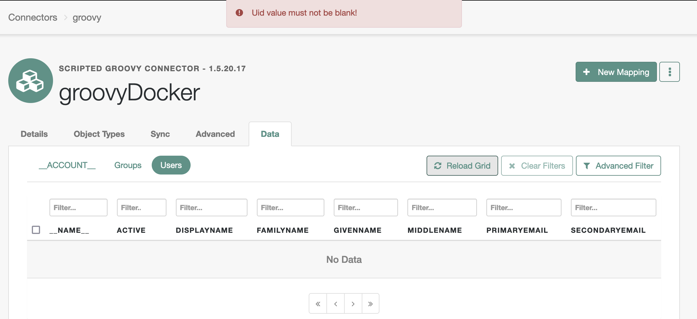

# The Basics of Developing Scripted Connectors for Java Remote Connector Server

In the [ForgeRock Identity Cloud](https://backstage.forgerock.com/docs/idcloud/latest/home.html) (Identity Cloud) managed environment, [syncing identities](https://backstage.forgerock.com/docs/idcloud/latest/identities/sync-identities.html) via a remote server provides necessary flexibility in integrating the [ForgeRock Identity Platform](https://backstage.forgerock.com/docs/platform) (Platform) with external systems.

Scripted implementations present a relatively easy way to extend this flexibility further and almost indefinitely, including the option to develop a new connector when the [available solutions](https://backstage.forgerock.com/docs/openicf/latest/connector-reference/preface.html) do not meet one's requirements. Thus, a scripted connector can address edge cases, aid with proofing a concept, serve as a demo, and potentially outline future development plans for a standard feature.

The following content overlays the existing ever-evolving [official docs](https://backstage.forgerock.com/docs/openicf/latest) with additional details on developing connectors based on the [Groovy Connector Toolkit](https://backstage.forgerock.com/docs/openicf/latest/connector-reference/groovy.html) for the [Java Remote Connector Server (RCS)](https://backstage.forgerock.com/docs/openicf/latest/connector-reference/remote-connector.html).

Additional information could also be found on the [ForgeRock Backstage](https://backstage.forgerock.com/search/?t=all&q=remote%20connector&page=1&sort=_score:desc&scope=sub) site.

> Use the links under the Contents section to quickly navigate to an area of interest. If you feel lost in a long chapter, navigate to the closest [Back to contents](#heading--contents) link and try again.
>
> The quoted paragraphs, such as this one, indicate that the content they provide is supplementary and optional.

## <a id="heading--contents" name="heading--contents"></a>Contents

* [Choosing IDE](#heading--developing-ide)
* [Interacting with RCS via IDM's REST](#heading--developing-idm-rest)
* [Debugging Scripts](#heading--developing-debugging-scripts)
    * [Try and Catch](#heading--developing-debugging-scripts-try-catch)
    * [Custom Logs](#heading--developing-debugging-scripts-custom-logs)
    * [Attaching Debugger to Kubernetes Deployment](#heading--developing-debugging-scripts-debugger-k8s)
        * [Enable Debugging](#heading--developing-debugging-scripts-debugger-k8s-jdwp)
        * [Enable Debugging Port](#heading--developing-debugging-scripts-debugger-k8s-port)
        * [Configure Debugger and Start Debugging](#heading--developing-debugging-scripts-debugger-k8s-debugger)
    * [Attaching Debugger to RCS within Docker Container](#heading--developing-debugging-scripts-debugger-docker)
* [Scripting Context](#heading--developing-connector-context)
    * [Bindings](#heading--developing-connector-context-bindings)
    * [Global Variables](#heading--developing-connector-context-globals)
* [Scripted Groovy Connector Bindings](#heading--developing-connector-bindings)
    * [configuration](#heading--developing-connector-bindings-configuration)
        * [configuration.propertyBag](#heading--developing-connector-bindings-configuration-property-bag)
            * [In Connection Configuration](#heading--developing-connector-bindings-configuration-property-bag-connection-configuration)
            * [In Customizer Script](#heading--developing-connector-bindings-configuration-property-bag-scripts-customizer)
                * [For Groovy Connector](#heading--developing-connector-bindings-configuration-property-bag-scripts-customizer-groovy)
                * [For Scripted SQL Connector](#heading--developing-connector-bindings-configuration-property-bag-scripts-customizer-sql)
                * [For Scripted REST Connector](#heading--developing-connector-bindings-configuration-property-bag-scripts-customizer-rest)
            * [In Scripts at Runtime](#heading--developing-connector-bindings-configuration-property-bag-scripts-runtime)
* [Scripted Groovy Connection Configuration](#heading--developing-connector-configuration)
    * ["configurationProperties"](#heading--developing-connector-configuration-configuration-properties)
        * ["customConfiguration" and "customSensitiveConfiguration"](#heading--developing-connector-configuration-configuration-properties-custom-configuration)
    * ["systemActions"](#heading--developing-connector-configuration-system-actions)
        * [Defining System Action](#heading--developing-connector-configuration-system-actions-definition)
            * ["scriptId"](#heading--developing-connector-configuration-system-actions-definition-script-id)
            * ["actions"](#heading--developing-connector-configuration-system-actions-definition-actions)
                * ["systemType"](#heading--developing-connector-configuration-system-actions-definition-actions-system-type)
                * ["actionType"](#heading--developing-connector-configuration-system-actions-definition-actions-action-type)
                * ["actionSource" _or_ "actionFile"](#heading--developing-connector-configuration-system-actions-definition-actions-action-source-or-file)
        * [Invoking via IDM's REST](#heading--developing-connector-configuration-system-actions-rest)
            * [Parts of the Request](#heading--developing-connector-configuration-system-actions-rest-parts)
                * [/openidm/system/\<connection-name\> (connection endpoint)](#heading--developing-connector-configuration-system-actions-rest-parts-path)
                * [?_action=script (request to execute script)](#heading--developing-connector-configuration-system-actions-rest-parts-action)
                * [&scriptId=\<script_id\> (system action to execute and return from)](#heading--developing-connector-configuration-system-actions-rest-parts-script-id)
                * [&arg1=value1&arg2=value2 . . . (script arguments)](#heading--developing-connector-configuration-system-actions-rest-parts-request-params)
                * [request body (script arguments)](#heading--developing-connector-configuration-system-actions-rest-parts-request-body)
                * [&scriptExecuteMode=resource ("run on resource")](#heading--developing-connector-configuration-system-actions-rest-parts-execute-mode)
                    * [Executed Script](#heading--developing-connector-configuration-system-actions-rest-parts-execute-mode-script-reference)
                    * [Context of Executed Script](#heading--developing-connector-configuration-system-actions-rest-parts-execute-mode-script-context)
                    * [Evaluating `scriptText`](#heading--developing-connector-configuration-system-actions-rest-parts-execute-mode-evaluate)
                    * [Other Applications of `scriptText`](#heading--developing-connector-configuration-system-actions-rest-parts-execute-mode-interpret)
        * [Invoking from an IDM Script](#heading--developing-connector-configuration-system-actions-script)
            * [Syntax](#heading--developing-connector-configuration-system-actions-script-syntax)
            * [Examples](#heading--developing-connector-configuration-system-actions-script-examples)
                * ["run on connector"](#heading--developing-connector-configuration-system-actions-script-examples-on-connector)
                * ["run on resource"](#heading--developing-connector-configuration-system-actions-script-examples-on-resource)
        * ["run on resource" vs "run on connector"](#heading--developing-connector-configuration-system-actions-execute-modes)
        * [Support in Connectors](#heading--developing-connector-configuration-system-actions-support)
* [Scripted Groovy Connector (Toolkit)](#heading--developing-scripted-connectors-groovy)
    * [Registering Connection in IDM](#heading--developing-scripted-connectors-groovy-connection)
        * [Deployment Requirements](#heading--developing-scripted-connectors-groovy-connection-requirements)
        * [Platform UI](#heading--developing-scripted-connectors-groovy-connection-platform-ui)
        * [IDM's REST](#heading--developing-scripted-connectors-groovy-connection-rest)
            * [Create Configuration](#heading--developing-scripted-connectors-groovy-connection-rest-system)
            * [Use a Provisioner File](#heading--developing-scripted-connectors-groovy-connection-rest-provisioner)
            * [Example](#heading--developing-scripted-connectors-groovy-connection-rest-example)
    * [Schema Script](#heading--developing-scripted-connectors-groovy-schema)
        * [Object Classes](#heading--developing-scripted-connectors-groovy-schema-object-types)
            * [objectClass(Closure closure)](#heading--developing-scripted-connectors-groovy-schema-object-types-object-class)
                * [type(String type)](#heading--developing-scripted-connectors-groovy-schema-object-types-object-class-type)
                * [attribute(String name[, Class type[, Set flags]])](#heading--developing-scripted-connectors-groovy-schema-object-types-object-class-attribute)
                * [attribute(AttributeInfo attributeInfo)](#heading--developing-scripted-connectors-groovy-schema-object-types-object-class-attribute-info)
                * [attributes(Closure closure)](#heading--developing-scripted-connectors-groovy-schema-object-types-object-class-attributes)
            * [defineObjectClass(ObjectClassInfo objectClassInfo[, . . . ])](#heading--developing-scripted-connectors-groovy-schema-object-types-define-object-class)
        * [Example Data](#heading--developing-scripted-connectors-groovy-schema-example-data)
            * [Users](#heading--developing-scripted-connectors-groovy-schema-example-data-users)
            * [Groups](#heading--developing-scripted-connectors-groovy-schema-example-data-groups)
        * [Example Schema Script](#heading--developing-scripted-connectors-groovy-schema-example-script)
            * [Original Data Structure](#heading--developing-scripted-connectors-groovy-schema-example-script-original)
            * [Flat Representation of Data](#heading--developing-scripted-connectors-groovy-schema-example-script-flat)
    * [Search Script](#heading--developing-scripted-connectors-groovy-search)
        * [Requesting Search Operation](#heading--developing-scripted-connectors-groovy-search-requesting-data)
            * [IDM's REST](#heading--developing-scripted-connectors-groovy-search-requesting-data-rest)
            * [IDM Script](#heading--developing-scripted-connectors-groovy-search-requesting-data-script)
        * [Responding with Data](#heading--developing-scripted-connectors-groovy-search-responding-with-data)
        * [Filtering Results](#heading--developing-scripted-connectors-groovy-search-filtering)
            * [Read by Resource ID](#heading--developing-scripted-connectors-groovy-search-filtering-id)
            * [Query Definition](#heading--developing-scripted-connectors-groovy-search-filtering-query-expression)
        * [Paging and Sorting](#heading--developing-scripted-connectors-groovy-search-paging)
            * [Page Size](#heading--developing-scripted-connectors-groovy-search-paging-size)
            * [Sorting](#heading--developing-scripted-connectors-groovy-search-paging-sorting)
            * [Tracking Position in Paged Results](#heading--developing-scripted-connectors-groovy-search-paging-tracking)
        * [Attributes to Get](#heading--developing-scripted-connectors-groovy-search-attributes)
        * [Example Search Script](#heading--developing-scripted-connectors-groovy-search-example)
            * [Flat Representation of Data](#heading--developing-scripted-connectors-groovy-search-example-flat)
    * [Test Script](#heading--developing-scripted-connectors-groovy-test)
* [Conclusion](#heading--conclusion)
* [Commonly Used References](#heading--references)

## <a id="heading--developing-ide" name="heading--developing-ide"></a>Choosing IDE

[Back to Contents](#heading--contents)

For a Java RCS, you will write scripts in [the Apache Groovy programming language](https://groovy-lang.org/) (Groovy). Consult the [IDE integration support for Groovy](https://groovy-lang.org/ides.html) document when you choose an IDE for your scripted RCS development.

In general, you can get a better support for Groovy in a Java-specialized IDE, like [IntelliJ IDEA](https://www.jetbrains.com/idea/) (IntelliJ).

In a non-Java or a polyglottal IDE, you might be able to effectively maintain your RCS scripts, but Groovy-related features may not be readily available or have limited functionality and support available.

> For example, as of this writing, no Groovy debugger extension is available for Visual Code Studio—a very popular code editor. This means that if you want to do remote debugging and attach a debugger to your RCS process, you will have to use something like IntelliJ.

## <a id="heading--developing-idm-rest" name="heading--developing-idm-rest"></a>Interacting with RCS via IDM's REST

[Back to Contents](#heading--contents)

A remote connector is a [system object](https://backstage.forgerock.com/docs/idcloud-idm/latest/objects-guide/appendix-system-objects.html), and as such, you can interact with it via [IDM's REST](https://backstage.forgerock.com/docs/idcloud-idm/latest/rest-api-reference/endpoints/rest-system-objects.html)—which is a convenient option to validate your work during development.

You will need to authorize your requests to IDM's REST as an IDM administrator. In Identity Cloud, this means including an OAuth 2.0 bearer token in the `Authorization` header of your request. The token needs to be obtained with a client mapped to an IDM subject associated with the admin role.

The easiest way of accomplishing this type of authorization is signing in to the IDM admin UI, and using the browser console for making HTTP request with `jQuery`. Internally, `jQuery` uses `XMLHttpRequest` (XHR), and such requests are automatically authorized by the IDM admin UI. In addition, browser console can serve well as a JavaScript text editor. It will provide an interactive playground with code highlighting, autocompletion, and error checking. It will add necessary headers to your requests.

For example (where `[ . . . ]` denotes omission from the original content), you could check what scripted connectors are bundled with your connector server:

`IDM admin UI browser console`

```javascript
(async function () {
    var connectorServerName = 'rcs';
    /**
     * Get an array of available connector references.
     */
    var { connectorRef } = await $.ajax({
        method: 'POST',
        url: '/openidm/system?_action=availableConnectors'
    });
    /**
     * Get a list of scripted connectors for an RCS.
     */
    var scriptedConnectorRef = connectorRef.filter((connectorRef) => {
        return connectorRef.connectorHostRef === connectorServerName;
    }).filter((connectorRef) => {
        return connectorRef.connectorName.toLowerCase().includes('scripted');
    });
    console.log('scriptedConnectorRef', JSON.stringify(scriptedConnectorRef, null, 4));
}());
```

```json
[
    {
        "connectorHostRef": "rcs",
        "displayName": "Scripted SQL Connector",
        "bundleVersion": "1.5.20.15",
        "systemType": "provisioner.openicf",
        "bundleName": "org.forgerock.openicf.connectors.scriptedsql-connector",
        "connectorName": "org.forgerock.openicf.connectors.scriptedsql.ScriptedSQLConnector"
    },
    {
        "connectorHostRef": "rcs",
        "displayName": "Scripted REST Connector",
        "bundleVersion": "1.5.20.15",
        "systemType": "provisioner.openicf",
        "bundleName": "org.forgerock.openicf.connectors.scriptedrest-connector",
        "connectorName": "org.forgerock.openicf.connectors.scriptedrest.ScriptedRESTConnector"
    },
    {
        "connectorHostRef": "rcs",
        "displayName": "Scripted Poolable Groovy Connector",
        "bundleVersion": "1.5.20.15",
        "systemType": "provisioner.openicf",
        "bundleName": "org.forgerock.openicf.connectors.groovy-connector",
        "connectorName": "org.forgerock.openicf.connectors.groovy.ScriptedPoolableConnector"
    },
    {
        "connectorHostRef": "rcs",
        "displayName": "Scripted Groovy Connector",
        "bundleVersion": "1.5.20.15",
        "systemType": "provisioner.openicf",
        "bundleName": "org.forgerock.openicf.connectors.groovy-connector",
        "connectorName": "org.forgerock.openicf.connectors.groovy.ScriptedConnector"
    }
]
```

> In this example, the `connectorServerName` variable corresponds to the namesake setting in the `ConnectorServer.properties` file described in the [Configure a remote server](https://backstage.forgerock.com/docs/idcloud/latest/identities/sync-identities.html#configure_a_remote_server) doc. In Identity Cloud, you can see individual Connector Servers and Server Clusters in the Platform admin UI under Identities > Connect; you can use either a server or a cluster name to identify your RCS.

This technique will be used in the examples included in this writing.

Alternatively, you could use an actual IDE like [Postman](https://www.postman.com/) for crafting your requests to IDM's REST.

You can also obtain your access token separately and use it with [cURL](https://curl.se/).

For example:

```sh
curl 'https://openam-dx-kl03.forgeblocks.com/openidm/system?_action=availableConnectors' \
-X POST \
-H 'Authorization: Bearer $ACCESS_TOKEN' \
-H 'Content-Length: 0'
```

## <a id="heading--developing-debugging-scripts" name="heading--developing-debugging-scripts"></a>Debugging Scripts

[Back to Contents](#heading--contents)

### <a id="heading--developing-debugging-scripts-try-catch" name="heading--developing-debugging-scripts-try-catch"></a>Debugging Scripts > Try and Catch

[Back to Contents](#heading--contents)

If an unhandled exception occurs in your RCS scripts, depending on the script, it may result in a malformed or blank screen in the UI, an unnecessarily detailed error message sent to the client side, and/or lack of debug information in the RCS logs.

Therefore, you should wrap your code with a `try/catch` block, send custom error messages to the logs output, and potentially throw a custom exception.

For example:

`SearchScript.groovy`

```groovy
try {

    // code

} catch (e) {
    throw new UnsupportedOperationException('Error occurred during ' + operation + ' operation')
}
```

> [UnsupportedOperationException](https://docs.oracle.com/en/java/javase/11/docs/api/java.base/java/lang/UnsupportedOperationException.html) is a Java exception, which, among some other most commonly used Java classes, is [automatically provided in Groovy scripts](https://groovy-lang.org/structure.html#_default_imports).

Should an exception occur, a request for search operation would return the specified error content:

```json
{"code":404,"reason":"Not Found","message":"Error occurred during SEARCH operation"}
```

If it is supported, the browser response will be reflected in the UI, for example:



If you throw custom exceptions in your code, you can preserve those custom messages by catching a specific exception type.

For example:

`SearchScript.groovy`

```groovy
[ . . . ]

try {
    switch (objectClass.objectClassValue) {
        case 'users':

        [ . . . ]

        default:
            throw new UnsupportedOperationException(operation.name() + ' operation of type: ' + objectClass.getObjectClassValue() + ' is not supported.')
    }
} catch (UnsupportedOperationException e) {
    /**
     * Preserve and re-throw the custom exception on unrecognized object class.
     */
    throw e
} catch (e) {
    throw new UnsupportedOperationException('Error occurred during ' + operation + ' operation')
}
```


For debugging purposes, you can output more detailed information about an exception in the RCS logs.

### <a id="heading--developing-debugging-scripts-custom-logs" name="heading--developing-debugging-scripts-custom-logs"></a>Debugging Scripts > Custom Logs

[Back to Contents](#heading--contents)

You can use methods of the [Log](https://backstage.forgerock.com/docs/openicf/latest/_attachments/apidocs/org/identityconnectors/common/logging/Log.html) class to output custom logs from your connector scripts by passing in a String with the debugging content.

For example:

`SearchScript.groovy`

```groovy
try {

    [ . . . ]

} catch (e) {
    log.error e.message

    throw new UnsupportedOperationException('Error occurred during ' + operation + ' operation')
}
```

`RCS logs`

```
[rcs] Oct 20, 2022 12:41:12 AM INFO ERROR SearchScript: No such property: getResourceData for class: SearchScript
```

Using methods of the `Log` class might require some extra processing applied to the content you are trying to output:

* To output an object information without referencing its individual properties you may need to convert it to a String first. Otherwise, you could get a wordy error.

    For example:

    `TestScript.groovy`

    ```groovy
    try {
        log.info operation
    } catch (e) {
        log.error e.message
    }
    ```

    `RCS logs`

    ```
    [rcs] Oct 20, 2022 11:43:45 PM ERROR TestScript: No signature of method: org.identityconnectors.common.logging.Log.info() is applicable for argument types: (org.forgerock.openicf.connectors.groovy.OperationType) values: [TEST]%0APossible solutions: info(java.lang.String, [Ljava.lang.Object;), isInfo(), info(java.lang.Throwable, java.lang.String, [Ljava.lang.Object;), isOk(), find(), any()
    ```

    You can convert an object to string by using its `.toString()` method or by prepending your log with a String:

    For example:

   `TestScript.groovy`

    ```groovy
    try {
        log.info 'Operation: ' + operation
    } catch (e) {
        log.error e.message
    }
    ```

    `RCS logs`

    ```
    [rcs] Oct 20, 2022 11:47:24 PM INFO  TestScript: Operation: TEST
    ```

* If you try to output raw JSON describing an object, its curly braces will be interpreted as formatting syntax (by internally used [MessageFormat](https://docs.oracle.com/en/java/javase/11/docs/api/java.base/java/text/MessageFormat.html)). This might produce an error if the content of the curly braces is not a number.

    For (an error) example:

    `TestScript.groovy`

    ```groovy
    try {
        log.info '{"key": "value"}'
    } catch (e) {
        log.error e.message
    }
    ```

    `RCS logs`

    ```
    [rcs] Oct 19, 2022 06:55:08 PM ERROR TestScript: cant parse argument number: "key": "value"
    ```

    To mitigate this issue, you should parse the JSON first _and_ convert the resulting object to a String.

    For example:

     `TestScript.groovy`

    ```groovy
    import groovy.json.JsonSlurper

    try {
        log.info 'JSON object: ' + (new JsonSlurper().parseText('{"key": "value"}'))
    } catch (e) {
        log.error e.message
    }
    ```

    `RCS logs`

    ```
    [rcs] Oct 19, 2022 06:56:41 PM INFO  TestScript: JSON object: [key:value]
    ```

Methods of the `Log` class add additional information to the output: a timestamp, the log level, and the source reference. You should use `Log` for debugging output that is to stay in the code and be used in the final application.

During the development phase, however, for a quick temporary output, you could use the [println](https://docs.oracle.com/en/java/javase/11/docs/api/java.base/java/io/PrintStream.html) method. `System.out.println` will automatically apply `.toString()` method available in all Java objects to the content it outputs. This will allow to print out content of different types of variables without additional processing. It will be up to you to provide any extra info in the output.

> Much of the commonly used Java functionality is [imported in Groovy by default](https://groovy-lang.org/structure.html#_default_imports), including the `java.lang.*` package where `println` comes from. Hence, you don't need to use the full `System.out.println` statement.

For example:

`TestScript.groovy`

```groovy
println operation
```

`RCS logs`

```
[rcs] TEST
```

To outline string values in the printed out content of an object, you can use [inspect()](https://docs.groovy-lang.org/latest/html/groovy-jdk/java/lang/Object.html#inspect()) method in Groovy.

For example:

`SearchScript.groovy`

```groovy
println binding.variables.query()
println binding.variables.query().inspect()
```

`RCS Logs`

```sh
[rcs] [not:false, operation:GREATERTHAN, left:__NAME__, right:m]
[rcs] ['not':false, 'operation':'GREATERTHAN', 'left':'__NAME__', 'right':'m']
```

### <a id="heading--developing-debugging-scripts-debugger-k8s" name="heading--developing-debugging-scripts-debugger-k8s"></a>Debugging Scripts > Attaching Debugger to Kubernetes Deployment

[Back to Contents](#heading--contents)

Attaching a debugger to your RCS process will allow to pause a connector execution at select break points in your code and inspect the current state of your connector scripting context. Doing so can help to locate and eliminate programming errors.

An RCS can be deployed within a [Docker](https://www.docker.com/) container; in this case, it will run in a remote Java Virtual Machine (JVM). In order to attach a debugger to this process from your local development setup, you will need to perform the following steps:

1. <a id="heading--developing-debugging-scripts-debugger-k8s-jdwp" name="heading--developing-debugging-scripts-debugger-k8s-jdwp"></a>Enable Debugging

    [Back to Contents](#heading--contents)

    You can enable debugging by invoking your RCS JVM with the [Java Debug Wire Protocol (JDWP)](https://docs.oracle.com/en/java/javase/11/docs/specs/jpda/conninv.html#oracle-vm-invocation-options) options.

    For a [Kubernetes](https://kubernetes.io/) deployment, you can specify the JDWP options in a few alternative ways:

    * Engage the [ForgeRock Open Identity Connector Framework (ICF)](https://backstage.forgerock.com/docs/openicf/latest/index.html) defaults.

        You could rely on the default JDWP options defined for the RCS Docker container. You can do it by supplying the expected `jpda` argument to the ICF's [Docker ENTRYPOINT](https://docs.docker.com/engine/reference/builder/#entrypoint) script:

        `/opt/openicf/bin/docker-entrypoint.sh`:

        ```sh
        [ . . . ]
        if [ "$1" = "jpda" ] ; then
        if [ -z "$JPDA_TRANSPORT" ]; then
            JPDA_TRANSPORT="dt_socket"
        fi
        if [ -z "$JPDA_ADDRESS" ]; then
            JPDA_ADDRESS="5005"
        fi
        if [ -z "$JPDA_SUSPEND" ]; then
            JPDA_SUSPEND="n"
        fi
        if [ -z "$JPDA_OPTS" ]; then
            JPDA_OPTS="-agentlib:jdwp=transport=$JPDA_TRANSPORT,address=$JPDA_ADDRESS,server=y,suspend=$JPDA_SUSPEND"
        fi
        OPENICF_OPTS="$OPENICF_OPTS $JPDA_OPTS"
        shift
        fi
        [ . . . ]
        ```

        > JDWP is a part of Java Platform Debugger Architecture; hence, the JPDA abbreviation is used in the ICF code.

        In a Kubernetes manifest for your RCS, the `jpda` argument can be added to the command that calls the `/opt/openicf/bin/docker-entrypoint.sh` script.

        For example:

        `rcs.yaml`

        ```sh
        [ . . . ]
        command: ['bash', '-c']
        args:
        - export OPENICF_OPTS="-Dconnectorserver.connectorServerName=$HOSTNAME [ . . . ]"
          && /opt/openicf/bin/docker-entrypoint.sh jpda;
        [ . . . ]
        ```

    * Provide custom JDWP options at RCS launch.

        Alternatively, you can include your (custom) JDWP options in the `OPENICF_OPTS` environment variable defined in your Kubernetes manifest.

        For example:

        `rcs.yaml`

        ```sh
        [ . . . ]
        command: ['bash', '-c']
        args:
        - export OPENICF_OPTS="-Dconnectorserver.connectorServerName=$HOSTNAME [ . . . ]
          -agentlib:jdwp=transport=dt_socket,address=5005,server=y,suspend=n"
          && /opt/openicf/bin/docker-entrypoint.sh;
        [ . . . ]
        ```

    * Provide (custom) JDWP options at runtime.

        You can dynamically apply an environment variable to your RCS containers by using [kubectl set env](https://kubernetes.io/docs/reference/generated/kubectl/kubectl-commands#set) command. With this command, you can update `JAVA_OPTS` for the JVM running in the containers.

        For example:

        `Terminal`

        ```sh
        $ kubectl set env statefulsets/rcs -c rcs JAVA_OPTS="$JAVA_OPTS -agentlib:jdwp=transport=dt_socket,address=5005,server=y,suspend=n"
        ```

        > If you use [Skaffold](https://skaffold.dev/docs/), updating `JAVA_OPTS` will restart your StatefulSet/Deployment.

        You can check the updated environment with the `--list` option.

        For example:

        `Terminal`

        ```sh
        $ kubectl set env statefulsets/rcs -c rcs --list=true
        ```

        ```
        # StatefulSet rcs, container rcs
        JAVA_OPTS= -agentlib:jdwp=transport=dt_socket,address=5005,server=y,suspend=n
        ```

        You can remove the variable and its effects with the (negative) `JAVA_OPTS-` option.

        For example:

        `Terminal`

        ```sh
        $ kubectl set env statefulsets/rcs -c rcs JAVA_OPTS-
        ```

    In all cases, the JDWP address option is the remote JVM's TCP/IP port, to which your local debugger will eventually connect. It will be a _local to the RCS instance_ port, but to distinguish it from the port on the debugger machine, we will call it "remote".

    > Optionally, you can include the host information in the address option, an IP or the `localhost` designation, to limit where the debugger connection could be made from; for example: `address=127.0.0.1:5005`.
    >
    > If you omit the host identifier in the Java Development Kit (JDK) 9 and above, the connection will be limited to `localhost`. In the older versions of JDK, if no host is specified, a connection would be allowed from any IP. To achieve the same behavior in JDK 9+, you can use a wildcard as the host value; for example, `address=*:5005`. It is considered the best practice, however, to limit connections to a specific IP.
    >
    > In the case of attaching a debugger to RCS deployed within a Kubernetes cluster, leaving the host information out, and thus limiting the debugger connection to localhost, is the easiest option and the one taken in the default JDWP options defined in the ICF.

2. <a id="heading--developing-debugging-scripts-debugger-k8s-port" name="heading--developing-debugging-scripts-debugger-k8s-port"></a>Enable Debugging Port

    [Back to Contents](#heading--contents)

    You will need to allow your local debugger to communicate with the RCS process via the remote debugging port specified in the JDWP options.

    Your RCS deployment and its debugging port are unlikely to be exposed externally. This means, you will need to let your debugger access the remote process by [forwarding connections made to a local port on your machine to a remote port on the RCS pods in your Kubernetes cluster](https://kubernetes.io/docs/tasks/access-application-cluster/port-forward-access-application-cluster/#forward-a-local-port-to-a-port-on-the-pod).

    Here, the local port is the one you will use in your debugger configuration; the remote port is the one that you specified in the JDWP `address` option. In the following example, the "local" port is on the left and the "remote" one is on the right:

    `Terminal`

    ```sh
    $ kubectl port-forward statefulsets/rcs 5005:5005

    Forwarding from 127.0.0.1:5005 -> 5005
    Forwarding from [::1]:5005 -> 5005
    ```

3. <a id="heading--developing-debugging-scripts-debugger-k8s-debugger" name="heading--developing-debugging-scripts-debugger-k8s-debugger"></a>Configure Debugger and Start Debugging

    [Back to Contents](#heading--contents)

    IntelliJ is a popular IDE that has rich and refined support for Java and Groovy; and thus, it is probably going to be your best option for developing Groovy scripts for RCS. Below, find an example of how you can configure IntelliJ for remote debugging and attach its debugger to your RCS process:

    1. Create a new IntelliJ project.

        For example, you can use `File > New > Project from Existing Sources...` and point it to the folder that contains your project files—such as README, configuration, etc.—and the actual scripts; then, the folder content could be accessed and maintained under `Project > Project Files`. Do not import any sources at this point; you will add the scripts you need to debug as a module in the next step.

        Open the project.

    1. Add a new module with `File > New Module from Existing Sources...` and point it to your connector's scripts location.

        If/when you have more than one connector in your RCS, mark only the connector-specific scripts as the source files in the Import Module dialog. Creating a separate module from the existing scripts for each connector will let you reference the module in a debugging configuration and thus limit its scope to the scripts for a particular connector.

        > Otherwise, if you included files with the same name for more than one connector in a module, and set a breakpoint in one of the namesake scripts, the debugger could open a file with the same name for a different connector—the first script file with this name that was found in the module sources.

        The module files will serve as the [sources of your (RCS) application](https://www.jetbrains.com/help/idea/attaching-to-local-process.html#prerequisites), which is one of the prerequisites for attaching a debugger in IntelliJ.

        For example, two modules registered for a project might appear under the Project Files in the following manner:

        

    1. Select `Run` > `Edit Configurations...`

    1. Select `Add New Configuration` (`+`), then select `Remote JVM Debug` from the list of predefined configuration templates.

    1. In the `Configuration` tab, provide values (or verify the defaults) for the following settings:

        1. `Name`: _your-rcs-connector-debugging-configuration-name_

        1. `Debugger mode`: Attach to remote JVM

        1. `Host`: localhost

            The host to which the debugger will connect. Choose localhost because we, actually, attempt to debug locally (that is, the debugger runs locally and connects to a local port, and then it is forwarded to a remote port in the Kubernetes cluster); you could also use `127.0.0.1` or `::1` as the Host value.

        1. `Port`: 5005

            The local port the debugger will connect to, from which connections will be forwarded (with the `kubectl port-forward [ . . . ]` command) to the remote port.

        1. `Command line arguments for remote JVM (for JDK 9 or later)`: JDK 9 or later

            This input is to provide a template for your JDWP options according to your previous choices, and you will see the following:

            `-agentlib:jdwp=transport=dt_socket,server=y,suspend=n,address=*:5005`

            Note, however, that:

            * The `*` prefix  in `JDK 9+` means that the connection will be allowed on the remote host from any IP.

                Leaving the host information out and having just the port specified will limit connections to the localhost only, which is the safest option that will work in this case.

                > Removing the wildcard or replacing it with a specific identifier (for example, an IP or `localhost`) is considered the best practice. In reality, however, it is unlikely that any IP/port will be made public on your RCS; hence, limiting debugging connections to your JVM might be a minor consideration in this case.

            * The remote JVM port is populated with the same number as your local debugger port, for it assumes that the two ports, local and remote, are the same.

                > _If_ the remote debugging port in your RCS were different from the local one, you could still use this input for getting your JDWP options template, and simply update the port with the actual remote port that you will use for debugging.
                >
                > Naturally, in such case, you would also need to port-forward your local connections to _that_ port with the `kubectl port-forward [ . . . ]` command.
                >
                > For example, if your remote JVM port is `5006`, your _actual_ JDWP options could look like the following:
                >
                > `Terminal`
                >
                > ```sh
                > $ kubectl set env statefulsets/rcs -c rcs JAVA_OPTS="$JAVA_OPTS -agentlib:jdwp=transport=dt_socket,server=y,suspend=n,address=5006"
                > ```
                >
                > and your port-forwarding command would be:
                >
                > `Terminal`
                >
                > ```
                > kubectl port-forward statefulsets/rcs 5005:5006
                > ```

        1. `Use module classpath`: _your-rcs-connector-module-name_

            Here, you reference the module created from your existing connector's scripts—so that the debugger looks for the breakpoints positions only in those files.

        1. The end result may look similar to the following:

            

            Select `Apply` or `OK`.

    1. Start debugging.

        For example, you can select the bug button in the upper right of your IDE UI:

        

    1. Add breakpoints.

        If everything is set up correctly, you should be able to see the breakpoints [verified](https://www.jetbrains.com/help/idea/using-breakpoints.html#breakpoint-icons) and employed when you are using your connector.

        For example:

        

    1. If you want to use debugger with another scripted connector in the same IntelliJ project:

        * Add a new module via `File > New Module from Existing Sources...`, and point it to the other connector's scripts.

        * Under `Run > Edit Configurations...`, add a new remote JVM debugging configuration, and select the new module in the `Use module classpath:` input.

        * Select the new debug configuration before you start your debug session.

            For example:

            

    For additional details, consult the IntelliJ docs on [setting debugging environment](https://www.jetbrains.com/help/idea/creating-and-editing-run-debug-configurations.html) and [debugging](https://www.jetbrains.com/help/idea/debugging-code.html#general-procedure).

This should help understand the process of attaching a debugger to your RCS instance running in a Kubernetes cluster. Change it according to your specific requirements.

### <a id="heading--developing-debugging-scripts-debugger-docker" name="heading--developing-debugging-scripts-debugger-docker"></a>Debugging Scripts > Attaching Debugger to RCS within Docker Container

[Back to Contents](#heading--contents)

If you have deployed RCS in a stand-alone Docker container, you can publish the debugger port in the [docker run](https://docs.docker.com/engine/reference/commandline/run) command using the [--publish, -p](https://docs.docker.com/engine/reference/commandline/run/#publish) flag.

Because localhost reference in a stand-alone container will depend on the host platform, you might not be able to use the default JDWP options defined by the ICF. Also, there is no standard way to update the environment variables in a running Docker container. Thus, including the JDWP options in the `OPENICF_OPTS` environment variable at the time an RCS container is created (with the [docker run](https://docs.docker.com/engine/reference/commandline/run) command) is probably the most practical way of enabling debugging.

For example:

`.env file`

```sh
OPENICF_OPTS=-Dconnectorserver.url=wss://openam-dx-kl04.forgeblocks.com/openicf/0 -Dconnectorserver.tokenEndpoint=https://openam-dx-kl04.forgeblocks.com/am/oauth2/realms/root/realms/alpha/access_token -Dconnectorserver.connectorServerName=rcs-docker-1 -Dconnectorserver.clientId=RCSClient -Dconnectorserver.clientSecret=YA...H? -agentlib:jdwp=transport=dt_socket,address=*:5005,server=y,suspend=n
```

```sh
$ docker run --rm --env-file .env -p 127.0.0.1:5005:5005 --entrypoint /opt/openicf/bin/docker-entrypoint.sh rcs
```

From this point, you can proceed to the step [3. Configure Debugger and Start Debugging](#heading--developing-debugging-scripts-debugger-k8s-debugger) described in the Kubernetes Deployment chapter.

##  <a id="heading--developing-connector-context" name="heading--developing-connector-context"></a>Scripting Context

[Back to Contents](#heading--contents)

###  <a id="heading--developing-connector-context-bindings" name="heading--developing-connector-context-bindings"></a>Scripting Context > Bindings

[Back to Contents](#heading--contents)

A [Groovy script](https://docs.groovy-lang.org/latest/html/api/groovy/lang/Script.html) can receive externally defined content via the [binding](https://docs.groovy-lang.org/latest/html/api/groovy/lang/Binding.html) object defined in the script's top-level scope. In connector scripts, the variable bindings are defined according to the connector type ([Groovy](https://backstage.forgerock.com/docs/openicf/latest/connector-reference/groovy.html), [Scripted REST](https://backstage.forgerock.com/docs/openicf/latest/connector-reference/scripted-rest.html), or [Scripted SQL](https://backstage.forgerock.com/docs/openicf/latest/connector-reference/scripted-sql.html) for a scripted connector) and the [script operation type](https://backstage.forgerock.com/docs/openicf/latest/connector-dev-guide/groovy-operations.html), which are derived from the respective connection configuration registered in IDM.

For example:

`provisioner.openicf-<connector-name>.json`

```json
{
    "connectorRef": {
        "bundleName": "org.forgerock.openicf.connectors.groovy-connector",
        "connectorName": "org.forgerock.openicf.connectors.groovy.ScriptedConnector",
        [ . . . ]
    },
    [ . . . ]
    "configurationProperties": {
        "scriptExtensions": [
            "groovy"
        ],
        "scriptRoots": [
            "/opt/openicf/scripts/groovy"
        ],
        "scriptOnResourceScriptFileName":  null,
        "authenticateScriptFileName":  null,
        "createScriptFileName":  null,
        "customizerScriptFileName": null,
        "deleteScriptFileName":  null,
        "resolveUsernameScriptFileName":  null,
        "schemaScriptFileName": "SchemaScript.groovy",
        "searchScriptFileName": "SearchScript.groovy",
        "syncScriptFileName":  null,
        "testScriptFileName": "TestScript.groovy",
        "updateScriptFileName":  null,
        "scriptBaseClass": null,
        [ . . . ]
    },
    "systemActions" : [
        {
            "scriptId" : "script-1",
            "actions" : [
                {
                    "systemType" : ".*ScriptedConnector",
                    "actionType" : "groovy",
                    "actionSource" : "println 'actionSource bindings: '; println binding.variables;"
                }
            ]
        }
    ],
    [ . . .]
}
```

You can inspect variable bindings passed to the script (and thus, directly accessible in the script top-level scope) as shown in the following example:

`SchemaScript.groovy`

```groovy
println 'operation: ' + operation
```

`RCS logs`

```
[rcs] operation: SCHEMA
```

You can also output the entire content of the `binding.variables` property:

`SchemaScript.groovy`

```groovy
println binding.variables.inspect()
```

`RCS logs`

```sh
['builder':org.forgerock.openicf.connectors.groovy.ICFObjectBuilder@290017f2, 'operation':SCHEMA, 'configuration':org.forgerock.openicf.connectors.groovy.ScriptedConfiguration@5a34f2f9, 'log':org.identityconnectors.common.logging.Log@32095aee]
```

The `binding.variables` property is an instance of the [java.util.LinkedHashMap](https://docs.oracle.com/en/java/javase/11/docs/api/java.base/java/util/LinkedHashMap.html) class. You can loop over its entries and get more detailed information about individual bindings:

For example:

`SchemaScript.groovy`

```groovy
binding.variables.each { key, value ->
    def className = value ? value.class.name : ''
    println key + ': ' + className
}
```

`RCS logs`

```
[rcs] Bindings:
[rcs] builder: org.forgerock.openicf.connectors.groovy.ICFObjectBuilder
[rcs] operation: org.forgerock.openicf.connectors.groovy.OperationType
[rcs] configuration: org.forgerock.openicf.connectors.groovy.ScriptedConfiguration
[rcs] log: org.identityconnectors.common.logging.Log
```

> [Registering Connection in IDM](#heading--developing-scripted-connectors-groovy-connection) and [Schema Script](#heading--developing-scripted-connectors-groovy-schema) chapters provide details on enabling and requesting schema operation, which invokes the schema script.

### <a id="heading--developing-connector-context-globals" name="heading--developing-connector-context-globals"></a>Global Variables

[Back to Contents](#heading--contents)

Bindings, both the `binding` instance and the individual variable bindings, behave as global variables. This opens a possibility of reassigning them accidentally and thus breaking something in your code.

To avoid a situation like this in complex and involved scripts, you could reassign variable bindings to the namesake local variables. You can further clarify bindings' designations by referencing their types.

For example:

`TestScript.groovy`

```groovy
import org.identityconnectors.common.logging.Log
import org.forgerock.openicf.connectors.groovy.OperationType
import org.forgerock.openicf.connectors.groovy.ScriptedConfiguration

def operation = operation as OperationType
def configuration = configuration as ScriptedConfiguration
def log = log as Log

[ . . . ]
```

Doing so and adding corresponding dependencies to your scripted connector project can enable your IDE to show bindings' class information and provide additional code completion options.

> For example, [in IntelliJ, you can add your dependencies as modules](https://www.jetbrains.com/help/idea/working-with-module-dependencies.html). Even if you don't manage your connector scripts as a Java project, for the `identityconnectors` and `openicf` packages, you could import `java-framework` and `groovy-common` from the [General Access Connectors](https://stash.forgerock.org/projects/GA/repos/connectors-customers-ga/browse?at=refs%2Ftags%2F1.5.20.15) repository; and thus, allow your IDE to show the additional information about your variables.

## <a id="heading--developing-connector-bindings" name="heading--developing-connector-bindings"></a>Scripted Groovy Connector Bindings

[Back to Contents](#heading--contents)

In [ICF operations with Groovy scripts](https://backstage.forgerock.com/docs/openicf/latest/connector-dev-guide/groovy-operations.html#groovy-script-variables), you can navigate through descriptions and examples of use for common and operation-specific bindings (that is, externally defined input variables) available in connector scripts.

Below, find additional information about some common properties accessible from the scripting context:

### <a id="heading--developing-connector-bindings-configuration" name="heading--developing-connector-bindings-configuration"></a>Scripted Groovy Connector Bindings > `configuration`

[Back to Contents](#heading--contents)

The `configuration` binding is an instance of `org.forgerock.openicf.connectors.groovy.ScriptedConfiguration`, which provides access to connection properties registered in IDM and some additional properties defined by the ICF framework.

You can print out the entire binding content by inspecting `configuration.properties`, which returns a map:

`SearchScript.groovy`

```groovy
println configuration.properties.inspect()
```

To make a map output more readable and/or informative, you could print the map keys individually and recursively when a key itself is a map.

For example:

`SearchScript.groovy`

```groovy
/**
 * @param object    Any variable.
 * @param label     String
 *                  Optional label to precede the output.
 * @param space     int
 *                  Optional indentation size.
 * @todo            Extend to handle complex types other than Map.
 */
def printObjectProperties = { object, label='Map', space=4 ->
    def printProperties
    printProperties = { propertyValue, propertyName, indent ->
        def message = indent + propertyName +  ' (' + propertyValue.getClass().name + '):'
        if (propertyValue instanceof Map) {
            println message

            propertyValue.each { entry ->
                printProperties entry.value, entry.key, indent + ' ' * space
            }
        } else {
            println message + ' ' + propertyValue.inspect()
        }
    }
    printProperties object, label, ''
}

printObjectProperties configuration.properties, 'configuration.properties'
```

`RCS logs`
```sh
[rcs] configuration.properties (java.util.LinkedHashMap):
[rcs]     imports ([Ljava.lang.String;): ['org.identityconnectors.framework.common.objects.*']
[rcs]     disabledGlobalASTTransformations ([Ljava.lang.String;): [null]
[rcs]     scriptOnResourceScriptFileName (org.codehaus.groovy.runtime.NullObject): null
[rcs]     parentLoader (org.identityconnectors.framework.impl.api.local.BundleClassLoader): org.identityconnectors.framework.impl.api.local.BundleClassLoader@12bbfc54
[rcs]     deleteScriptFileName (org.codehaus.groovy.runtime.NullObject): null
[rcs]     propertyBag (java.util.concurrent.ConcurrentHashMap):
[rcs]         myCustomProperties (java.util.LinkedHashMap):
[rcs]             count (java.lang.Integer): 0
[rcs]             config (org.apache.groovy.json.internal.LazyMap):
[rcs]                 key1 (java.lang.String): 'value1'
[rcs]                 key2 (org.apache.groovy.json.internal.LazyMap):
[rcs]                     key1 (java.lang.String): 'value1'
[rcs]         myCustomMethods (java.util.LinkedHashMap):
[rcs]             getSum (SearchScript$_run_closure2): SearchScript$_run_closure2@61997137
[rcs]     scriptExtensions ([Ljava.lang.String;): ['groovy']
[rcs]     syncScriptFileName (org.codehaus.groovy.runtime.NullObject): null
[rcs]     defaultCustomizerScriptName (java.lang.String): '/org/forgerock/openicf/connectors/groovy/CustomizerScript.groovy'
[rcs]     recompileGroovySource (java.lang.Boolean): false
[rcs]     createScriptFileName (org.codehaus.groovy.runtime.NullObject): null
[rcs]     tolerance (java.lang.Integer): 10
[rcs]     customSensitiveConfiguration (org.codehaus.groovy.runtime.NullObject): null
[rcs]     customizerClass (org.codehaus.groovy.runtime.NullObject): null
[rcs]     minimumRecompilationInterval (java.lang.Integer): 100
[rcs]     authenticateScriptFileName (org.codehaus.groovy.runtime.NullObject): null
[rcs]     warningLevel (java.lang.Integer): 1
[rcs]     targetDirectory (org.codehaus.groovy.runtime.NullObject): null
[rcs]     schemaScriptFileName (java.lang.String): 'SchemaScript.groovy'
[rcs]     class (java.lang.Class): class org.forgerock.openicf.connectors.groovy.ScriptedConfiguration
[rcs]     scriptBaseClass (org.codehaus.groovy.runtime.NullObject): null
[rcs]     customConfiguration (org.codehaus.groovy.runtime.NullObject): null
[rcs]     connectorMessages (org.identityconnectors.framework.impl.api.ConnectorMessagesImpl): org.identityconnectors.framework.impl.api.ConnectorMessagesImpl@3ea2423
[rcs]     debug (java.lang.Boolean): false
[rcs]     classpath ([Ljava.lang.String;): []
[rcs]     releaseClosure (org.codehaus.groovy.runtime.NullObject): null
[rcs]     updateScriptFileName (org.codehaus.groovy.runtime.NullObject): null
[rcs]     sourceEncoding (java.lang.String): 'UTF-8'
[rcs]     customizerScriptFileName (org.codehaus.groovy.runtime.NullObject): null
[rcs]     testScriptFileName (org.codehaus.groovy.runtime.NullObject): null
[rcs]     verbose (java.lang.Boolean): false
[rcs]     groovyScriptEngine (groovy.util.GroovyScriptEngine): groovy.util.GroovyScriptEngine@53a79e33
[rcs]     searchScriptFileName (java.lang.String): 'SearchScript.groovy'
[rcs]     scriptRoots ([Ljava.lang.String;): ['/opt/openicf/scripts/groovy']
[rcs]     resolveUsernameScriptFileName (org.codehaus.groovy.runtime.NullObject): null
```

You can also access each configuration property individually:

`SearchScript.groovy`

```groovy
println 'Script Roots: ' + configuration.scriptRoots.inspect()
```

`RCS logs`

```sh
[rcs] Script Roots: ['/opt/openicf/scripts/groovy']
```

Most of this content corresponds directly to the keys in the connection configuration at the time it is registered in IDM, where you can specify some of the connector configuration properties. ICF defines additional properties in the connector configuration.

#### <a id="heading--developing-connector-bindings-configuration-property-bag" name="heading--developing-connector-bindings-configuration-property-bag"></a>Scripted Groovy Connector Bindings > `configuration` > `configuration.propertyBag`

[Back to Contents](#heading--contents)

If you need to keep a custom global reference accessible from any connector script, you can save it in the `configuration.propertyBag` property, which is a map. This will allow to dynamically define, cache, and share within a connector instance anything that can be passed as a variable: a primitive or a reference to an object, such as a map or a closure.

The content saved in `configuration.propertyBag` will be reset when "configurationProperties.customConfiguration" and "configurationProperties.customSensitiveConfiguration" properties have been changed in the connection configuration, the RCS is restarted, or the IDM connector instance service (OSGi) is restarted.

You can populate `configuration.propertyBag` at different stages of a connector life cycle:

##### <a id="heading--developing-connector-bindings-configuration-property-bag-connection-configuration" name="heading--developing-connector-bindings-configuration-property-bag-connection-configuration"></a>Scripted Groovy Connector Bindings > `configuration.propertyBag` > In Connection Configuration

[Back to Contents](#heading--contents)

Initial content for `configuration.propertyBag` can be provided via "configurationProperties.customConfiguration" and "configurationProperties.customSensitiveConfiguration" keys in a connection configuration.

Doing so, the connection-specific content—which could be settings, secrets, references, etc.—can be saved in IDM environment, with an option to use [property value substitution](https://backstage.forgerock.com/docs/idm/7.3/setup-guide/using-property-substitution.html) and [Environment-Specific Variables and Secrets (ESVs)](https://backstage.forgerock.com/docs/idcloud/latest/tenants/esvs.html) (in Identity Cloud).

See the [Connection Configuration > "configurationProperties" > "customConfiguration" and "customSensitiveConfiguration"](#heading--developing-connector-configuration-configuration-properties-custom-configuration) chapter for details.

Note that if "configurationProperties.customConfiguration" or "configurationProperties.customSensitiveConfiguration" properties have been changed in the connection configuration, the `configuration.propertyBag` content will be reset on the connector that is using this configuration.

##### <a id="heading--developing-connector-bindings-configuration-property-bag-scripts-customizer" name="heading--developing-connector-bindings-configuration-property-bag-scripts-customizer"></a>Scripted Groovy Connector Bindings > `configuration.propertyBag` > In Customizer Script

[Back to Contents](#heading--contents)

In connector implementations based on the [Scripted Groovy Connector Toolkit](https://backstage.forgerock.com/docs/openicf/latest/connector-reference/groovy.html), ICF uses the [Stateful Configuration](https://backstage.forgerock.com/docs/openicf/latest/connector-dev-guide/connector-types.html) interface. This means that a configuration instance is initialized once during the connector's [management cycle](https://backstage.forgerock.com/docs/openicf/latest/connector-dev-guide/framework-connector-instantiation.html#connector-instantiation-stateful) and before any [ICF operations with Groovy scripts](https://backstage.forgerock.com/docs/openicf/latest/connector-dev-guide/groovy-operations.html) are performed.

You can use [custom configuration initialization](https://backstage.forgerock.com/docs/openicf/latest/connector-dev-guide/advanced-custom-config.html) in the connector server environment via a script referenced under the "configurationProperties.customizerScriptFileName" key in a connection configuration.

During the initialization process, the customizer script will have access to the configuration instance and can be used to update `configuration.propertyBag` content, which will become globally available for all the scripts implementing ICF operations at runtime.

> Note that while a stateful connector configuration is initialized only once, the customizer script runs every time when the corresponding connection configuration is updated in IDM; you can leverage this fact while developing your customizer script functionality.

###### <a id="heading--developing-connector-bindings-configuration-property-bag-scripts-customizer-groovy" name="heading--developing-connector-bindings-configuration-property-bag-scripts-customizer-groovy"></a>Scripted Groovy Connector Bindings > `configuration.propertyBag` > In Customizer Script > For Groovy Connector

[Back to Contents](#heading--contents)

In a plain Groovy connector, the customizer script will have access to the following bindings:

* `log`, which is an instance of the [org.identityconnectors.common.logging.Log](https://backstage.forgerock.com/docs/openicf/latest/_attachments/apidocs/org/identityconnectors/common/logging/Log.html) class that can be used for outputting debugging information.

* `configuration`, which is an instance of `org.forgerock.openicf.connectors.groovy.ScriptedConfiguration`, and which provides access to its `.propertyBag` property and the other connector configuration properties.

Thus, you can interact with the `configuration.propertyBag` content in a customizer script.

For example:

`CustomizerScript.groovy`

```groovy
configuration.propertyBag.myCustomProperties = [:]
configuration.propertyBag.myCustomProperties.count = 0
configuration.propertyBag.apiConfig.apiKey = System.getenv('API_KEY')

[ . . . ]
```

`SearchScript.groovy`

```groovy
println configuration.propertyBag.apiConfig.apiKey

[ . . . ]
```

`RCS logs`

```
[rcs] bm90LWFuLWFwaS1rZXk
```

Similarly, the customizer script can reference other connector server resources, and it could also be driven by the existing `propertyBag` content defined in "custom(Sensitive)Configuration".

###### <a id="heading--developing-connector-bindings-configuration-property-bag-scripts-customizer-sql" name="heading--developing-connector-bindings-configuration-property-bag-scripts-customizer-sql"></a>Scripted Groovy Connector Bindings > `configuration.propertyBag` > In Customizer Script > For Scripted SQL Connector

[Back to Contents](#heading--contents)

Everything said in regard to `configuration.propertyBag` in a plain Groovy connector applies to a Scripted SQL one, except its configuration instance is extended to `org.forgerock.openicf.connectors.scriptedsql.ScriptedSQLConfiguration` and contains additional, Scripted SQL-specific properties.

###### <a id="heading--developing-connector-bindings-configuration-property-bag-scripts-customizer-rest" name="heading--developing-connector-bindings-configuration-property-bag-scripts-customizer-rest"></a>Scripted Groovy Connector Bindings > `configuration` > `configuration.propertyBag` > In Customizer Script > For Scripted REST Connector

[Back to Contents](#heading--contents)

[Scripted REST connector](https://backstage.forgerock.com/docs/openicf/latest/connector-reference/scripted-rest.html) does not define `configuration` binding in the top-level scope of its customizer script. Instead, it allows to use `init`, `decorate`, and `release` methods inside a closure passed into the `customize` method, which is defined in the script's top-level scope.

The `init` method accepts a closure, in which you can configure a passed in [HTTPClientBuilder](https://hc.apache.org/httpcomponents-client-4.5.x/current/httpclient/apidocs/org/apache/http/impl/client/HttpClientBuilder.html) instance, which will be used to build customized [CloseableHttpClient](https://hc.apache.org/httpcomponents-client-4.5.x/current/httpclient/apidocs/org/apache/http/impl/client/CloseableHttpClient.html). The `init` closure runs when the connector configuration is initialized.

The `decorate` method accepts a closure in which you can customize further an instance of the HTTP client built with the HTTPClientBuilder. Then, the HTTP client is provided as the `customizedConnection` binding for making requests in the connector's scripts. The decorate closure runs on every ICF operation.

> The `release` closure runs when the stateful configuration is released. It could be used to dispose any custom objects not handled by the ICF. Otherwise you don not need to call the release method.

The closures passed into `init`, `decorate`, and `release` methods have their [delegates](https://groovy-lang.org/closures.html#_delegation_strategy) assigned an instance of the `org.forgerock.openicf.connectors.scriptedrest.ScriptedRESTConfiguration` class, which extends `org.forgerock.openicf.connectors.groovy.ScriptedConfiguration` and thus provides access to `propertyBag` and the other connector's configuration properties.

This means that in the `init` closure you can update the `propertyBag` content during the connector configuration initialization and before any scripted ICF operations are performed, and in the `decorate` closure, you can update the `propertyBag` content at runtime.

For example:

`CustomizerScript.groovy`

```groovy
[ . . . ]

import org.forgerock.openicf.connectors.scriptedrest.ScriptedRESTConfiguration
import org.apache.http.impl.client.HttpClientBuilder
import org.apache.http.client.HttpClient

customize {
    init { HttpClientBuilder builder ->
        def c = delegate as ScriptedRESTConfiguration

        c.propertyBag.myCustomProperties = [:]
        c.propertyBag.myCustomProperties.count = 0
        c.propertyBag.apiConfig.apiKey = System.getenv('API_KEY')

        [ . . . ]
    }

    decorate { HttpClient httpClient ->
        def c = delegate as ScriptedRESTConfiguration

        c.propertyBag.myCustomProperties.count += 1
    }
}
```

Comprehensive examples of customizer script for scripted REST connector could be found in an IDM installation in [Samples provided with IDM](https://backstage.forgerock.com/docs/idm/7.3/samples-guide/samples-provided.html), in the accessible for ForgeRock customers [General Access Connectors](https://stash.forgerock.org/projects/GA/repos/connectors-customers-ga/browse/scriptedrest-connector/src/test/resources/mock?at=refs%2Ftags%2F1.5.20.15) repository, and in the [Scripted REST connector](https://backstage.forgerock.com/docs/openicf/latest/connector-reference/scripted-rest.html) documentation. In particular, the OAuth2 Authentication Implementation example demonstrates how OAuth 2.0 authorization could be performed, and how resulting from it access tokens can be saved in `propertyBag` and shared with the scripts performing data operations.

> Having the `ScriptedRESTConfiguration` instance as the delegate and as the enclosing class for the closures, you could access its properties directly. However, for the reasons explained in [Scripting Context > Global Variables](#heading--developing-connector-context-globals), and as shown in official examples shipped with IDM, you might want to reassign your delegate to a variable of this particular, `ScriptedRESTConfiguration` type.
>
> For illustration:
>
> `CustomizerScript.groovy` (for scripted REST connector)
>
> ```groovy
> [ . . . ]
>
> import org.forgerock.openicf.connectors.scriptedrest.ScriptedRESTConfiguration
> import org.apache.http.impl.client.HttpClientBuilder
> import org.apache.http.client.HttpClient
>
> customize {
>     init { HttpClientBuilder builder ->
>         def c = delegate as ScriptedRESTConfiguration
>         assert c.propertyBag == propertyBag
>
>         [ . . . ]
>     }
>
>     decorate { HttpClient httpClient ->
>         def c = delegate as ScriptedRESTConfiguration
>         assert c.propertyBag == propertyBag
>
>         [ . . . ]
>     }
>
>     release {
>         def configuration = delegate as ScriptedRESTConfiguration
>         assert configuration.propertyBag == propertyBag
>
>         [ . . . ]
>     }
> }
> ```

##### <a id="heading--developing-connector-bindings-configuration-property-bag-scripts-runtime" name="heading--developing-connector-bindings-configuration-property-bag-scripts-runtime"></a>Scripted Groovy Connector Bindings > `configuration` > `configuration.propertyBag` > In Scripts at Runtime

[Back to Contents](#heading--contents)

All [ICF operations with Groovy scripts](https://backstage.forgerock.com/docs/openicf/latest/connector-dev-guide/groovy-operations.html) will have access to the `configuration` binding. Thus, the scripts will have read and write access to the configuration properties saved in `configuration.propertyBag`.

For example:

`SearchScript.groovy`

```groovy
[ . . . ]

configuration.propertyBag.myCustomProperties.count += 1
```

It should be noted that while some other configuration properties can be changed from a script with immediate effect, you should limit your runtime configuration customizations to the designated area that `configuration.propertyBag` is.

## <a id="heading--developing-connector-configuration" name="heading--developing-connector-configuration"></a>Scripted Groovy Connection Configuration

[Back to Contents](#heading--contents)

Configuration properties that you can register in IDM for different remote connector types can be found under [Connector reference](https://backstage.forgerock.com/docs/openicf/latest/connector-reference/preface.html).

This chapter will elaborate on some additional details, not _currently_ present in the ever improving docs.

### <a id="heading--developing-connector-configuration" name="heading--developing-connector-configuration"></a>Scripted Groovy Connection Configuration > "configurationProperties"

[Back to Contents](#heading--contents)

The "configurationProperties" key in a connection configuration contains settings that are specific to the remote system.

#### <a id="heading--developing-connector-configuration" name="heading--developing-connector-configuration"></a>Scripted Groovy Connection Configuration > "configurationProperties" > "customConfiguration" and "customSensitiveConfiguration"

[Back to Contents](#heading--contents)

The content of `custom(Sensitive)Configuration` keys in a connection configuration can be used for setting parameters accessible to the connector scripts via `configuration.propertyBag` binding.

> You might have come across an [example of using customConfiguration and customSensitiveConfiguration](https://backstage.forgerock.com/docs/openicf/latest/connector-reference/groovy.html#groovy-custom-properties) in the current docs:
>
> ```json
> "customConfiguration" : "kadmin { cmd = '/usr/sbin/kadmin.local'; user='<KADMIN USERNAME>'; default_realm='<REALM>' }",
> "customSensitiveConfiguration" : "kadmin { password = '<KADMIN PASSWORD>'}",
> ```
>
> However, just from the code sample, it might not be entirely clear how (and why) this Groovy-like syntax works, and how you can leverage it to set custom configuration options used in a script.

The content provided in "customConfiguration" will be evaluated with a matching `parse` method of the [groovy.util.ConfigSlurper class](https://docs.groovy-lang.org/latest/html/gapi/groovy/util/ConfigSlurper.html#method_summary).

In particular, the [parse(String script)](https://docs.groovy-lang.org/latest/html/gapi/groovy/util/ConfigSlurper.html#parse(java.lang.String)) method accepts a special script that can be used to set keys in `configuration.propertyBag` using variable assignment or [Closure](https://groovy-lang.org/closures.html) syntax:

* Assigning variables:

    ```json
    "customConfiguration": "key1 = 'value1';"
    ```

* Defining closures:

    ```json
    "customConfiguration": "key1 { key2 = 'value2'; };"
    ```

If you use a closure for setting "customConfiguration" variables, the literal preceding the closure becomes a key in the `configuration.propertyBag` map, and its value will be a map-like [ConfigObject](https://docs.groovy-lang.org/latest/html/gapi/groovy/util/ConfigObject.html) with its keys corresponding to the variables set by the closure code. You can also create such maps of parameters by using variable assignment or dot notation. Saving your parameters in maps may help to better organize your custom configuration and reduce redundancy.

For example:

`provisioner.openicf-<connection-name>.json`

```json
{
    "connectorRef": {
        "connectorHostRef": "rcs",
        "bundleVersion": "1.5.20.15",
        "bundleName": "org.forgerock.openicf.connectors.groovy-connector",
        "connectorName": "org.forgerock.openicf.connectors.groovy.ScriptedConnector"
    },
    "configurationProperties": {
        "customConfiguration": "key1 = 'value1'; key2 = 'value2'; map1 { key1 = 'value3'; key2 = 'value4'; }; map2.key1 = 'value5'; map2.key2 = 'value6'; map3 = [ key1: 'value7', key2: 'value8' ];",
        [ . . . ]
    }
    [ . . . ]
}
```

Note that multi-line statements are not supported in JSON. This means, you must put all "customConfiguration" content in one line, and separate multiple Groovy statements with semicolons.

> You can use new lines for separating Groovy statements as well:
>
> ```json
> [ . . . ]
> "customConfiguration": "key1 = 'value1'\n key2 = 'value2'\n map1 { key1 = 'value3'\n key2 = 'value4'\n }\n map2.key1 = 'value5'\n map2.key2 = 'value6'\n map3 = [ key1: 'value7', key2: 'value8' ]\n",
> [ . . . ]
>```

The parsed custom configuration content will be used to populate `configuration.propertyBag` properties:

`TestScript.groovy`

```groovy
println configuration.propertyBag.key1
println configuration.propertyBag.key2
println configuration.propertyBag.map1.key1
println configuration.propertyBag.map1.key2
println configuration.propertyBag.map2.key1
println configuration.propertyBag.map2.key2
println configuration.propertyBag.map3.key1
println configuration.propertyBag.map3.key2
```

`RCS logs`

```
[rcs] value1
[rcs] value2
[rcs] value3
[rcs] value4
[rcs] value5
[rcs] value6
[rcs] value7
[rcs] value8
```

If you don't want your (hardcoded) connection configuration to be exposed in clear text in IDM, you can also supply the `configuration.propertyBag` content via the connection's "customSensitiveConfiguration" configuration property. The information defined with the "customSensitiveConfiguration" key will be encrypted on IDM side; its content will become a [GuardedString](https://docs.oracle.com/en/middleware/idm/identity-governance/12.2.1.3/omicf/index.html?org/identityconnectors/common/security/GuardedString.html) (that is, an encrypted string), and it will continue to be encrypted in transport to the connector server.

The properties defined in "customSensitiveConfiguration" will overwrite the same keys provided in "customConfiguration". A map defined in `propertyBag` can be updated from both keys.

For example:

`provisioner.openicf-<connection-name>.json`

```json
{
    [ . . . ]
    "configurationProperties": {
        "customConfiguration": "key1 = 'value1'; key2 = 'value2'; map1 { key1 = 'value3'; };",
        "customSensitiveConfiguration": "key1 = 'sensitive-value1'; map1 { key2 = 'value4'; };",
        [ . . . ]
    }
    [ . . . ]
}
```

`TestScript.groovy`
```groovy
println configuration.propertyBag.key1
println configuration.propertyBag.key2
println configuration.propertyBag.map1.inspect()
```

`RCS logs`

```
[rcs] sensitive-value1
[rcs] value2
[rcs] ['key2':'value4', 'key1':'value3']
```

You can also use [property value substitution](https://backstage.forgerock.com/docs/idm/7.3/setup-guide/using-property-substitution.html) in the "custom(Sensitive)Configuration" values to allow for dynamic and secure content. In addition to the IDM variables, in Identity Cloud, you can also reference [Environment-Specific Variables and Secrets (ESVs)](https://backstage.forgerock.com/docs/idcloud/latest/tenants/esvs.html). Doing will help to define environment-specific configuration—especially in controlled environments, such as staging and production in Identity Cloud, where the connection configuration properties are a part of the immutable config. It can also hide sensitive information from the UIs.

For example:

`provisioner.openicf-<connection-name>.json`

```json
{
    [ . . . ]
    "configurationProperties": {
        "customConfiguration": "oauth2Config { provider = 'https://&{fqdn}/'; client_id = 'client-id' }; apiConfig { url = '${esv.rcs.api.config.key}'; key = '${esv.rcs.api.config.key}' };",
        "customSensitiveConfiguration": "oauth2Config { client_secret = '&{esv.rcs.oauth2.client_secret}' }",
        [ . . . ]
    }
    [ . . . ]
}
```

`TestScript.groovy`

```groovy
println configuration.propertyBag.apiConfig.inspect()
println configuration.propertyBag.oauth2Config.inspect()
```

`RCS logs`

```
[rcs] ['url':'bm90LWFuLWFwaS1rZXk', 'key':'bm90LWFuLWFwaS1rZXk']
[rcs] ['client_secret':'Up0N4Tt95', 'discoveryUri':'https://openam-dx-kl04.forgeblocks.com/am/oauth2/alpha/.well-known/openid-configuration', 'client_id':'RCSClient']
```

> In this case, over a secure connection, everything, including the OAuth 2.0 secrets, could be saved in "customConfiguration", but using "customSensitiveConfiguration" is an option.

Note that the maps in `propertyBag` are actual objects and don't have to be parsed (like a JSON).

The configuration code saved in "custom(Sensitive)Configuration" and interpolated by IDM will be sent to and evaluated by ICF.

This means that you _could_ assign `configuration.propertyBag` properties dynamically by defining a script (or using [Groovy string interpolation](https://groovy-lang.org/syntax.html#_string_interpolation)) and referencing the connector server resources (such as its file system, environment variables, methods, etc.).

For example:

`provisioner.openicf-<connection-name>.json`
```json
{
    [ . . . ]
    "configurationProperties": {
        "customConfiguration": "apiConfig { apiKey = System.getenv('API_KEY') };",
        [ . . . ]
    }
}
```

> Given the limitations of JSON and considering that connection configuration is being transmitted over the network, it might be more effective and efficient to define connector server-specific settings in a script hosted on the connector server, which will have read and write access to the `configuration.propertyBag` property, as described in the [`configuration.propertyBag` > In Customizer Script](#heading--developing-connector-bindings-configuration-property-bag-scripts-customizer) chapter.
>
> This also means that you can execute any arbitrary code delivered via "customConfiguration" on the connector server. However, actions defined in "systemActions" provide better facilities for this type of interaction.

###  <a id="heading--developing-connector-configuration-system-actions" name="heading--developing-connector-configuration-system-actions"></a>Scripted Groovy Connector (Toolkit) > Connection Configuration > "systemActions"

[Back to Contents](#heading--contents)

Since remote connector is a [system object](https://backstage.forgerock.com/docs/idcloud-idm/latest/objects-guide/appendix-system-objects.html), you can initiate a scripted action on it. You can define your action under the "systemActions" key in the connection configuration.

Running a remote script may serve as the means of making a change to or getting a response from the remote system without authorizing to that system or changing its firewall rules; the script will have access to the connector server environment.

A scripted action on a remote connector could also be used to modify the connector behavior, because the script will have access to the libraries and bindings available to the connector, including its configuration.

####  <a id="heading--developing-connector-configuration-system-actions-definition" name="heading--developing-connector-configuration-system-actions-definition"></a>Scripted Groovy Connector (Toolkit) > Connection Configuration > "systemActions" > Defining System Action

[Back to Contents](#heading--contents)

To outline its general structure, below is an example of a system action definition with two individual actions—one returning script bindings and another one solving a math problem:

`provisioner.openicf-<connection-name>.json`

```json
{
    "connectorRef": {
        "connectorName": "org.forgerock.openicf.connectors.groovy.ScriptedConnector",
        [ . . . ]
    },
    [ . . . ]
    "systemActions": [
        {
            "scriptId" : "script-1",
            "actions" : [
                {
                    "systemType" : ".*ScriptedConnector",
                    "actionType" : "groovy",
                    "actionSource" : "binding.variables.toString();"
                },
                {
                    "systemType" : ".*ScriptedConnector",
                    "actionType" : "groovy",
                    "actionSource" : "2 * 2"
                }
            ]
        },
        [ . . . ]
    ]
}
```

You can request a system action identified by its "scriptId" via IDM's APIs, as described later in [Invoking via IDM's REST](#heading--developing-connector-configuration-system-actions-rest) and [Invoking from an IDM Script](#heading--developing-connector-configuration-system-actions-script) chapters.

Each system action is defined with the following keys:

* <a id="heading--developing-connector-configuration-system-actions-definition-script-id" name="heading--developing-connector-configuration-system-actions-definition-script-id"></a>"scriptId"

    [Back to Contents](#heading--contents)

    The ID you will use in your request to invoke this system action.

* <a id="heading--developing-connector-configuration-system-actions-definition-actions" name="heading--developing-connector-configuration-system-actions-definition-actions"></a>"actions"

    [Back to Contents](#heading--contents)

    For each script ID, you can specify one or more action in an array of action definitions.

    Each action definition consists of the following keys:

    * <a id="heading--developing-connector-configuration-system-actions-definition-actions-system-type" name="heading--developing-connector-configuration-system-actions-definition-actions-system-type"></a>"systemType"

        [Back to Contents](#heading--contents)

        Reference to a connector type for which this action was written. System actions will be performed in the context of the connector type, for which scripting environment will be built.

        The value for this key corresponds to the "connectorRef.connectorName" value in the connection configuration, and you can populate it with a matching regular expression. If "systemType" does not match "connectorRef.connectorName", the action will not be executed when the parent system action is requested.

        Consider the aforementioned example:

        * The system type for both actions is ".*ScriptedConnector", which matches the connector name, "org.forgerock.openicf.connectors.groovy.ScriptedConnector".

        * Therefore, when "script-1" system action is requested, both ot its actions will return results.

            For example:

            ```json
            {
                "actions": [
                    {
                        "result": "[arg1:Arg1, param1:Param1, operation:RUNSCRIPTONCONNECTOR, options:OperationOptions: {CAUD_TRANSACTION_ID:1674597149435-ad859d99bf71003de8ae-19623/0/1}, configuration:org.forgerock.openicf.connectors.groovy.ScriptedConfiguration@213027ec, log:org.identityconnectors.common.logging.Log@41b1ffbf]"
                    },
                    {
                        "result": 4
                    }
                ]
            }
            ```

        To run an action on a connector of a different type, you will need a matching "systemType" value.

        For example:

        `provisioner.openicf-<connection-name>.json`

        ```json
        {
            "connectorRef": {
                "connectorName": "org.forgerock.openicf.connectors.scriptedrest.ScriptedRESTConnector",
                [ . . . ]
            },
            [ . . . ]
            "systemActions": [
                {
                    "scriptId" : "script-1",
                    "actions" : [
                        {
                            "systemType" : ".*ScriptedRESTConnector",
                            "actionType" : "groovy",
                            "actionSource" : "binding.variables.toString();"
                        }
                    ]
                },
                [ . . . ]
            ]
        }
        ```

        Note that for this connector type, `ScriptedRESTConnector`, the response will reveal two additional bindings available for the action script: `connection` and `customizedConnection`:

        ```json
        {
            "actions": [
                {
                    "result": "[arg1:Arg1, param1:Param1, operation:RUNSCRIPTONCONNECTOR, options:OperationOptions: {CAUD_TRANSACTION_ID:1674597562382-5618dcd582b30aa5ae0d-20316/0/1}, configuration:org.forgerock.openicf.connectors.scriptedrest.ScriptedRESTConfiguration@27a387dd, connection:org.apache.http.impl.client.InternalHttpClient@21979403, customizedConnection:InnerRESTClient@106ef511, log:org.identityconnectors.common.logging.Log@6124b177]"
                }
            ]
        }
        ```

        If there are no actions with "systemType" matching "connectorRef.connectorName", requesting the parent system action will return a 400 error accompanied with the following message:

        > Script ID: `<system-action-scriptId>` for systemType `<connection-name>` is not defined.

    * <a id="heading--developing-connector-configuration-system-actions-definition-actions-action-type" name="heading--developing-connector-configuration-system-actions-definition-actions-action-type"></a>"actionType"

        [Back to Contents](#heading--contents)

        A language reference, indicating which language the system action script is written and should be interpreted in.

        For a Java RCS, the action type is always "groovy".

    * <a id="heading--developing-connector-configuration-system-actions-definition-actions-action-source-or-file" name="heading--developing-connector-configuration-system-actions-definition-actions-action-source-or-file"></a>"actionSource" _or_ "actionFile"

        [Back to Contents](#heading--contents)

        A system action script content can be provided as a relative path reference to a script located on the IDM host in the "actionFile" key, or as inline script in the "actionSource" key:

        * "actionFile"

            The reference to a script file in the IDM installation folder.

            In Identity Cloud, you do not have access to the IDM file system. In such environment, you need to customize your system action with the content provided in "actionSource" key and/or by passing in additional arguments to your system action requested via IDM's APIs.

        * "actionSource"

            Some text sent to RCS; for example, the actual script to be executed. The "actionSource" value MUST contain a non-whitespace string.

            Because JSON does not support multiline content, if "actionSource" is a (Groovy) script, you can separate your statements with semicolons or new lines.

            For example:

            ```json
            [ . . . ]
            {
                [ . . . ]
                "actionSource" : "println 'actionSource bindings: '; println binding.variables;"
            },
            {
                [ . . . ]
                "actionSource" : "println 'actionSource bindings: ' \nprintln binding.variables"
            }
            [ . . . ]
            ```

            > Consult https://www.json.org/json-en.html on the acceptable JSON syntax.
            >
            > You can also use a formatting tool where your script content is converted into a JSON-acceptable format; for example, https://www.freeformatter.com/json-escape.html

The [Invoking via IDM's REST](#heading--developing-connector-configuration-system-actions-rest) chapter provides additional details on how a system action can be defined and customized.

The [Invoking from an IDM Script](#heading--developing-connector-configuration-system-actions-script) chapter demonstrates how a system action can be invoked from a script.

#### <a id="heading--developing-connector-configuration-system-actions-rest" name="heading--developing-connector-configuration-system-actions-rest"></a>Scripted Groovy Connection Configuration > "systemActions" > Invoking via IDM's REST

[Back to Contents](#heading--contents)

You can [run a script on a remote connector](https://backstage.forgerock.com/docs/idcloud-idm/latest/rest-api-reference/endpoints/rest-system-objects.html#script-system-object) by sending a POST request to IDM's REST API:

`/openidm/system/<connection-name>`?`_action=script`&`scriptId=<script_id>`[&`arg1=value1`&`arg2=value2` . . . ]\[&`scriptExecuteMode=resource`]

##### <a id="heading--developing-connector-configuration-system-actions-rest-parts" name="heading--developing-connector-configuration-system-actions-rest-parts"></a>Scripted Groovy Connection Configuration > "systemActions" > Invoking via IDM's REST > Parts of the Request:

[Back to Contents](#heading--contents)

* <a id="heading--developing-connector-configuration-system-actions-rest-parts-path" name="heading--developing-connector-configuration-system-actions-rest-parts-path"></a>`/openidm/system/<connection-name>`

    [Back to Contents](#heading--contents)

    Path to the IDM's endpoint, at which your remote connection is registered.

    As an example, `/openidm/system/groovy` path in your system action request will correspond to a remote connection registered at `/openidm/config/provisioner.openicf/groovy`, as described in the final step of the [Configure connectors over REST](https://backstage.forgerock.com/docs/openicf/latest/connector-reference/configure-connector.html#connector-wiz-REST) doc.

* <a id="heading--developing-connector-configuration-system-actions-rest-parts-action" name="heading--developing-connector-configuration-system-actions-rest-parts-action"></a>`?_action=script`

    [Back to Contents](#heading--contents)

    When executing a script on a remote connector, the `_action` argument value is always to be `script`.

* <a id="heading--developing-connector-configuration-system-actions-rest-parts-script-id" name="heading--developing-connector-configuration-system-actions-rest-parts-script-id"></a>`&scriptId=<script_id>`

    [Back to Contents](#heading--contents)

    The identifier of the system action you are trying to invoke, which is saved in your connection configuration JSON under the "systemActions.scriptId" key.

    For example, consider the following system action definition:

    `provisioner.openicf-<connection-name>.json`

    ```json
    {
        "connectorRef": {
            "connectorName": "org.forgerock.openicf.connectors.groovy.ScriptedConnector",
            [ . . . ]
        },
        [ . . . ]
        "systemActions": [
            {
                "scriptId" : "script-1",
                "actions" : [
                    {
                        "systemType" : ".*ScriptedConnector",
                        "actionType" : "groovy",
                        "actionSource" : "println 'actionSource bindings: '; println binding.variables;"
                    }
                ]
            },
            [ . . . ]
        ]
    }
    ```

    Requesting this action via IDM's REST could be done in the following way:

    `IDM Admin Browser Console`

    ```javascript
    (async function () {
        var data = await $.ajax('/openidm/system/groovy?_action=script&scriptId=script-1', {
            method: 'POST'
        });

        console.log(JSON.stringify(data, null, 4));
    }());
    ```

    Because this particular "actionSource" script does not return anything, the response data will bear an empty result from the only action defined and executed for this script ID:

    `Browser Network Response`

    ```json
    {
        "actions": [
            {
                "result": null
            }
        ]
    }
    ```

    > In Groovy, you don't have to explicitly return anything from a script; the result of the last statement is returned automatically. However, in the provided example, the last statement is a [println](https://docs.oracle.com/en/java/javase/11/docs/api/java.base/java/io/PrintWriter.html#println(java.lang.String)) call, which returns nothing; hence, there is `null` result in the response.

    To return something in the response, end your script with a statement returning "serializable" value. A value is serializable if it can be converted into a valid [JSON text](https://www.rfc-editor.org/rfc/rfc7159.html).

    In a Java RCS, instances of the following classes (and the corresponding primitives) are serializable and could be returned from your script:

    * [Boolean](https://docs.oracle.com/en/java/javase/11/docs/api/java.base/java/lang/Boolean.html) (and `boolean`)

    * [Integer](https://docs.oracle.com/en/java/javase/11/docs/api/java.base/java/lang/Integer.html) (and `int`)

    * [Long](https://docs.oracle.com/en/java/javase/11/docs/api/java.base/java/lang/Long.html) (and `long`)

    * [Float](https://docs.oracle.com/en/java/javase/11/docs/api/java.base/java/lang/Float.html) (and `float`)

    * [Double](https://docs.oracle.com/en/java/javase/11/docs/api/java.base/java/lang/Double.html) (and `double`)

    * [BigDecimal](https://docs.oracle.com/en/java/javase/11/docs/api/java.base/java/math/BigDecimal.html)

    * [BigInteger](https://docs.oracle.com/en/java/javase/11/docs/api/java.base/java/math/BigInteger.html)

    * [String](https://docs.oracle.com/en/java/javase/11/docs/api/java.base/java/lang/String.html)

    * [Character](https://docs.oracle.com/en/java/javase/11/docs/api/java.base/java/lang/Character.html) (and `char`)

    * [Byte](https://docs.oracle.com/en/java/javase/11/docs/api/java.base/java/lang/Byte.html) (`byte` and `byte[]`)

    * [URI](https://docs.oracle.com/en/java/javase/11/docs/api/java.base/java/net/URI.html)

    * [File](https://docs.oracle.com/en/java/javase/11/docs/api/java.base/java/io/File.html)

    * [Class](https://docs.oracle.com/en/java/javase/11/docs/api/java.base/java/lang/Class.html)

    * [List](https://docs.oracle.com/en/java/javase/11/docs/api/java.base/java/util/List.html)

    * [Map](https://docs.oracle.com/en/java/javase/11/docs/api/java.base/java/util/Map.html) (but not [SortedMap](https://docs.oracle.com/en/java/javase/11/docs/api/java.base/java/util/SortedMap.html))

    * [Map.Entry](https://docs.oracle.com/en/java/javase/11/docs/api/java.base/java/util/Map.Entry.html)

    * [Set](https://docs.oracle.com/en/java/javase/11/docs/api/java.base/java/util/Set.html) (but not [SortedSet](https://docs.oracle.com/en/java/javase/11/docs/api/java.base/java/util/SortedSet.html))

    * [Locale](https://docs.oracle.com/en/java/javase/11/docs/api/java.base/java/util/Locale.html)

    * [GuardedString](https://docs.oracle.com/en/middleware/idm/identity-governance/12.2.1.3/omicf/index.html?org/identityconnectors/common/security/GuardedString.html)

    * [GuardedByteArray](https://docs.oracle.com/en/middleware/idm/identity-governance/12.2.1.3/omicf/index.html?org/identityconnectors/common/security/GuardedByteArray.html)

    > Besides manually defining data returned from a script, you could also use a number of built-in [ICF-specific Handlers and Mappings](https://backstage.forgerock.com/docs/openicf/latest/_attachments/apidocs/index.html) that can consume and return serialized values.

    Generally, if you try to return a non-serializable value from your script you will receive an error message in the response, similar to the following:

    ```json
    {
        "actions": [
            {
                "error": "No serializer for class: class java.util.HashMap$Node"
            }
        ]
    }
    ```

    or

    ```json
    {
        "actions": [
            {
                "error": "No serializer for class: class groovy.lang.Script"
            }
        ]
    }
    ```

    As an example of a serializable value that could result from an arbitrary operation performed in a remotely executed script, you could return a list:

    `provisioner.openicf-<connection-name>.json`

    ```json
    {
        "connectorRef": {
            "connectorName": "org.forgerock.openicf.connectors.groovy.ScriptedConnector",
            [ . . . ]
        },
        [ . . . ]
        "systemActions": [
            {
                "scriptId" : "script-1",
                "actions" : [
                    {
                        "systemType" : ".*ScriptedConnector",
                        "actionType" : "groovy",
                        "actionSource" : "println 'actionSource bindings: '; println binding.variables; [1, 2, 3];"
                    }
                ]
            },
            [ . . . ]
        ]
    }
    ```

    In the response, you will now see an array in the result of the single action defined for the "script-1" system action:

    `Browser Network Response`

    ```json
    {
        "actions": [
            {
                "result": [
                    1,
                    2,
                    3
                ]
            }
        ]
    }
    ```

    Multiple actions defined for a system action will return multiple results in the "actions" array in the response.

    This particular "actionSource" script will also output its variable bindings in the RCS logs:

    `RCS logs`

    ```
    [rcs] actionSource bindings:
    [rcs] [operation:RUNSCRIPTONCONNECTOR, options:OperationOptions: {CAUD_TRANSACTION_ID:1659985544219-55e3d75b5a1adc2a72f9-134922/0/4}, configuration:org.forgerock.openicf.connectors.groovy.ScriptedConfiguration@73133988, log:org.identityconnectors.common.logging.Log@2cba672e]
    ```

    Note that the `operation` binding value reveals the [script on connector operation](https://backstage.forgerock.com/docs/openicf/latest/connector-dev-guide/operations/operation-script-on-connector.html) environment, which is the default execution mode for a system action script. In this mode,  the script specified in "actionSource" (or "actionFile") is executed in a context built for a [run on connector script](https://backstage.forgerock.com/docs/openicf/latest/connector-dev-guide/scripts/script-run-on-connector.html).

    > You can read about common RCS script bindings in [Variables available to all Groovy scripts](https://backstage.forgerock.com/docs/openicf/latest/connector-dev-guide/groovy-operations.html#groovy-script-variables), and find more specific information in the sections designated to a particular script operation.

* <a id="heading--developing-connector-configuration-system-actions-rest-parts-request-params" name="heading--developing-connector-configuration-system-actions-rest-parts-request-params"></a>`&arg1=value1&arg2=value2 . . . `

    [Back to Contents](#heading--contents)

    Besides `scriptId`, you can pass additional arbitrary arguments in the query string. These will become top-level variables in the scripting context.

    It might be more efficient, however, to define you script parameters in the request body.

* <a id="heading--developing-connector-configuration-system-actions-rest-parts-request-body" name="heading--developing-connector-configuration-system-actions-rest-parts-request-body"></a>`request body`

    [Back to Contents](#heading--contents)

    The key/value pairs provided as JSON in the request body will be available to the remotely executed script as top-level variables.

    For example, you could execute the following request:

    `IDM Admin Browser Console`

    ```javascript
    (async function () {
        var data = await $.ajax('/openidm/system/groovy?_action=script&scriptId=script-1', {
            method: 'POST',
            headers: {
                'Content-Type': 'application/json'
            },
            data: JSON.stringify({
                arg1: 'value1'
            })
        });

        console.log(JSON.stringify(data, null, 4));
    }());
    ```

    In the RCS logs, in the bindings available to your action script, you will now see `arg1`, which was a key in your request body JSON:

    ```
    [rcs] actionSource bindings:
    [rcs] [arg1:value1, operation:RUNSCRIPTONCONNECTOR, options:OperationOptions: {CAUD_TRANSACTION_ID:1659985960800-d72d565f715c26629c97-65231/0/4}, configuration:org.forgerock.openicf.connectors.groovy.ScriptedConfiguration@73133988, log:org.identityconnectors.common.logging.Log@2cba672e]
    ```

    Different types of values in the request body JSON will be presented in the script as the following types:

    * `object` > [java.util.HashMap](https://docs.oracle.com/en/java/javase/11/docs/api/java.base/java/util/HashMap.html)
    * `number` > [java.lang.Integer](https://docs.oracle.com/en/java/javase/11/docs/api/java.base/java/lang/Integer.html) or [java.lang.Double](https://docs.oracle.com/en/java/javase/11/docs/api/java.base/java/lang/Double.html)
    * `array` > [java.util.ArrayList](https://docs.oracle.com/en/java/javase/11/docs/api/java.base/java/util/ArrayList.html)
    * `null` > [org.codehaus.groovy.runtime.NullObject](https://docs.groovy-lang.org/docs/latest/html/api/org/codehaus/groovy/runtime/NullObject.html)
    * `boolean` > [java.lang.Boolean](https://docs.oracle.com/en/java/javase/11/docs/api/java.base/java/lang/Boolean.html)
    * `string` >  [java.lang.String](https://docs.oracle.com/en/java/javase/11/docs/api/java.base/java/lang/String.html)
    * `undefined` > Will NOT be present.

    For example, providing this request body:

    ```js
    data: JSON.stringify({
        arg1: 'value1',
        arg2: {
            arg3: 1,
            arg4: 1.1,
            arg5: [
                'value3',
                'value4'
            ],
            arg6: true,
            arg7: null,
            arg8: undefined
        }
    })
    ```

    will yield the following output in the RCS logs:

    ```
    [arg2:[arg3:1, arg5:[value3, value4], arg4:1.1, arg7:null, arg6:true], arg1:value1, operation:RUNSCRIPTONCONNECTOR, options:OperationOptions: {CAUD_TRANSACTION_ID:1661235801641-96bc95f49bbf8e27d3e4-54089/0/4}, configuration:org.forgerock.openicf.connectors.groovy.ScriptedConfiguration@26f4d226, log:org.identityconnectors.common.logging.Log@1726fedb]
    ```


* <a id="heading--developing-connector-configuration-system-actions-rest-parts-execute-mode" name="heading--developing-connector-configuration-system-actions-rest-parts-execute-mode"></a>`&scriptExecuteMode=resource` (optional and important)

    [Back to Contents](#heading--contents)

    The absence or presence of this parameter in a system action request will determine one of the two execution modes for the scripted system action:

    * By default, _without_ this optional parameter populated with this particular value, the script you specify in "actionSource" or "actionFile" script will ["run on connector"](https://backstage.forgerock.com/docs/openicf/latest/connector-dev-guide/scripts/script-run-on-connector.html).

        In this mode, the script you specify in "actionSource" or "actionFile" will be sent to the RCS, where your scripted connector package is deployed. The ICF framework will execute the script in the connector type-specific context, with all the variable bindings for "run on connector" operation available to the script.

        This has been the mode illustrated in all previous examples.

    * Including `&scriptExecuteMode=resource` in a system action request will cause the remote script to ["run on resource"](https://backstage.forgerock.com/docs/openicf/latest/connector-dev-guide/scripts/script-run-on-resource.html).

    ###### <a id="heading--developing-connector-configuration-system-actions-rest-parts-execute-mode-script-reference" name="heading--developing-connector-configuration-system-actions-rest-parts-execute-mode-script-reference"></a>`&scriptExecuteMode=resource` (optional and important) > Executed Script

    [Back to Contents](#heading--contents)

    In this latter mode, a script hosted on the RCS will be executed.

    Exactly which script hosted on RCS is going to be executed is specified in the connection configuration under the "scriptOnResourceScriptFileName" key.

    For example:

    `provisioner.openicf-<connection-name>.json`

    ```json
    {
        "connectorRef": {
            "connectorName": "org.forgerock.openicf.connectors.groovy.ScriptedConnector",
            [ . . . ]
        },
        "configurationProperties": {
            "scriptExtensions": [
                "groovy"
            ],
            "scriptRoots": [
                "/opt/openicf/scripts/<connection-name>"
            ],
            "scriptOnResourceScriptFileName": "ScriptOnResourceScript.groovy",
            [ . . . ]
        },
        [ . . . ]
        "systemActions": [
            {
                "scriptId" : "script-1",
                "actions" : [
                    {
                        "systemType" : ".*ScriptedConnector",
                        "actionType" : "groovy",
                        "actionSource" : "println 'actionSource bindings: '; println binding.variables; [1, 2, 3];"
                    }
                ]
            },
            [ . . . ]
        ]
    }
    ```

    ###### <a id="heading--developing-connector-configuration-system-actions-rest-parts-execute-mode-script-context" name="heading--developing-connector-configuration-system-actions-rest-parts-execute-mode-script-context"></a>`&scriptExecuteMode=resource` (optional and important) > Context of Executed Script

    [Back to Contents](#heading--contents)

    The content provided either in "actionSource" or via "actionFile" will be available to the the script referenced in "scriptOnResourceScriptFileName" as the `scriptText` variable binding.

    For example:

    `ScriptOnResourceScript.groovy`

    ```groovy
    [ . . . ]
    println 'ScriptOnResourceScript.groovy bindings: ' + binding.variables
    ```

    `IDM Admin Browser Console`

    ```javascript
    (async function () {
        var data = await $.ajax('/openidm/system/groovy?_action=script&scriptId=script-1&scriptExecuteMode=resource', {
            method: 'POST',
            headers: {
                'Content-Type': 'application/json'
            },
            data: JSON.stringify({
                arg1: 'value1'
            })
        });

        console.log(JSON.stringify(data, null, 4));
    }());
    ```

    `RCS logs`

    ```
    [rcs] ScriptOnResourceScript.groovy bindings: [scriptArguments:[arg1:value1], scriptText:println 'actionSource bindings: '; println binding.variables; [1, 2, 3];, scriptLanguage:groovy, operation:RUNSCRIPTONRESOURCE, options:OperationOptions: {CAUD_TRANSACTION_ID:1659989514919-55e3d75b5a1adc2a72f9-142363/0/5}, configuration:org.forgerock.openicf.connectors.groovy.ScriptedConfiguration@21fa1b88, log:org.identityconnectors.common.logging.Log@3f3e5b1c]
    ```

    Note:

    * The `operation` type is "RUNSCRIPTONRESOURCE", which corresponds to the [script on resource operation](https://backstage.forgerock.com/docs/openicf/latest/connector-dev-guide/operations/operation-script-on-resource.html).

    * The script you provided in "actionSource" is available to `ScriptOnResourceScript.groovy` as the `scriptText` binding.

    * The `scriptText` content is for a Groovy environment, as indicated in the `scriptLanguage` binding.

    * The request data is saved in the `scriptArguments` binding (which is an unmodifiable map).

    Note also that this particular `ScriptOnResourceScript.groovy` does not return anything; and thus, in the browser response you will see no result:

    `Browser Network Response`

    ```json
    {
        "actions": [
            {
                "result": null
            }
        ]
    }
    ```

    ###### <a id="heading--developing-connector-configuration-system-actions-rest-parts-execute-mode-evaluate" name="heading--developing-connector-configuration-system-actions-rest-parts-execute-mode-evaluate"></a>`&scriptExecuteMode=resource` (optional and important) > Evaluating `scriptText`

    [Back to Contents](#heading--contents)

    The script you see in the `scriptText` variable is NOT automatically executed by RCS. The `ScriptOnResourceScript.groovy` script can ignore `scriptText` or use its text value in any desirable way.

    For example, the [samples/scripted-sql-with-mysql/tools/ResetDatabaseScript.groovy](https://backstage.forgerock.com/docs/idm/7.3/samples-guide/scripted-sql-with-mysql.html#sample-scripted-sql-running) script does not expect a `scriptText` binding, and can be executed "on resource" with any (non-whitespace) content in the "actionSource" value.

    If the `scriptText` content is a script, `ScriptOnResourceScript.groovy` can evaluate it and return its result:

    `ScriptOnResourceScript.groovy`

    ```groovy
    [ . . . ]
    println 'ScriptOnResourceScript.groovy bindings: ' + binding.variables

    new GroovyShell().evaluate(scriptText)
    ```

    This time, in addition to the bindings printed out from `ScriptOnResourceScript.groovy`, the script provided in "actionSource" will execute as well and log out its available variables:

    `RCS logs`

    ```
    [rcs] ScriptOnResourceScript.groovy bindings: [scriptArguments:[arg1:value1], scriptText:println 'actionSource bindings: '; println binding.variables; [1, 2, 3];, scriptLanguage:groovy, operation:RUNSCRIPTONRESOURCE, options:OperationOptions: {CAUD_TRANSACTION_ID:1661542196240-3c9381d89956a1ca3441-148731/0/4}, configuration:org.forgerock.openicf.connectors.groovy.ScriptedConfiguration@308df108, log:org.identityconnectors.common.logging.Log@12972750]

    [ . . . ]

    [rcs] actionSource bindings:
    [rcs] [:]
    ```

    The empty map representing bindings in the script defined in "actionSource" means that no outside-defined variables have been made available to the evaluated script. This is because no arguments were passed to the [groovy.lang.GroovyShell](https://docs.groovy-lang.org/latest/html/api/groovy/lang/GroovyShell.html) constructor used to create the instance that evaluated the `scriptText` content.

    You can supply the "actionSource" script with the very same bindings defined for `ScriptOnResourceScript.groovy` by passing its `binding` object into the `groovy.lang.GroovyShell` constructor:

    `ScriptOnResourceScript.groovy`

    ```groovy
    [ . . . ]
    println 'ScriptOnResourceScript.groovy bindings: ' + binding.variables

    new GroovyShell(binding).evaluate(scriptText)
    ```

    `RCS logs`

    ```
    [rcs] ScriptOnResourceScript.groovy bindings: [scriptArguments:[arg1:value1], scriptText:println 'actionSource bindings: '; println binding.variables; [1, 2, 3];, scriptLanguage:groovy, operation:RUNSCRIPTONRESOURCE, options:OperationOptions: {CAUD_TRANSACTION_ID:1661543987519-3c9381d89956a1ca3441-151976/0/5}, configuration:org.forgerock.openicf.connectors.groovy.ScriptedConfiguration@7a551e98, log:org.identityconnectors.common.logging.Log@26179ea7]

    [ . . . ]

    [rcs] actionSource bindings:
    [rcs] [scriptArguments:[arg1:value1], scriptText:println 'actionSource bindings: '; println binding.variables; [1, 2, 3];, scriptLanguage:groovy, operation:RUNSCRIPTONRESOURCE, options:OperationOptions: {CAUD_TRANSACTION_ID:1661543987519-3c9381d89956a1ca3441-151976/0/5}, configuration:org.forgerock.openicf.connectors.groovy.ScriptedConfiguration@7a551e98, log:org.identityconnectors.common.logging.Log@26179ea7]
    ```

    Alternatively, you could explicitly define "actionSource"-specific bindings:

    `ScriptOnResourceScript.groovy`

    ```groovy
    [ . . . ]
    println 'ScriptOnResourceScript.groovy bindings: ' + binding.variables

    // Do some processing.
    def sum = 1 + 1

    Binding binding = new Binding()
    binding.setVariable('args', scriptArguments)
    binding.setVariable('sum', sum)

    new GroovyShell(binding).evaluate(scriptText)
    ```

    Now, the action script bindings will be limited to the variables explicitly set for this `GroovyShell` instance in the `ScriptOnResourceScript.groovy` script:

    `RCS logs`

    ```
    [rcs] ScriptOnResourceScript.groovy bindings: [scriptArguments:[arg1:value1], scriptText:println 'actionSource bindings: '; println binding.variables; [1, 2, 3];, scriptLanguage:groovy, operation:RUNSCRIPTONRESOURCE, options:OperationOptions: {CAUD_TRANSACTION_ID:1661545941051-690832f475140dd87466-16728/0/4}, configuration:org.forgerock.openicf.connectors.groovy.ScriptedConfiguration@308df108, log:org.identityconnectors.common.logging.Log@12972750]

    [ . . . ]

    [rcs] actionSource bindings:
    [rcs] [args:[arg1:value1], sum:2]
    ```

    In the last few examples, `ScriptOnResourceScript.groovy` ends with a `GroovyShell` call; and thus, the browser response will contain the result of evaluating the "actionSource" script:

    `Browser Network Response`

    ```json
    {
        "actions": [
            {
                "result": [
                    1,
                    2,
                    3
                ]
            }
        ]
    }
    ```

    ###### <a id="heading--developing-connector-configuration-system-actions-rest-parts-execute-mode-interpret" name="heading--developing-connector-configuration-system-actions-rest-parts-execute-mode-interpret"></a>`&scriptExecuteMode=resource` (optional and important) > Other Applications of `scriptText`

    [Back to Contents](#heading--contents)

    You can customize the script "on resource" behavior in the following ways:

    * With the additional parameters (passed in the request body) available to the script as the `scriptArguments` binding.

    * Via the "actionSource" content (and/or in a self-managed environment, via the "actionFile" reference) for each defined and performed action in a system action.

    In the latter case, the script content can be any text. It could be evaluated by the script "on resource", or used in a conditional statement, or applied in any other similar way. It could be a reference to a local (to RCS) and completely separate script file.

    Or, `scriptText` provided via "actionSource" could be a JSON, which `ScriptOnResourceScript.groovy` can parse and use for all the above and more.

    Note that since "systemActions" definition is read and interpolated by IDM, you can use dynamic references in this content, as demonstrated in the [Connection Configuration > "configurationProperties" > "customConfiguration" and "customSensitiveConfiguration"](#heading--developing-connector-configuration-configuration-properties-custom-configuration) chapter.

    For example, the following system action with the "script-2" ID could be added to the connection configuration:

    `provisioner.openicf-<connection-name>.json`

    ```json
    {
        "connectorRef": {
            "connectorName": "org.forgerock.openicf.connectors.groovy.ScriptedConnector",
            [ . . . ]
        },
        "configurationProperties": {
            "scriptExtensions": [
                "groovy"
            ],
            "scriptRoots": [
                "/opt/openicf/scripts/<connection-name>"
            ],
            "scriptOnResourceScriptFileName": "ScriptOnResourceScript.groovy",
            [ . . . ]
        },
        [ . . . ]
        "systemActions": [
            {
                "scriptId" : "script-1",
                "actions" : [
                    {
                        "systemType" : ".*ScriptedConnector",
                        "actionType" : "groovy",
                        "actionSource" : "println 'actionSource bindings: '; println binding.variables; [1, 2, 3];"
                    }
                ]
            },
            {
                "scriptId" : "script-2",
                "actions" : [
                    {
                        "systemType" : ".*ScriptedConnector",
                        "actionType" : "groovy",
                        "actionSource" : "{\"scriptPath\":\"/opt/openicf/scripts/groovy/ScriptOnResourceScript.script-2.action-0.groovy\"}"
                    },
                    {
                        "systemType" : ".*ScriptedConnector",
                        "actionType" : "groovy",
                        "actionSource" : "{\"scriptPath\":\"/opt/openicf/scripts/groovy/ScriptOnResourceScript.script-2.action-1.groovy\"}"
                    }
                ]
            }
        ]
    }
    ```

    The system action defined under the "script-2" ID has two actions, each containing a path to a local file in its "actionSource".

    Assume that the referenced files have a very simple Groovy script returning an object—a list and a map respectively:

    `ScriptOnResourceScript.script-2.action-0.groovy`

    ```groovy
    [1, 2]
    ```

    `ScriptOnResourceScript.script-2.action-1.groovy`

    ```groovy
    [ a: 'a', b: 'b']
    ```

    The `ScriptOnResourceScript.groovy` script can evaluate the content of each action file referenced in "actionSource"—_one_ action at the time—in the following way:

    `ScriptOnResourceScript.groovy`

    ```groovy
    import groovy.json.JsonSlurper

    def jsonSlurper = new groovy.json.JsonSlurper()
    def actionSourceJson = jsonSlurper.parseText scriptText

    println actionSourceJson.inspect()

    def scriptFileText = new File(actionSourceJson.scriptPath).text
    new GroovyShell().evaluate scriptFileText
    ```

    When the system action identified as "script-2" is requested via IDM's APIs:

    `IDM Admin Browser Console`

    ```javascript
    (async function () {
        var data = await $.ajax('/openidm/system/groovy?_action=script&scriptId=script-2&scriptExecuteMode=resource', {
            method: 'POST',
            headers: {
                'Content-Type': 'application/json'
            },
            data: JSON.stringify({
                arg1: 'value1'
            })
        });

        console.log(JSON.stringify(data, null, 4));
    }());
    ```

    In the response, you should now see the data returned for each action:

    ```json
    {
        "actions": [
            {
                "result": [
                    1,
                    2
                ]
            },
            {
                "result": {
                    "a": "a",
                    "b": "b"
                }
            }
        ]
    }
    ```

    In the RCS logs you will see the content of the parsed JSON provided in "actionSource":

    `RCS logs`

    ```sh
    ['scriptPath':'/opt/openicf/scripts/groovy/ScriptOnResourceScript.script-2.action-1.groovy']
    ```

    In this way, "actionSource" could serve as a great tool for referencing local scripts that can be maintained as separate files under the RCS installation. If you don't need to define any (dynamic) content on IDM side, the "actionSource" key could contain just a string representing a path to a script file.

    > Note that in such case, the content of "actionSource" is NOT a script. If you attempt to evaluate it directly, you will get an error.
    >
    > For example, if you try to request the very same system action to "run on connector" (notice absence of the `&scriptExecuteMode=resource` argument):
    >
    > `IDM Admin Browser Console`
    >
    > ```javascript
    > (async function () {
    >     var data = await $.ajax('/openidm/system/groovy?_action=script&scriptId=script-2', {
    >         method: 'POST',
    >         headers: {
    >             'Content-Type': 'application/json'
    >         },
    >         data: JSON.stringify({
    >             arg1: 'value1'
    >         })
    >     });
    >
    >     console.log(JSON.stringify(data, null, 4));
    > }());
    > ```
    >
    > RCS will try to evaluate the "actionSource" content as a script, and you will see the following errors reported in the browser response:
    >
    > ```json
    > {
    >     "actions": [
    >         {
    >             "error": "No such property: openicf for class: Script1661393119839"
    >         },
    >         {
    >             "error": "No such property: openicf for class: Script1661393119971"
    >         }
    >     ]
    > }
    > ```

#### <a id="heading--developing-connector-configuration-system-actions-script" name="heading--developing-connector-configuration-system-actions-script"></a>Scripted Groovy Connection Configuration > "systemActions" > Invoking from IDM Script

[Back to Contents](#heading--contents)

You can invoke a system action from an [IDM script](https://backstage.forgerock.com/docs/idcloud-idm/latest/scripting-guide/scripting-func-engine.html) by calling `openidm.action(resource, actionName, content, params, fields)` function for _Actions supported on system resources (system/`*`)_.

##### <a id="heading--developing-connector-configuration-system-actions-script-syntax" name="heading--developing-connector-configuration-system-actions-script-syntax"></a>Scripted Groovy Connection Configuration > "systemActions" > Invoking from an IDM Script > Syntax

[Back to Contents](#heading--contents)

Except for the actual syntax, all the information used for invoking a system action via IDM's REST applies here. Arguments passed into an `openidm.action(resource, actionName, content, params, fields)` call can be mapped to the parts of a REST request for a system action in the following way:

* `resource` corresponds to the [/openidm/system/\<connection-name\>](#heading--developing-connector-configuration-system-actions-rest-parts-path) part of the path.

* `actionName` corresponds to the [_action=script](#heading--developing-connector-configuration-system-actions-rest-parts-action) ("execute script" action) URL parameter and is always populated with 'script'.

* `content` is an object that in the REST request is described in the [request body](#heading--developing-connector-configuration-system-actions-rest-parts-request-body) JSON.

* `params` is an object containing additional arguments, such as [scriptId=\<script_id\>](#heading--developing-connector-configuration-system-actions-rest-parts-script-id), [scriptExecuteMode=resource](#heading--developing-connector-configuration-system-actions-rest-parts-execute-mode), and any [additional arguments](#heading--developing-connector-configuration-system-actions-rest-parts-request-params) included in the query string of the REST request.

* `fields` can be omitted.

##### <a id="heading--developing-connector-configuration-system-actions-script-examples" name="heading--developing-connector-configuration-system-actions-script-examples"></a>Scripted Groovy Connection Configuration > "systemActions" > Invoking from IDM Script > Examples

[Back to Contents](#heading--contents)

For comparison, let's assume the same connection configuration as in the previous REST examples:

`provisioner.openicf-<connection-name>.json`

```json
{
    [ . . . ]
    "configurationProperties": {
        "scriptOnResourceScriptFileName": "ScriptOnResourceScript.groovy",
        [ . . . ]
    },
    "systemActions": [
        {
            "scriptId" : "script-1",
            "actions" : [
                {
                    "systemType" : ".*ScriptedConnector",
                    "actionType" : "groovy",
                    "actionSource" : "println 'actionSource bindings: '; println binding.variables; [1, 2, 3];"
                }
            ]
        }
    ]
}
```

Then, the system action identified by the "script-1" ID could be requested from a script in IDM in the following ways:

* <a id="heading--developing-connector-configuration-system-actions-script-examples-on-connector" name="heading--developing-connector-configuration-system-actions-script-examples-on-connector"></a>"run on connector"

    [Back to Contents](#heading--contents)

    `IDM Admin > Managed object > alpha_user > onRead Inline Script (text/javascript)`

    ```javascript
    try {
        const response = openidm.action(
            'system/groovy',
            'script',
            {
                arg1: 'value1'
            },
            {
                scriptId: 'script-1'
            }
        );

        logger.error(String(response));
    } catch (e) {
        logger.error(e.message);
    }
    ```

    In IDM logs, you will see the `logger` output with the JSON returned by the system action:

    `IDM logs`

    ```
    "SEVERE: { \"actions\": [ { \"result\": [ 1, 2, 3 ] } ] }"
    ```

    In RCS logs you will see the bindings available for the "run on connector" script:

    `RCS logs`

    ```
    [rcs] actionSource bindings:
    [rcs] [arg1:value1, operation:RUNSCRIPTONCONNECTOR, options:OperationOptions: {CAUD_TRANSACTION_ID:1660248281913-d3e36ed8cab1c078539d-31401/0/5}, configuration:org.forgerock.openicf.connectors.groovy.ScriptedConfiguration@28200dd8, log:org.identityconnectors.common.logging.Log@4d49370f]
    ```

* <a id="heading--developing-connector-configuration-system-actions-script-examples-on-resource" name="heading--developing-connector-configuration-system-actions-script-examples-on-resource"></a>"run on resource"

    [Back to Contents](#heading--contents)

    `IDM Admin > Managed object > alpha_user > onRead Inline Script (text/javascript)`
    ```javascript
    try {
        const response = openidm.action(
            'system/groovy',
            'script',
            {
                arg1: 'value1'
            },
            {
                scriptId: 'script-1',
                scriptExecuteMode: 'resource'
            }
        );

        logger.error(String(response));
    } catch (e) {
        logger.error(e.message);
    }
    ```

    Note the additional `scriptExecuteMode: 'resource'` argument.

    Let's assume the following "script on resource" content:

    `ScriptOnResourceScript.groovy`

    ```groovy
    [ . . . ]
    println 'ScriptOnResourceScript.groovy bindings: ' + binding.variables

    Binding binding = new Binding();
    binding.setVariable('args', scriptArguments)

    new GroovyShell(binding).evaluate(scriptText)
    ```

    In IDM logs, you will still see JSON returned by the system action, which is the result of evaluating the "actionSource" content:

    `IDM logs`

    ```
    "SEVERE: { \"actions\": [ { \"result\": [ 1, 2, 3 ] } ] }"
    ```

   The RCS logs, however, will now include output of the bindings available for both scripts, the hosted on RCS `ScriptOnResourceScript.groovy` and the script sent to RCS in "actionSource", as both are going to be executed:

    `RCS logs`

    ```
    [rcs] ScriptOnResourceScript.groovy bindings: [scriptArguments:[arg1:value1], scriptText:println 'actionSource bindings: '; println binding.variables; [1, 2, 3];, scriptLanguage:groovy, operation:RUNSCRIPTONRESOURCE, options:OperationOptions: {CAUD_TRANSACTION_ID:1660248944505-d3e36ed8cab1c078539d-32885/0/5}, configuration:org.forgerock.openicf.connectors.groovy.ScriptedConfiguration@4ebedbe8, log:org.identityconnectors.common.logging.Log@4f41fd7e]

    [ . . . ]

    [rcs] actionSource bindings:
    [rcs] [args:[arg1:value1]]
    ```

    Once again, all considerations you might have for invoking a system action with a REST call, except the actual syntax, apply to invoking a system action from an IDM script.

#### <a id="heading--developing-connector-configuration-system-actions-execute-modes" name="heading--developing-connector-configuration-system-actions-execute-modes"></a>Scripted Groovy Connection Configuration > "systemActions" > "run on resource" vs "run on connector"

[Back to Contents](#heading--contents)

Whether the script you send to RCS is run "on connector" or "on resource", it is executed in the connector environment, on the connector server, where the connector package is deployed.

But the way your script content is used is different in the two modes:

* For a "run on connector" operation the ICF framework executes the script sent to ICF, and the script has direct access to the connector type-specific context.

* For a "run on resource" operation, the "actionFile" or "actionSource" script content is given as the `scriptText` variable to a script already hosted on RCS. The hosted-on-RCS script will be executed by ICF, and will perform its actions in the connector context. Optionally, the hosted script could evaluate the provided script text, or use it in any other way, or simply ignore the `scriptText` binding.

    If `scriptText` contains a script to evaluate, its bindings can be defined only by the hosted on RCS script. As an example, the hosted on RCS script can share its own bindings defined by the ICF framework.

The "run on resource" script execution mode could be more efficient than the "run on connector" one because:

* The hosted script is loaded, compiled, and cached once, when the connector is activated, while an "actionSource" or an "actionFile" script is evaluated every time a "run on connector" action is called.

* The hosted script doesn't have to be transmitted from IDM to RCS, while the "actionSource" or "actionFile" content does.

In addition, in a managed environment such as the Identity Cloud, you cannot host a custom script file and reference it in "actionFile". Your system action-specific script content is limited to "actionSource". Arguably, in this case, a more practical approach to perform a custom system action of any considerable complexity is executing a "run on resource" script, which will enable you to maintain the scripted functionality in separate file(s) hosted on the connector server.

> It is possible to run any arbitrary script maintained outside of the connection configuration "on connector" by providing the script content in the request body and evaluating it in the "actionSource" script. The script will have access to all other arguments and to `RUNSCRIPTONCONNECTOR` bindings, but the same maintainability concerns might apply.
>
> For example:
>
> `provisioner.openicf-<connection-name>.json`
>
> ```json
> {
>     [ . . . ],
>     "systemActions": [
>         {
>             "scriptId": "script-2",
>             "actions": [
>                 {
>                     "systemType": ".*ScriptedConnector",
>                     "actionType": "groovy",
>                     "actionSource": "new GroovyShell(binding).evaluate(connectorScript)"
>                 }
>             ]
>         }
>     ]
> }
> ```
>
> `IDM Admin Browser Console`
>
> ```javascript
> (async function () {
>     var data = await $.ajax('/openidm/system/groovy?_action=script&scriptId=script-2', {
>         method: 'POST',
>         headers: {
>             'Content-Type': 'application/json'
>         },
>         data: JSON.stringify({
>             params: {
>                 param1: 2,
>                 param2: 2
>             },
>             connectorScript: `
>                 // Any Groovy script:
>                 params.param1 + params.param2
>             `
>         })
>     });
>
>     console.log(JSON.stringify(data, null, 4));
> }());
> ```
>
> ```json
> {
>     "actions": [
>         {
>             "result": 4
>         }
>     ]
> }
> ```

#### <a id="heading--developing-connector-configuration-system-actions-support" name="heading--developing-connector-configuration-system-actions-support"></a>Scripted Groovy Connection Configuration > "systemActions" > Support in Connectors

[Back to Contents](#heading--contents)

The "systemAction" key and its content are only accepted and supported by connectors that implement [Script on connector operation](https://backstage.forgerock.com/docs/openicf/latest/connector-dev-guide/operations/operation-script-on-connector.html) and [Script on resource operation](https://backstage.forgerock.com/docs/openicf/latest/connector-dev-guide/operations/operation-script-on-resource.html).

At the time of writing, the following (Java) connectors have implemented both:

* [Kerberos](https://backstage.forgerock.com/docs/openicf/latest/connector-reference/kerberos.html)

* [Marketo](https://backstage.forgerock.com/docs/openicf/latest/connector-reference/marketo.html)

* [MongoDB](https://backstage.forgerock.com/docs/openicf/latest/connector-reference/mongodb.html)

* [Groovy Connector Toolkit](https://backstage.forgerock.com/docs/openicf/latest/connector-reference/groovy.html)

* [Scripted REST](https://backstage.forgerock.com/docs/openicf/latest/connector-reference/scripted-rest.html)

* [Scripted SQL](https://backstage.forgerock.com/docs/openicf/latest/connector-reference/scripted-sql.html)

* [SSH](https://backstage.forgerock.com/docs/openicf/latest/connector-reference/ssh.html)

In addition, the [Salesforce](https://backstage.forgerock.com/docs/openicf/latest/connector-reference/salesforce.html) connector has only "script on connector operation" implemented.

> Although unrelated to Java RCS, [Scripted connectors with PowerShell](https://backstage.forgerock.com/docs/openicf/latest/connector-dev-guide/powershell.html) also support script on connector operation.

## <a id="heading--developing-scripted-connectors-groovy" name="heading--developing-scripted-connectors-groovy"></a>Scripted Groovy Connector (Toolkit)

[Back to Contents](#heading--contents)

The scripted connectors on a Java connector server are based on the Groovy Connector Toolkit. Out of the box, ICF bundles the following scripted connectors:

* [Groovy](https://backstage.forgerock.com/docs/openicf/latest/connector-reference/groovy.html) (`org.forgerock.openicf.connectors.groovy.Scripted(Poolable)Connector`)

    All connector operations are implemented in Groovy, with no built in support for a particular data source type.

* [Scripted REST](https://backstage.forgerock.com/docs/openicf/latest/connector-reference/scripted-rest.html) (`org.forgerock.openicf.connectors.scriptedrest.ScriptedRESTConnector`)

    The scripts are provided with automatically maintained by ICF customizable connection to a REST interface.

* [Scripted SQL](https://backstage.forgerock.com/docs/openicf/latest/connector-reference/scripted-sql.html) (`org.forgerock.openicf.connectors.scriptedsql.ScriptedSQLConnector`)

    The scripts are provided with automatically maintained by ICF connection to a JDBC data source.

### <a id="heading--developing-scripted-connectors-groovy-connection" name="heading--developing-scripted-connectors-groovy-connection"></a>Scripted Connectors > Registering Connection in IDM

[Back to Contents](#heading--contents)

A Groovy Toolkit-based connector will perform [ICF Operations](https://backstage.forgerock.com/docs/openicf/latest/connector-dev-guide/groovy-operations.html) with scripts hosted on the connector server. Often, a connector is performing [synchronization](https://backstage.forgerock.com/docs/idcloud-idm/latest/synchronization-guide/chap-sync-operations.html) between the target and destination systems that employs many or all of the ICF operations. The location of the scripts needs to be reflected in the connection configuration.

> Here, connection configuration is the final JSON sent to the `/openidm/config/provisioner.openicf/<connection-name>` endpoint to register your connector parameters in IDM, as described in [Configure connectors over REST](https://backstage.forgerock.com/docs/openicf/latest/connector-reference/configure-connector.html#connector-wiz-REST).

There are cases when a connector may be used for a less involved task or a demo behind the remote source authorization walls, which might require less configuration details.

This section aims to describe registering a connection in IDM that will allow you to start using your scripted connector.

#### <a id="heading--developing-scripted-connectors-groovy-connection-requirements" name="heading--developing-scripted-connectors-groovy-connection-requirements"></a>Scripted Groovy Connector (Toolkit) > Registering Connection in IDM > Deployment Requirements

[Back to Contents](#heading--contents)

Before you can register a connection in IDM, your connector server usually needs to provide a certain infrastructure, to which your [connector configuration](https://backstage.forgerock.com/docs/openicf/latest/connector-reference/groovy.html#groovy-connector-configuration) will refer via the "configurationProperties" keys.

* "scriptRoots"

    An array of string references to locations on the connector server containing Groovy scripts that will be performing the [ICF Operations](https://backstage.forgerock.com/docs/openicf/latest/connector-dev-guide/groovy-operations.html). As noted in the [Connector Reference](https://backstage.forgerock.com/docs/openicf/latest/connector-reference/preface.html) docs, "scriptRoots" are required for all Groovy-based connectors.

    For example, on your RCS, `/opt/openicf/scripts/groovy` path could point to a folder with the scripts used by a connection. Then, the connection configuration may look like the following:

    `provisioner.openicf-groovy.json`

    ```json
    {
        "connectorRef": {
            "bundleName": "org.forgerock.openicf.connectors.groovy-connector",
            "connectorName": "org.forgerock.openicf.connectors.groovy.ScriptedConnector"

            [ . . . ]
        },
        "configurationProperties": {
            "scriptRoots": [
                "/opt/openicf/scripts/groovy"
            ],
            "createScriptFileName": null,
            "customizerScriptFileName": "CustomizerScript.groovy",
            "deleteScriptFileName": null,
            "resolveUsernameScriptFileName": null,
            "schemaScriptFileName": "SchemaScript.groovy",
            "searchScriptFileName": "SearchScript.groovy",
            "scriptOnResourceScriptFileName": "ScriptOnResourceScript.groovy",
            "syncScriptFileName": null,
            "testScriptFileName": null,
            "updateScriptFileName": null,

            [ . . . ]
        },

        [ . . . ]
    }
    ```

    "scriptRoots" could also refer to a (connector) `.jar` file containing the scripts.

    For example:

    `provisioner.openicf-groovy.json`

    ```json
    [ . . . ]

    "scriptRoots" : [
        "jar:file:connectors/groovy.jar!/scripts/"
    ]

    [ . . . ]
    ```

    For a functional scripted Groovy connection you MUST have a location registered in "scriptRoots".

    In order to run any scripts hosted on the connector server and referenced in the connection configuration, the scripts MUST exist under a location registered in "scriptRoots".

    If you provide an invalid reference to a script, your connection configuration will fail to be validated.

* "customizerScriptFileName"

    The file name of a [script implementing custom configuration initialization](https://backstage.forgerock.com/docs/openicf/latest/connector-dev-guide/advanced-custom-config.html).

    This is a required script for [Scripted REST](https://backstage.forgerock.com/docs/openicf/latest/connector-reference/scripted-rest.html) connector.

* "schemaScriptFileName"

    The file name of a [script implementing the Schema operation](https://backstage.forgerock.com/docs/openicf/latest/connector-dev-guide/scripts/script-schema.html).

    In order to use your connector for [synchronization](https://backstage.forgerock.com/docs/idcloud-idm/latest/synchronization-guide/chap-sync-operations.html), you need a functional schema script correctly referenced in the connection configuration. Also, a functional schema script returning a schema object is required if you register your connection as described in the [Configure connectors over REST](https://backstage.forgerock.com/docs/openicf/latest/connector-reference/configure-connector.html#connector-wiz-REST) doc.

    Schema script functionality is described in details in the [Schema Script](#heading--developing-scripted-connectors-groovy-schema) chapter, and example implementations can be found in its [Schema Script > Example Schema Script](#heading--developing-scripted-connectors-groovy-schema-example-script) section.

* "searchScriptFileName"

    A connection provides access to a remote system. Normally, it is used for data exchange, where remote data is a list of resources obtained from a [search operation](https://backstage.forgerock.com/docs/openicf/latest/connector-dev-guide/operations/operation-search.html). In a Groovy Toolkit-based connector, the search operation is performed with a [search or query script](https://backstage.forgerock.com/docs/openicf/latest/connector-dev-guide/scripts/script-search.html), which is referenced in the connection configuration via the "searchScriptFileName" key.

    In order to use your connector for the [search operation](https://backstage.forgerock.com/docs/openicf/latest/connector-dev-guide/operations/operation-search.html), including CRUD operations and [synchronization](https://backstage.forgerock.com/docs/idcloud-idm/latest/synchronization-guide/chap-sync-operations.html), you MUST have a functional search script correctly referenced in the connection configuration.

    Search script functionality is described in details in the [Search Script](#heading--developing-scripted-connectors-groovy-search) chapter, and example implementations can be found in the [Example Search Script](#heading--developing-scripted-connectors-groovy-search-example) section.

If you plan to implement any other [ICF operations with Groovy scripts](https://backstage.forgerock.com/docs/openicf/latest/connector-dev-guide/groovy-operations.html), you will need to deploy the corresponding scripts as well.

In addition, a UI might impose its own requirements while registering a connection.

#### <a id="heading--developing-scripted-connectors-groovy-connection-platform-ui" name="heading--developing-scripted-connectors-groovy-connection-platform-ui"></a>Scripted Connectors > Registering Connection in IDM > Platform UI

[Back to Contents](#heading--contents)

In the Platform admin UI, you can [Register an application](https://backstage.forgerock.com/docs/idcloud/latest/app-management/register-an-application.html) and configure a [Groovy](https://backstage.forgerock.com/docs/idcloud/latest/app-management/provision-an-application.html#scripted_groovy), [Scripted REST](https://backstage.forgerock.com/docs/idcloud/latest/app-management/provision-an-application.html#scripted_rest), or [Scripted (SQL) Table](https://backstage.forgerock.com/docs/idcloud/latest/app-management/provision-an-application.html#scripted_table) connection on the application's Provisioning tab.

From the Provisioning tab, you will be able to manage your connection, see the remote object classes and data, and apply outbound and/or inbound mappings.

> A connection created in this way will also appear in the IDM admin UI, but changes made in the IDM's native console might not apply correctly to the Platform application.

#### <a id="heading--developing-scripted-connectors-groovy-connection-rest" name="heading--developing-scripted-connectors-groovy-connection-rest"></a>Scripted Connectors > Registering Connection in IDM > IDM's REST

[Back to Contents](#heading--contents)

You can register and manage your scripted Groovy connection over IDM's REST. This way, you will miss the new Application Management features available in the Platform admin UI. You will, however, be able to manage your connection in a reproducible way and in conjunction with your script development. It will also allow for registering a minimal configuration that will still render a functional scripted connector or employ functionality a UI might not have access to.

##### <a id="heading--developing-scripted-connectors-groovy-connection-rest-system" name="heading--developing-scripted-connectors-groovy-connection-rest-system"></a>Scripted Connectors > Registering Connection in IDM > IDM's REST > Create Configuration

[Back to Contents](#heading--contents)

As described in the [Configure connectors over REST](https://backstage.forgerock.com/docs/openicf/latest/connector-reference/configure-connector.html#connector-wiz-REST) doc, in order to register a connection, you will need to perform the following steps:

1. Find a connector reference in data returned from `/openidm/system?_action=availableConnectors`

1. Using the connector reference, request the connector's core configuration from `/openidm/system?_action=createCoreConfig`.

1. Update the core configuration with your RCS specifics, and get the full connection configuration from `/openidm/system?_action=createFullConfig`.

    Optionally, update the full connector configuration with entries not provided by default, such as ["systemActions"](https://backstage.forgerock.com/docs/openicf/latest/connector-reference/groovy.html#runscriptonconnector).

1. Using the full configuration, register a connection at its designated configuration endpoint: `/openidm/config/provisioner.openicf/<connection-name>`.

As explained in the [Scripted Groovy Connector (Toolkit) > Deployment Requirements](#heading--developing-scripted-connectors-groovy-connection-requirements) chapter, in the Step 3 of this process, under the "configurationProperties" key, you will need to provide a "scriptRoots" entry and valid references to the scripts that you plan to employ in your connector.

To create a full connection configuration in the Step 3, at a minimum, you will need to update the core config with the following references:

* `org.forgerock.openicf.connectors.groovy.ScriptedConnector`

    * "configurationProperties.scriptRoots"

    * "configurationProperties.schemaScriptFileName"

        The referenced schema script file MUST exist under a location listed in "scriptRoots" and the script MUST return a schema object, as described in the the [Schema Script](#heading--developing-scripted-connectors-groovy-schema) chapter.

* `org.forgerock.openicf.connectors.scriptedrest.ScriptedRESTConnector`

    * "configurationProperties.serviceAddress"

    * "coreConfig.configurationProperties.username"

    * "configurationProperties.password"

    * "configurationProperties.scriptRoots"

    * "configurationProperties.customizerScriptFileName"

        The referenced customizer script file MUST exist under a location listed in "scriptRoots" and the script MUST define the `init` closure. Which means it needs to call `customize` method, pass in a closure, inside which it needs to call `init` method and pass in a closure (in which the HTTP client used in the connector's scripts could be customized).

        For example:

        ```groovy
        customize {
            init {
                [ . . . ]
            }
        }
        ```

    * "configurationProperties.schemaScriptFileName"

        The referenced schema script file MUST exist under a location listed in "scriptRoots" and the script MUST return a schema object, as described in the the [Schema Script](#heading--developing-scripted-connectors-groovy-schema) chapter.

* `org.forgerock.openicf.connectors.scriptedsql.ScriptedSQLConnector`

    * "configurationProperties.url"

    * "configurationProperties.username"

    * "configurationProperties.password"

    * "configurationProperties.driverClassName"

    * "configurationProperties.scriptRoots"

    * "configurationProperties.schemaScriptFileName"

        The referenced schema script file MUST exist under a location listed in "scriptRoots" and the script MUST return a schema object, as described in the the [Schema Script](#heading--developing-scripted-connectors-groovy-schema) chapter.

    Note that a functional Scripted SQL connector configuration requires valid connection parameters _and_ a functional connection they refer to.

##### <a id="heading--developing-scripted-connectors-groovy-connection-rest-provisioner" name="heading--developing-scripted-connectors-groovy-connection-rest-provisioner"></a>Scripted Connectors > Registering Connection in IDM > IDM's REST > Use a Provisioner File

[Back to Contents](#heading--contents)

Once you have your connection configuration in JSON format—received either from the Step 3, Step 4, or an existing connection configuration endpoint—you can save it in a file, track it in your source, and read it from a script to register or update a connection.

For example:

`register-connection.sh`

```sh
# @param {string} $1 - Path to the provisioner configuration file.
# @param {string} $2 - Name of the connection, as (it will be) registered at /openidm/system/<connection-name>.
curl \
--header "Authorization: $AUTHORIZATION_HEADER_VALUE" \
--header "Accept-API-Version: resource=1.0" \
--header "Content-Type: application/json" \
--request PUT \
--data "$(cat $1)" \
"$TENANT_ORIGIN/openidm/config/provisioner.openicf/$2" -i
```

> You can also craft your provisioner file manually, which is even less restrictive than creating the full connection configuration in the [Configure connectors over REST](https://backstage.forgerock.com/docs/openicf/latest/connector-reference/configure-connector.html#connector-wiz-REST) process.

##### <a id="heading--developing-scripted-connectors-groovy-connection-rest-example" name="heading--developing-scripted-connectors-groovy-connection-rest-example"></a>Scripted Connectors > Registering Connection in IDM > IDM's REST > Example

[Back to Contents](#heading--contents)

As outlined in the [Interacting with RCS via IDM's REST](#heading--developing-idm-rest) chapter, while developing your Groovy connector, one convenient option for interacting with a connection configuration endpoint might be your browser console.

For example:

`IDM admin UI browser console`

```javascript
/**
 * Register a Groovy connection.
 * @todo Sign in IDM admin UI and run this script in the browser console.
 */
(async function () {
    // Step 0
    /**
     * @todo Name the connection endpoint in IDM REST (case-sensitive, /[a-zA-Z0-9]/).
     * This will define the path under which you will interact with your remote connector system object.
     * @example
     * var connectionName = 'groovy'
     *
     * Then, the system object endpoint path will be:
     * '/openidm/system/groovy'
     */
    var connectionName = 'groovy'
    /**
     * @todo Identify your RCS server or server cluster
     * as it had been registered in your Platform admin UI > Identities > Connect.
     */
    var connectorServerName = 'rcs';

    // Step 1
    /**
     * @todo Identify the connector name, for which you want to register a connection.
     */
    var connectorName = 'org.forgerock.openicf.connectors.groovy.ScriptedConnector';
    /**
     * Get available connectors.
     */
    var settings = {
        method: 'POST',
        url: '/openidm/system?_action=availableConnectors'
    };
    var connectorRef = await $.ajax(settings);
    console.log('connectorRef', JSON.stringify(connectorRef, null, 4));
    /**
     * Get the connector reference.
     */
    connectorRef = connectorRef.connectorRef.find((connectorRef) => {
       return connectorRef.connectorName === connectorName && connectorRef.connectorHostRef === connectorServerName;
    });
    console.log('connectorRef', JSON.stringify(connectorRef, null, 4));
    if (!connectorRef) {
        throw(`Cannot find ${connectorName} on host named ${connectorServerName}.`);
    }

    // Step 2
    /**
     * Generate the connector's core configuration.
     *
     * (Optional) Sort configuration properties for easy navigation and comparison:
     * @example JavaScript
     * coreConfig.configurationProperties = Object.entries(coreConfig.configurationProperties).sort().reduce((object, [key, value]) => {
     *     object[key] = value;
     *     return object;
     * }, {});
     */
   settings = {
        headers: {
            'Content-Type': 'application/json'
        },
        method: 'POST',
        url: '/openidm/system?_action=createCoreConfig',
        data: JSON.stringify({
            connectorRef: connectorRef
        })
    };
    var coreConfig = await $.ajax(settings);
    console.log('coreConfig', JSON.stringify(coreConfig, null, 4));

    // Step 3
    /**
     * Generate full, source-specific configuration.
     * For that, add necessary information to the core configuration.
     */
    coreConfig.configurationProperties.scriptRoots = [
        `/opt/openicf/scripts/groovy`
    ];
    coreConfig.configurationProperties.schemaScriptFileName = 'SchemaScript.groovy';
    coreConfig.configurationProperties.searchScriptFileName = 'SearchScript.groovy';
    settings = {
        headers: {
            'Accept-API-Version': 'resource=1.0',
            'Content-Type': 'application/json'
        },
        method: 'POST',
        url: '/openidm/system?_action=createFullConfig',
        data: JSON.stringify(coreConfig)
    };
    var fullConfig = await $.ajax(settings);
    console.log('fullConfig', JSON.stringify(fullConfig, null, 4));

    // optional
    /**
     * Update the full configuration with additional settings.
     */
    fullConfig.systemActions = [
        {
            "scriptId" : "script-1",
            "actions" : [
                {
                    "systemType" : ".*ScriptedConnector",
                    "actionType" : "groovy",
                    "actionSource" : "2 + 2;"
                },
                {
                    "systemType" : ".*Scripted.*Connector",
                    "actionType" : "groovy",
                    "actionSource" : "2 * 2"
                }
            ]
        }
    ];
    console.log('fullConfigUpdated', JSON.stringify(fullConfig, null, 4));

    // Step 4
    /**
     * Register the connection.
     */
    settings = {
        headers: {
            'Content-Type': 'application/json'
        },
        method: 'PUT',
        url: `/openidm/config/provisioner.openicf/${connectionName}`,
        data: JSON.stringify(fullConfig)
    };
    var connection = await $.ajax(settings);
    console.log('connection', JSON.stringify(connection, null, 4));
}());
```

You can update an existing connection by using its configuration endpoint.

For example:

`IDM admin UI browser console`

```javascript
/**
 * Update a Groovy connection.
 * @todo Sign in IDM admin UI and run this script in the browser console.
 */
(async function () {
    /**
     * @todo Provide name of the connection endpoint in IDM's REST (case-sensitive).
     */
    var connectionName = 'groovy'
    /**
     * Get connection configuration.
     */
   settings = {
        url: `/openidm/config/provisioner.openicf/${connectionName}`
    };
    var connectionConfig = await $.ajax(settings);
    console.log('connectionConfig', JSON.stringify(connectionConfig, null, 4));

    /**
     * Update connection configuration.
     */
    connectionConfig.systemActions = [
        {
            "scriptId" : "script-1",
            "actions" : [
                {
                    "systemType" : ".*Scripted.*Connector",
                    "actionType" : "groovy",
                    "actionSource" : "2 * 2"
                }
            ]
        }
    ];

    /**
     * Update connection.
     */
    settings = {
        headers: {
            'Content-Type': 'application/json'
        },
        method: 'PUT',
        url: `/openidm/config/provisioner.openicf/${connectionName}`,
        data: JSON.stringify(connectionConfig)
    };
    var connection = await $.ajax(settings);
    console.log('connection', JSON.stringify(connection, null, 4));
}());
```

### <a id="heading--developing-scripted-connectors-groovy-schema" name="heading--developing-scripted-connectors-groovy-schema"></a>Scripted Groovy Connector (Toolkit) > Schema Script

[Back to Contents](#heading--contents)

In order to be functional, your [schema script](https://backstage.forgerock.com/docs/openicf/latest/connector-dev-guide/scripts/script-schema.html) MUST return an instance of [Schema](https://backstage.forgerock.com/docs/openicf/latest/_attachments/apidocs/org/identityconnectors/framework/common/objects/Schema.html).

The schema instance MUST be populated with one or more instances of [ObjectClassInfo](https://backstage.forgerock.com/docs/openicf/latest/_attachments/apidocs/org/identityconnectors/framework/common/objects/ObjectClassInfo.html), each representing a data object class (type) that you decided to expose via your connector.

To define a connector schema, you can call `builder.schema(Closure closure)` method in your schema script.

Inside the closure passed into the `builder.schema(Closure closure)` method, you can call `objectClass(Closure closure)` method. Each call to this method will create an [ObjectClassInfo](https://backstage.forgerock.com/docs/openicf/latest/_attachments/apidocs/org/identityconnectors/framework/common/objects/ObjectClassInfo.html) instance and add it to your connector schema; thus, defining an object class. Since at least one object class needs to be present in a schema, you need to call the `objectClass(Closure closure)` method at least once.

If you pass an empty closure into the `objectClass(Closure closure)` method, the resulting object class instance will be of the default `__ACCOUNT__` type and have the default attribute `__NAME__`.

For example:

`SchemaScript.groovy`

```groovy
builder.schema {
    objectClass {

    }
}
```

When a connection is registered, as described in the [Registering Connection in IDM](#heading--developing-scripted-connectors-groovy-connection) chapter, you will be able to request its schema in a UI or via IDM's REST:

`/openidm/system/<connection-name>?_action=schema`

> You cannot request a connector schema from an IDM script, because [`schema` action in scripts is not supported on system resources](https://backstage.forgerock.com/docs/idcloud-idm/latest/scripting-guide/scripting-func-engine.html).

For example:

`IDM admin UI browser console`

```javascript
(async function () {
    var data = await $.ajax('/openidm/system/groovy?_action=schema', {
        method: 'POST'
    });

    console.log(JSON.stringify(data, null, 4));
}());
```

The aforementioned minimal example of a schema definition would result in the following response:

```json
{
    "objectTypes": {
        "__ACCOUNT__": {
            "$schema": "http://json-schema.org/draft-03/schema",
            "id": "__ACCOUNT__",
            "type": "object",
            "nativeType": "__ACCOUNT__",
            "properties": {
                "__NAME__": {
                    "type": "string",
                    "nativeName": "__NAME__",
                    "nativeType": "string"
                }
            }
        }
    },
    "operationOptions": {
        [ . . . ]
    }
}
```

Note:

* A connector schema contains two keys:

    * "objectTypes"

    * "operationOptions"

        By default, operation options associated with an object class have no properties (that is, no options) defined. At the time of this writing, adding operation options in a schema script is not supported.

* The "objectTypes" key is populated with a single object class definition of `__ACCOUNT__` type with a single string attribute `__NAME__`.

#### <a id="heading--developing-scripted-connectors-groovy-schema-object-types" name="heading--developing-scripted-connectors-groovy-schema-object-types"></a>Scripted Groovy Connector (Toolkit) > Schema Script > Object Classes

[Back to Contents](#heading--contents)

##### <a id="heading--developing-scripted-connectors-groovy-schema-object-types-object-class" name="heading--developing-scripted-connectors-groovy-schema-object-types-object-class"></a>Scripted Groovy Connector (Toolkit) > Schema Script > Object Classes > `objectClass(Closure closure) method`

[Back to Contents](#heading--contents)

To customize your schema, inside the closure passed into the `builder.schema(Closure closure)` method you can call its delegate's `objectClass(Closure closure)` method. In turn, this method accepts a closure, inside which you can use methods defined in its delegate to describe a custom object class:

* <a id="heading--developing-scripted-connectors-groovy-schema-object-types-object-class-type" name="heading--developing-scripted-connectors-groovy-schema-object-types-object-class-type"></a>`type(String type)`

    > Internally, this will call the [ObjectClassInfoBuilder.setType(java.lang.String type)](https://backstage.forgerock.com/docs/openicf/latest/_attachments/apidocs/org/identityconnectors/framework/common/objects/ObjectClassInfoBuilder.html#setType(java.lang.String)) method.

    The string that you provide as the argument will serve as the object class name. This will become an option under Applications > _connection name_ > Provisioning > Connector Type (form) in the Platform admin UI, and under CONFIGURE > CONNECTORS > _connection-name_ > Object Types and Data in IDM admin UI.

    For example:

    ```groovy
    type 'myObjectTypeName'
    ```

    If you don't call the `type(String type)` method, and thus don't set the type explicitly, by default, it will be populated with "\_\_ACCOUNT__" string, which is the value of the `ACCOUNT_NAME` constant predefined in the [ObjectClass](https://backstage.forgerock.com/docs/openicf/latest/_attachments/apidocs/org/identityconnectors/framework/common/objects/ObjectClass.html) class.

    > An "\_\_ACCOUNT__" instance of [ObjectClassInfo](https://backstage.forgerock.com/docs/openicf/latest/_attachments/apidocs/org/identityconnectors/framework/common/objects/ObjectClassInfo.html) "represents a human being in the context of a specific system or application".
    >
    > Hence, in the schema script example above, where the object class definition represents users of the target system, you could leave the type name at its default. Setting it to an arbitrary name makes it more explicit and demonstrates the use of the `type(String type)` method.

* <a id="heading--developing-scripted-connectors-groovy-schema-object-types-object-class-attribute" name="heading--developing-scripted-connectors-groovy-schema-object-types-object-class-attribute"></a>`attribute(String name[, Class type[, Set flags]])`

    This method will define an attribute (that is, a property) for the remote object class. You have to pass in at least the attribute name. In addition, you can reference a desired attribute's Java type (which by default is `java.lang.String`) and provide a [Set](https://docs.oracle.com/en/java/javase/11/docs/api/java.base/java/util/Set.html) of [attribute flags](https://backstage.forgerock.com/docs/openicf/latest/_attachments/apidocs/org/identityconnectors/framework/common/objects/AttributeInfo.Flags.html)—all in that order.

    For example:

    ```groovy
    attribute 'myAttributeName1', Boolean.class, EnumSet.of(REQUIRED, MULTIVALUED)
    ```

    > The exact syntax is described in the Java documentation for the `build(String name[, Class type[, Set flags]])` methods of the [AttributeInfoBuilder](https://backstage.forgerock.com/docs/openicf/latest/_attachments/apidocs/org/identityconnectors/framework/common/objects/AttributeInfoBuilder.html) class, which is used internally for constructing a static `AttributeInfo` object from the provided arguments.
    >
    > Eventually, it will call the [ObjectClassInfoBuilder.addAttributeInfo(AttributeInfo info)](https://backstage.forgerock.com/docs/openicf/latest/_attachments/apidocs/org/identityconnectors/framework/common/objects/ObjectClassInfoBuilder.html#addAttributeInfo(org.identityconnectors.framework.common.objects.AttributeInfo)) method before building the object class instance.

* <a id="heading--developing-scripted-connectors-groovy-schema-object-types-object-class-attribute-info" name="heading--developing-scripted-connectors-groovy-schema-object-types-object-class-attribute-info"></a>`attribute(AttributeInfo attributeInfo)`

    You can pass in an [AttributeInfo](https://backstage.forgerock.com/docs/openicf/latest/_attachments/apidocs/org/identityconnectors/framework/common/objects/AttributeInfo.html) instance to the `attribute` method as the only argument that will fully define your attribute. This way, a commonly used attribute can be defined once and then included in different object classes.

    For example:

    `SchemaScript.groovy`

    ```groovy
    import static org.identityconnectors.framework.common.objects.AttributeInfo.Flags.MULTIVALUED
    import static org.identityconnectors.framework.common.objects.AttributeInfo.Flags.NOT_UPDATEABLE
    import static org.identityconnectors.framework.common.objects.AttributeInfo.Flags.REQUIRED
    import static org.identityconnectors.framework.common.objects.AttributeInfo.Flags.NOT_RETURNED_BY_DEFAULT

    import org.identityconnectors.framework.common.objects.AttributeInfoBuilder

    def myAttributeName1AttributeInfo = AttributeInfoBuilder.build(
        'myAttributeName1',
        String.class,
        EnumSet.of(REQUIRED, MULTIVALUED, NOT_UPDATEABLE, NOT_RETURNED_BY_DEFAULT)
    )

    objectClass {
        type 'myObjectTypeName1'
        attribute myAttributeName1AttributeInfo
        [ . . . ]
    }

    objectClass {
        type 'myObjectTypeName2'
        attribute myAttributeName1AttributeInfo
        [ . . . ]
    }
    ```

    If you define attribute instances in a shared location, you will be able to use methods of the [AttributeInfo](https://backstage.forgerock.com/docs/openicf/latest/_attachments/apidocs/org/identityconnectors/framework/common/objects/AttributeInfo.html) class to retrieve the attribute properties in other scripts.

* <a id="heading--developing-scripted-connectors-groovy-schema-object-types-object-class-attributes" name="heading--developing-scripted-connectors-groovy-schema-object-types-object-class-attributes"></a>`attributes(Closure closure)`

    This method takes a closure as its only argument and can define multiple attributes for the object class at once.

    In each statement in the closure, the first literal, which acts as a method call, serves as the attribute's "nativeName", which is also how the attribute appears in the admin UIs.

    The literal could be followed by one or more comma-separated arguments—all optional and in any order:

    * [Class](https://docs.oracle.com/en/java/javase/11/docs/api/java.base/java/lang/Class.html) `type`

    * [AttributeInfo.Flags](https://backstage.forgerock.com/docs/openicf/latest/_attachments/apidocs/org/identityconnectors/framework/common/objects/AttributeInfo.Flags.html) `flag`

    For example:

    ```groovy
    attributes {
        myAttributeName2()
        myAttributeName3 Boolean.class
        myAttributeName4 NOT_UPDATEABLE, MULTIVALUED
        myAttributeName5 Map.class, NOT_RETURNED_BY_DEFAULT
        myAttributeName6 MULTIVALUED, Map.class
    }
    ```

    > In the closure, each statement represents a call to the [ObjectClassInfoBuilder.addAttributeInfo(AttributeInfo info)](https://backstage.forgerock.com/docs/openicf/latest/_attachments/apidocs/org/identityconnectors/framework/common/objects/ObjectClassInfoBuilder.html#addAttributeInfo(org.identityconnectors.framework.common.objects.AttributeInfo)) method, and the line content is used for building an instance of the [AttributeInfo](https://backstage.forgerock.com/docs/openicf/latest/_attachments/apidocs/org/identityconnectors/framework/common/objects/AttributeInfo.html) class.

    Note that if you don't provide any arguments after the attribute name literal, you have to indicate that it is a method call by adding parenthesis:

    ```groovy
    myAttributeName2()
    ```

A String type `__NAME__` attribute is always added to each object class in addition to properties defined with the `attribute(String name[, Class type[, Set flags]])` and/or `attributes(Closure closure)` methods. The `__NAME__` attribute is supposed to represent [user-friendly identifier of an object on the target resource](https://backstage.forgerock.com/docs/openicf/latest/_attachments/apidocs/org/identityconnectors/framework/common/objects/Name.html) and could serve as a placeholder for username.

##### <a id="heading--developing-scripted-connectors-groovy-schema-object-types-define-object-class" name="heading--developing-scripted-connectors-groovy-schema-object-types-define-object-class"></a>Scripted Groovy Connector (Toolkit) > Schema Script > Object Classes > `defineObjectClass(ObjectClassInfo objectClassInfo[, . . . ])`

[Back to Contents](#heading--contents)

You can also define object classes by using the `defineObjectClass(ObjectClassInfo objectClassInfo[, java.lang.Class<? extends SPIOperation>... operations)]` method of the [SchemaBuilder](https://backstage.forgerock.com/docs/openicf/latest/_attachments/apidocs/org/identityconnectors/framework/common/objects/SchemaBuilder.html) class inside the closure passed into the `builder.schema(Closure closure)` method.

For example:

`SchemaScript.groovy`

```groovy
import org.identityconnectors.framework.common.objects.ObjectClassInfoBuilder
import org.identityconnectors.framework.common.objects.AttributeInfoBuilder

[ . .  . ]

def myAttributeName1AttributeInfo = (new AttributeInfoBuilder()).build(
    'myAttributeName1',
    String.class,
    EnumSet.of(REQUIRED, MULTIVALUED, NOT_UPDATEABLE, NOT_RETURNED_BY_DEFAULT)
)

def objectClassInfoBuilder = new ObjectClassInfoBuilder()
objectClassInfoBuilder.setType 'myObjectTypeName3'
objectClassInfoBuilder.addAttributeInfo myAttributeName1AttributeInfo
def myObjectTypeName3ObjectClassInfo = objectClassInfoBuilder.build()

defineObjectClass myObjectTypeName3ObjectClassInfo
```

A potential advantage of this approach is that you could cache and re-use your object definitions and a cleaner syntax for creating dynamically defined schema.

#### <a id="heading--developing-scripted-connectors-groovy-schema-example-data" name="heading--developing-scripted-connectors-groovy-schema-example-data"></a>Scripted Groovy Connector (Toolkit) > Schema Script > Example Data

[Back to Contents](#heading--contents)

To illustrate functionality of a scripted Groovy connector that employs the [search operation](https://backstage.forgerock.com/docs/openicf/latest/connector-dev-guide/operations/operation-search.html), the following two data samples will be assumed:

* <a id="heading--developing-scripted-connectors-groovy-schema-example-data-users" name="heading--developing-scripted-connectors-groovy-schema-example-data-users"></a>`Sample Users Data`

    ```json
    {
        "Resources": [
            {
                "id": "2819c223-7f76-453a-919d-413861904646",
                "userName": "bjensen",
                "displayName": "Ms. Barbara J Jensen III",
                "name": {
                    "familyName": "Jensen",
                    "givenName": "Barbara",
                    "middleName": "Jane"
                },
                "emails": [
                    {
                        "value": "bjensen@example.com",
                        "type": "work",
                        "primary": true
                    },
                    {
                        "value": "babs@jensen.org",
                        "type": "home"
                    }
                ],
                "schemas": [
                    "urn:ietf:params:scim:schemas:core:2.0:User"
                ]
            },
            [ . . . ]
        ],
        "itemsPerPage": 25,
        "schemas": [
            "urn:ietf:params:scim:api:messages:2.0:ListResponse"
        ],
        "startIndex": 1,
        "totalResults": 25
    }
    ```

    > This sample data is a partial realization of the System for Cross-domain Identity Management (SCIM) [User](https://www.rfc-editor.org/rfc/rfc7643#section-4.1) Resource Schema.

* <a id="heading--developing-scripted-connectors-groovy-schema-example-data-groups" name="heading--developing-scripted-connectors-groovy-schema-example-data-groups"></a>`Sample Groups Data`

    ```json
    {
        "Resources": [
            {
                "schemas": [
                    "urn:ietf:params:scim:schemas:core:2.0:Group"
                ],
                "id": "e9e30dba-f08f-4109-8486-d5c6a331660a",
                "displayName": "Tour Guides",
                "members": [
                    {
                        "value": "2819c223-7f76-453a-919d-413861904646",
                        "$ref": "https://example.com/v2/Users/2819c223-7f76-453a-919d-413861904646",
                        "display": "Babs Jensen"
                    },
                    [ . . . ]
                ]
            }
        ],
        "schemas": [
            "urn:ietf:params:scim:api:messages:2.0:ListResponse"
        ],
        "totalResults": 1,
        "startIndex": 1,
        "itemsPerPage": 100
    }
    ```

    > This sample data is a partial realization of the SCIM [Group](https://www.rfc-editor.org/rfc/rfc7643#section-4.2) Resource Schema.

#### <a id="heading--developing-scripted-connectors-groovy-schema-example-script" name="heading--developing-scripted-connectors-groovy-schema-example-script"></a>Scripted Groovy Connector (Toolkit) > Schema Script > Example Schema Script

[Back to Contents](#heading--contents)

> Note that after registering your connection, any changes in a connector schema will not be automatically reflected in the IDM admin UI, until the object class is (re)added under CONFIGURE > CONNECTORS > _connector name_ > Object Types. In the case of the Platform admin UI, currently, the entire application representing a scripted Groovy connection has to be recreated to reflect the changes.

##### <a id="heading--developing-scripted-connectors-groovy-schema-example-script-original" name="heading--developing-scripted-connectors-groovy-schema-example-script-original"></a>Scripted Groovy Connector (Toolkit) > Schema Script > Example Schema Script > Original Data Structure

[Back to Contents](#heading--contents)

To represent the [Users](#heading--developing-scripted-connectors-groovy-schema-example-data-users) and the [Groups](#heading--developing-scripted-connectors-groovy-schema-example-data-groups)
 _original data structures_, you could define the following object classes:

`SchemaScript.groovy`

```groovy
/**
 * Defined variables:
 * builder          org.forgerock.openicf.connectors.groovy.ICFObjectBuilder
 *                  Provides schema(Closure closure) method for defining the connector schema.
 *                  @see {@link https://backstage.forgerock.com/docs/openicf/latest/connector-dev-guide/scripts/script-schema.html#schema-builder}
 * operation        org.forgerock.openicf.connectors.groovy.OperationType
 *                  The SEARCH operation type.
 * configuration    org.forgerock.openicf.connectors.groovy.ScriptedConfiguration
                    The connector configuration properties.
 *                  @see {@link https://backstage.forgerock.com/docs/openicf/latest/connector-reference/groovy.html#groovy-connector-configuration}
 * log              org.identityconnectors.common.logging.Log
 *                  Logging facility.
 *                  @see {@link https://backstage.forgerock.com/docs/openicf/latest/_attachments/apidocs/org/identityconnectors/common/logging/Log.html}
 * Returns          org.identityconnectors.framework.common.objects.Schema
 *                  @see {@link https://backstage.forgerock.com/docs/openicf/latest/_attachments/apidocs/org/identityconnectors/framework/common/objects/Schema.html}
 */

/**
 * Import AttributeInfo.Flags constants, so that you can reference them in the code.
 * @see {@link https://backstage.forgerock.com/docs/openicf/latest/_attachments/apidocs/org/identityconnectors/framework/common/objects/AttributeInfo.Flags.html}
 * @example
 * import static org.identityconnectors.framework.common.objects.AttributeInfo.Flags.*
 */
import static org.identityconnectors.framework.common.objects.AttributeInfo.Flags.MULTIVALUED
import static org.identityconnectors.framework.common.objects.AttributeInfo.Flags.NOT_UPDATEABLE
import static org.identityconnectors.framework.common.objects.AttributeInfo.Flags.REQUIRED
import static org.identityconnectors.framework.common.objects.AttributeInfo.Flags.NOT_RETURNED_BY_DEFAULT

builder.schema {
    /**
     * Define a custom object class of a custom type 'users'
     * with provided by default __NAME__ attribute
     * and five additional attributes
     * describing its original data structure.
     */
    objectClass {
        type 'users'
        attribute 'active', Boolean.class, EnumSet.of(REQUIRED)
        attributes {
            displayName()
            name Map.class
            emails Map.class, MULTIVALUED, REQUIRED
            schemas MULTIVALUED, NOT_UPDATEABLE, NOT_RETURNED_BY_DEFAULT
        }
    }

    /**
     * Define an additional custom object class
     * describing its original data structure.
     */
    objectClass {
        type 'groups'
        attributes {
            displayName()
            members Map.class, MULTIVALUED, REQUIRED
            schemas MULTIVALUED, NOT_UPDATEABLE, NOT_RETURNED_BY_DEFAULT
        }
    }
}
```

When defined in this way schema is requested via IDM's REST:

`IDM admin UI browser console`

```javascript
(async function () {
    var data = await $.ajax('/openidm/system/groovy?_action=schema', {
        method: 'POST'
    });

    console.log(JSON.stringify(data, null, 4));
}());
```

The response will contain the following "objectTypes":

```json
{
    "objectTypes": {
        "groups": {
            "$schema": "http://json-schema.org/draft-03/schema",
            "id": "groups",
            "type": "object",
            "nativeType": "groups",
            "properties": {
                "displayName": {
                    "type": "string",
                    "nativeName": "displayName",
                    "nativeType": "string"
                },
                "members": {
                    "type": "array",
                    "items": {
                        "type": "object",
                        "nativeType": "object"
                    },
                    "required": true,
                    "nativeName": "members",
                    "nativeType": "object"
                },
                "schemas": {
                    "type": "array",
                    "items": {
                        "type": "string",
                        "nativeType": "string"
                    },
                    "nativeName": "schemas",
                    "nativeType": "string",
                    "flags": [
                        "NOT_UPDATEABLE",
                        "NOT_RETURNED_BY_DEFAULT"
                    ]
                },
                "__NAME__": {
                    "type": "string",
                    "nativeName": "__NAME__",
                    "nativeType": "string"
                }
            }
        },
        "users": {
            "$schema": "http://json-schema.org/draft-03/schema",
            "id": "users",
            "type": "object",
            "nativeType": "users",
            "properties": {
                "displayName": {
                    "type": "string",
                    "nativeName": "displayName",
                    "nativeType": "string"
                },
                "middleName": {
                    "type": "string",
                    "nativeName": "middleName",
                    "nativeType": "string"
                },
                "active": {
                    "type": "boolean",
                    "nativeName": "active",
                    "nativeType": "boolean"
                },
                "__NAME__": {
                    "type": "string",
                    "nativeName": "__NAME__",
                    "nativeType": "string"
                },
                "secondaryEmail": {
                    "type": "string",
                    "nativeName": "secondaryEmail",
                    "nativeType": "string",
                    "flags": [
                        "NOT_RETURNED_BY_DEFAULT"
                    ]
                },
                "primaryEmail": {
                    "type": "string",
                    "nativeName": "primaryEmail",
                    "nativeType": "string"
                },
                "givenName": {
                    "type": "string",
                    "nativeName": "givenName",
                    "nativeType": "string"
                },
                "familyName": {
                    "type": "string",
                    "nativeName": "familyName",
                    "nativeType": "string"
                }
            }
        }
    },
    "operationOptions": {
        [ . . . ]
    }
}
```

Note:

* Attributes for the "users" object class are shown under its "properties" key in the response. The attributes are not necessarily in the order you have defined them.

* In addition to the custom attributes, explicitly defined in the schema script, ICF will automatically add placeholders for the remote resource [unique identifier](https://backstage.forgerock.com/docs/openicf/latest/_attachments/apidocs/org/identityconnectors/framework/common/objects/Uid.html) (`_id`, which is not shown in the response) and [user-friendly identifier](https://backstage.forgerock.com/docs/openicf/latest/_attachments/apidocs/org/identityconnectors/framework/common/objects/Name.html) (`__NAME__`) to the schema.

* Adding [AttributeInfo.Flags](https://backstage.forgerock.com/docs/openicf/latest/_attachments/apidocs/org/identityconnectors/framework/common/objects/AttributeInfo.Flags.html) to an attribute definition will affect its behavior in ICF operations requested from IDM.

    For example, adding the "NOT_RETURNED_BY_DEFAULT" flag would require the attribute to be explicitly requested from a search operation in order for it to be included in the search operation result.

##### <a id="heading--developing-scripted-connectors-groovy-schema-example-script-flat" name="heading--developing-scripted-connectors-groovy-schema-example-script-flat"></a>Scripted Groovy Connector (Toolkit) > Schema Script > Example Schema Script > Flat Representation of Data

[Back to Contents](#heading--contents)

A connector's schema does not necessarily have to match the resource data structure—your search script can modify the original data to fit your schema definition.

For example, representing complex data types in the [Users](#heading--developing-scripted-connectors-groovy-schema-example-data-users) sample as individual string attributes will help with filtering search operation results, reduce dependency on transformation scripts, and make mapping and displaying the inbound data easier in the Platform and IDM admin UIs.

The example schema script below demonstrates this approach in the `users` object class definition:

`SchemaScript.groovy`

```groovy
/**
 * Defined variables:
 * builder          org.forgerock.openicf.connectors.groovy.ICFObjectBuilder
 *                  Provides schema(Closure closure) method for defining the connector schema.
 *                  @see {@link https://backstage.forgerock.com/docs/openicf/latest/connector-dev-guide/scripts/script-schema.html#schema-builder}
 * operation        org.forgerock.openicf.connectors.groovy.OperationType
 *                  The SEARCH operation type.
 * configuration    org.forgerock.openicf.connectors.groovy.ScriptedConfiguration
                    The connector configuration properties.
 *                  @see {@link https://backstage.forgerock.com/docs/openicf/latest/connector-reference/groovy.html#groovy-connector-configuration}
 * log              org.identityconnectors.common.logging.Log
 *                  Logging facility.
 *                  @see {@link https://backstage.forgerock.com/docs/openicf/latest/_attachments/apidocs/org/identityconnectors/common/logging/Log.html}
 * Returns          org.identityconnectors.framework.common.objects.Schema
 *                  @see {@link https://backstage.forgerock.com/docs/openicf/latest/_attachments/apidocs/org/identityconnectors/framework/common/objects/Schema.html}
 */

/**
 * Import AttributeInfo.Flags constants, so that you can reference them in the code.
 * @see {@link https://backstage.forgerock.com/docs/openicf/latest/_attachments/apidocs/org/identityconnectors/framework/common/objects/AttributeInfo.Flags.html}
 * @example
 * import static org.identityconnectors.framework.common.objects.AttributeInfo.Flags.*
 */
import static org.identityconnectors.framework.common.objects.AttributeInfo.Flags.MULTIVALUED
import static org.identityconnectors.framework.common.objects.AttributeInfo.Flags.NOT_UPDATEABLE
import static org.identityconnectors.framework.common.objects.AttributeInfo.Flags.REQUIRED
import static org.identityconnectors.framework.common.objects.AttributeInfo.Flags.NOT_RETURNED_BY_DEFAULT

builder.schema {
    /**
     * Define a custom object class of a custom type
     * with provided by default __NAME__ attribute
     * and seven additional attributes
     * representing individual properties in primitive formats.
     */
    objectClass {
        type 'users'
        attributes {
            active Boolean.class
            displayName()
            givenName()
            middleName()
            familyName()
            primaryEmail()
            secondaryEmail NOT_RETURNED_BY_DEFAULT
        }
    }

    /**
     * Define an additional custom object class
     * describing its original data structure.
     */
    objectClass {
        type 'groups'
        attributes {
            displayName()
            members Map.class, MULTIVALUED, REQUIRED
            schemas MULTIVALUED, NOT_UPDATEABLE, NOT_RETURNED_BY_DEFAULT
        }
    }
}
```

With this schema script, your search script is expected to handle the remote [Users](#heading--developing-scripted-connectors-groovy-schema-example-data-users) data in a way that all attribute values are returned as simple strings or a boolean in a search operation result. Doing so will be demonstrated in the [Example Search Script > Flat Representation of Data](#heading--developing-scripted-connectors-groovy-search-example-flat) chapter.

### <a id="heading--developing-scripted-connectors-groovy-search" name="heading--developing-scripted-connectors-groovy-search"></a>Scripted Groovy Connector (Toolkit) > Search Script

[Back to Contents](#heading--contents)

If you plan to use [search operation](https://backstage.forgerock.com/docs/openicf/latest/connector-dev-guide/operations/operation-search.html) against your connector—for example, for [synchronization](https://backstage.forgerock.com/docs/idcloud-idm/latest/synchronization-guide/chap-sync-operations.html)—your search script needs to respond with available data. In order to be completely usable by IDM, a search script should implement filtering, sorting, and paging according to the criteria that was included in a search operation request and delivered to the script via its bindings.

To start working on your [search script](https://backstage.forgerock.com/docs/openicf/latest/connector-dev-guide/scripts/script-search.html), you can deploy an empty one, so that you can reference it from your connection configuration, as described in the [Registering Connection in IDM](#heading--developing-scripted-connectors-groovy-connection) chapter. An empty search script that does not handle any data will mean query and read operations within IDM will always return an empty dataset.

#### <a id="heading--developing-scripted-connectors-groovy-search-requesting-data" name="heading--developing-scripted-connectors-groovy-search-requesting-data"></a>Scripted Groovy Connector (Toolkit) > Search Script > Requesting Search Operation

[Back to Contents](#heading--contents)

When your search script is deployed, you can update your connection configuration with a reference to the script, as described in the [Registering Connection in IDM](#heading--developing-scripted-connectors-groovy-connection) chapter, and request a search operation via [IDM's REST](https://backstage.forgerock.com/docs/idcloud-idm/latest/rest-api-reference/endpoints/rest-system-objects.html) or from a [script in IDM](https://backstage.forgerock.com/docs/idcloud-idm/latest/scripting-guide/scripting-func-engine.html).

In either case, you MUST include some search criteria in your request. Optionally, you can add sorting and paging arguments and a list of attributes to receive.

##### <a id="heading--developing-scripted-connectors-groovy-search-requesting-data-rest" name="heading--developing-scripted-connectors-groovy-search-requesting-data-rest"></a>Scripted Groovy Connector (Toolkit) > Search Script > Requesting Search Operation > IDM's REST

[Back to Contents](#heading--contents)

To initiate search operation using IDM's REST, you can send a GET request to your system endpoint for an object class and include all your arguments in the URL.

* Read Request

    You can search for a single resource (that is, a record in the remote system data) with a [ForgeRock Common REST](https://backstage.forgerock.com/docs/idm/7.3/crest/about-crest.html) (CREST) [Read](https://backstage.forgerock.com/docs/idm/7.3/crest/crest-read.html) request. In this case, _path_ to the resource ID endpoint will become the search criteria, and you won't need any sorting or paging arguments. The simplest form of such request would have the following structure:

    `/openidm/system/<connection-name>/<object-class>/<ID>`

    Optionally, you can specify a list of the object attributes to receive:

    `/openidm/system/<connection-name>/<object-class>/<ID>`\[?`<attributes-to-receive>`]

    For example:

    `/openidm/system/groovy/users/xxxxxxxx-xxxx-xxxx-xxxx-xxxxxxxxxxxx?_fields=__NAME__,displayName`

* Query Request

    You can request a list of resources by using CREST [Query](https://backstage.forgerock.com/docs/idm/7.3/crest/crest-query.html). The simplest form of such request would only include an all-inclusive "true" [query definition](https://backstage.forgerock.com/docs/idcloud-idm/latest/objects-guide/queries.html):

    `/openidm/system/<connection-name>/<object-class>?_queryFilter=true`

    Optionally, you can request the result to be filtered, sorted, paged, and specify the object attributes to receive:

    `/openidm/system/<connection-name>/<object-class>`?`<query-definition>`\[&`<sorting-and-paging-arguments>`]\[&`<attributes-to-receive>`]

    For example:

    `/openidm/system/groovy/users?_queryFilter=true&_pageSize=4&_sortKeys=displayName,-__NAME__&_pagedResultsCookie=MjgxOWMyMjMtN2Y3Ni00NTNhLTkxOWQtNDEzODYxOTA0NjQ2&_fields=__NAME__,displayName`

##### <a id="heading--developing-scripted-connectors-groovy-search-requesting-data-script" name="heading--developing-scripted-connectors-groovy-search-requesting-data-script"></a>Scripted Groovy Connector (Toolkit) > Search Script > Requesting Search Operation > IDM Script

[Back to Contents](#heading--contents)

* Read Function

    The simplest call to [openidm.read(resourceName, params, fields)](https://backstage.forgerock.com/docs/idcloud-idm/latest/scripting-guide/scripting-func-engine.html) will only include an object class and a resource ID reference:

    ```javascript
    openidm.read('system/<connection-name>/<object-class>/<ID>');
    ```

    Optionally, you can specify a list of the object attributes to receive:

    ```javascript
    openidm.read(
        '/openidm/system/<connection-name>/<object-class>/<ID>',
        null, // optional and can be omitted if no attributes to receive are specified
        [
            '<pointer>', // optional
            // [ . . . ]
        ]
    );
    ```

    For example:

    `IDM script`

    ```javascript
    const data = openidm.read(
        'system/groovy/users/xxxxxxxx-xxxx-xxxx-xxxx-xxxxxxxxxxxx',
        null,
        [
            '__NAME__',
            'displayName'
        ]
    );
    ```

* Query Function

    The simplest call to [openidm.query(resourceName, params, fields)](https://backstage.forgerock.com/docs/idcloud-idm/latest/scripting-guide/scripting-func-engine.html) will only include an all-inclusive literal 'true':

    ```javascript
    openidm.query('system/<connection-name>/<object-class>', {
        _queryFilter: 'true'
    });
    ```

    Optionally, you can request the result to be filtered, sorted, paged, and specify the object attributes to receive:

    ```javascript
    openidm.query(
        '/openidm/system/<connection-name>/<object-class>',
        {
            '<query-definition>',
            '<sorting-and-paging-arguments>' // optional
        },
        [
            '<attributes-to-receive>' // optional
        ]
    );
    ```

    For example:

    `IDM script`

    ```javascript
    const data = openidm.query(
        'system/groovy/users',
        {
            _queryFilter: 'true',
            _pageSize: 4,
            _sortKeys: [
                'displayName',
                '-__NAME__'
            ],
            _pagedResultsCookie: 'MjgxOWMyMjMtN2Y3Ni00NTNhLTkxOWQtNDEzODYxOTA0NjQ2'
        },
        [
            'displayName',
            '__NAME__'
        ]
    );
    ```

    Note that the `_queryFilter` value MUST be a String.

> You can [validate](https://backstage.forgerock.com/docs/idcloud-idm/latest/scripting-guide/script-endpoint.html) your scripts over IDM's REST.
>
> For example:
>
> `IDM admin UI browser console`
>
> ```javascript
> (async function () {
>     var script = `
>         try {
>             const data = openidm.query(
>                 'system/groovy/users',
>                 {
>                     _queryFilter: 'true'
>                 }
>             );
>
>             data;
>         } catch (e) {
>             logger.error(String(e));
>
>             e.message;
>         }
>     `;
>
>     var data = await $.ajax('/openidm/script?_action=eval', {
>         method: 'POST',
>         headers: {
>             'Content-Type': 'application/json'
>         },
>         data: JSON.stringify({
>             type: 'text/javascript',
>             source: script
>         })
>     });
>
>     console.log(JSON.stringify(data, null, 4));
> }());
> ```

#### <a id="heading--developing-scripted-connectors-groovy-search-responding-with-data" name="heading--developing-scripted-connectors-groovy-search-responding-with-data"></a>Scripted Groovy Connector (Toolkit) > Search Script > Responding with Data

[Back to Contents](#heading--contents)

As described in the [Search or query script > Returning Search Results](https://backstage.forgerock.com/docs/openicf/latest/connector-dev-guide/scripts/script-search.html#_returning_search_results) docs, to return a resource, your script needs to call `handler(Closure closure)` or `handler(ConnectorObject connectorObject)` method.

For example:

`SearchScript.groovy`

```groovy
handler {
    uid 'xxxxxxxx-xxxx-xxxx-xxxx-xxxxxxxxxxxx'
    id 'firstname.lastname'
    attribute 'active', true
    attribute 'displayName', 'Firstname Lastname'
    attribute 'givenName', 'Firstname'
    attribute 'middleName', null
    attribute 'familyName', 'Lastname'
    attribute 'primaryEmail', 'firstname.lastname@example.com'
    attribute 'secondaryEmail', 'firstname.lastname@example.org'
    attribute 'notInSchema', 'Not in Schema'
}
```

A `handler` MUST include the [unique identifier of an object within the name-space of the target resource](https://backstage.forgerock.com/docs/openicf/latest/_attachments/apidocs/org/identityconnectors/framework/common/objects/Uid.html) as the `uid` attribute for each resource. If your handler didn't define resource `uid`, you'd encounter an exception:

```sh
java.lang.IllegalArgumentException: The Attribute set must contain a 'Uid'
```

Each search operation result MUST also include the [user-friendly identifier of an object on the target resource](https://backstage.forgerock.com/docs/openicf/latest/_attachments/apidocs/org/identityconnectors/framework/common/objects/Name.html). In your handler, you can provide this identifier as the `id` attribute; if omitted, it will be populated automatically with the same value as the resource `uid`.

In addition to `uid` and `id`, which are required and will respectively populate "\_id" and "\_\_NAME__" fields in the search operation result, the `handler` method SHOULD also return all the other attributes defined in the object class schema. Any attributes that are not explicitly included in a handler call and any attributes that are not defined in the schema will be omitted from the response.

The last script example calls the `handler` method once and thus will always respond with a single resource data populated with the hardcoded values, regardless of any criteria included in the search operation request.

For example:

`IDM admin UI browser console`

```javascript
(async function () {
    var data = await $.ajax('/openidm/system/groovy/users?_queryFilter=true');

    console.log(JSON.stringify(data, null, 4));
}());
```

With the [Example Schema > Flat Representation of Data](#heading--developing-scripted-connectors-groovy-schema-example-script-flat) example deployed on the connector server, and referenced in the connection configuration, the response will look like the following:

```json
{
    "result": [
        {
            "_id": "xxxxxxxx-xxxx-xxxx-xxxx-xxxxxxxxxxxx",
            "__NAME__": "firstname.lastname",
            "primaryEmail": "firstname.lastname@example.com",
            "displayName": "Firstname Lastname",
            "familyName": "Lastname",
            "givenName": "Firstname",
            "active": true
        }
    ],
    "resultCount": 1,
    "pagedResultsCookie": null,
    "totalPagedResultsPolicy": "NONE",
    "totalPagedResults": -1,
    "remainingPagedResults": -1
}
```

Note:

* The result of a search operation in response to a query request is a list of objects.

* The `uid` and `id` attributes defined in the search script populate "\_id" and "\_\_NAME__" fields in the result.

* The `secondaryEmail` attribute is omitted from the result, because it is marked with the `NOT_RETURNED_BY_DEFAULT` [flag](https://backstage.forgerock.com/docs/openicf/latest/_attachments/apidocs/org/identityconnectors/framework/common/objects/AttributeInfo.Flags.html) in the connector schema defined in the [Example Schema Script](#heading--developing-scripted-connectors-groovy-schema-example-script-flat), and the attribute was not explicitly requested.

* The `notInSchema` attribute is omitted from the result, because it was not defined in the `users` object class in the example schema.

In the Platform admin UI, these result could appear in the following way:


To respond with multiple resources, you need to call the `handler` method for each resource to be included in the search operation result. The source data should be available for the search script as an iterable data type, such as [java.util.ArrayList](https://docs.oracle.com/en/java/javase/11/docs/api/java.base/java/util/ArrayList.html). Then, you can loop over the list and call the `handler` method for each object in the list.

For example, if your data comes in a JSON (file), you can parse it with Groovy and iterate over the result:

`SearchScript.groovy`

```groovy
import groovy.json.JsonSlurper

def jsonSlurper = new JsonSlurper()

def json = new File('/usr/local/src/users.json')
def resources = json.exists() ? (jsonSlurper.parse(json)).Resources : []

resources.each { resource ->
    handler {
        uid resource.id
        id resource.userName
        attribute 'active', !!resource.active
        attribute 'displayName', resource.displayName
        attribute 'givenName', resource.name.givenName // 1
        attribute 'middleName', resource.name.middleName
        attribute 'familyName', resource.name.familyName
        attribute 'primaryEmail', (resource.emails.find { resource.primary })?.value // 2
        attribute 'secondaryEmail', (resource.emails.find { !resource.primary })?.value
    }
}
```

1. Individual value from the user's name object can be used to populate a field.
2. Array methods can be used to obtain an individual object from a list.

> The example data here is a SCIM [Query Resources](https://www.rfc-editor.org/rfc/rfc7644#section-3.4.2) response from the `/Users` endpoint, in which case a list of users is saved under the "Resources" key.

Now, the result of the search operation will be populated dynamically from the provided data.

For example:

```json
{
    "result": [
        {
            "_id": "2819c223-7f76-453a-919d-413861904646",
            "__NAME__": "bjensen",
            "displayName": "Ms. Barbara J Jensen III",
            "primaryEmail": "bjensen@example.com",
            "middleName": "Jane",
            "active": false,
            "givenName": "Barbara",
            "familyName": "Jensen"
        },
        [ . . . ]
    ],
    "resultCount": 19,
    "pagedResultsCookie": null,
    "totalPagedResultsPolicy": "NONE",
    "totalPagedResults": -1,
    "remainingPagedResults": -1
}
```

Each object class that you expect to be searchable will need to be handled within your search script. Different object classes can be associated with different data sources, have different attributes, or otherwise require different processing. This means, you will likely need to organize your code so that the result set for each object class is treated uniquely, using conditional logic. You can determine which object class data has been requested from the search operation by inspecting the `objectClass` binding and base your conditional logic on its content.

If a search operation request is not supported in your script—for example, if an object class is defined in the connector schema, but is not handled in the script—the request should result in [UnsupportedOperationException](https://docs.oracle.com/en/java/javase/11/docs/api/java.base/java/lang/UnsupportedOperationException.html) with an informative message.

For the reasons discussed in the [Debugging Scripts > Try and Catch](#heading--developing-debugging-scripts-try-catch) chapter, you should also handle any errors in your search script and respond with custom error messages.

For example:

`SearchScript.groovy`

```groovy
import groovy.json.JsonSlurper

try {
    def jsonSlurper = new JsonSlurper()

    switch (objectClass.objectClassValue) {
        case 'users':
            def json = new File('/usr/local/src/users.json')
            def resources = json.exists() ? (jsonSlurper.parse(json)).Resources : []

            resources.each { resource ->
                handler {
                    uid resource.id
                    id resource.userName
                    attribute 'active', !!resource.active
                    attribute 'displayName', resource.displayName
                    attribute 'givenName', resource.name.givenName
                    attribute 'middleName', resource.name.middleName
                    attribute 'familyName', resource.name.familyName
                    attribute 'primaryEmail', (resource.emails.find { resource.primary })?.value
                    attribute 'secondaryEmail', (resource.emails.find { !resource.primary })?.value
                }
            }

            break
        case 'groups':
            def json = new File('/usr/local/src/groups.json')
            def resources = json.exists() ? (jsonSlurper.parse(json)).Resources : []

            resources.each { resource ->
                handler {
                    uid resource.id
                    attribute 'displayName', resource.displayName
                    attribute 'members', resource.members
                    attribute 'schemas', resource.schemas
                }
            }

            break
        default:
            throw new UnsupportedOperationException(operation.name() + ' operation of type ' + objectClass.getObjectClassValue() + ' is not supported.')
    }
} catch (UnsupportedOperationException e) {
    /**
     * Preserve and re-throw the custom exception on unrecognized object class.
     */

    throw e
} catch (e) {
    log.error 'EXCEPTION: ' + e.message

    throw new UnsupportedOperationException('Error occurred during ' + operation + ' operation')
}
```

> As demonstrated in the example code, an object class can be identified by its type found with the `objectClass.getObjectClassValue()` method.
>
> In addition, [ObjectClass](https://backstage.forgerock.com/docs/openicf/latest/_attachments/apidocs/org/identityconnectors/framework/common/objects/ObjectClass.html) class has some predefined types and corresponding constants that you could use in your code.
>
> For example:
>
> ```groovy
> [ . . . ]
>
> switch (objectClass.getObjectClassValue()) {
>     case ObjectClass.ACCOUNT_NAME:
>
> [ . . . ]
> ```
>
> ```groovy
> [ . . . ]
>
> switch (objectClass) {
>     case ObjectClass.ACCOUNT:
>
> [ . . . ]
> ```

#### <a id="heading--developing-scripted-connectors-groovy-search-filtering" name="heading--developing-scripted-connectors-groovy-search-filtering"></a>Scripted Groovy Connector (Toolkit) > Search Script > Filtering Results

[Back to Contents](#heading--contents)

When invoking a search operation via IDM's APIs, you MUST provide search criteria using one of the following:

* Resource ID
* Query Definition

Search arguments, such as a resource ID or an attribute value, will be used to populate the `filter` binding, from which you will be able to extract the search parameters. For example, you can use use the `query` binding, which is a closure you can call to obtain a map of the search parameters.

##### <a id="heading--developing-scripted-connectors-groovy-search-filtering-id" name="heading--developing-scripted-connectors-groovy-search-filtering-id"></a>Scripted Groovy Connector (Toolkit) > Search Script > Filtering Results > Read by Resource ID

[Back to Contents](#heading--contents)

For a single specific resource, you can specify its ID as a [URL path](https://www.rfc-editor.org/rfc/rfc3986#section-3.3) argument:

* `/openidm/system/<connection-name>/<object-class>/<ID>` (in a CREST [Read](https://backstage.forgerock.com/docs/idm/7.3/crest/crest-read.html) request)

* `openidm.read('system/<connection-name>/<object-class>/<ID>')` (in an [openidm.read(resourceName, params, fields)](https://backstage.forgerock.com/docs/idcloud-idm/latest/scripting-guide/scripting-func-engine.html) function call)

For example:

`IDM admin UI Browser Console`

```javascript
(async function () {
    var data = await $.ajax('/openidm/system/groovy/users/xxxxxxxx-xxxx-xxxx-xxxx-xxxxxxxxxxxx');

    console.log(JSON.stringify(data, null, 4));
}());
```

A response from a successful read request made via IDM's APIs will be a single object JSON populated with data from the first resource handled by your search script.

For example:

```json
{
    "_id": "2819c223-7f76-453a-919d-413861904646",
    "__NAME__": "bjensen",
    "displayName": "Ms. Barbara J Jensen III",
    "primaryEmail": "bjensen@example.com",
    "middleName": "Jane",
    "active": false,
    "givenName": "Barbara",
    "familyName": "Jensen"
}
```

In order for it to match the specified ID, your script needs to implement filtering logic.

* Using the `query` binding.

    The `query` binding is a closure which returns a map of search parameters from the `filter` binding. In a search script, the passed in ID condition will appear as an entry in the map returned by the `query` closure.

    For example:

    `SearchScript.groovy`

    ```groovy
    println query()

    [ . . . ]
    ```

    `RCS logs`

    ```sh
    [not:false, operation:EQUALS, left:__UID__, right:xxxxxxxx-xxxx-xxxx-xxxx-xxxxxxxxxxxx]
    ```

    In the [Query Definition](#heading--developing-scripted-connectors-groovy-search-filtering-query-expression) chapter, it will be explained in details how the map returned by a `query()` call can be used for filtering data in response to either a read or a query request.

* Using the `filter` binding.

    You can use the [FrameworkUtil.getUidIfGetOperation(Filter filter)](https://backstage.forgerock.com/docs/openicf/latest/_attachments/apidocs/org/identityconnectors/framework/common/FrameworkUtil.html#getUidIfGetOperation(org.identityconnectors.framework.common.objects.filter.Filter)) method to extract the passed in ID and apply it in the following way:

    `SearchScript.groovy`

    ```groovy
    import groovy.json.JsonSlurper
    import org.identityconnectors.framework.common.FrameworkUtil

    def jsonSlurper = new JsonSlurper()

    [ . . . ]

                def json = new File('/usr/local/src/users.json')
                def resources = json.exists() ? (jsonSlurper.parse(json)).Resources : []

                def uuid = FrameworkUtil.getUidIfGetOperation(filter)

                if (uuid) {
                    // GET the matching resource.
                    def resource = resources.find {
                        it.id == uuid.uidValue
                    }

                    if (resource) {
                        handler {
                            uid resource.id
                            id resource.userName
                            attribute 'active', !!resource.active
                            attribute 'displayName', resource.displayName
                            attribute 'givenName', resource.name.givenName
                            attribute 'middleName', resource.name.middleName
                            attribute 'familyName', resource.name.familyName
                            attribute 'primaryEmail', (resource.emails.find { it.primary })?.value
                            attribute 'secondaryEmail', (resource.emails.find { !it.primary })?.value
                        }
                    }
                }

    [ . . . ]
    ```

    Requesting a non-existing ID will result in no `handler` call; hence, the response will contain a "Not Found" error:

    ```json
    {
        "code": 404,
        "reason": "Not Found",
        "message": "Object xxxxxxxx-xxxx-xxxx-xxxx-xxxxxxxxxxxx not found on system/groovy/users"
    }
    ```

    Requesting an existing ID will result in a `handler` call, and the response from IDM's APIs will be a single object JSON with the matching value in the "_id" field.

    For example:

    `IDM admin UI Browser Console`

    ```javascript
    (async function () {
        var data = await $.ajax('/openidm/system/groovy/users/2819c223-7f76-453a-919d-413861904646');

        console.log(JSON.stringify(data, null, 4));
    }());
    ```

    ```json
    {
        "_id": "2819c223-7f76-453a-919d-413861904646",
        "__NAME__": "bjensen",
        "displayName": "Ms. Barbara J Jensen III",
        "primaryEmail": "bjensen@example.com",
        "middleName": "Jane",
        "active": false,
        "givenName": "Barbara",
        "familyName": "Jensen"
    }
    ```

##### <a id="heading--developing-scripted-connectors-groovy-search-filtering-query-expression" name="heading--developing-scripted-connectors-groovy-search-filtering-query-expression"></a>Scripted Groovy Connector (Toolkit) > Search Script > Filtering Results > Query Definition

[Back to Contents](#heading--contents)

To request a list of resources from a search operation, you can include a `_queryFilter` argument populated with a [query definition](https://backstage.forgerock.com/docs/idcloud-idm/latest/objects-guide/queries.html). In your search script, the query definition can be evaluated as `true` to include a resource or as `false` to exclude it from the search result.

In a [query request](https://backstage.forgerock.com/docs/idm/7.3/crest/crest-query.html) sent via IDM's REST, a query definition becomes a part of the URL query:

`/openidm/system/<connection-name>/<object-class>?_queryFilter=<query-definition>`

In an IDM script, the query definition will be included in the [openidm.query(resourceName, params, fields)](https://backstage.forgerock.com/docs/idcloud-idm/latest/scripting-guide/scripting-func-engine.html) params:

```javascript
openidm.query('system/<connection-name>/<object-class>', {
    _queryFilter: '<query-definition>'
});
```

The query definition will be used to set values of the `filter` and `query` bindings in your search script.

In the simplest scenario, with `_queryFilter=true` (or `_queryFilter: 'true'`), both the `filter` object and the value returned by the `query` closure are `null`. This indicates (to the script) that all resources for the requested object class should satisfy the search criteria, and no filtering should be applied.

> With `_queryFilter=false` (or `_queryFilter: 'false'`), the search script would not run at all, and an empty result set would be included in the response from IDM's APIs.

To build a functional query definition, you need to follow conventions described in [Define and call data queries](https://backstage.forgerock.com/docs/idcloud-idm/latest/objects-guide/queries.html) and CREST
[Query](https://backstage.forgerock.com/docs/idm/7.3/crest/crest-query.html) docs.

> Both documents describe generic IDM search operations; not everything described there can be used within ICF search scripts.
>
> For example, you might come across references to `_queryExpression` argument, which behaves similarly to `queryFilter` on a connector server, but `_queryExpression` is not officially supported in ICF context.

Correctly built and accepted by IDM's APIs query definition will be used to populate the `filter` and the `query` bindings with the passed in search criteria:

* Methods of a [filter](https://backstage.forgerock.com/docs/openicf/latest/_attachments/apidocs/org/identityconnectors/framework/common/objects/filter/Filter.html) object can be used to produce different representations of the search parameters, such as an SQL string or a map, by accepting custom implementations of [FilterVisitor](https://backstage.forgerock.com/docs/openicf/latest/_attachments/apidocs/org/identityconnectors/framework/common/objects/filter/FilterVisitor.html).

    > The scripted example of MySQL connector, which could be found in [Samples provided with IDM](https://backstage.forgerock.com/docs/idm/7.3/samples-guide/samples-provided.html) or in the [General Access Connectors](https://stash.forgerock.org/projects/GA/repos/connectors-customers-ga/browse/scriptedsql-connector/src/test/resources/mysql_sample/SearchScript.groovy?at=1.5.20.13#98) repository, demonstrates how filter criteria can be converted into an SQL statement.

* The `query` binding is a [Closure](https://groovy-lang.org/closures.html), which returns a map of search parameters from the `filter` object.

    The map returned by a `query()` call has predictable structure and can be used for generating conditional logic for filtering the result of a search operation.

    This makes calling the `query` closure an easy and the preferred way of extracting the search parameters if you don't have a specific [FilterVisitor](https://backstage.forgerock.com/docs/openicf/latest/_attachments/apidocs/org/identityconnectors/framework/common/objects/filter/FilterVisitor.html) for your source of data.

    For example:

    `Query definition`

    ?_queryFilter=(primaryEmail pr) and active eq true

    `SearchScript.groovy`

    ```groovy
    println query().inspect()
    ```

    `RCS logs`

    ```sh
    [rcs] ['operation':'AND', 'left':['operation':'PRESENT', 'not':false, 'left':'primaryEmail'], 'right':['not':false, 'operation':'EQUALS', 'left':'active', 'right':'true']]
    ```

Currently, the following expressions and operators are accepted in a query definition:

| Operation                | Expression                          | Example of `_queryFilter`                                    | `query()`                                                                                                                                                                                  |
|--------------------------|-------------------------------------|---------------------------------------------------|--------------------------------------------------------------------------------------------------------------------------------------------------------------------------------------------|
| presence (of property)   | \<pointer\> `pr`                    | givenName pr                                      | ['operation':'PRESENT', 'not':false, 'left':'givenName']                                                                                                                                   |
| contains                 | \<pointer\> `co` \<value\>          | givenName co "bar"                                | ['not':false, 'operation':'CONTAINS', 'left':'givenName', 'right':'bar']                                                                                                                   |
| equal to                 | \<pointer\> `eq` \<value\>          | givenName eq "Barbara"                            | ['not':false, 'operation':'EQUALS', 'left':'givenName', 'right':'Barbara']                                                                                                                 |
| greater than             | \<pointer\> `gt` \<value\>          | givenName gt "Barbara"                            | ['not':false, 'operation':'GREATERTHAN', 'left':'givenName', 'right':'Barbara']                                                                                                            |
| greater than or equal to | \<pointer\> `ge` \<value\>          | givenName ge "Barbara"                            | ['not':false, 'operation':'GREATERTHANOREQUAL', 'left':'givenName', 'right':'Barbara']                                                                                                     |
| less than                | \<pointer\> `lt` \<value\>          | givenName lt "B"                                  | ['not':false, 'operation':'LESSTHAN', 'left':'givenName', 'right':'B']                                                                                                                     |
| less than or equal to    | \<pointer\> `le` \<value\>          | givenName le "Barbara"                            | ['not':false, 'operation':'LESSTHANOREQUAL', 'left':'givenName', 'right':'Barbara']                                                                                                        |
| starts with              | \<pointer\> `sw` \<value\>          | givenName sw "Bar"                                | ['not':false, 'operation':'STARTSWITH', 'left':'givenName', 'right':'Bar']                                                                                                                 |
| ends with                | \<pointer\> `ew` \<value\>          | givenName ew "ara"                                | ['not':false, 'operation':'ENDSWITH', 'left':'givenName', 'right':'ara']                                                                                                                   |
| AND                      | \<expression\> `and` \<expression\> | givenName eq "Barbara" and familyName eq "Jensen" | ['operation':'AND', 'left':['not':false, 'operation':'EQUALS', 'left':'givenName', 'right':'Barbara'], 'right':['not':false, 'operation':'EQUALS', 'left':'familyName', 'right':'Jensen']] |
| OR                       | \<expression\> `or` \<expression\>  | givenName eq "Barbara" or familyName eq "Jensen"  | ['operation':'OR', 'left':['not':false, 'operation':'EQUALS', 'left':'givenName', 'right':'Barbara'], 'right':['not':false, 'operation':'EQUALS', 'left':'familyName', 'right':'Jensen']]  |
| NOT                      | `!`(\<expression\>)                 | !(givenName eq "Barbara")                         | ['not':true, 'operation':'EQUALS', 'left':'givenName', 'right':'Barbara']                                                                                                                  |
| Literal                  | `true`\|`false`                     | true                                              | null                                                                                                                                                                                       |

Each query expression represents a single operation. Individual query expressions can be used in an `AND`/`OR` clause and grouped with parenthesis.

In a complex query definition, the left and right parts of an operation may consist of nested maps, where each map introduces a single condition.

For example:

`?_queryFilter=(givenName eq "Barbara" or givenName eq "Jane") and familyName eq "Jensen"`

The result of a `query()` call with extra whitespace for readability:

```groovy
[
    'operation':'AND',
    'left':[
        'operation':'OR',
        'left':[
            'not':false,
            'operation':'EQUALS',
            'left':'givenName',
            'right':'Barbara'
        ],
        'right':[
            'not':false,
            'operation':'EQUALS',
            'left':'givenName',
            'right':'Jane'
        ]
    ],
    'right':[
        'not':false,
        'operation':'EQUALS',
        'left':'familyName',
        'right':'Jensen'
    ]
]
```

You can use this standard representation of the search parameters to dynamically generate conditional logic for filtering the result, which is demonstrated in the [Example Search Script > Flat Representation of Data](#heading--developing-scripted-connectors-groovy-search-example-flat) chapter.

Your query definition will be validated _before_ the search script is executed and _independently_ for each expression. If validation fails, you might receive the following errors:

* Except when checked for presence, unrecognized pointers (that is, attribute references unaccounted in the connector schema) will result in an error, even if you checked for presence first in your query definition.

    For example:

    `?_queryFilter=firstName pr and firstName eq "Barbara"`

    ```json
    {"code":400,"reason":"Bad Request","message":"Attribute firstName does not exist as part of ObjectClass: users"}
    ```

* If you try to use an unrecognized expression or an unsupported operator, you will receive a 4xx error.

    For example:

    ```json
    {"code":400,"reason":"Bad Request","message":"ExtendedMatchFilter is not supported"}
    ```

    ```json
    {"code":404,"reason":"Not Found","message":"ContainsAllValuesFilter transformation is not supported"}
    ```

    ```json
    {"code":404,"reason":"Not Found","message":"Complex filter not supported"}
    ```

* If you use unrecognized arguments starting with an underscore, you will receive a 400 error.

    For example:

    ```json
    {"code":400,"reason":"Bad Request","message":"Unrecognized request parameter '_query'"}
    ```

    Any additional arguments in the URL query that do not start with an underscore will be ignored and not present in the search script context.

#### <a id="heading--developing-scripted-connectors-groovy-search-paging" name="heading--developing-scripted-connectors-groovy-search-paging"></a>Scripted Groovy Connector (Toolkit) > Search Script > Paging and Sorting

[Back to Contents](#heading--contents)

The [Define and call data queries](https://backstage.forgerock.com/docs/idcloud-idm/latest/objects-guide/queries.html#paging-query-results) document describes how your search script SHOULD react to additional sorting and paging arguments provided in the request. You can only use paging arguments along with a query; they will not be accepted (nor needed) when processing a read request.

To implement reliable paging, you need to make sure no valid resources are skipped as you iterate through the pages. One common way to achieve that is to sort the result on a stable attribute, and to use a value-based paging strategy that refers to the last value for the given page from that attribute in order to establish a consistent reference for the next page.

To request paging, you need to specify page size.

* <a id="heading--developing-scripted-connectors-groovy-search-paging-size" name="heading--developing-scripted-connectors-groovy-search-paging-size"></a>Page Size

    [Back to Contents](#heading--contents)

    The `_pageSize` argument specifies the number of resources each page (that is, a single result of a search operation) should be limited to:

    * `&_pageSize=<positive-integer>` (in a CREST [Query](https://backstage.forgerock.com/docs/idm/7.3/crest/crest-query.html))

    * `_pageSize: <positive-integer>` (in [openidm.query(resourceName, params, fields)](https://backstage.forgerock.com/docs/idcloud-idm/latest/scripting-guide/scripting-func-engine.html) params)

    In a search script context, this parameter becomes available as the `options.pageSize` binding. Presence of a positive value in the `options.pageSize` parameter indicates that paging is requested.

* <a id="heading--developing-scripted-connectors-groovy-search-paging-sorting" name="heading--developing-scripted-connectors-groovy-search-paging-sorting"></a>Sorting

    [Back to Contents](#heading--contents)

    You might be able to rely on the order your resources are received from the target backend, but sorting your resources explicitly in the script will ensure consistent results.

    A request for a search operation may contain sorting criteria in a `_sortKeys` argument:

    * `&_sortKeys=<pointer>,<pointer> . . . ` (in a CREST [Query](https://backstage.forgerock.com/docs/idm/7.3/crest/crest-query.html))

    * `_sortKeys: [' <pointer>', '<pointer>' . . . ]` (in [openidm.query(resourceName, params, fields)](https://backstage.forgerock.com/docs/idcloud-idm/latest/scripting-guide/scripting-func-engine.html) params)

    By default, the order in which each sort key is to be applied is ascending. You can change it by prefixing a pointer with a `-` (minus) sign in your request.

    For example:

    `&_sortKeys=-__NAME__`

    In the search script context, the sorting criteria becomes available as the `options.sortKeys` binding, which is an array of the [SortKey](https://backstage.forgerock.com/docs/openicf/latest/_attachments/apidocs/org/identityconnectors/framework/common/objects/SortKey.html) class instances.

    The sorting information might not be provided in a request, or it could reference non-unique identifiers making sorting by them inconsistent and unreliable. Therefore, if paging is requested, you should always do the last sorting by the object class unique identifier, its `_id` property; and accordingly, add the corresponding `SortKey` to the array.

    For example:

    `SearchScript.groovy`

    ```groovy
    [ . . . ]

    def sortKeys = options.sortKeys

    if (!sortKeys || sortKeys?.last().field != '_UID_') {
        sortKeys += new SortKey('__UID__', true)
    }

    [ . . . ]
    ```

    > If an `_id` argument were included in a request, it would be translated into an ICF-named `__UID__` parameter in the search script context. Hence, to treat all attribute references consistently, the `__UID__` name is used as the SortKey field in this last example.

    > The `options.sortKeys` binding is not present on read requests.

    You can use accessors of the [SortKey](https://backstage.forgerock.com/docs/openicf/latest/_attachments/apidocs/org/identityconnectors/framework/common/objects/SortKey.html) class to retrieve the attribute name and the direction by which you need to sort your result.

    For example:

    `SearchScript.groovy`

    ```groovy
    /**
     * Apply sort keys in reverse order, so that sorting by multiple keys is possible.
     */
    sortKeys.reverse().each { sortKey ->
        resources = resources.sort { a, b ->
            def valueA = a[sortKey.field].toString()
            def valueB = b[sortKey.field].toString()

            if (sortKey.isAscendingOrder) {
                valueA.compareToIgnoreCase(valueB)
            } else {
                valueB.compareToIgnoreCase(valueA)
            }
        }
    }
    ```

* <a id="heading--developing-scripted-connectors-groovy-search-paging-tracking" name="heading--developing-scripted-connectors-groovy-search-paging-tracking"></a>Tracking Position in Paged Results

    [Back to Contents](#heading--contents)

    If the client has already received some paged result, it will need to indicate where to start next page in its requests for a paged search operation.

    Either `_pagedResultsCookie` or `_pagedResultsOffset` argument can be used for this purpose.

    > Currently, both arguments can be provided simultaneously in IDM scripts; hence, you script should make application of these parameters mutually exclusive.

    Note that for [reconciliation](https://backstage.forgerock.com/docs/idcloud-idm/latest/synchronization-guide/manage-recon.html) IDM only uses `_pagedResultsCookie`; so, if you are building a connector specifically to work with reconciliation, that option should be the focus of the implementation.

    * `_pagedResultsCookie`

        If paging is requested, and your script is not responding with the last page, you should inform the client about the last handled resource. This is done by including the last resource unique identifier as the value of `pagedResultsCookie` property in an instance of the [SearchResult](https://backstage.forgerock.com/docs/openicf/latest/_attachments/apidocs/org/identityconnectors/framework/common/objects/SearchResult.html) class, and returning the instance from the script.

        Having received the reference to the last resource from a search operation, the client can include it in its next request—to indicate where the next page needs to start. In order to avoid any translation errors in this exchange, the value of the unique identifier should be base-64 and URL-encoded.

        For example, where `remainingPagedResults` is a calculated value based on tracking the last handled resource:

        `SearchScript.groovy`

        ```groovy
        import org.identityconnectors.framework.common.objects.SearchResult

        def pagedResultsCookie

        [ . . . ]

        if (remainingPagedResults > 0) {
            pagedResultsCookie = resources?.last().uid.bytes.encodeBase64Url().toString()
        }

        [ . . . ]

        new SearchResult(
            pagedResultsCookie,
            -1
        )
        ```

        > IDM does not support [SearchResult.CountPolicy](https://backstage.forgerock.com/docs/openicf/latest/_attachments/apidocs/org/identityconnectors/framework/common/objects/SearchResult.CountPolicy.html) for `/system` endpoints; hence, you cannot leverage the [SearchResult(java.lang.String pagedResultsCookie, SearchResult.CountPolicy totalPagedResultsPolicy, int totalPagedResults, int remainingPagedResults)](https://backstage.forgerock.com/docs/openicf/latest/_attachments/apidocs/org/identityconnectors/framework/common/objects/SearchResult.html#%3Cinit%3E(java.lang.String,org.identityconnectors.framework.common.objects.SearchResult.CountPolicy,int,int)) constructor. In effect, you can only respond with `pagedResultsCookie` from your scripted connector.

        The client will receive this information as a part of the response from the search operation request.

        For example:

        ```json
        {
            "result": [
                [ . . . ]
            ],
            "resultCount": 8,
            "pagedResultsCookie": "MjgxOWMyMjMtN2Y3Ni00NTNhLTkxOWQtNDEzODYxOTA0NjQ2",
            "totalPagedResultsPolicy": "NONE",
            "totalPagedResults": -1,
            "remainingPagedResults": -1
        }
        ```

        If the client wants to proceed with the next page, it can include this last resource reference in its next request as a `_pagedResultsCookie` argument:

        * `&_pagedResultsCookie=<paged-results-cookie>` (in a CREST [Query](https://backstage.forgerock.com/docs/idm/7.3/crest/crest-query.html))

        * `_pagedResultsCookie: <paged-results-cookie>` (in [openidm.query(resourceName, params, fields)](https://backstage.forgerock.com/docs/idcloud-idm/latest/scripting-guide/scripting-func-engine.html) params)

        The search script will receive this value in the `options.pagedResultsCookie` parameter, and will need to decode it to determine the last ID position in the source data to start the next page from.

        For example:

        `SearchScript.groovy`

        ```groovy
        [ . . . ]

        lastHandledIndex = resources.findIndexOf { resource ->
            resource.uid == new String(options.pagedResultsCookie.decodeBase64Url())
        }

        [ . . . ]
        ```

        When the last page is returned, `pagedResultsCookie` in the [SearchResult](https://backstage.forgerock.com/docs/openicf/latest/_attachments/apidocs/org/identityconnectors/framework/common/objects/SearchResult.html) instance returned from the script should not be assigned any value, making the "pagedResultsCookie" field in the search operation response populated with `null`, which will conclude the paging cycle.

    * `_pagedResultsOffset`

        When a positive `_pagedResultsOffset` value is received, the search script is to discard the number of resources indicated by the argument value from the beginning of the search operation result.

        For example:

        `SearchScript.groovy`

        ```groovy
        [ . . . ]

        if (options.pagedResultsOffset) {
            resources = resources.drop options.pagedResultsOffset
        }

        [ . . . ]
        ```

        In this case, `pagedResultsCookie` still needs to be sent back to the client to make it aware of incomplete paged result and of the position where the last page ended; thus, making it an option for the client to start paging from this position using the `_pagedResultsCookie` argument.

The [Example Search Script](#heading--developing-scripted-connectors-groovy-search-example) chapter demonstrates applying sorting and paging parameters in a Groovy connector. In the example scripts, look for the code and comments associated with `options.pageSize`, `options.sortKeys`, `options.pagedResultsCookie`, and `options.pagedResultsOffset` to see the implementation details.

##### <a id="heading--developing-scripted-connectors-groovy-search-attributes" name="heading--developing-scripted-connectors-groovy-search-attributes"></a>Scripted Groovy Connector (Toolkit) > Search Script > Attributes to Get

[Back to Contents](#heading--contents)

By default, all handled attributes that are defined in the connector schema will be included in the result of a search operation, except the ones that are marked with the `NOT_RETURNED_BY_DEFAULT` [flag](https://backstage.forgerock.com/docs/openicf/latest/_attachments/apidocs/org/identityconnectors/framework/common/objects/AttributeInfo.Flags.html). In a request for search operation, either read or query, you can specify what attributes should be included in the response by providing a comma-separated list of attribute names in a `_fields` argument:

* `&_fields=pointer[,pointer . . . ]` (in a CREST [Query](https://backstage.forgerock.com/docs/idm/7.3/crest/crest-query.html))

* `[ 'pointer', . . . ]` (in [openidm.query(resourceName, params, fields)](https://backstage.forgerock.com/docs/idcloud-idm/latest/scripting-guide/scripting-func-engine.html) _fields_, which is the third and last argument of this method)

Attributes not matching the populated `_fields` value will be automatically excluded from the search operation response with one exception: a response from IDM's REST will always include the `_id` attribute.

For example:

`?_queryFilter=true&_fields=__NAME__`

```json
{
    "result": [
        {
            "_id": "2819c223-7f76-453a-919d-413861904646",
            "__NAME__": "bjensen"
        },
        [ . . . ]
    ],
    "resultCount": 19,
    "pagedResultsCookie": null,
    "totalPagedResultsPolicy": "NONE",
    "totalPagedResults": -1,
    "remainingPagedResults": -1
}
```

To reference all attributes that are included in a response by default, you can use a `*` (asterisk) wildcard.

Then, the `_fields` argument can be used for including attributes marked with the `NOT_RETURNED_BY_DEFAULT` [flag](https://backstage.forgerock.com/docs/openicf/latest/_attachments/apidocs/org/identityconnectors/framework/common/objects/AttributeInfo.Flags.html).

For example:

`?_queryFilter=true&_fields=*,secondaryEmail`

```json
{
    "result": [
        {
            "_id": "2819c223-7f76-453a-919d-413861904646",
            "__NAME__": "bjensen",
            "displayName": "Ms. Barbara J Jensen III",
            "primaryEmail": "bjensen@example.com",
            "middleName": "Jane",
            "active": false,
            "givenName": "Barbara",
            "familyName": "Jensen",
            "secondaryEmail": "babs@jensen.org"
        },
        [ . . . ]
   ],
    "resultCount": 19,
    "pagedResultsCookie": null,
    "totalPagedResultsPolicy": "NONE",
    "totalPagedResults": -1,
    "remainingPagedResults": -1
}
```

In the search script context, the list of requested attributes will be available as the `options.attributesToGet` parameter, which is an array of Strings.

For example:

`/openidm/system/groovy/users/2819c223-7f76-453a-919d-413861904646?_fields=__NAME__`

`SearchScript.groovy`

```groovy
println options.attributesToGet

[ . . . ]
```

`RCS logs`

```sh
[__NAME__]
```

If you have an expensive attribute to process, you might want to consult this list and only process the fields that have been requested.

If the `_fields` argument is not included in the request or is empty, all attributes that are included by default will be present in the array.

For example:

`/openidm/system/groovy/users/2819c223-7f76-453a-919d-413861904646?_fields=`

`RCS logs`

```sh
['displayName', 'givenName', 'familyName', 'active', 'middleName', '__NAME__', 'primaryEmail']
```

> Currently, setting the "enableAttributesToGetSearchResultsHandler" key to `false` in a scripted Groovy connector configuration does not change the described in this chapter default behavior driven by the `_fields` argument.
>
> ```json
> {
>     "connectorRef": {
>         "connectorHostRef": "rcs",
>         "bundleVersion": "1.5.20.15",
>         "bundleName": "org.forgerock.openicf.connectors.groovy-connector",
>         "connectorName": "org.forgerock.openicf.connectors.groovy.ScriptedConnector"
>     },
>     "resultsHandlerConfig": {
>         "enableAttributesToGetSearchResultsHandler": true,
>         [ . . . ]
>     },
>     [ . . . ]
> }
> ```

##### <a id="heading--developing-scripted-connectors-groovy-search-example" name="heading--developing-scripted-connectors-groovy-search-example"></a>Scripted Groovy Connector (Toolkit) > Search Script > Example Search Script

[Back to Contents](#heading--contents)

###### <a id="heading--developing-scripted-connectors-groovy-search-example-flat" name="heading--developing-scripted-connectors-groovy-search-example-flat"></a>Scripted Groovy Connector (Toolkit) > Search Script > Example Search Script > Flat Representation of Data

[Back to Contents](#heading--contents)

The example below demonstrates how some of the conventions described in [Define and call data queries](https://backstage.forgerock.com/docs/idcloud-idm/latest/objects-guide/queries.html) and
[ForgeRock Common REST > Query](https://backstage.forgerock.com/docs/idm/7.3/crest/crest-query.html) docs can be translated into a script.

The example script handles requests for two object classes outlined in the [Example Schema Script > Flat Representation of Data](#heading--developing-scripted-connectors-groovy-schema-example-script-flat) chapter.

In order to apply search criteria dynamically and universally, the following considerations have been addressed in the example script:

* Different query definitions will need to be handled in the same script.

    If you don't have a [FilterVisitor](https://backstage.forgerock.com/docs/openicf/latest/_attachments/apidocs/org/identityconnectors/framework/common/objects/filter/FilterVisitor.html) for your source of data, you will need to build a condition generator, which will consume the dynamic input returned by a `query()` call and use it to produce filtering logic that can be applied to your data source.

* A connector may handle requests for multiple object classes.

    The ICF framework conventionally uses `__UID__` and `__NAME__` as a resource [unique identifier](https://backstage.forgerock.com/docs/openicf/latest/_attachments/apidocs/org/identityconnectors/framework/common/objects/Uid.html) and its [user-friendly identifier](https://backstage.forgerock.com/docs/openicf/latest/_attachments/apidocs/org/identityconnectors/framework/common/objects/Name.html) in the search parameters delivered to a search script. In the closure passed into the `handler` method, the respective attributes are represented as `uid` and `id` fields.

    In a remote system the corresponding identifiers could be found under different properties for different object classes. Thus, it might be beneficial to transform all sources' data to match ICF conventions, map the ICF names received in the request to the fields existing the converted dataset, and use this map as a reference in your filtering and handling logic that can be shared between different object classes.

    For example:

    ```groovy
    /**
     * Map ICF ID names (used in the filter) to ICF ID fields (used in handler).
     */
    def queryFieldMap = [
        '__UID__': 'uid',
        '__NAME__': 'id'
    ]

    [ . . . ]

    /**
     * Get a resource data in the format matching the object class schema.
     *
     * @param resource  org.apache.groovy.json.internal.LazyMap
     *                  Represents a resource object.
     * @return          java.util.LinkedHashMap
     *                  Represents a resource.
     */
    def getResourceData = { resource ->
        [
            uid: resource.id,
            id: resource.userName,
            [ . . . ]
        ]
    }
    ```

    > The [unique identifier](https://backstage.forgerock.com/docs/openicf/latest/_attachments/apidocs/org/identityconnectors/framework/common/objects/Uid.html) is returned as the "_id" key in a search operation result. Whether you use its value in the path of a read request or as an `_id` argument in a query request, in the map returned by a `query()` call the argument will be converted into ICF's `__UID__` parameter.
    >
    > For example:
    >
    > `/openidm/system/groovy/users/2819c223-7f76-453a-919d-413861904646`
    >
    > `RCS logs`
    >
    > ```sh
    >  ['not':false, 'operation':'EQUALS', 'left':'__UID__', 'right':'2819c223-7f76-453a-919d-413861904646']
    > ```

* In order for search arguments to be accepted by the APIs, the corresponding attribute needs to be defined as a primitive type in the connector's schema.

    > If you attempt to search against an Object attribute using a String value in a query definition, you may receive an error:
    >
    > ```json
    > {"code":400,"reason":"Bad Request","message":"java.lang.String to java.util.Map"}
    > ```

    In the [Example Schema > Flat Representation of Data](#heading--developing-scripted-connectors-groovy-schema-example-script-flat) script, properties of the complex attributes have been defined as individual attributes in the `users` object class. The search script has to accommodate this schema by obtaining corresponding individual properties from the `users` data.

    This also presents an opportunity to align the search operation result with any validation policies implemented in the target system.

Below find an example search script for a simple Groovy connector that gets data from a JSON file, but similarly could handle any other list of objects that can be converted into an array of maps. The script implements all the functionality that have been discussed in this chapter.

The example script serves illustration purposes; modify and optimize it for your use.

`SearchScript.groovy`

```groovy
/**
 * DISCLAIMER
 * The sample code described herein is provided on an "as is" basis, without warranty of any kind,
 * to the fullest extent permitted by law. ForgeRock does not warrant or guarantee the individual success
 * developers may have in implementing the sample code on their development platforms or in production
 * configurations. ForgeRock does not warrant, guarantee or make any representations regarding the use, results
 * of use, accuracy, timeliness or completeness of any data or information relating to the sample code.
 * ForgeRock disclaims all warranties, expressed or implied, and in particular, disclaims all warranties of
 * merchantability, and warranties related to the code, or any service or software related thereto.
 * ForgeRock shall not be liable for any direct, indirect or consequential damages or costs of any type arising
 * out of any action taken by you or others related to the sample code.
 */

/**
 * @file Provide an example search script for use with Groovy Toolkit connectors.
 * @author Konstantin.Lapine@forgerock.com
 * @version 0.1.0
 * Defined variables:
 * filter           org.identityconnectors.framework.common.objects.filter.Filter
 *                  The search parameters.
 * query            groovy.lang.Closure
 *                  Returns a map of search parameters from the filter object.
 * options          org.identityconnectors.framework.common.objects.OperationOptions
 *                  Additional search parameters.
 * objectClass      org.identityconnectors.framework.common.objects.ObjectClass
 *                  Represents the requested object class.
 *                  @see {@link https://backstage.forgerock.com/docs/openicf/latest/_attachments/apidocs/org/identityconnectors/framework/common/objects/ObjectClass.html}
 *                  @see {@link https://backstage.forgerock.com/docs/openicf/latest/_attachments/apidocs/org/identityconnectors/framework/common/objects/OperationOptions.html}
 * handler          groovy.lang.Closure
 *                  Adds a resource to the search operation result.
 * operation        org.forgerock.openicf.connectors.groovy.OperationType
 *                  The SEARCH operation type.
 * configuration    org.forgerock.openicf.connectors.groovy.ScriptedConfiguration
                    The connector configuration properties.
 *                  @see {@link https://backstage.forgerock.com/docs/openicf/latest/connector-reference/groovy.html#groovy-connector-configuration}
 * log              org.identityconnectors.common.logging.Log
 *                  Logging facility.
 *                  @see {@link https://backstage.forgerock.com/docs/openicf/latest/_attachments/apidocs/org/identityconnectors/common/logging/Log.html}
 * Returns          org.identityconnectors.framework.common.objects.SearchResult
 *                  @see {@link https://backstage.forgerock.com/docs/openicf/latest/_attachments/apidocs/org/identityconnectors/framework/common/objects/SearchResult.html}
 *
 */

import org.identityconnectors.framework.common.objects.SearchResult
import groovy.json.JsonSlurper

try {
    /**
     * Identify the ICF operation in RCS logs.
     */
    log.info 'Script: ' + configuration.scriptRoots + '/' + configuration.searchScriptFileName + ' Operation: ' + operation

    def jsonSlurper = new JsonSlurper()

    /**
     * Map ICF ID names (used in the filter) to ICF ID fields (used in handler),
     * for automated lookup.
     */
    def queryFieldMap = [
        '__UID__': 'uid',
        '__NAME__': 'id'
    ]

    /**
     * Define defaults for paging.
     */
    def pagedResultsCookie
    def remainingPagedResults
    def lastHandledIndex = -1
    def totalPagedResults

    /**
     * Parse the search criteria if it has been provided,
     * and generate a condition template to be evaluated against a resource.
     *
     * @return  java.lang.String | null
     */
    def getConditionTemplate = {
        /**
         * Create a condition template to dynamically evaluate against a resource data.
         * @param query             java.util.LinkedHashMap
         *                          Represents a query operation,
         *                          where left and right parts of the condition could be other query operation maps.
         * @param fieldMap          java.util.LinkedHashMap
         *                          Contains query parameters mapped to an object class-specific attributes.
         * @return                  java.lang.String
         *                          Contains the condition template.
         */
        def conditionGenerator = { query, fieldMap=[:] ->
            /**
             * Parse each query operation individually
             * and combine them in AND/OR clause(s) if requested.
             */
            if (query.operation == 'AND' || query.operation == 'OR') {
                def operation = '&&'
                if (query.operation == 'OR') {
                    operation = '||'
                }
                return '(' + call(query.right, fieldMap) + ' ' + operation + ' ' + call(query.left, fieldMap) + ')'
            } else {
                def objectClassType = objectClass.objectClassValue
                def argumentValue = query.right
                def not = query.not ? '!' : ''
                def template

                def attributeName = query.left
                if (fieldMap[attributeName]) {
                    attributeName = fieldMap[attributeName]
                }
                attributeName = 'resource.' + attributeName

                /**
                 * Ensure the resource attribute is evaluated to a string value
                 * for string comparisons with the search arguments.
                 */
                attributeTemplate = attributeName + '.toString()'

                switch (query.operation) {
                    case 'PRESENT':
                        template = "$not(${attributeName})"
                        break
                    case 'EQUALS':
                        template = "$attributeName && $not(${attributeTemplate}.equalsIgnoreCase('$argumentValue'))"
                        /**
                         * For case-sensitive comparison, you can use the equals(Object object) method or the equality operator.
                         * @example
                         * template = "$attributeName && $not($attributeTemplate == '$argumentValue')"
                         */
                        break
                    case 'GREATERTHAN':
                        template = "$attributeName && $not(${attributeTemplate}.compareToIgnoreCase('$argumentValue') > 0)"
                        break
                    case 'GREATERTHANOREQUAL':
                        template = "$attributeName && $not(${attributeTemplate}.compareToIgnoreCase('$argumentValue') >= 0)"
                        break
                    case 'LESSTHAN':
                        template = "$attributeName && $not(${attributeTemplate}.compareToIgnoreCase('$argumentValue') < 0)"
                        break
                    case 'LESSTHANOREQUAL':
                        template = "$attributeName && $not(${attributeTemplate}.compareToIgnoreCase('$argumentValue') <= 0)"
                        break
                    case 'CONTAINS':
                        template = "$attributeName && $not(${attributeTemplate}.containsIgnoreCase('$argumentValue'))"
                        break
                    case 'ENDSWITH':
                        template = "$attributeName && $not(${attributeTemplate}.endsWithIgnoreCase('$argumentValue'))"
                        /**
                         * Alternatively, you could use a regular expression.
                         * @example
                         * template = "$attributeName && $not(($attributeTemplate =~ /\\w*$argumentValue\$/).size())"
                         */
                        break
                    case 'STARTSWITH':
                        template = "$attributeName && $not(${attributeTemplate}.startsWithIgnoreCase('$argumentValue'))"
                }

                return template
            }
        }

        if (query()) {
            /**
             * Parse the query data and get back a condition template
             * for evaluating against a resource in GroovyShell.
             */
            conditionTemplate = conditionGenerator query(), queryFieldMap
        }
    }

    /**
     * Transform resources to match the object class schema,
     * and optionally filter resources based on the search parameters received in the request.
     *
     * @param resources         java.util.ArrayList
     *                          A list of org.apache.groovy.json.internal.LazyMap instances,
     *                          each representing a resource object for an object class.
     * @param getResourceData   groovy.lang.Closure
     *                          Returns a single resource data in the format matching the object class schema.
     * @return                  java.util.ArrayList
     *                          Filtered list of org.apache.groovy.json.internal.LazyMap instances.
     */
    def filterResources = { resources, getResourceData ->
        def conditionTemplate = getConditionTemplate()

        if (conditionTemplate) {
            resources = resources.collectMany { resource ->
                def resourceData = getResourceData(resource)

                /**
                 * Use Groovy shell for evaluating the condition template with a placeholder for dynamically supplied data.
                 */
                def groovyShellBinding = new Binding()
                def groovyShell = new GroovyShell(groovyShellBinding)

                /**
                 * Provide dynamic, resource-specific content for the conditional template.
                 */
                groovyShellBinding.setVariable 'resource', resourceData

                /**
                 * Exclude resources that do not meet search criteria from the search result.
                 */
                groovyShell.evaluate(conditionTemplate) ? [resourceData] : []
            }
        } else {
            resources = resources.collect { resource ->
                getResourceData resource
            }
        }
    }

    /**
     * (Re)define sort keys if sorting and/or paging are requested.
     *
     * @return   java.util.ArrayList
     *           of org.identityconnectors.framework.common.objects.SortKey instances.
     */
    def getSortKeys = {
        def sortKeys = options.sortKeys

        /**
         * Define default sorting by the unique identifier to ensure reliable paging.
         * @see {@link https://backstage.forgerock.com/docs/openicf/latest/_attachments/apidocs/org/identityconnectors/framework/common/objects/SortKey.html}
         * @see {@link https://backstage.forgerock.com/docs/openicf/latest/_attachments/apidocs/org/identityconnectors/framework/common/objects/Uid.html}
         */
        if (!sortKeys || sortKeys?.last().field != '_UID_') {
            sortKeys += new SortKey('__UID__', true)
        }

        /**
         * Replace ICF names present in sort keys with ICF ID fields used in resource data.
         */
        sortKeys.collect { sortKey ->
            def field = sortKey.field
            if (queryFieldMap[field]) {
                field = queryFieldMap[field]
            }
            new SortKey(field, sortKey.isAscendingOrder)
        }
    }

    /**
     * Sort an object class data if sorting and/or paging are requested.
     * Apply the sort keys in reverse order to allow fo sorting by multiple keys.
     *
     * @param resources         java.util.ArrayList
     *                          A list of org.apache.groovy.json.internal.LazyMap instances,
     *                          each representing a resource object.
     * @return                  java.util.ArrayList
     *                          Sorted list of the resources.
     */
    def sortResources = { resources ->
        def sortKeys = getSortKeys()
        sortKeys.reverse().each { sortKey ->
            resources = resources.sort { a, b ->
                def valueA = a[sortKey.field].toString()
                def valueB = b[sortKey.field].toString()

                if (sortKey.isAscendingOrder) {
                    valueA.compareToIgnoreCase(valueB)
                } else {
                    valueB.compareToIgnoreCase(valueA)
                }
            }
        }

        resources
    }

    /**
     * Create a page for an object class data.
     * Set pagedResultsCookie.
     *
     * @param resources         java.util.ArrayList
     *                          A list of org.apache.groovy.json.internal.LazyMap instances,
     *                          each representing a resource object.
     * @return                  java.util.ArrayList
     *                          Paged list of the resources.
     */
    def pageResources = { resources ->
        /**
         * Skip resources that have been included in previous pages or explicitly excluded.
         */
        if (options.pagedResultsCookie) {
            /**
             * Get position of the last handled resource in the sorted result.
             */
            lastHandledIndex = resources.findIndexOf { resource ->
                resource.uid == new String(options.pagedResultsCookie.decodeBase64Url())
            }

            /**
             * Discard already handled resources from the result.
             */
            resources = resources.drop lastHandledIndex + 1
        } else if (options.pagedResultsOffset) {
            /**
             * Discard resources from the beginning of the result set according to the requested offset.
             */
            resources = resources.drop options.pagedResultsOffset
        }

        /**
         * Capture the number of remaining resources to be handled in subsequent paged results search requests.
         */
        remainingPagedResults = resources.size() - options.pageSize

        /**
         * Get resources for the requested page size.
         */
        resources = resources.subList 0, Math.min(options.pageSize, resources.size())

        /**
         * Set pagedResultsCookie if there are still resources remaining to be handled.
         */
        if (remainingPagedResults > 0) {
            pagedResultsCookie = resources?.last().uid.bytes.encodeBase64Url().toString()
        }

        resources
    }

    /**
     * Process and handle resources.
     *
     * @param resources         java.util.ArrayList
     *                          A list of org.apache.groovy.json.internal.LazyMap instances,
     *                          each representing a resource object for an object class.
     * @param getResourceData   groovy.lang.Closure
     *                          Returns a single resource data in the format matching the object class schema.
     * @return                  null
     */
    def handleResources = { resources, getResourceData ->
        /**
         * Process resources to match the object class schema,
         * and apply search criteria included in the request.
         */
        resources = filterResources resources, getResourceData

        def pagedResults = options.pageSize && options.pageSize > 0

        /**
         * Sort resources if sorting and/or paging are requested.
         */
        if (options.sortKeys || pagedResults) {
            resources = sortResources resources
        }

        /**
         * Page resources if paging is requested.
         */
        if (pagedResults) {
            resources = pageResources resources
        }

        /**
         * Add each retained resource to the result of search operation.
         */
        resources.each { resource ->
            handler {
                uid resource.uid
                id resource.id
                resource.each { entry ->
                    if (!['uid', 'id'].find { it == entry.key }) {
                        attribute entry.key, entry.value
                    }
                }
            }
        }
    }

    /**
     * Handle source data for each supported object class.
     * @see {@link https://backstage.forgerock.com/docs/openicf/latest/_attachments/apidocs/org/identityconnectors/framework/common/objects/ObjectClass.html}
     */
    switch (objectClass.objectClassValue) {
        case 'users':
            /**
             * Use sample data in JSON format.
             */
            def json = new File('/usr/local/src/users.json')
            def resources = json.exists() ? (jsonSlurper.parse(json)).Resources : []

            /**
             * Get a resource data in the format matching the object class schema.
             *
             * @param resource  org.apache.groovy.json.internal.LazyMap
             *                  Represents a resource object.
             * @return          java.util.LinkedHashMap
             *                  A resource object in the format matching the object class schema.
             */
            def getResourceData = { resource ->
                [
                    uid: resource.id,
                    id: resource.userName,
                    active: resource.active,
                    displayName: resource.displayName,
                    givenName: resource.name.givenName,
                    middleName: resource.name.middleName,
                    familyName: resource.name.familyName,
                    primaryEmail: (resource.emails.find { it.primary })?.value,
                    secondaryEmail: (resource.emails.find { !it.primary })?.value
                ]
            }

            handleResources resources, getResourceData

            break
        case 'groups':
            def json = new File('/usr/local/src/groups.json')
            def resources = json.exists() ? (jsonSlurper.parse(json)).Resources : []

            /**
             * Get a resource data in the format matching the object class schema.
             *
             * @param resource  org.apache.groovy.json.internal.LazyMap
             *                  Represents a resource object.
             * @return          java.util.LinkedHashMap
             *                  A resource object in the format matching the object class schema.
             */
            def getResourceData = { resource ->
                [
                    uid: resource.id,
                    id: resource.id,
                    displayName: resource.displayName,
                    members: resource.members,
                    schemas: resource.schemas
                ]
            }

            handleResources resources, getResourceData

            break
        default:
            throw new UnsupportedOperationException(operation.name() + ' operation of type: ' + objectClass.getObjectClassValue() + ' is not supported.')
    }

    /**
     * Return the last handled resource reference of the current search operation.
     * Only pagedResultsCookie is currently supported for a Groovy Toolkit connector;
     * hence, the required remainingPagedResults argument is populated with -1.
     * @see {@link https://backstage.forgerock.com/docs/openicf/latest/_attachments/apidocs/org/identityconnectors/framework/common/objects/SearchResult.html}
     */
    new SearchResult(
        pagedResultsCookie,
        -1
    )
} catch (UnsupportedOperationException e) {
    log.error e.message

    /**
     * Preserve and re-throw the custom exception on unrecognized object class.
     */
    throw e
} catch (e) {
    log.error e.message

    throw new UnsupportedOperationException('Error occurred during ' + operation + ' operation')
}
```

### <a id="heading--developing-scripted-connectors-groovy-test" name="heading--developing-scripted-connectors-groovy-test"></a>Scripted Groovy Connector (Toolkit) > Test Script

[Back to Contents](#heading--contents)

A [test script](https://backstage.forgerock.com/docs/openicf/latest/connector-dev-guide/scripts/script-test.html) implements the [test operation](https://backstage.forgerock.com/docs/openicf/latest/connector-dev-guide/operations/operation-test.html). In scripted Groovy connectors, the test operation always validates the connector configuration first; if a test script reference has been found in the configuration, the script is executed.

The test operation is called by IDM at the time a connection is registered, and an admin UI can call it at different times in the connection life cycle.

This means that you have an option to use a test script for any connection validation that your particular use case requires. One common application is checking the data source availability.

To indicate a failure, the test script must throw an exception. If available, the exception should be a specific one, or you could throw a generic [ConnectorException](https://backstage.forgerock.com/docs/openicf/latest/_attachments/apidocs/org/identityconnectors/framework/common/exceptions/ConnectorException.html).

For example:

`TestScript.groovy`

```groovy
/**
 * Defined variables:
 * operation        org.forgerock.openicf.connectors.groovy.OperationType
 *                  The SEARCH operation type.
 * configuration    org.forgerock.openicf.connectors.groovy.ScriptedConfiguration
                    The connector configuration properties.
 *                  @see {@link https://backstage.forgerock.com/docs/openicf/latest/connector-reference/groovy.html#groovy-connector-configuration}
 * log              org.identityconnectors.common.logging.Log
 *                  Logging facility.
 *                  @see {@link https://backstage.forgerock.com/docs/openicf/latest/_attachments/apidocs/org/identityconnectors/common/logging/Log.html}
 */

def usersJsonFile = new File('/usr/local/src/users.json')

if (!usersJsonFile.exists()) {
    throw new MissingResourceException('Resources not found.', operation.name(), 'users.json')
}
```

If no exception is thrown, the response JSON will contain an "ok" key populated with `true`.

If there is an exception, the "ok" key will be populated with `false` and accompanied with an error message that you specified in the exception.

For example:

`IDM Admin Browser Console`

```javascript
(async function () {
    var data = await $.ajax('/openidm/system/groovyCore?_action=test', {
        method: 'POST'
    });

    console.log(JSON.stringify(data, null, 4));
}());
```

```json
{
    "name": "groovy",
    "enabled": true,
    "config": "config/provisioner.openicf/groovy",
    "connectorRef": {
        "connectorHostRef": "rcs",
        "bundleVersion": "1.5.20.15-SNAPSHOT",
        "bundleName": "org.forgerock.openicf.connectors.groovy-connector",
        "connectorName": "org.forgerock.openicf.connectors.groovy.ScriptedConnector"
    },
    "displayName": "Scripted Groovy Connector",
    "objectTypes": [
        "groups",
        "__ACCOUNT__",
        "__ALL__",
        "users"
    ],
    "error": "Resources not found.",
    "ok": false
}
```

If supported, the error will also be displayed in the UI.

Note that a test script will have access to the connector's configuration. A test script for Scripted SQL connector will also have a `connection` binding representing the JDBC data source. A test script for Scripted REST will have `connection` and `customizedConnection` bindings representing the HTTP client and its decorated version injected into the scripts for connecting to the REST interface.

## <a id="heading--conclusion" name="heading--conclusion"></a>Conclusion

[Back to Contents](#heading--contents)

This writing have covered some basics of developing a Groovy Toolkit-based connector for a Java Remote Connector Server, which can help use cases when an existing connector solution cannot be easily adjusted to meet particular requirements.

## <a id="heading--references" name="heading--references"></a>Commonly Used References

[Back to Contents](#heading--contents)

* [Identity Cloud / Sync identities with an external resource](https://backstage.forgerock.com/docs/idcloud/latest/identities/sync-identities.html)

* [Identity Cloud / Identity and object-related REST APIs / System objects](https://backstage.forgerock.com/docs/idcloud-idm/latest/rest-api-reference/endpoints/rest-system-objects.html)

* [Identity Cloud / Synchronization (Guide)](backstage.forgerock.com/docs/idcloud-idm/latest/synchronization-guide/)

* [Identity Cloud / Application management](https://backstage.forgerock.com/docs/idcloud/latest/app-management/applications.html)

* [Identity Cloud / Scripting in JavaScript / Functions available for use in identity scripts](https://backstage.forgerock.com/docs/idcloud-idm/latest/scripting-guide/scripting-func-engine.html)

* [Identity Cloud / Object modeling / Access data objects / Define and call data queries](https://backstage.forgerock.com/docs/idcloud-idm/latest/objects-guide/queries.html)

* [IDM 7.3.0 / REST API reference / ForgeRock Common REST](https://backstage.forgerock.com/docs/idm/7.3/crest/about-crest.html)

* [IDM 7.3.0 / Samples / Samples provided with IDM](https://backstage.forgerock.com/docs/idm/7.3/samples-guide/samples-provided.html)

* [OpenICF Docs](https://backstage.forgerock.com/docs/openicf/latest)

* [General Access Connectors Repository](https://stash.forgerock.org/projects/GA/repos/connectors-customers-ga/browse?at=refs%2Ftags%2F1.5.20.15)

* [The Apache Groovy programming language](https://groovy-lang.org/)

* [Groovy JDK API Documentation](https://docs.groovy-lang.org/latest/html/groovy-jdk/overview-summary.html)

* [Java API Docs](https://docs.oracle.com/en/java/javase/11/docs/api/index.html)

***

#### QUICK LINKS

* [Backstage Customer Portal](https://backstage.forgerock.com/)
* [Marketplace](https://backstage.forgerock.com/marketplace/)
* [Knowledge Base](https://backstage.forgerock.com/knowledge/)
* [Technical Blog](https://community.forgerock.com/tag/blog)
* [Training & Certification](https://www.forgerock.com/university)