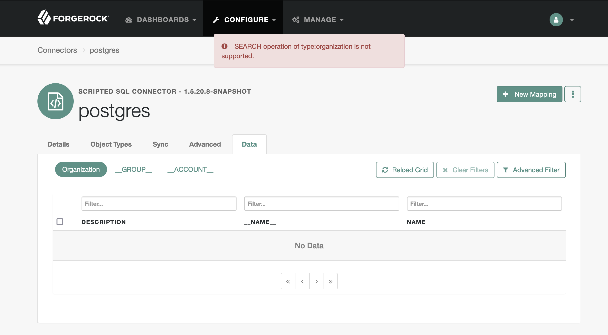
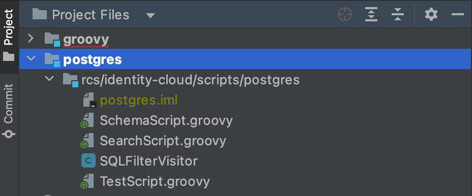
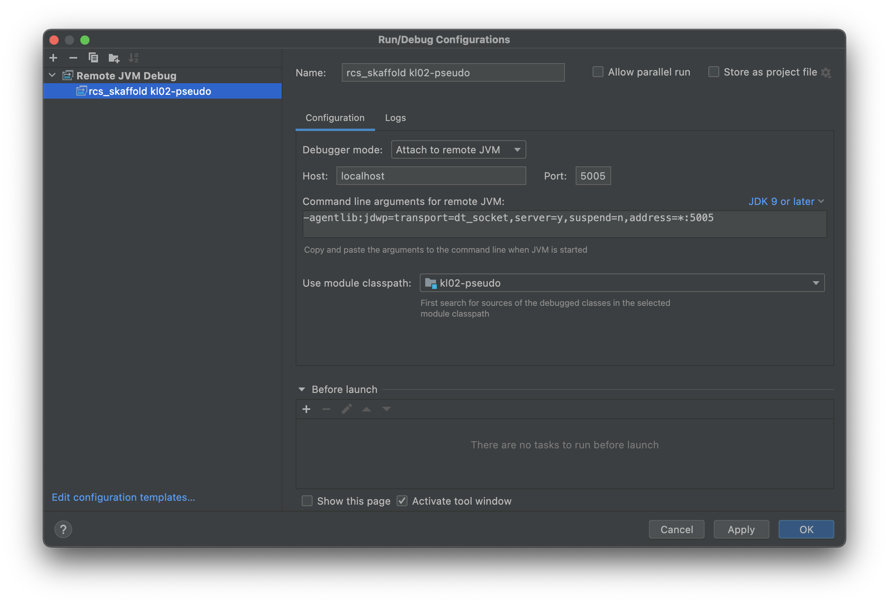
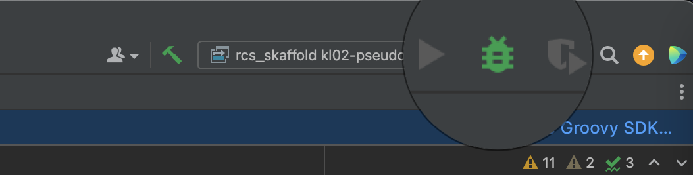
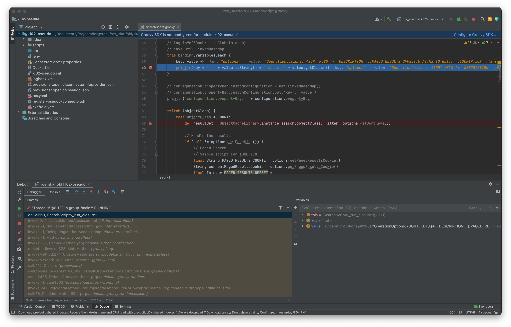
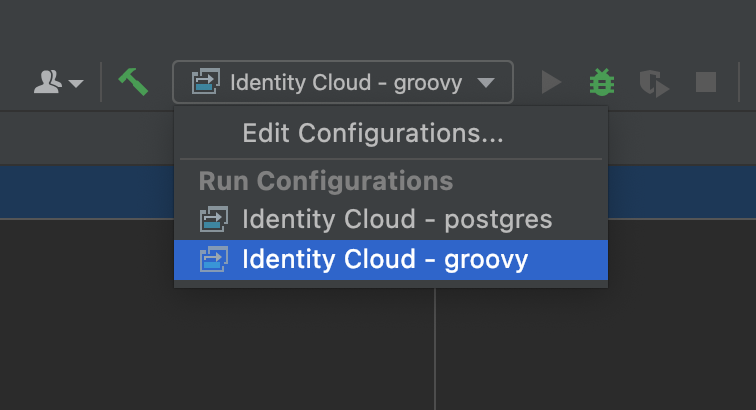

# Developing Scripted Connectors for Java Remote Connector Server (RCS)

## <a id="contents" name="contents"></a>Contents

* [Choosing IDE](#developing-ide)
* [Debugging Scripts](#developing-debugging-scripts)
    * [Try and Catch](#developing-debugging-scripts-try-catch)
    * [Custom Logs](#developing-debugging-scripts-custom-logs)
    * [Attaching Debugger to Kubernetes Deployment](#developing-debugging-scripts-debugger)
* [Connector Configuration](#developing-connector-configuration)
    * ["configurationProperties"](#developing-connector-configuration-configuration-properties)
* [Example Connectors](#example-connectors)
    * [Scripted SQL Connector](#example-connectors-scripted-sql)

## <a id="developing-ide" name="developing-ide"></a>Choosing IDE

[Back to Contents](#contents)

For a Java RCS, you will write scripts in [the Apache Groovy programming language](https://groovy-lang.org/) (Groovy). Consult the [IDE integration support for Groovy](https://groovy-lang.org/ides.html) when you choose your IDE for RCS script development.

In general, you can get a better support for Groovy in a Java-specialized IDE, like [IntelliJ IDEA](https://www.jetbrains.com/idea/) (IntelliJ).

In a non-Java or in a polyglottal IDE, you might be able to effectively maintain your RCS scripts, but Groovy-related features may not be readily available or have limited functionality and support (in comparison to IntelliJ).

> For example, as of this writing, no Groovy debugger extension is available for Visual Code Studio—a very popular code editor. This means that, if you want to do remote debugging and attach a debugger to your RCS process, you will have to use something like IntelliJ.

## <a id="developing-debugging-scripts" name="developing-debugging-scripts"></a>Debugging Scripts

[Back to Contents](#contents)

### <a id="developing-debugging-scripts-try-catch" name="developing-debugging-scripts-try-catch"></a>Debugging Scripts > Try and Catch

[Back to Contents](#contents)

If an unhandled error occurs in your RCS scripts, depending on the script, it may result in a malformed or blank screen in IDM admin UI, an unnecessarily detailed error message sent to the client side, and no debug information in the RCS logs.

Therefore, you should wrap your code with a `try/catch` block, send custom error messages to the logs output, and, potentially, throw a custom exception.

For example (where `[ . . . ]` denotes omission from the original source):

`SearchScript.groovy`

```groovy
try {
    def message = operation + ' script'

    [ . . . ]
} catch (e) {
    log.error 'EXCEPTION: ' + e.message
    throw new UnsupportedOperationException('Error occurred during ' + operation + ' operation')
}
```

> [UnsupportedOperationException](https://docs.oracle.com/en/java/javase/11/docs/api/java.base/java/lang/UnsupportedOperationException.html) is a Java exception, which, among some other most commonly used Java classes, is [automatically provided in Groovy scripts](https://groovy-lang.org/structure.html#_default_imports).

> To convert an object to a String using the plus operator, you have to start your expression with a String, and use the String concatenation operator: `def message = 'script ' + operation`. >
>
> An object's `.plus()` method invoked by the `+` operator might not be taking a String as its argument. Hence, for the `operation` object, this particular expression in the `try` block will throw an exception.

When you look for a connector data in the IDM admin UI under CONFIGURE > CONNECTORS > _connector name_ > Data, it will call the search script, and the browser response will contain:

```json
{"code":404,"reason":"Not Found","message":"Error occurred during SEARCH operation"}
```

For a search script, the browser response will be reflected in the UI as well:



At the same time, in the RCS logs, you will find a more detailed message with additional information (added manually and/or by the `Log` class) that could help with your debugging:

`RCS logs`

```
[rcs] Jun 22, 2022 2:35:11 AM ERROR SearchScript: EXCEPTION: No signature of method: org.forgerock.openicf.connectors.groovy.OperationType.plus() is applicable for argument types: (String) values: [ script]%0APossible solutions: values(), split(groovy.lang.Closure), is(java.lang.Object), use([Ljava.lang.Object;), wait(), name()
```

### <a id="developing-debugging-scripts-custom-logs" name="developing-debugging-scripts-custom-logs"></a>Debugging Scripts > Custom Logs

[Back to Contents](#contents)

You can use methods of the [Log](https://backstage.forgerock.com/docs/idcloud-idm/latest/_attachments/apidocs/org/identityconnectors/comprintlnmon/logging/Log.html) class to output custom logs from your connector scripts by passing in a String containing your debugging content.

For example:

`TestScript.groovy`

```groovy
log.info 'This is ' + operation + ' script'
```

`RCS logs`

```
[rcs] Jul 20, 2022 12:41:12 AM INFO  TestScript: This is TEST script
```

Using methods of the `Log` class might require some extra processing applied to the content you are trying to output:

* To output an object information without referencing its individual properties you may need to convert it to a String first. Otherwise, you could get a wordy error.

    For (an error) example:

    `TestScript.groovy`

    ```groovy
    try {
        log.info operation
    } catch (e) {
        log.error e.message
    }
    ```

    `RCS logs`

    ```
    [rcs] Jul 20, 2022 11:43:45 PM ERROR TestScript: No signature of method: org.identityconnectors.common.logging.Log.info() is applicable for argument types: (org.forgerock.openicf.connectors.groovy.OperationType) values: [TEST]%0APossible solutions: info(java.lang.String, [Ljava.lang.Object;), isInfo(), info(java.lang.Throwable, java.lang.String, [Ljava.lang.Object;), isOk(), find(), any()
    ```

    You can convert an object to string by using its `.toString()` method or by prepending your log with a String:

    For example:

   `TestScript.groovy`

    ```groovy
    try {
        log.info 'Operation: ' + operation
    } catch (e) {
        log.error e.message
    }
    ```

    `RCS logs`

    ```
    [rcs] Jul 20, 2022 11:47:24 PM INFO  TestScript: Operation: TEST
    ```

* If you try to output raw JSON describing an object, its curly braces will be interpreted as formatting syntax (by internally used [MessageFormat](https://docs.oracle.com/en/java/javase/11/docs/api/java.base/java/text/MessageFormat.html)). This might produce an error if the content of the curly braces is not a number.

    For (an error) example:

    `TestScript.groovy`

    ```groovy
    try {
        log.info '{"key": "value"}'
    } catch (e) {
        log.error e.message
    }
    ```

    `RCS logs`

    ```
    [rcs] Oct 19, 2022 06:55:08 PM ERROR TestScript: cant parse argument number: "key": "value"
    ```

    To mitigate this issue, you should parse the JSON first _and_ convert the resulting object to a String.

    For example:

     `TestScript.groovy`

    ```groovy
    import groovy.json.JsonSlurper

    try {
        log.info 'JSON object: ' + (new JsonSlurper().parseText('{"key": "value"}'))
    } catch (e) {
        log.error e.message
    }
    ```

    `RCS logs`

    ```
    [rcs] Oct 19, 2022 06:56:41 PM INFO  TestScript: JSON object: [key:value]
    ```

Methods of the `Log` class add additional information to the output: a timestamp, the log level, and the source reference. You should use `Log` for debugging output that is to stay in the code and be used in test and production.

During the development phase, however, for a quick and temporary output, you could use the [println](https://docs.oracle.com/en/java/javase/11/docs/api/java.base/java/io/PrintStream.html) method. `System.out.println` will automatically apply `.toString()` method available in all Java objects to the content it outputs. This will allow to print out content of different types of variables without additional processing. It will be up to you to provide any extra info in the output.

> Much of Java functionality is [imported in Groovy by default](https://groovy-lang.org/structure.html#_default_imports), including the `java.lang.*` package where `println` comes from. Hence, you don't need to use the full `System.out.println` statement.

For example:

`TestScript.groovy`

```groovy
try {
    println operation
} catch (e) {
    log.error e.message
}
```

`RCS logs`

```
[rcs] TEST
```

### <a id="developing-debugging-scripts-debugger" name="developing-debugging-scripts-debugger"></a>Debugging Scripts > Attaching Debugger to Kubernetes Deployment

[Back to Contents](#contents)

Attaching a debugger to your RCS process will allow to pause a connector execution at different points in your code and inspect the current state of your connector scripts. Doing so can help to locate and eliminate programming errors.

RCS can be deployed in a [Docker](https://www.docker.com/) container within a [Kubernetes](https://kubernetes.io/) cluster.

Java RCS deployed in a Docker container will run in a remote Java Virtual Machine (JVM). In order to attach a debugger to this process from your local development setup, you will need to perform the following steps:

1. Start your RCS JVM with the [Java Debug Wire Protocol (JDWP)](https://docs.oracle.com/en/java/javase/11/docs/specs/jpda/conninv.html#oracle-vm-invocation-options) options.

    You can specify the JDWP options in a few alternative ways:

    * Engage the ICF defaults.

        You could rely on the default JDWP options defined for the RCS Docker container. You can do it by supplying the expected `jpda` argument to the ICF's [Docker ENTRYPOINT](https://docs.docker.com/engine/reference/builder/#entrypoint) script:

        `/opt/openicf/bin/docker-entrypoint.sh`:

        ```sh
        [ . . . ]
        if [ "$1" = "jpda" ] ; then
        if [ -z "$JPDA_TRANSPORT" ]; then
            JPDA_TRANSPORT="dt_socket"
        fi
        if [ -z "$JPDA_ADDRESS" ]; then
            JPDA_ADDRESS="5005"
        fi
        if [ -z "$JPDA_SUSPEND" ]; then
            JPDA_SUSPEND="n"
        fi
        if [ -z "$JPDA_OPTS" ]; then
            JPDA_OPTS="-agentlib:jdwp=transport=$JPDA_TRANSPORT,address=$JPDA_ADDRESS,server=y,suspend=$JPDA_SUSPEND"
        fi
        OPENICF_OPTS="$OPENICF_OPTS $JPDA_OPTS"
        shift
        fi
        [ . . . ]
        ```

        > JDWP is a part of Java Platform Debugger Architecture; hence, the JPDA abbreviation used in the ICF code.

        In a Kubernetes manifest for your RCS, the `jpda` argument can be added to the command that calls the Docker ENTRYPOINT script.

        For example:

        `rcs.yaml`

        ```sh
        [ . . . ]
        command: ['bash', '-c']
        args:
        - export OPENICF_OPTS="-Dconnectorserver.connectorServerName=$HOSTNAME [ . . . ]"
          && /opt/openicf/bin/docker-entrypoint.sh jpda;
        [ . . . ]
        ```

    * Provide custom JDWP options at RCS launch.

        Alternatively, you can include your (custom) JDWP options in the `OPENICF_OPTS` environment variable defined in your Kubernetes manifest.

        For example:

        `rcs.yaml`

        ```sh
        [ . . . ]
        command: ['bash', '-c']
        args:
        - export OPENICF_OPTS="-Dconnectorserver.connectorServerName=$HOSTNAME [ . . . ]
          -agentlib:jdwp=transport=dt_socket,address=5005,server=y,suspend=n"
          && /opt/openicf/bin/docker-entrypoint.sh;
        [ . . . ]
        ```

    * Provide (custom) JDWP options at runtime.

        You can dynamically apply an environment variable to your RCS containers by using [kubectl set env](https://kubernetes.io/docs/reference/generated/kubectl/kubectl-commands#set) command. With this command, you can update `JAVA_OPTS` for the JVM running in the containers.

        For example:

        `Terminal`

        ```sh
        $ kubectl set env statefulsets/rcs -c rcs JAVA_OPTS="$JAVA_OPTS -agentlib:jdwp=transport=dt_socket,address=5005,server=y,suspend=n"
        ```

        > If you use [Skaffold](https://skaffold.dev/docs/), updating `JAVA_OPTS` will restart your StatefulSet/Deployment.

        You can check the updated environment with the `--list` option.

        For example:

        `Terminal`

        ```sh
        $ kubectl set env statefulsets/rcs -c rcs --list=true
        ```

        ```
        # StatefulSet rcs, container rcs
        JAVA_OPTS= -agentlib:jdwp=transport=dt_socket,address=5005,server=y,suspend=n
        ```

        You can remove the variable and its effects with the (negative) `JAVA_OPTS-` option.

        For example:

        `Terminal`

        ```sh
        $ kubectl set env statefulsets/rcs -c rcs JAVA_OPTS-
        ```

    In all cases, the JDWP address option is the remote JVM's TCP/IP port, to which your local debugger will eventually connect. It will be a _local to the RCS instance_ port, but to distinguish it from the port on the debugger machine, we will call it "remote".

    > Optionally, you can include the host information in the address option, an IP or the `localhost` designation, to limit where the debugger connection could be made from; for example: `address=127.0.0.1:5005`.
    >
    > If you omit the host identifier in the Java Development Kit (JDK) 9 and above, the connection will be limited to `localhost`. In the older versions of JDK, if no host is specified, a connection would be allowed from any IP. To achieve the same behavior in JDK 9+, you can use a wildcard as the host value; for example, `address=*:5005`. It is considered the best practice, however, to limit connections to a specific IP.
    >
    > In the case of attaching a debugger to RCS, leaving the host information out, and thus limiting the debugger connection to localhost, is the easiest option.

2. Allow your local debugger to communicate with the RCS process via the remote debugging port specified in the JDWP options.

    Your RCS deployment and its debugging port are unlikely to be exposed externally. This means, you will need to let your debugger access the remote process by [forwarding connections made to a local port on your machine to a remote port on the RCS pods in your Kubernetes cluster](https://kubernetes.io/docs/tasks/access-application-cluster/port-forward-access-application-cluster/#forward-a-local-port-to-a-port-on-the-pod).

    Here, the local port is the one you will use in your debugger configuration; the remote port is the one that you specified in the JDWP `address` option. In the following command, the "local" port is on the left and the "remote" one is on the right:

    `Terminal`

    ```sh
    $ kubectl port-forward statefulsets/rcs 5005:5005

    Forwarding from 127.0.0.1:5005 -> 5005
    Forwarding from [::1]:5005 -> 5005
    ```

3. Configure your debugger for remote debugging and start a debugging session.

    IntelliJ is a popular IDE that has rich and refined support for Java and Groovy; and thus, it is probably going to be your best option for developing Groovy scripts for RCS. Below, find an example of how you can configure IntelliJ for remote debugging and attach its debugger to your RCS process:

    1. Create a new IntelliJ project.

        For example, you can use `File > New > Project from Existing Sources...` and point it to the folder that contains your project files, such as README, configuration, etc., and the actual scripts; then, the folder content could be accessed and maintained under `Project > Project Files`. Do not import any sources at this point; you will add the scripts you need to debug as a module in the next step.

        Open the project.

    1. Add a new module with `File > New Module from Existing Sources...` and point it to your connector's scripts location.

        If/when you have more than one connector in your RCS, mark only the connector-specific scripts as the source files in the Import Module dialog. Creating a separate module from the existing scripts for each connector will let you reference the module in a debugging configuration and thus limit its scope to the scripts for a particular connector.

        > Otherwise, if you included files with the same name for more than one connector in a module, and set a breakpoint in one of the namesake scripts, the debugger could open a file with the same name for a different connector—the first script file with this name that was was found in the module sources.

        The module files will serve as the [sources of your (RCS) application](https://www.jetbrains.com/help/idea/attaching-to-local-process.html#prerequisites), which is one of the prerequisites for attaching a debugger in IntelliJ.

        For example, two modules registered for a project might appear under the Project Files in the following manner:

        

    1. Select `Run` > `Edit Configurations...`
    1. Select `Add New Configuration` (`+`), then select `Remote JVM Debug` from the list of predefined configuration templates.
    1. In the `Configuration` tab, provide values (or verify the defaults) for the following settings:
        1. `Name`: _your-rcs-connector-debugging-configuration-name_
        1. `Debugger mode`: Attach to remote JVM
        1. `Host`: localhost

            The host to which the debugger will connect. Choose localhost because we, actually, attempt to debug locally (that is, the debugger runs locally and connects to a local port, and then it is forwarded to a remote port in the Kubernetes cluster); you could also use `127.0.0.1` or `::1` as the Host value.

        1. `Port`: 5005

            The local port the debugger will connect to, from which we forward connections to the remote port (with `kubectl port-forward [ . . . ]`).

        1. `Command line arguments for remote JVM (for JDK 9 or later)`: JDK 9 or later

            This input is to provide a template for your JDWP options according to your previous choices, and you will see the following:

            `-agentlib:jdwp=transport=dt_socket,server=y,suspend=n,address=*:5005`

            Note, however, that:

            * The `*` prefix  in `JDK 9+` means that the connection will be allowed on the remote host from any IP.

                Leaving the host information out and having just the port specified will limit connections to the localhost only, which is the safest option that will work in this case.

                > Removing the wildcard or replacing it with a specific identifier (for example, an IP or `localhost`) is considered the best practice. In reality, however, it is unlikely that any IP/port will be made public on your RCS; hence, limiting debugging connections to your JVM might be a minor consideration in this case.

            * The remote JVM port is populated with the same number as your local debugger port, for it assumes that the two ports, local and remote, are the same.

                > _If_ the remote debugging port in your RCS were different from the local one, you could still use this input for getting your JDWP options template, and simply update the port with the actual remote port that you will use for debugging.
                >
                > Naturally, in such case, you would also need to port-forward your local connections to _that_ port with the `kubectl port-forward [ . . . ]` command.
                >
                > For example, if your remote JVM port is `5006`, your _actual_ JDWP options could look like the following:
                >
                > `Terminal`
                >
                > ```sh
                > $ kubectl set env statefulsets/rcs -c rcs JAVA_OPTS="$JAVA_OPTS -agentlib:jdwp=transport=dt_socket,server=y,suspend=n,address=5006"
                > ```
                >
                > and your port-forwarding command would be:
                >
                > `Terminal`
                >
                > ```
                > kubectl port-forward statefulsets/rcs 5005:5006
                > ```

        1. `Use module classpath`: _your-rcs-connector-module-name_

            Here, you reference the module created from your existing connector's scripts—so that the debugger looks for the breakpoints set only in those files.

        1. The end result may look similar to this:

            

            Select `Apply` or `OK`.

    1. Start debugging.

        For example, you can select the bug button in the upper right:

        

    1. Add breakpoints.

        If everything is set up correctly, you should be able to see the breakpoints [verified](https://www.jetbrains.com/help/idea/using-breakpoints.html#breakpoint-icons) and employed when you are using your connector.

        For example:

        

    1. If you want to to use debugger with another scripted connector in the same IntelliJ project:

        * Add a new module via `File > New Module from Existing Sources...`, and point it to the other connector's scripts.

        * Under `Run > Edit Configurations...`, add a new remote JVM debugging configuration, and select the new module in the `Use module classpath:` input.

        * Select the new debug configuration before you start your debug session.

            For example:

            

    For additional details, consult the IntelliJ docs on [setting debugging environment](https://www.jetbrains.com/help/idea/creating-and-editing-run-debug-configurations.html) and [debugging](https://www.jetbrains.com/help/idea/debugging-code.html#general-procedure).

This should help understand the process of attaching a debugger to your RCS instance running in a Kubernetes cluster. Change it according to your specific requirements.

##  <a id="developing-connector-configuration" name="developing-connector-configuration"></a>Connector Configuration

[Back to Contents](#contents)

The docs outline general steps of [Configuring connectors over REST](https://backstage.forgerock.com/docs/idcloud-idm/latest/connector-reference/configure-connector.html#connector-wiz-REST). Configuration properties for different remote connector types (that are available in Identity Cloud) can be found under [Connector reference](https://backstage.forgerock.com/docs/idcloud-idm/latest/connector-reference/preface.html) > Remote Connectors.

This section will elaborate on some additional details, not currently presented in the docs.

###  <a id="developing-connector-configuration-configuration-properties" name="developing-connector-configuration-configuration-properties"></a>Connector Configuration > "configurationProperties"

[Back to Contents](#contents)

The "configurationProperties" key in connector configuration contains settings that are specific to the target system.

## <a id="example-connectors" name="example-connectors"></a>Example Connectors

[Back to Contents](#contents)

### <a id="example-connectors-scripted-sql" name="example-connectors-scripted-sql"></a>Example Connectors > Scripted SQL

[Back to Contents](#contents)

[README](./connectors/postgres/README.md) for a PostgreSQL connector configuration example.
