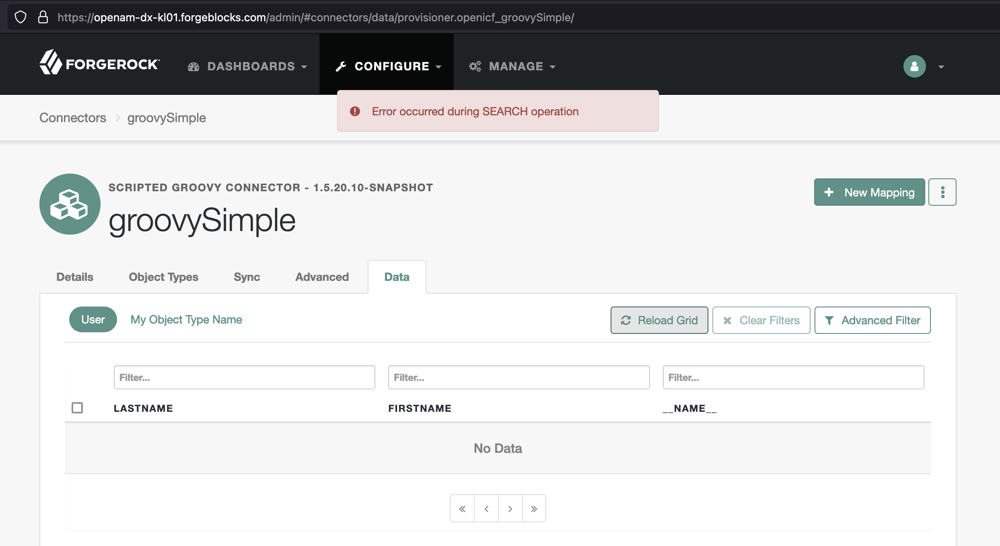

# Developing Scripted Connectors for Java Remote Connector Server (RCS)

## <a id="contents" name="contents"></a>Contents

* [Choosing an IDE](#developing-ide)
* [Debugging Scripts](#developing-debugging-scripts)
    * [Custom Logs](#developing-debugging-scripts-custom-logs)
    * [Try and Catch](#developing-debugging-scripts-try-catch)
    * [Attaching a Debugger](#developing-debugging-scripts-debugger)
* [Scripting Context](#developing-connector-context)
* [Connector Configuration](#developing-connector-configuration)
    * [Custom (Sensitive) Configuration](#developing-connector-configuration-custom-configuration)
* [Example Connectors](#example-connectors)
    * [Scripted SQL Connector](#example-connectors-scripted-sql)

### <a id="developing-ide" name="developing-ide"></a>Choosing IDE

[Back to Contents](#contents)

Consult the [IDE integration](https://groovy-lang.org/ides.html) support for Groovy Language.

In general, you can get a better support for Groovy in a Java-specialized IDE, like [IntelliJ IDEA](https://www.jetbrains.com/idea/) (IntelliJ).

In a non-Java or polyglottal IDE, you will be able to maintain your RCS scripts, but Groovy support might not be provided or come from extensions maintained by individuals. For example, as of this writing, Visual Code Studio, a very popular code editor, has no available Groovy debugger extension. This means that, if you need to attach a debugger to your RCS process, you'd have to go with something like IntelliJ.

### <a id="developing-debugging-scripts" name="developing-debugging-scripts"></a>Debugging Scripts

[Back to Contents](#contents)

#### <a id="developing-debugging-scripts-custom-logs" name="developing-debugging-scripts-custom-logs"></a>Debugging Scripts > Custom Logs

[Back to Contents](#contents)

You can use methods of the [Log](https://backstage.forgerock.com/docs/idcloud-idm/latest/_attachments/apidocs/org/identityconnectors/common/logging/Log.html) class to output custom logs from your connector scripts. For example:

```groovy
import org.identityconnectors.common.logging.Log

def log = log as Log
def operation = operation as OperationType

log.info 'This is ' + operation + ' script'
```

```
[rcs] Jul 20, 2022 12:41:12 AM INFO  TestScript: This is TEST script
```

> Converting object to a string will allow `log` to output an object without referencing individual properties or keys. Otherwise, you might get a wordy error instead:
> ```groovy
> log.info operation
> ```
>
> ```
> groovy.lang.MissingMethodException: No signature of method: org.identityconnectors.common.logging.Log.info() is applicable for argument types: (org.forgerock.openicf.connectors.groovy.OperationType) values: [TEST]
> ```

Use the Log class for debug messages to stay in the code.

During the development phase, for temporary output, you could use the standard `println`:

```groovy
println operation
```

This will allow to print out content of objects and strings without the additional information that might add little value during script development:

```
[rcs] TEST
```

#### <a id="developing-debugging-scripts-try-catch" name="developing-debugging-scripts-try-catch"></a>Debugging Scripts > Try and Catch

[Back to Contents](#contents)

Generally, you should wrap your code with a `try/catch` block, and observe custom error messages in the logs output. For example:

```groovy
import org.identityconnectors.common.logging.Log
// . . .

def log = log as Log

try {
    def operation = operation as OperationType
    // . . .
    switch (objectClass) {
        // . . .
    }
} catch (Exception e) {
    def message = "${operation.name()} operation of type: ${objectClass.objectClassValue} is not supported."

    log.error message
    log.error "Exception: ${e.getMessage()}."

    throw new UnsupportedOperationException(message)
}
```

> [UnsupportedOperationException](https://docs.oracle.com/en/java/javase/11/docs/api/java.base/java/lang/UnsupportedOperationException.html) is a Java exception [provided automatically in Groovy scripts among with other most commonly used classes](https://groovy-lang.org/structure.html#_default_imports).

Script error Handled in this way will result in a message displayed on the connector data page in IDM Admin:



Passing script identifiers and the exception information to the `log` object methods could provide helpful content for debugging the issue; for example:

```bash
[rcs] Jun 22, 2022 2:35:11 AM ERROR SearchScript: SEARCH operation of type: organization is not supported.
[rcs] Jun 22, 2022 2:35:11 AM ERROR SearchScript: Exception: ERROR: relation "organisations" does not exist%0A  Position: 15.
```

> Employing the `try/catch` technique is not Skaffold-specific and outlined here for completeness.

#### <a id="developing-debugging-scripts-debugger" name="developing-debugging-scripts-debugger"></a>Debugging Scripts > Attaching a Debugger

[Back to Contents](#contents)

Attaching a debugger to your RCS process will allow to pause a connector execution at different points and access the current state of your application. Doing so can help to locate and eliminate issues in your connector code.

In a Kubernetes cluster, RCS will run in a remote Java Virtual Machine (JVM). In order to attach a debugger from your local development setup, you will need to perform the following three steps:

1. Invoke your RCS JVM with [Java Debug Wire Protocol (JDWP)](https://docs.oracle.com/en/java/javase/11/docs/specs/jpda/conninv.html#oracle-vm-invocation-options) options.

    You can specify the JDWP options in a few alternative ways:

    * Engage the ICF defaults when RCS starts.

        You could rely on the default JDWP options defined in your RCS Docker container by supplying the expected `jpda` argument to the entry point script at `/opt/openicf/bin/docker-entrypoint.sh`:

        ```sh
        . . .
        if [ "$1" = "jpda" ] ; then
        if [ -z "$JPDA_TRANSPORT" ]; then
            JPDA_TRANSPORT="dt_socket"
        fi
        if [ -z "$JPDA_ADDRESS" ]; then
            JPDA_ADDRESS="5005"
        fi
        if [ -z "$JPDA_SUSPEND" ]; then
            JPDA_SUSPEND="n"
        fi
        if [ -z "$JPDA_OPTS" ]; then
            JPDA_OPTS="-agentlib:jdwp=transport=$JPDA_TRANSPORT,address=$JPDA_ADDRESS,server=y,suspend=$JPDA_SUSPEND"
        fi
        OPENICF_OPTS="$OPENICF_OPTS $JPDA_OPTS"
        shift
        fi
        . . .
        ```

        > JDWP is a part of Java Platform Debugger Architecture; hence, the JPDA abbreviation used in the ICF code.

        <!-- In the provided here Skaffold deployment example, the `docker-entrypoint.sh` script is called from the [RCS Kubernetes manifest](/rcs/identity-cloud/rcs.yaml#26): -->

        <!-- `rcs.yaml`
        ```sh
        . . .
        command: ['bash', '-c']
        args:
        - export OPENICF_OPTS="-Dconnectorserver.connectorServerName=$HOSTNAME . . . "
          && /opt/openicf/bin/docker-entrypoint.sh;
        . . .
        ``` -->

        <!-- To engage the default JDWP options, append the `jpda` argument at the end of this command to enable the default JDWP configuration: -->

        You can add the `jpda` argument when you call the Docker entrypoint script in your Kubernetes manifest for RCS:

        `rcs.yaml`
        ```sh
        . . .
        command: ['bash', '-c']
        args:
        - export OPENICF_OPTS="-Dconnectorserver.connectorServerName=$HOSTNAME . . . "
          && /opt/openicf/bin/docker-entrypoint.sh jpda;
        . . .
        ```

    * Provide custom JDWP options at RCS launch.

        Alternatively, you can include your (custom) JDWP options in the `OPENICF_OPTS` environment variable defined in your Kubernetes manifest:

        `rcs.yaml`
        ```sh
        . . .
        command: ['bash', '-c']
        args:
        - export OPENICF_OPTS="-Dconnectorserver.connectorServerName=$HOSTNAME . . .
          -agentlib:jdwp=transport=dt_socket,address=5005,server=y,suspend=n"
          && /opt/openicf/bin/docker-entrypoint.sh;
        . . .
        ```

    * Provide (custom) JDWP options at runtime.

        You can dynamically apply an environment variable to your RCS StatefulSet by using `kubectl set env -h` command. By using this command, you can update the standard `JAVA_OPTS` for the JVM running in the containers. For example:

        ```sh
        $ kubectl set env statefulsets/rcs -c rcs JAVA_OPTS="$JAVA_OPTS -agentlib:jdwp=transport=dt_socket,address=5005,server=y,suspend=n"
        ```

        > If you run Skaffold in the development mode, this will restart your StatefulSet.

        You can check the updated environment with the following command:

        ```sh
        $ kubectl set env statefulsets/rcs -c rcs --list=true
        ```

        ```
        # StatefulSet rcs, container rcs
        JAVA_OPTS= -agentlib:jdwp=transport=dt_socket,address=5005,server=y,suspend=n
        ```

        You can remove the variable and its effects with the following command:

        ```sh
        $ kubectl set env statefulsets/rcs -c rcs JAVA_OPTS-
        ```

2. Allow your local debugger to communicate with the remote RCS process via the debugging port specified in JDWP options.

    Since your RCS deployment and its debugging port are unlikely to be exposed externally, you will need to let your debugger access the remote process by [forwarding connections made to a local port on your machine to a remote port in the pods managed by your StatefulSet](https://kubernetes.io/docs/tasks/access-application-cluster/port-forward-access-application-cluster/#forward-a-local-port-to-a-port-on-the-pod) (port forwarding).

    The local port is the one you will use in your debugger configuration. The remote port is the one that you specified in the JDWP `address` option. In the following command, the local port is on the left and the remote one is on the right:

    ```sh
    $ kubectl port-forward statefulsets/rcs 5005:5005

    Forwarding from 127.0.0.1:5005 -> 5005
    Forwarding from [::1]:5005 -> 5005
    ```


3. Configure your debugger for remote debugging and start a debugging session.

    IntelliJ is a popular IDE that has rich and refined support for Java and Groovy; and thus, it is probably your best option for developing RCS Groovy scripts. Below, find an example of how you can configure IntelliJ for remote debugging and attach its debugger to your RCS process:

    1. Create a new IntelliJ project.

        You can use `File > New > Project from Existing Sources...` and point it to files you'd like to be able to manage in your project; they will be available under `Project > Project Files`.

        Do not import any sources at this point; you will add the scripts you need to debug in the next step.

        Open the project.

    1. Add a new module with `File > New Module from Existing Sources...` and point it to your connector's scripts location.

        If you have more than one connector in your RCS, mark only a connector-specific scripts as the source files in the Import Module dialog.

        Creating a separate module from existing scripts for each connector will let you reference the module in your debugging configuration, and thus limit the configuration scope to scripts for a particular connector.

        If you included files with the same name for more than one connector in a module, and set a breakpoint in one of the scripts, the debugger could open a file with the same name for a different connector—the first script file with this name that was was found in the module sources.

        > In result, the existing files associated with your module(s) will serve as the [debugging sources](https://www.jetbrains.com/help/idea/attaching-to-local-process.html#prerequisites) of your RCS application.

    1. Select `Run` > `Edit Configurations...`
    1. Select `Add New Configuration` (`+`), then select `Remote JVM Debug` from the list of predefined configuration templates.
    1. In the `Configuration` tab, provide values (or verify the defaults) for the following settings:
        1. `Name`: _your-rcs-connector-debugging-configuration-name_
        1. `Debugger mode`: Attach to remote JVM
        1. `Host`: localhost

            Choose localhost because we attempt to debug locally. You can also use `127.0.0.1`.

        1. `Port`: 5005

            The local port for the debugger to connect to, from which we forward to the remote port.

        1. `Command line arguments for remote JVM (for JDK 9 or later)`: -agentlib:jdwp=transport=dt_socket,server=y,suspend=n,address=*:5005

            This input is conveniently populated according to your previous choices.

            You _could_ copy and paste it to your JDWP options when the remote and the local ports are the same.

            > If the remote debugging port in your RCS were different, you could still use this input as a template for your JDWP options, and change the port part. Naturally, you would also have to forward local connections to that port.

        1. `Use module classpath`: _your-rcs-connector-module-name_

            Here, you reference the module created from your existing connector's scripts—so that the debugger looks for the breakpoints in module sources.

            The end result may look similar to this:

            

        1. Select `Apply` or `OK`.
    1. Start debugging.

        For example, you can select the bug button in the upper right:

        

    1. Add breakpoints, and if everything is set up correctly, you should be able to see them [verified](https://www.jetbrains.com/help/idea/using-breakpoints.html#breakpoint-icons) and used while running your RCS and accessing the connector you are debugging. For example:

        

        > Consult the IntelliJ IDEA docs on [setting debugging environment](https://www.jetbrains.com/help/idea/creating-and-editing-run-debug-configurations.html) and [debugging](https://www.jetbrains.com/help/idea/debugging-code.html#general-procedure) for additional details.

    1. If you want to to use debugger with another scripted connector in the same IntelliJ project:

        * Add a new module by using `File > New Module from Existing Sources...` and pointing it to the other connector's scripts.
        * Under `Run > Edit Configurations...`, add a new remote JVM debugging configuration, and select the new module you just added in the `Use module classpath:` input.
        * Select the new debug configuration before you start your debug session.

            For example:

            

    Hopefully, this helps to understand the process of attaching a debugger to your RCS instance running in a Kubernetes cluster, and change it according to your specific requirements.

###  <a id="developing-connector-context" name="developing-connector-context"></a>On Scripting Context

[Back to Contents](#contents)

The bindings in a connector script will depend on the connector and script types. There are, however, some common properties available in any connector script that are worth of mentioning.

* `configuration.propertyBag`

    If you need to keep a global reference accessible in the scripts, you can save it in the `configuration.propertyBag` binding.

    For example, you can populate the `propertyBag` property manually in a script. Once set, it can serve as a global variable accessible in the other scripts at runtime. For example:

    ```groovy
    configuration.propertyBag.myCustomProperties = new LinkedHashMap()
    configuration.propertyBag.myCustomProperties.add('key': 'value')
    ```

    You can provide initial content for `propertyBag` in the connector configuration via `configurationProperties.customConfiguration` when you [configure your scripted connector over REST](https://backstage.forgerock.com/docs/idcloud/latest/solution-scripted-rest-connector.html).

    See the [Connector Configuration > Custom (Sensitive) Configuration](#developing-connector-configuration-custom-configuration) for additional details.


###  <a id="developing-connector-configuration" name="developing-connector-configuration"></a>Connector Configuration

[Back to Contents](#contents)

The docs provide general steps of [Configuring connectors over REST](https://backstage.forgerock.com/docs/idcloud-idm/latest/connector-reference/configure-connector.html#connector-wiz-REST). Configuration properties for the remote connector types available in Identity Cloud can be found under [Connector reference](https://backstage.forgerock.com/docs/idcloud-idm/latest/connector-reference/preface.html) > Remote Connectors.

In this section, we will go over some connector configuration settings, using of which may benefit from additional details.

####  <a id="developing-connector-configuration-custom-configuration" name="developing-connector-configuration-custom-configuration"></a>Connector Configuration > Custom (Sensitive) Configuration

[Back to Contents](#contents)

The docs provide an [example of using customConfiguration and customSensitiveConfiguration](https://backstage.forgerock.com/docs/idcloud-idm/latest/connector-reference/kerberos.html#ssh-kerberos-config):

```json
"customConfiguration" : "kadmin {
    cmd = '/usr/sbin/kadmin.local';
    user = 'openidm/admin';
    default_realm = 'EXAMPLE.COM'
}",
"customSensitiveConfiguration" : "kadmin {password = 'Passw0rd'}",
```

It might not be entirely clear, though, how (and why) this Groovy-like syntax works, and how custom configuration options set this way could be used.

The content provided in `customConfiguration` will be evaluated with [a matching parse method of the groovy.util.ConfigSlurper class](https://docs.groovy-lang.org/latest/html/gapi/groovy/util/ConfigSlurper.html#method_summary).

<!-- For reference: [OpenICF > Connectors > ScriptedConfiguration](https://stash.forgerock.org/projects/OPENICF/repos/connectors/browse/groovy-common/src/main/java/org/forgerock/openicf/connectors/groovy/ScriptedConfiguration.java#563-569,576-584). -->

In particular, the [parse(String script)](https://docs.groovy-lang.org/next/html/gapi/groovy/util/ConfigSlurper.html#parse(java.lang.String)) method accepts a special script that will set variables using variable assignment or a [Closure](https://groovy-lang.org/closures.html) syntax:

* Assigning variables:

    ```json
    "customConfiguration": "key1 = 'value1';"
    ```

* Defining closures:

    ```json
    "customConfiguration": "key1 { key2 = 'value2'; };"
    ```

If you use a closure for that purpose, the word preceding the closure becomes a property that contains a map with keys set by the closure code. Using closure syntax may reduce the redundant clutter with a map referenced multiple times. It also allow for processing before a variable (which will become a configuration property) is set. But, you can also use variable assignment or dot notation for creating a map.

For example, you could have the following configuration for your connector:

`provisioner.openicf-my-connector-name.json`
```json
{
    "connectorRef": {
        "connectorHostRef": "rcs",
        "bundleVersion": "1.5.20.6-SNAPSHOT",
        "bundleName": "org.forgerock.openicf.connectors.groovy-connector",
        "connectorName": "org.forgerock.openicf.connectors.groovy.ScriptedConnector"
    },
    "configurationProperties": {
        "customConfiguration": "key1 = 'value1'; key2 = 'value2'; map1 { key1 = 'value3'; key2 = 'value4'; }; map2.key1 = 'value5'; map2.key2 = 'value6'; map3 = [ key1: 'value7', key2: 'value8' ];",
        . . .
    }
    . . .
}
```

Note that multi-line statements are not supported in JSON. This means, you put all `customConfiguration` in one line.

To separate multiple Groovy statements in `customConfiguration` use semicolons, or you could use new lines too:

```json
. . .
"customConfiguration": "key1 = 'value1'\n key2 = 'value2'\n map1 { key1 = 'value3'\n key2 = 'value4'\n }\n map2.key1 = 'value5'\n map2.key2 = 'value6'\n map3 = [ key1: 'value7', key2: 'value8' ]\n",
. . .
```


The parsed configuration will be used to populate the scripts' `configuration.propertyBag` binding. For example:

`TestScript.groovy`
```groovy
import org.identityconnectors.common.logging.Log
import org.forgerock.openicf.connectors.groovy.ScriptedConfiguration

def log = log as Log
def configuration = configuration as ScriptedConfiguration

log.info configuration.propertyBag.key1
log.info configuration.propertyBag.key2
log.info configuration.propertyBag.map1.key1
log.info configuration.propertyBag.map1.key2
log.info configuration.propertyBag.map2.key1
log.info configuration.propertyBag.map2.key2
log.info configuration.propertyBag.map3.key1
log.info configuration.propertyBag.map3.key2
```

```
[rcs] Jul 19, 2022 12:56:34 AM INFO  TestScript: value1
[rcs] Jul 19, 2022 12:56:34 AM INFO  TestScript: value2
[rcs] Jul 19, 2022 12:56:34 AM INFO  TestScript: value3
[rcs] Jul 19, 2022 12:56:34 AM INFO  TestScript: value4
[rcs] Jul 19, 2022 12:56:34 AM INFO  TestScript: value5
[rcs] Jul 19, 2022 12:56:34 AM INFO  TestScript: value6
[rcs] Jul 19, 2022 12:56:34 AM INFO  TestScript: value7
[rcs] Jul 19, 2022 12:56:34 AM INFO  TestScript: value8
```

If you don't want your connector configuration to be exposed in clear text, you can also supply `propertyBag` content in the connector's `customSensitiveConfiguration` configuration property. The information defined with the `customSensitiveConfiguration` key will be encrypted on IDM side; its content will become a guarded string, and it will continue to be encrypted in transport to the RCS.

The properties defined in `customSensitiveConfiguration` will overwrite the same keys provided in `customConfiguration`:

`provisioner.openicf-my-connector-name.json`
```json
{
    . . .
    "configurationProperties": {
        "customConfiguration": "key1 = 'value1'; key2 = 'value2'; map1 { key1 = 'value3'; key2 = 'value4'; }; map2.key1 = 'value5'; map2.key2 = 'value6'; map3 = [ key1: 'value7', key2: 'value8' ];",
        "customSensitiveConfiguration": "key1 = 'sensitive-value1'; map1 { key1 = 'sensitive-value3'; }; map2.key1 = 'sensitive-value5'; map3 = [ key1: 'sensitive-value7' ];",
        . . .
    }
    . . .
}
```

`TestScript.groovy`
```groovy
import org.identityconnectors.common.logging.Log
import org.forgerock.openicf.connectors.groovy.ScriptedConfiguration

def log = log as Log
def configuration = configuration as ScriptedConfiguration

log.info configuration.propertyBag.key1
log.info configuration.propertyBag.key2
log.info configuration.propertyBag.map1.key1
log.info configuration.propertyBag.map1.key2
log.info configuration.propertyBag.map2.key1
log.info configuration.propertyBag.map2.key2
log.info configuration.propertyBag.map3.key1
log.info configuration.propertyBag.map3.key2
```

```
[rcs] Jul 19, 2022 1:29:48 AM INFO  TestScript: sensitive-value1
[rcs] Jul 19, 2022 1:29:48 AM INFO  TestScript: value2
[rcs] Jul 19, 2022 1:29:48 AM INFO  TestScript: sensitive-value3
[rcs] Jul 19, 2022 1:29:48 AM INFO  TestScript: value4
[rcs] Jul 19, 2022 1:29:48 AM INFO  TestScript: sensitive-value5
[rcs] Jul 19, 2022 1:29:48 AM INFO  TestScript: value6
[rcs] Jul 19, 2022 1:29:48 AM INFO  TestScript: sensitive-value7
[rcs] Jul 19, 2022 1:29:48 AM INFO  TestScript: value8
```

As with many things processed on the IDM side, you can use [property value substitution](https://backstage.forgerock.com/docs/idm/7.2/setup-guide/using-property-substitution.html) in `custom(Sensitive)Configuration`.

For example:

```json
{
    . . .
    "configurationProperties": {
        "customConfiguration": "oauth2 { provider = 'https://&{fqdn}/'; client_id = 'client-id'; }",
        "customSensitiveConfiguration": "oauth2 { client_secret = 'client-secret' }",
        . . .
    }
    . . .
}
```

To output with `log.info`, you could concatenate an object with a string:

```groovy
log.info 'PROPERTY BAG: ' + configuration.propertyBag
```

```
[rcs] Jul 20, 2022 12:41:12 AM INFO  TestScript: PROPERTY BAG: [oauth2:[client_secret:client-secret, provider:https://openam-dx-kl.forgeblocks.com/, client_id:client-id]]
```

You can also `println` an object (during your _development_):

```groovy
println configuration.propertyBag
```

```
[rcs] [oauth2:[client_secret:client-secret, provider:https://openam-dx-kl.forgeblocks.com/, client_id:client-id]]
```

## <a id="example-connectors" name="example-connectors"></a>Example Connectors

[Back to Contents](#contents)

### <a id="example-connectors-scripted-sql" name="example-connectors-scripted-sql"></a>Example Connectors > Scripted SQL

[Back to Contents](#contents)

[README](./connectors/postgres/README.md) for a PostgreSQL connector configuration example.
