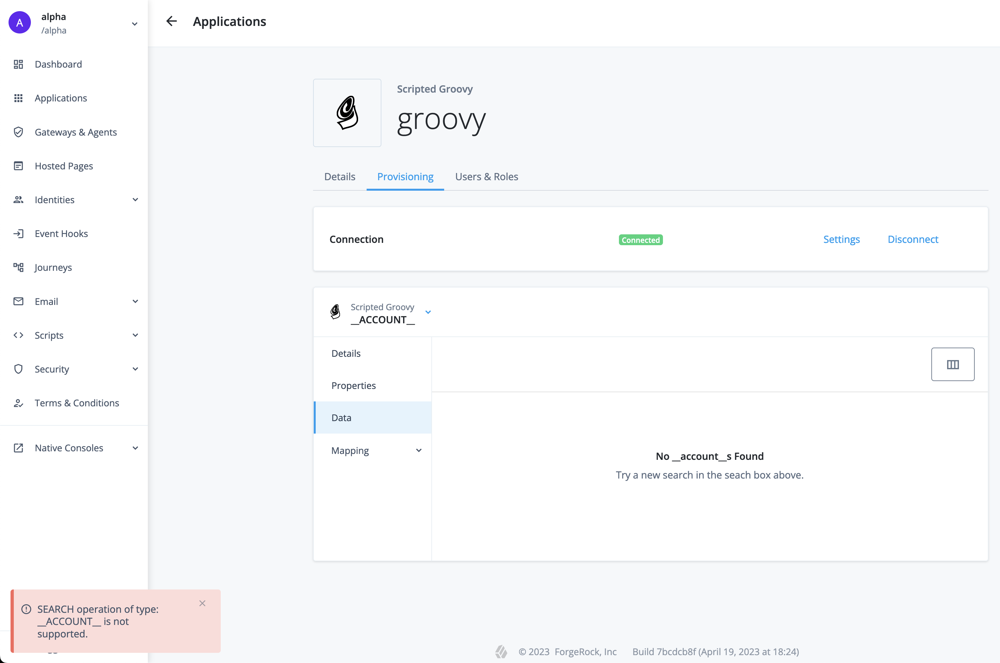
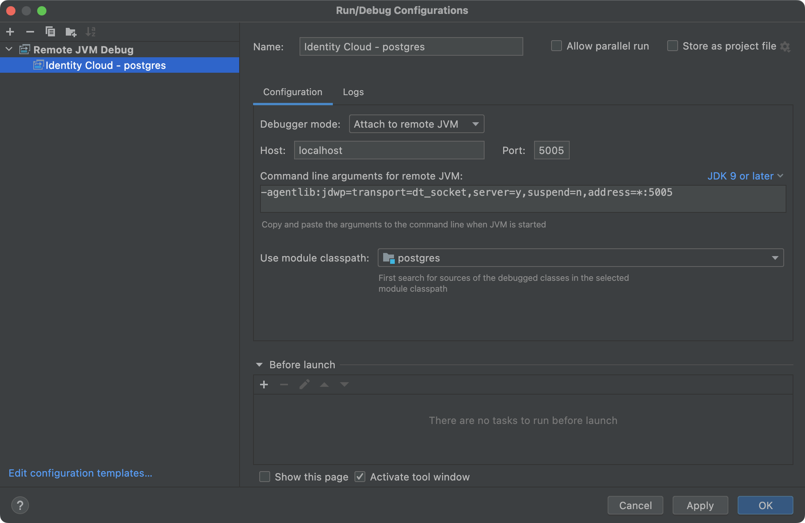
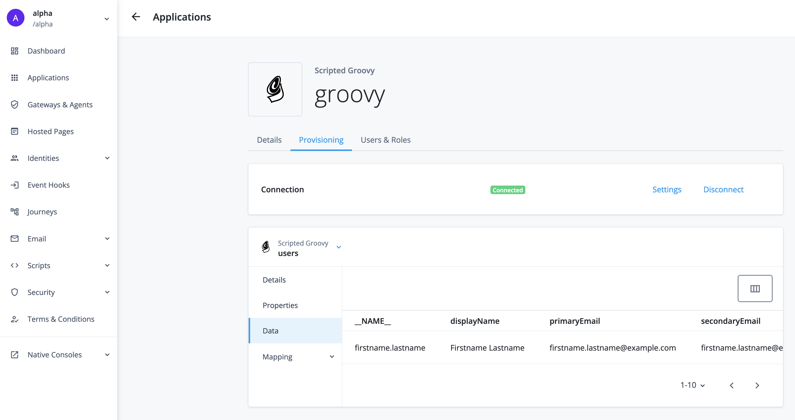

# Developing Scripted Connectors for Java Remote Connector Server (RCS)

In a managed environment that [ForgeRock Identity Cloud](https://backstage.forgerock.com/docs/idcloud/latest/home.html) (Identity Cloud) presents, [syncing identities](https://backstage.forgerock.com/docs/idcloud/latest/identities/sync-identities.html) via a remote server provides necessary flexibility in integrating your [ForgeRock Identity Platform](https://backstage.forgerock.com/docs/platform) (Platform) with external systems.

Scripted implementations extend this flexibility further and almost indefinitely.

The following content aims to overlay existing ever-evolving docs with additional structure and details that will hopefully help one understand better the RCS setup and using it to its maximum capabilities.

While primary focus and many references in this article are pointed to Identity Cloud, much of the lower level considerations should be universally applicable to other current RCS scripted solutions.

## <a id="contents" name="contents"></a>Contents

* [Choosing IDE](#developing-ide)
* [Interacting with RCS via IDM's REST](#developing-idm-rest)
* [Debugging Scripts](#developing-debugging-scripts)
    * [Try and Catch](#developing-debugging-scripts-try-catch)
    * [Custom Logs](#developing-debugging-scripts-custom-logs)
    * [Attaching Debugger to Kubernetes Deployment](#developing-debugging-scripts-debugger)
* [Scripting Context](#developing-connector-context)
    * [Bindings](#developing-connector-context-bindings)
    * [Global Variables](#developing-connector-context-globals)
* [Scripted Connector Bindings](#developing-connector-bindings)
* [Scripted Connectors (based on Groovy Toolkit)](#developing-scripted-connectors)
    * [Groovy Connector](#developing-scripted-connectors-groovy)
        * [Requirements](#developing-scripted-connectors-groovy-requirements)
            * [Schema Script](#developing-scripted-connectors-groovy-requirements-schema)
                * [Example Data](#developing-scripted-connectors-groovy-requirements-schema-example-data)
                    * [Users](#developing-scripted-connectors-groovy-requirements-schema-example-data-users)
                    * [Groups](#developing-scripted-connectors-groovy-requirements-schema-example-data-groups)
                * [Object Classes](#developing-scripted-connectors-groovy-requirements-schema-object-types)
                    * [objectClass(Closure closure)](#developing-scripted-connectors-groovy-requirements-schema-object-types-object-class)
                    * [defineObjectClass(ObjectClassInfo objectClassInfo[, . . . ])](#developing-scripted-connectors-groovy-requirements-schema-object-types-define-object-class)
                * [Example Schema Script](#developing-scripted-connectors-groovy-requirements-schema-example)
            * [Search Script](#developing-scripted-connectors-groovy-requirements-search)
                * [Requesting Search Operation](#developing-scripted-connectors-groovy-requirements-search-requesting-data)
                    * [IDM's REST](#developing-scripted-connectors-groovy-requirements-search-requesting-data-rest)
                    * [IDM Script](#developing-scripted-connectors-groovy-requirements-search-requesting-data-script)
                * [Responding with Data](#developing-scripted-connectors-groovy-requirements-search-responding-with-data)
                * [Filtering Results](#developing-scripted-connectors-groovy-requirements-search-filtering)
                    * [Read by Resource ID](#developing-scripted-connectors-groovy-requirements-search-filtering-id)
                    * [Query Definition](#developing-scripted-connectors-groovy-requirements-search-filtering-query-expression)
                * [Paging and Sorting](#developing-scripted-connectors-groovy-requirements-search-paging)
                    * [Page Size](#developing-scripted-connectors-groovy-requirements-search-paging-size)
                    * [Sorting](#developing-scripted-connectors-groovy-requirements-search-paging-sorting)
                    * [Tracking Position in Paged Results](#developing-scripted-connectors-groovy-requirements-search-paging-tracking)
                * [Attributes to Get](#developing-scripted-connectors-groovy-requirements-search-attributes)
                * [Example Search Script](#developing-scripted-connectors-groovy-requirements-search-example)
        * [Registering Connection](#developing-scripted-connectors-groovy-registering-connection)
            * [Platform UI](#developing-scripted-connectors-groovy-registering-connection-platform-ui)
            * [IDM's REST](#developing-scripted-connectors-groovy-registering-connection-rest)
* [Connector Configuration](#developing-connector-configuration)
    * ["configurationProperties"](#developing-connector-configuration-configuration-properties)
        * ["customConfiguration" and "customSensitiveConfiguration"](#developing-connector-configuration-configuration-properties-custom-configuration)
    * ["systemActions"](#developing-connector-configuration-system-actions)
        * [Defining System Action](#developing-connector-configuration-system-actions-definition)
            * ["scriptId"](#developing-connector-configuration-system-actions-definition-script-id)
            * ["actions"](#developing-connector-configuration-system-actions-definition-actions)
                * ["systemType"](#developing-connector-configuration-system-actions-definition-actions-system-type)
                * ["actionType"](#developing-connector-configuration-system-actions-definition-actions-action-type)
                * ["actionSource" _or_ "actionFile"](#developing-connector-configuration-system-actions-definition-actions-action-source-or-file)
        * [Invoking via IDM's REST](#developing-connector-configuration-system-actions-rest)
            * [Parts of the Request](#developing-connector-configuration-system-actions-rest-parts)
                * [/openidm/system/\<connection-name\> (connection endpoint)](#developing-connector-configuration-system-actions-rest-parts-path)
                * [?_action=script (execute script)](#developing-connector-configuration-system-actions-rest-parts-action)
                * [&scriptId=\<script_id\> (identifier for system action to execute and return from)](#developing-connector-configuration-system-actions-rest-parts-script-id)
                * [&arg1=value1&arg2=value2 . . . (script arguments)](#developing-connector-configuration-system-actions-rest-parts-request-params)
                * [request body (script arguments)](#developing-connector-configuration-system-actions-rest-parts-request-body)
                * [&scriptExecuteMode=resource ("run on resource")](#developing-connector-configuration-system-actions-rest-parts-execute-mode)
            * ["run on resource" vs "run on connector"](#developing-connector-configuration-system-actions-rest-execute-modes)
        * [Invoking from IDM Script](#developing-connector-configuration-system-actions-idm-script)
            * [Syntax](#developing-connector-configuration-system-actions-idm-script-syntax)
            * [Examples](#developing-connector-configuration-system-actions-idm-script-examples)
                * ["run on connector"](#developing-connector-configuration-system-actions-idm-script-examples-on-connector)
                * ["run on resource"](#developing-connector-configuration-system-actions-idm-script-examples-on-resource)
        * [Support in Connectors](#developing-connector-configuration-system-actions-support)

## <a id="developing-ide" name="developing-ide"></a>Choosing IDE

[Back to Contents](#contents)

For a Java RCS, you will write scripts in [the Apache Groovy programming language](https://groovy-lang.org/) (Groovy). Consult the [IDE integration support for Groovy](https://groovy-lang.org/ides.html) when you choose your IDE for RCS script development.

In general, you can get a better support for Groovy in a Java-specialized IDE, like [IntelliJ IDEA](https://www.jetbrains.com/idea/) (IntelliJ).

In a non-Java or in a polyglottal IDE, you might be able to effectively maintain your RCS scripts, but Groovy-related features may not be readily available or have limited functionality and support (in comparison to IntelliJ).

> For example, as of this writing, no Groovy debugger extension is available for Visual Code Studio—a very popular code editor. This means that, if you want to do remote debugging and attach a debugger to your RCS process, you will have to use something like IntelliJ.

## <a id="developing-idm-rest" name="developing-idm-rest"></a>Interacting with RCS via IDM's REST

[Back to Contents](#contents)

A remote connector is a [system object](https://backstage.forgerock.com/docs/idcloud-idm/latest/objects-guide/appendix-system-objects.html), and as such, you can interact with it via [IDM's REST](https://backstage.forgerock.com/docs/idcloud-idm/latest/rest-api-reference/endpoints/rest-system-objects.html)—which is a convenient option to validate your work during development.

You will need to authorize your requests to IDM's REST as an IDM administrator.

In Identity Cloud, this means providing an OAuth 2.0 bearer token in the `Authorization` header of your request. The token needs to be obtained with a client mapped to an IDM subject associated with the admin role.

The easiest way of accomplishing this type of authorization is signing in to the IDM admin UI, and using the browser console for making HTTP request with `jQuery`. Internally, `jQuery` uses `XMLHttpRequest` (XHR), and such requests are automatically authorized by the IDM admin UI.

For example (where `[ . . . ]` denotes omission from the original content):

`IDM Admin Browser Console`

```javascript
(async function () {
    var data = await $.ajax('/openidm/system?_action=availableConnectors', {
        method: 'POST'
    });

    console.log(JSON.stringify(data, null, 4));
}());
```

In the output, this will produce similar to the following:

```json
{
    "connectorRef": [
        {
            "connectorHostRef": "rcs",
            "displayName": "SSH Connector",
            "bundleVersion": "1.5.20.15",
            "systemType": "provisioner.openicf",
            "bundleName": "org.forgerock.openicf.connectors.ssh-connector",
            "connectorName": "org.forgerock.openicf.connectors.ssh.SSHConnector"
        },
        [ . . . ]
        {
            "connectorHostRef": "rcs",
            "displayName": "CSV File Connector",
            "bundleVersion": "1.5.20.15",
            "systemType": "provisioner.openicf",
            "bundleName": "org.forgerock.openicf.connectors.csvfile-connector",
            "connectorName": "org.forgerock.openicf.csvfile.CSVFileConnector"
        }
    ]
}
```

Alternatively, you could use an IDE like [Postman](https://www.postman.com/) for crafting your requests to IDM's REST.

You can also obtain your access token separately and use it with [cURL](https://curl.se/). For example, an equivalent to the aforementioned request made with cURL will look similar to the following:

```sh
curl 'https://openam-dx-kl03.forgeblocks.com/openidm/system?_action=availableConnectors' \
-X POST \
-H 'Authorization: Bearer eyJ0eXAi...2MSWMLNA' \
-H 'Content-Length: 0'
```

Browser console, however, can serve well as an IDE for functional programming in JavaScript. It will provide an interactive playground with code highlighting, autocompletion, and error checking. It will add necessary headers to your requests. And, in the case of IDM admin UI, it will have jQuery preloaded and its requests authorized. Finally, it will provide convenient output that you can interact with.

We will use this technique in the examples below.

## <a id="developing-debugging-scripts" name="developing-debugging-scripts"></a>Debugging Scripts

[Back to Contents](#contents)

### <a id="developing-debugging-scripts-try-catch" name="developing-debugging-scripts-try-catch"></a>Debugging Scripts > Try and Catch

[Back to Contents](#contents)

If an unhandled error occurs in your RCS scripts, depending on the script, it may result in a malformed or blank screen in IDM admin UI, an unnecessarily detailed error message sent to the client side, and no debug information in the RCS logs.

Therefore, you should wrap your code with a `try/catch` block, send custom error messages to the logs output, and, potentially, throw a custom exception.

For example:

`SearchScript.groovy`

```groovy
try {

    // code

} catch (e) {
    throw new UnsupportedOperationException('Error occurred during ' + operation + ' operation')
}
```

> [UnsupportedOperationException](https://docs.oracle.com/en/java/javase/11/docs/api/java.base/java/lang/UnsupportedOperationException.html) is a Java exception, which, among some other most commonly used Java classes, is [automatically provided in Groovy scripts](https://groovy-lang.org/structure.html#_default_imports).

Should an exception occur, a request for search operation would return an error:

```json
{"code":404,"reason":"Not Found","message":"Error occurred during SEARCH operation"}
```

If it is supported, the browser response will be reflected in the UI:


If you throw custom exceptions in your code, you can preserve the custom messages by catching a specific exception (type).

For example:

`SearchScript.groovy`

```groovy
try {

    // code

} catch (UnsupportedOperationException e) {
    /**
     * Re-throw custom exception; for example, an exception on unrecognized object class.
     */
    throw e
} catch (e) {
    throw new UnsupportedOperationException('Error occurred during ' + operation + ' operation')
}
```



For debugging purposes, you can output more detailed information about an exception in the RCS logs.

### <a id="developing-debugging-scripts-custom-logs" name="developing-debugging-scripts-custom-logs"></a>Debugging Scripts > Custom Logs

[Back to Contents](#contents)

You can use methods of the [Log](https://backstage.forgerock.com/docs/openicf/latest/_attachments/apidocs/org/identityconnectors/common/logging/Log.html) class to output custom logs from your connector scripts by passing in a String containing your debugging content.

For example:

`TestScript.groovy`

```groovy
log.info 'This is ' + operation + ' script'
```

`RCS logs`

```
[rcs] Jul 20, 2022 12:41:12 AM INFO  TestScript: This is TEST script
```

Using methods of the `Log` class might require some extra processing applied to the content you are trying to output:

* To output an object information without referencing its individual properties you may need to convert it to a String first. Otherwise, you could get a wordy error.

    For (an error) example:

    `TestScript.groovy`

    ```groovy
    try {
        log.info operation
    } catch (e) {
        log.error e.message
    }
    ```

    `RCS logs`

    ```
    [rcs] Jul 20, 2022 11:43:45 PM ERROR TestScript: No signature of method: org.identityconnectors.common.logging.Log.info() is applicable for argument types: (org.forgerock.openicf.connectors.groovy.OperationType) values: [TEST]%0APossible solutions: info(java.lang.String, [Ljava.lang.Object;), isInfo(), info(java.lang.Throwable, java.lang.String, [Ljava.lang.Object;), isOk(), find(), any()
    ```

    You can convert an object to string by using its `.toString()` method or by prepending your log with a String:

    For example:

   `TestScript.groovy`

    ```groovy
    try {
        log.info 'Operation: ' + operation
    } catch (e) {
        log.error e.message
    }
    ```

    `RCS logs`

    ```
    [rcs] Jul 20, 2022 11:47:24 PM INFO  TestScript: Operation: TEST
    ```

* If you try to output raw JSON describing an object, its curly braces will be interpreted as formatting syntax (by internally used [MessageFormat](https://docs.oracle.com/en/java/javase/11/docs/api/java.base/java/text/MessageFormat.html)). This might produce an error if the content of the curly braces is not a number.

    For (an error) example:

    `TestScript.groovy`

    ```groovy
    try {
        log.info '{"key": "value"}'
    } catch (e) {
        log.error e.message
    }
    ```

    `RCS logs`

    ```
    [rcs] Oct 19, 2022 06:55:08 PM ERROR TestScript: cant parse argument number: "key": "value"
    ```

    To mitigate this issue, you should parse the JSON first _and_ convert the resulting object to a String.

    For example:

     `TestScript.groovy`

    ```groovy
    import groovy.json.JsonSlurper

    try {
        log.info 'JSON object: ' + (new JsonSlurper().parseText('{"key": "value"}'))
    } catch (e) {
        log.error e.message
    }
    ```

    `RCS logs`

    ```
    [rcs] Oct 19, 2022 06:56:41 PM INFO  TestScript: JSON object: [key:value]
    ```

Methods of the `Log` class add additional information to the output: a timestamp, the log level, and the source reference. You should use `Log` for debugging output that is to stay in the code and be used in test and production.

During the development phase, however, for a quick and temporary output, you could use the [println](https://docs.oracle.com/en/java/javase/11/docs/api/java.base/java/io/PrintStream.html) method. `System.out.println` will automatically apply `.toString()` method available in all Java objects to the content it outputs. This will allow to print out content of different types of variables without additional processing. It will be up to you to provide any extra info in the output.

> Much of Java functionality is [imported in Groovy by default](https://groovy-lang.org/structure.html#_default_imports), including the `java.lang.*` package where `println` comes from. Hence, you don't need to use the full `System.out.println` statement.

For example:

`TestScript.groovy`

```groovy
try {
    println operation
} catch (e) {
    log.error e.message
}
```

`RCS logs`

```
[rcs] TEST
```

### <a id="developing-debugging-scripts-debugger" name="developing-debugging-scripts-debugger"></a>Debugging Scripts > Attaching Debugger to Kubernetes Deployment

[Back to Contents](#contents)

Attaching a debugger to your RCS process will allow to pause a connector execution at different points in your code and inspect the current state of your connector scripts. Doing so can help to locate and eliminate programming errors.

RCS can be deployed in a [Docker](https://www.docker.com/) container within a [Kubernetes](https://kubernetes.io/) cluster.

Java RCS deployed in a Docker container will run in a remote Java Virtual Machine (JVM). In order to attach a debugger to this process from your local development setup, you will need to perform the following steps:

1. Start your RCS JVM with the [Java Debug Wire Protocol (JDWP)](https://docs.oracle.com/en/java/javase/11/docs/specs/jpda/conninv.html#oracle-vm-invocation-options) options.

    You can specify the JDWP options in a few alternative ways:

    * Engage the Identity Connector Framework (ICF) defaults.

        You could rely on the default JDWP options defined for the RCS Docker container. You can do it by supplying the expected `jpda` argument to the ICF's [Docker ENTRYPOINT](https://docs.docker.com/engine/reference/builder/#entrypoint) script:

        `/opt/openicf/bin/docker-entrypoint.sh`:

        ```sh
        [ . . . ]
        if [ "$1" = "jpda" ] ; then
        if [ -z "$JPDA_TRANSPORT" ]; then
            JPDA_TRANSPORT="dt_socket"
        fi
        if [ -z "$JPDA_ADDRESS" ]; then
            JPDA_ADDRESS="5005"
        fi
        if [ -z "$JPDA_SUSPEND" ]; then
            JPDA_SUSPEND="n"
        fi
        if [ -z "$JPDA_OPTS" ]; then
            JPDA_OPTS="-agentlib:jdwp=transport=$JPDA_TRANSPORT,address=$JPDA_ADDRESS,server=y,suspend=$JPDA_SUSPEND"
        fi
        OPENICF_OPTS="$OPENICF_OPTS $JPDA_OPTS"
        shift
        fi
        [ . . . ]
        ```

        > JDWP is a part of Java Platform Debugger Architecture; hence, the JPDA abbreviation used in the ICF code.

        In a Kubernetes manifest for your RCS, the `jpda` argument can be added to the command that calls the Docker ENTRYPOINT script.

        For example:

        `rcs.yaml`

        ```sh
        [ . . . ]
        command: ['bash', '-c']
        args:
        - export OPENICF_OPTS="-Dconnectorserver.connectorServerName=$HOSTNAME [ . . . ]"
          && /opt/openicf/bin/docker-entrypoint.sh jpda;
        [ . . . ]
        ```

    * Provide custom JDWP options at RCS launch.

        Alternatively, you can include your (custom) JDWP options in the `OPENICF_OPTS` environment variable defined in your Kubernetes manifest.

        For example:

        `rcs.yaml`

        ```sh
        [ . . . ]
        command: ['bash', '-c']
        args:
        - export OPENICF_OPTS="-Dconnectorserver.connectorServerName=$HOSTNAME [ . . . ]
          -agentlib:jdwp=transport=dt_socket,address=5005,server=y,suspend=n"
          && /opt/openicf/bin/docker-entrypoint.sh;
        [ . . . ]
        ```

    * Provide (custom) JDWP options at runtime.

        You can dynamically apply an environment variable to your RCS containers by using [kubectl set env](https://kubernetes.io/docs/reference/generated/kubectl/kubectl-commands#set) command. With this command, you can update `JAVA_OPTS` for the JVM running in the containers.

        For example:

        `Terminal`

        ```sh
        $ kubectl set env statefulsets/rcs -c rcs JAVA_OPTS="$JAVA_OPTS -agentlib:jdwp=transport=dt_socket,address=5005,server=y,suspend=n"
        ```

        > If you use [Skaffold](https://skaffold.dev/docs/), updating `JAVA_OPTS` will restart your StatefulSet/Deployment.

        You can check the updated environment with the `--list` option.

        For example:

        `Terminal`

        ```sh
        $ kubectl set env statefulsets/rcs -c rcs --list=true
        ```

        ```
        # StatefulSet rcs, container rcs
        JAVA_OPTS= -agentlib:jdwp=transport=dt_socket,address=5005,server=y,suspend=n
        ```

        You can remove the variable and its effects with the (negative) `JAVA_OPTS-` option.

        For example:

        `Terminal`

        ```sh
        $ kubectl set env statefulsets/rcs -c rcs JAVA_OPTS-
        ```

    In all cases, the JDWP address option is the remote JVM's TCP/IP port, to which your local debugger will eventually connect. It will be a _local to the RCS instance_ port, but to distinguish it from the port on the debugger machine, we will call it "remote".

    > Optionally, you can include the host information in the address option, an IP or the `localhost` designation, to limit where the debugger connection could be made from; for example: `address=127.0.0.1:5005`.
    >
    > If you omit the host identifier in the Java Development Kit (JDK) 9 and above, the connection will be limited to `localhost`. In the older versions of JDK, if no host is specified, a connection would be allowed from any IP. To achieve the same behavior in JDK 9+, you can use a wildcard as the host value; for example, `address=*:5005`. It is considered the best practice, however, to limit connections to a specific IP.
    >
    > In the case of attaching a debugger to RCS, leaving the host information out, and thus limiting the debugger connection to localhost, is the easiest option.

2. Allow your local debugger to communicate with the RCS process via the remote debugging port specified in the JDWP options.

    Your RCS deployment and its debugging port are unlikely to be exposed externally. This means, you will need to let your debugger access the remote process by [forwarding connections made to a local port on your machine to a remote port on the RCS pods in your Kubernetes cluster](https://kubernetes.io/docs/tasks/access-application-cluster/port-forward-access-application-cluster/#forward-a-local-port-to-a-port-on-the-pod).

    Here, the local port is the one you will use in your debugger configuration; the remote port is the one that you specified in the JDWP `address` option. In the following command, the "local" port is on the left and the "remote" one is on the right:

    `Terminal`

    ```sh
    $ kubectl port-forward statefulsets/rcs 5005:5005

    Forwarding from 127.0.0.1:5005 -> 5005
    Forwarding from [::1]:5005 -> 5005
    ```

3. Configure your debugger for remote debugging and start a debugging session.

    IntelliJ is a popular IDE that has rich and refined support for Java and Groovy; and thus, it is probably going to be your best option for developing Groovy scripts for RCS. Below, find an example of how you can configure IntelliJ for remote debugging and attach its debugger to your RCS process:

    1. Create a new IntelliJ project.

        For example, you can use `File > New > Project from Existing Sources...` and point it to the folder that contains your project files, such as README, configuration, etc., and the actual scripts; then, the folder content could be accessed and maintained under `Project > Project Files`. Do not import any sources at this point; you will add the scripts you need to debug as a module in the next step.

        Open the project.

    1. Add a new module with `File > New Module from Existing Sources...` and point it to your connector's scripts location.

        If/when you have more than one connector in your RCS, mark only the connector-specific scripts as the source files in the Import Module dialog. Creating a separate module from the existing scripts for each connector will let you reference the module in a debugging configuration and thus limit its scope to the scripts for a particular connector.

        > Otherwise, if you included files with the same name for more than one connector in a module, and set a breakpoint in one of the namesake scripts, the debugger could open a file with the same name for a different connector—the first script file with this name that was was found in the module sources.

        The module files will serve as the [sources of your (RCS) application](https://www.jetbrains.com/help/idea/attaching-to-local-process.html#prerequisites), which is one of the prerequisites for attaching a debugger in IntelliJ.

        For example, two modules registered for a project might appear under the Project Files in the following manner:

        

    1. Select `Run` > `Edit Configurations...`
    1. Select `Add New Configuration` (`+`), then select `Remote JVM Debug` from the list of predefined configuration templates.
    1. In the `Configuration` tab, provide values (or verify the defaults) for the following settings:
        1. `Name`: _your-rcs-connector-debugging-configuration-name_
        1. `Debugger mode`: Attach to remote JVM
        1. `Host`: localhost

            The host to which the debugger will connect. Choose localhost because we, actually, attempt to debug locally (that is, the debugger runs locally and connects to a local port, and then it is forwarded to a remote port in the Kubernetes cluster); you could also use `127.0.0.1` or `::1` as the Host value.

        1. `Port`: 5005

            The local port the debugger will connect to, from which we forward connections to the remote port (with `kubectl port-forward [ . . . ]`).

        1. `Command line arguments for remote JVM (for JDK 9 or later)`: JDK 9 or later

            This input is to provide a template for your JDWP options according to your previous choices, and you will see the following:

            `-agentlib:jdwp=transport=dt_socket,server=y,suspend=n,address=*:5005`

            Note, however, that:

            * The `*` prefix  in `JDK 9+` means that the connection will be allowed on the remote host from any IP.

                Leaving the host information out and having just the port specified will limit connections to the localhost only, which is the safest option that will work in this case.

                > Removing the wildcard or replacing it with a specific identifier (for example, an IP or `localhost`) is considered the best practice. In reality, however, it is unlikely that any IP/port will be made public on your RCS; hence, limiting debugging connections to your JVM might be a minor consideration in this case.

            * The remote JVM port is populated with the same number as your local debugger port, for it assumes that the two ports, local and remote, are the same.

                > _If_ the remote debugging port in your RCS were different from the local one, you could still use this input for getting your JDWP options template, and simply update the port with the actual remote port that you will use for debugging.
                >
                > Naturally, in such case, you would also need to port-forward your local connections to _that_ port with the `kubectl port-forward [ . . . ]` command.
                >
                > For example, if your remote JVM port is `5006`, your _actual_ JDWP options could look like the following:
                >
                > `Terminal`
                >
                > ```sh
                > $ kubectl set env statefulsets/rcs -c rcs JAVA_OPTS="$JAVA_OPTS -agentlib:jdwp=transport=dt_socket,server=y,suspend=n,address=5006"
                > ```
                >
                > and your port-forwarding command would be:
                >
                > `Terminal`
                >
                > ```
                > kubectl port-forward statefulsets/rcs 5005:5006
                > ```

        1. `Use module classpath`: _your-rcs-connector-module-name_

            Here, you reference the module created from your existing connector's scripts—so that the debugger looks for the breakpoints set only in those files.

        1. The end result may look similar to this:

            

            Select `Apply` or `OK`.

    1. Start debugging.

        For example, you can select the bug button in the upper right:

        

    1. Add breakpoints.

        If everything is set up correctly, you should be able to see the breakpoints [verified](https://www.jetbrains.com/help/idea/using-breakpoints.html#breakpoint-icons) and employed when you are using your connector.

        For example:

        

    1. If you want to to use debugger with another scripted connector in the same IntelliJ project:

        * Add a new module via `File > New Module from Existing Sources...`, and point it to the other connector's scripts.

        * Under `Run > Edit Configurations...`, add a new remote JVM debugging configuration, and select the new module in the `Use module classpath:` input.

        * Select the new debug configuration before you start your debug session.

            For example:

            

    For additional details, consult the IntelliJ docs on [setting debugging environment](https://www.jetbrains.com/help/idea/creating-and-editing-run-debug-configurations.html) and [debugging](https://www.jetbrains.com/help/idea/debugging-code.html#general-procedure).

This should help understand the process of attaching a debugger to your RCS instance running in a Kubernetes cluster. Change it according to your specific requirements.

##  <a id="developing-connector-context" name="developing-connector-context"></a>Scripting Context

[Back to Contents](#contents)

###  <a id="developing-connector-context-bindings" name="developing-connector-context-bindings"></a>Scripting Context > Bindings

[Back to Contents](#contents)

A [Groovy script](https://docs.groovy-lang.org/latest/html/api/groovy/lang/Script.html) gets its context via [bindings](https://docs.groovy-lang.org/latest/html/api/groovy/lang/Binding.html)—that is, global variables defined outside of the script. For connector scripts, the variable bindings are defined according to the registered [connector type](https://backstage.forgerock.com/docs/openicf/latest/connector-reference/preface.html#remote-connectors-desc) (Groovy, Scripted REST, or Scripted SQL for a scripted connector) and the [script operation type](https://backstage.forgerock.com/docs/openicf/latest/connector-dev-guide/groovy-operations.html) exposed as an [ICF interface](https://backstage.forgerock.com/docs/openicf/latest/connector-reference/interfaces.html).

The connector type and the script operation type are derived from the connector configuration received by IDM at the time when the connection is registered.

The final connection configuration will have reference to the connector type, scripts for different connector operations, and the language in which the scripts are written.

For example:

`provisioner.openicf-<connector-name>.json`

```json
{
    "connectorRef": {
        "bundleName": "org.forgerock.openicf.connectors.groovy-connector",
        "connectorName": "org.forgerock.openicf.connectors.groovy.ScriptedConnector",
        [ . . . ]
    },
    [ . . . ]
    "configurationProperties": {
        "scriptExtensions": [
            "groovy"
        ],
        "scriptRoots": [
            "/opt/openicf/scripts/groovy"
        ],
        "scriptOnResourceScriptFileName":  null,
        "authenticateScriptFileName":  null,
        "createScriptFileName":  null,
        "customizerScriptFileName": null,
        "deleteScriptFileName":  null,
        "resolveUsernameScriptFileName":  null,
        "schemaScriptFileName": "SchemaScript.groovy",
        "searchScriptFileName": "SearchScript.groovy",
        "syncScriptFileName":  null,
        "testScriptFileName": "TestScript.groovy",
        "updateScriptFileName":  null,
        "scriptBaseClass": null,
        "recompileGroovySource": true,
        [ . . . ]
    },
    "systemActions" : [
        {
            "scriptId" : "script-1",
            "actions" : [
                {
                    "systemType" : ".*ScriptedConnector",
                    "actionType" : "groovy",
                    "actionSource" : "println 'actionSource bindings: '; println binding.variables;"
                }
            ]
        }
    ],
    [ . . .]
}
```

You can see all variable bindings passed to the script (and thus, defined in the script top-level scope) as shown in the following example:

`TestScript.groovy`

```groovy
try {
    println 'Bindings: '
    println binding.variables
} catch (e) {
    println('EXCEPTION: ' + e)
}
```

> In Groovy, you can _usually_ `get` and `set` object's (the script instance in this case) property by referencing the property itself, without explicitly calling its [getters and setters](https://groovy-lang.org/style-guide.html#_getters_and_setters). The above code is an equivalent to the following:
>
> `TestScript.groovy`
>
> ```groovy
> try {
>     println 'Bindings: '
>     println getBinding().getVariables()
> } catch (e) {
>     println('EXCEPTION: ' + e)
> }
> ```
>
>  There are exceptions, though; for example, you cannot use the dot notation to access a [Map](https://groovy-lang.org/syntax.html#_maps) instance _properties_, because the dot operator is used for retrieving map's keys.

To try the above, you can invoke the test script by POSTing a `test` action request to the connector endpoint in IDM's REST: `/openidm/system/<connector-name>?_action=test`.

You will need to authorize the request as an IDM administrator.

> In Identity Cloud, this means providing an OAuth 2.0 bearer token in the Authorization header of your request. The token needs to be obtained with a client mapped to an IDM subject associated with the administrator role.
>
> The easiest way of accomplishing this type of authorization is singing in the IDM admin UI, and using the browser console for making a jQuery request. Internally, jQuery uses XMLHttpRequest (XHR), and such requests are automatically authorized by the UI.

For example:

`IDM admin UI browser console`

```javascript
(async function () {
    var data = await $.ajax('/openidm/system/groovy?_action=test', {
        method: 'POST'
    });

    console.log(JSON.stringify(data, null, 4));
}());
```

> The browser response will contain some basic connector information along with the "ok" key; and if the things are not OK, with the the "error" key as well.
>
> For example:
>
> `IDM admin UI browser console`
>
> ```json
> {
>     "name": "groovy",
>     "enabled": true,
>     "config": "config/provisioner.openicf/groovy",
>     "connectorRef": {
>         "connectorHostRef": "rcs",
>         "bundleVersion": "1.5.20.15",
>         "bundleName": "org.forgerock.openicf.connectors.groovy-connector",
>         "connectorName": "org.forgerock.openicf.connectors.groovy.ScriptedConnector"
>     },
>     "displayName": "Scripted Groovy Connector",
>     "objectTypes": [
>         "__ACCOUNT__",
>         "__TEST__",
>         "__ALL__"
>     ],
>     "ok": true
> }
> ```
>
> This content is returned by the [Test operation](https://backstage.forgerock.com/docs/openicf/latest/connector-dev-guide/operations/operation-test.html). The test script cannot not return anything in the response, but it can throw an exception that will populate the "ok" key with `false` and provide the exception message in the "error" key.

In the RCS logs, you will see the following:

`RCS logs`

```
[rcs] Bindings:
[rcs] [operation:TEST, configuration:org.forgerock.openicf.connectors.groovy.ScriptedConfiguration@3797a24b, log:org.identityconnectors.common.logging.Log@68a6929f]
```

The script `binding` property is an instance of the [java.util.LinkedHashMap](https://docs.oracle.com/en/java/javase/11/docs/api/java.base/java/util/LinkedHashMap.html) class. You can loop over its entries if you want to get information about individual bindings.

For example:

`TestScript.groovy`

```groovy
try {
    println 'Bindings:'
    binding.variables.each { key, value ->
        def className = value ? value.class.name : ''
        println 'name: ' + key + ' value: ' + value + ' className: ' + className
    }
} catch (e) {
    println('EXCEPTION: ' + e)
}
```

`RCS logs`

```
[rcs] Bindings:
[rcs] key: operation value: TEST class: class org.forgerock.openicf.connectors.groovy.OperationType
[rcs] key: configuration value: org.forgerock.openicf.connectors.groovy.ScriptedConfiguration@28d2149c cl;$^ass: class org.forgerock.openicf.connectors.groovy.ScriptedConfiguration
[rcs] key: log value: org.identityconnectors.common.logging.Log@2ca03a2a class: class org.identityconnectors.common.logging.Log
```

An individual binding is accessible in the top-level scope as a variable:

`TestScript.groovy`

```groovy
try {
    println 'operation: ' + operation
} catch (e) {
    println('EXCEPTION: ' + e)
}
```

`RCS logs`

```
[rcs] operation: TEST
```

> If you try to reference a variable (binding) that does not exist, you will get a `groovy.lang.MissingPropertyException`.
>
> For example:
>
> `RCS logs`
>
> ```
> [rcs] EXCEPTION: No such property: myVariable for class: TestScript
> ```

### <a id="developing-connector-context-globals" name="developing-connector-context-globals"></a>Global Variables

[Back to Contents](#contents)

Bindings, both the `binding` instance and the individual binding properties, behave as global variables. This opens a possibility for reassigning them accidentally and thus breaking something in your code.

To avoid a situation like this in complex and involved scripts, you _could_:
1. Declare local variables with the same names as bindings. Doing so will prevent accidental reassignment of the corresponding global references.
2. Then, reference bindings as the script properties, with the `this.` prefix. Using the `this` keyword, which points to the script instance itself, will assure that you are not referencing a local variable.

For example:

`TestScript.groovy`

```groovy
try {
    def operation
    def configuration
    def log

    configuration = 'string value'

    println 'configuration: ' + configuration // local variable
    println 'this.configuration: ' + this.configuration // binding, which is a script instance property
} catch (e) {
    println('EXCEPTION: ' + e)
}
```

`RCS logs`

```
[rcs] configuration: string value
[rcs] this.configuration: org.forgerock.openicf.connectors.groovy.ScriptedConfiguration@1fc68d
```

While the above example illustrates the distinction between local variables and script properties, it introduces potentially unneeded local variables.

Alternatively, you can assign binding values to namesake local variables and reference them without `this` prefix. You can further clarify bindings' designations by referencing their types.

For example:

`TestScript.groovy`

```groovy
import org.identityconnectors.common.logging.Log
import org.forgerock.openicf.connectors.groovy.OperationType
import org.forgerock.openicf.connectors.groovy.ScriptedConfiguration

try {
    def operation = operation as OperationType
    def configuration = configuration as ScriptedConfiguration
    def log = log as Log

    [ . . . ]
} catch (e) {
    println('EXCEPTION: ' + e)
}
```

Doing so and adding corresponding dependencies to your scripted connector project can enable your IDE to show bindings' class information and provide additional code completion options.

> For example, [in IntelliJ, you can add your dependencies as modules](https://www.jetbrains.com/help/idea/working-with-module-dependencies.html). Even if you don't manage your connector scripts as a Java project, for the `identityconnectors` and `openicf` packages, you could import `java-framework` and `groovy-common` from [OPENICF/connectors](https://stash.forgerock.org/projects/OPENICF/repos/connectors/browse) and thus allow your IDE to show the additional information about your variables.

## <a id="developing-connector-bindings" name="developing-connector-bindings"></a>Scripted Connector Bindings

[Back to Contents](#contents)

In [ICF operations with Groovy scripts](https://backstage.forgerock.com/docs/openicf/latest/connector-dev-guide/scripts/script-authenticate.html), you can find descriptions and examples of use for common and operation-specific input variables (that is, bindings) present in various types of connector scripts.

Some bindings could represent an object with properties not currently outlined in the docs. Below, find additional information about some common properties available in any connector script (irrespective of the connector type and the script designation):

* `configuration`

    * `configuration.propertyBag`

        If you need to keep a global reference accessible in any script, you can save it in the `configuration.propertyBag` binding.

        You could populate the `propertyBag` property manually in a script. Once set, it can serve as a global variable accessible in the other scripts at runtime.

        For example:

        `TestScript.groovy`

        ```groovy
        configuration.propertyBag.myCustomProperties = [ key: 'value' ]

        [ . . . ]
        ```

        `SchemaScript.groovy`

        ```groovy
        println configuration.propertyBag.myCustomProperties.key

        [ . . . ]
        ```

        `RCS logs`

        ```
        [rcs] value
        ```

        You can also provide the initial content for `propertyBag` in the connector configuration via the "configurationProperties.customConfiguration" and "configurationProperties.customSensitiveConfiguration" keys when you [configure your scripted connector over REST](https://backstage.forgerock.com/docs/idcloud/latest/solution-scripted-rest-connector.html).

        See the [Connector Configuration > "configurationProperties" > "customConfiguration" and "customSensitiveConfiguration"](#developing-connector-configuration-configuration-properties-custom-configuration) section for details.

## <a id="developing-scripted-connectors" name="developing-scripted-connectors"></a>Scripted Connectors

[Back to Contents](#contents)

The scripted connectors are based on [Groovy Connector Toolkit](https://backstage.forgerock.com/docs/openicf/latest/connector-reference/groovy.html).

Out of the box, ICF bundles the following scripted connectors:

* Groovy ([non-poolable and poolable connector implementations](https://backstage.forgerock.com/docs/openicf/latest/connector-reference/groovy.html#groovy-connector-interfaces))

    All connector operations are implemented in Groovy, with no built in support for a particular resource type.

* ScriptedREST

    The scripts are provided with automatically maintained by ICF customizable connection to a REST interface.

* ScriptedSQL

    The scripts are provided with automatically maintained by ICF connection to a JDBC data source.

> As described in [Configure connectors over REST](https://backstage.forgerock.com/docs/openicf/latest/connector-reference/configure-connector.html#connector-wiz-REST), you can check what connectors are bundled with your RCS by visiting the `/openidm/system?_action=availableConnectors` endpoint and filtering the response against your RCS server name.
>
> In the following example, `connectorServerName` corresponds to the namesake setting in the `ConnectorServer.properties` file as explained in the [Configure a remote server](https://backstage.forgerock.com/docs/idcloud/latest/identities/sync-identities.html#configure_a_remote_server) doc. In Identity Cloud, you can see individual Connector Servers and Server Clusters in the Platform admin UI under Identities > Connect; you can use either a server or a cluster name to identify your RCS in the example below:
>
> `IDM admin UI browser console`
>
> ```javascript
> (async function () {
>     var connectorServerName = 'rcs';
>
>     /**
>      * Get an array of available connector references.
>      */
>     var { connectorRef } = await $.ajax({
>         method: 'POST',
>         url: '/openidm/system?_action=availableConnectors'
>     });
>
>     /**
>      * Get a list of scripted connectors for an RCS.
>      */
>     var scriptedConnectorRef = connectorRef.filter((connectorRef) => {
>         return connectorRef.connectorHostRef === connectorServerName;
>     }).filter((connectorRef) => {
>         return connectorRef.connectorName.toLowerCase().includes('scripted');
>     });
>
>     console.log('scriptedConnectorRef', JSON.stringify(scriptedConnectorRef, null, 4));
> }());
> ```
>
> ```json
> [
>     {
>         "connectorHostRef": "rcs",
>         "displayName": "Scripted SQL Connector",
>         "bundleVersion": "1.5.20.15",
>         "systemType": "provisioner.openicf",
>         "bundleName": "org.forgerock.openicf.connectors.scriptedsql-connector",
>         "connectorName": "org.forgerock.openicf.connectors.scriptedsql.ScriptedSQLConnector"
>     },
>     {
>         "connectorHostRef": "rcs",
>         "displayName": "Scripted REST Connector",
>         "bundleVersion": "1.5.20.15",
>         "systemType": "provisioner.openicf",
>         "bundleName": "org.forgerock.openicf.connectors.scriptedrest-connector",
>         "connectorName": "org.forgerock.openicf.connectors.scriptedrest.ScriptedRESTConnector"
>     },
>     {
>         "connectorHostRef": "rcs",
>         "displayName": "Scripted Poolable Groovy Connector",
>         "bundleVersion": "1.5.20.15",
>         "systemType": "provisioner.openicf",
>         "bundleName": "org.forgerock.openicf.connectors.groovy-connector",
>         "connectorName": "org.forgerock.openicf.connectors.groovy.ScriptedPoolableConnector"
>     },
>     {
>         "connectorHostRef": "rcs",
>         "displayName": "Scripted Groovy Connector",
>         "bundleVersion": "1.5.20.15",
>         "systemType": "provisioner.openicf",
>         "bundleName": "org.forgerock.openicf.connectors.groovy-connector",
>         "connectorName": "org.forgerock.openicf.connectors.groovy.ScriptedConnector"
>     }
> ]
> ```

### <a id="developing-scripted-connectors-groovy" name="developing-scripted-connectors-groovy"></a>Scripted Connectors > Groovy Connector

[Back to Contents](#contents)

#### <a id="developing-scripted-connectors-groovy-requirements" name="developing-scripted-connectors-groovy-requirements"></a>Scripted Connectors > Groovy Connector > Requirements

[Back to Contents](#contents)

Before you can register a connection in IDM, your connector server needs to provide a certain infrastructure, to which your [connection configuration](https://backstage.forgerock.com/docs/openicf/latest/connector-reference/configure-connector.html) will refer via the following "configurationProperties" keys:

* "scriptRoots"

    An array of locations on the connector server containing Groovy scripts that will be performing [ICF Operations](https://backstage.forgerock.com/docs/openicf/latest/connector-dev-guide/groovy-operations.html).

    For example, on your RCS, `/opt/openicf/scripts/groovy` path could point to a folder with the scripts used by a connection. Then, the connection configuration may look like the following:

    `provisioner.openicf-groovy.json`

    ```json
    {
        "connectorRef": {
            "bundleName": "org.forgerock.openicf.connectors.groovy-connector",
            "connectorName": "org.forgerock.openicf.connectors.groovy.ScriptedConnector"

            [ . . . ]
        },
        "configurationProperties": {
            "scriptRoots": [
                "/opt/openicf/scripts/groovy"
            ],

            [ . . . ]
        },

        [ . . . ]
    }
    ```

    > "scriptRoots" could also refer to a (connector) `.jar` file containing the scripts.
    >
    > For example:
    >
    > `provisioner.openicf-groovy.json`
    >
    > ```json
    > [ . . . ]
    >
    > "scriptRoots" : [
    >     "jar:file:connectors/groovy.jar!/scripts/"
    > ]
    >
    > [ . . . ]
    > ```
    >

* "schemaScriptFileName"

    The file name of a [script implementing the Schema operation](https://backstage.forgerock.com/docs/openicf/latest/connector-dev-guide/scripts/script-schema.html). The script file needs to exist under a "scriptRoots" location on the connector server.

    For example, on your RCS, the script could be placed at `/opt/openicf/scripts/groovy/SchemaScript.groovy`.

    The connection configuration would refer to this location as:

    `provisioner.openicf-groovy.json`

    ```json
    {
        [ . . . ]

        "configurationProperties": {
            "scriptRoots": [
                "/opt/openicf/scripts/groovy"
            ],
            "schemaScriptFileName": "SchemaScript.groovy",

            [ . . . ]
        },

        [ . . . ]
    }
    ```

    If you don't provide a _valid_ reference to a schema script in your connection configuration, you will not be able to register it in IDM.

    Schema script functionality is described in details in the [Schema Script](#developing-scripted-connectors-groovy-requirements-schema) chapter, and an example implementation used in this writing can be found in the [Schema Script > Example Schema Script](#developing-scripted-connectors-groovy-requirements-schema-example) section.

* "searchScriptFileName"

    A connection provides access to the remote data. Normally, this data represents a list of resources obtained from a [search operation](https://backstage.forgerock.com/docs/openicf/latest/connector-dev-guide/operations/operation-search.html) performed against the target system. Both Platform and IDM admin UIs provide Data tab for displaying this data in each registered connection. In a Groovy Toolkit connector, the search operation is performed with a [search or query script](https://backstage.forgerock.com/docs/openicf/latest/connector-dev-guide/scripts/script-search.html), which is referenced in the connection configuration via the "searchScriptName" key.

    For example, on your RCS, the search script could exist at `/opt/openicf/scripts/groovy/SearchScript.groovy`. Then, in your connection configuration, you would refer to it as:

    `provisioner.openicf-groovy.json`

    ```json
    {
        [ . . . ]

        "configurationProperties": {
            "scriptRoots": [
                "/opt/openicf/scripts/groovy"
            ],
            "schemaScriptFileName": "SchemaScript.groovy",
            "searchScriptFileName": "SearchScript.groovy",

            [ . . . ]
        },

        [ . . . ]
    }
    ```

    If you provide no reference to a search script file in your connection configuration or set "searchScriptFileName" to `null`, your will be able to register (via IDM's REST), validate, and use your connection for non-search operations, but search operation requests will be responded with 404-Not Found errors.

    If you provide an invalid reference under the "searchScriptFileName" key, your connection will not be validated, producing a 500 Internal Server Error with a message similar to the following:

    > groovy.util.ResourceException: Cannot open URL: file:/opt/openicf/scripts/groovy/<path/to/non-existing-file>

    Search script functionality is described in details in the [Search Script](#developing-scripted-connectors-groovy-requirements-search) chapter, and a fully functional example implementation can be found in the [Search Script > Example Search Script](#developing-scripted-connectors-groovy-requirements-search-example) section.

This means that in order to register a connection, your RCS:

* MUST have a valid [schema script](https://backstage.forgerock.com/docs/openicf/latest/connector-dev-guide/scripts/script-schema.html).

* SHOULD have a [search or query script](https://backstage.forgerock.com/docs/openicf/latest/connector-dev-guide/scripts/script-search.html)

##### <a id="developing-scripted-connectors-groovy-requirements-schema" name="developing-scripted-connectors-groovy-requirements-schema"></a>Scripted Connectors > Groovy Connector > Requirements > Schema Script

[Back to Contents](#contents)

Your [schema script](https://backstage.forgerock.com/docs/openicf/latest/connector-dev-guide/scripts/script-schema.html) MUST return an instance of [Schema](https://backstage.forgerock.com/docs/openicf/latest/_attachments/apidocs/org/identityconnectors/framework/common/objects/Schema.html).

The schema instance MUST be populated with one or more instances of [ObjectClassInfo](https://backstage.forgerock.com/docs/openicf/latest/_attachments/apidocs/org/identityconnectors/framework/common/objects/ObjectClassInfo.html), each representing a data object class (type) that you decided to expose via your connector.

To define a connector schema, you can call `builder.schema(Closure closure)` method in your schema script.

Inside the closure passed in the `builder.schema(Closure closure)` method, you can call `objectClass(Closure closure)` method. Each call to this method will create an [ObjectClassInfo](https://backstage.forgerock.com/docs/openicf/latest/_attachments/apidocs/org/identityconnectors/framework/common/objects/ObjectClassInfo.html) instance and add it to your connector schema; thus, defining an object class. Since at least one object class needs to be present in a schema, you need to call the `objectClass(Closure closure)` at least once.

If you pass an empty closure into the `objectClass(Closure closure)` method, the resulting object class instance will be of the default `__ACCOUNT__` type and have the default attribute `__NAME__`.

For example:

`SchemaScript.groovy`

```groovy
builder.schema {
    objectClass {

    }
}
```

This is the minimal functionality schema script that will allow for registering connection via IDM's REST—as [demonstrated later in this writing](#developing-scripted-connectors-groovy-registering-connection).

When a connection is registered, you will be able to request its schema via IDM's REST:

`/openidm/system/<connection-name>?_action=schema`

> You cannot request a connector schema from an IDM script, because `schema` action in scripts is not supported on system resources.

For example:

`IDM admin UI browser console`

```javascript
(async function () {
    var data = await $.ajax('/openidm/system/groovy?_action=schema', {
        method: 'POST'
    });

    console.log(JSON.stringify(data, null, 4));
}());
```

The aforementioned minimal example of a schema definition would result in the following response:

```json
{
    "objectTypes": {
        "__ACCOUNT__": {
            "$schema": "http://json-schema.org/draft-03/schema",
            "id": "__ACCOUNT__",
            "type": "object",
            "nativeType": "__ACCOUNT__",
            "properties": {
                "__NAME__": {
                    "type": "string",
                    "nativeName": "__NAME__",
                    "nativeType": "string"
                }
            }
        }
    },
    "operationOptions": {
        [ . . . ]
    }
}
```

Note:

* A connector schema contains two keys:

    * "objectTypes"

    * "operationOptions"

        By default, operation options associated with an object class have no properties (that is, no options) defined. At the time of this writing, adding operation options in a schema script is not supported and will not change connector's behavior.

* The "objectTypes" key is populated with a single object class definition of `__ACCOUNT__` type with a single string attribute `__NAME__`.

If your Groovy connector is not used for [synchronization and reconciliation](https://backstage.forgerock.com/docs/idcloud-idm/latest/synchronization-guide/chap-sync-operations.html), and doesn't employ the [search operation](https://backstage.forgerock.com/docs/openicf/latest/connector-dev-guide/operations/operation-search.html) in any other way, you do not need to define any specific data classes for the remote data objects. For example, you might be using your connector to perform arbitrary operations behind the target source authorization walls as described in the [Connector Configuration > "systemActions"](#developing-connector-configuration-system-actions) chapter. If that is the case, you can leave your schema script at that minimal code, and let it to be populated with the defaults.

###### <a id="developing-scripted-connectors-groovy-requirements-schema-example-data" name="developing-scripted-connectors-groovy-requirements-schema-example-data"></a>Scripted Connectors > Groovy Connector > Schema Script > Example Data

[Back to Contents](#contents)

To illustrate functionality of a scripted Groovy connector that does employ the [search operation](https://backstage.forgerock.com/docs/openicf/latest/connector-dev-guide/operations/operation-search.html), the following two data samples will be assumed:

* <a id="developing-scripted-connectors-groovy-requirements-schema-example-data-users" name="developing-scripted-connectors-groovy-requirements-schema-example-data-users"></a>`Sample Users Data`

    ```json
    {
        "Resources": [
            {
                "id": "2819c223-7f76-453a-919d-413861904646",
                "userName": "bjensen",
                "displayName": "Ms. Barbara J Jensen III",
                "name": {
                    "familyName": "Jensen",
                    "givenName": "Barbara",
                    "middleName": "Jane"
                },
                "emails": [
                    {
                        "value": "bjensen@example.com",
                        "type": "work",
                        "primary": true
                    },
                    {
                        "value": "babs@jensen.org",
                        "type": "home"
                    }
                ],
                "schemas": [
                    "urn:ietf:params:scim:schemas:core:2.0:User"
                ]
            },
            [ . . . ]
        ],
        "itemsPerPage": 25,
        "schemas": [
            "urn:ietf:params:scim:api:messages:2.0:ListResponse"
        ],
        "startIndex": 1,
        "totalResults": 25
    }
    ```

    > This sample data is a partial realization of the System for Cross-domain Identity Management (SCIM) [User](https://www.rfc-editor.org/rfc/rfc7643#section-4.1) Resource Schema.

* <a id="developing-scripted-connectors-groovy-requirements-schema-example-data-groups" name="developing-scripted-connectors-groovy-requirements-schema-example-data-groups"></a>`Sample Groups Data`

    ```json
    {
        "Resources": [
            {
                "schemas": [
                    "urn:ietf:params:scim:schemas:core:2.0:Group"
                ],
                "id": "e9e30dba-f08f-4109-8486-d5c6a331660a",
                "displayName": "Tour Guides",
                "members": [
                    {
                        "value": "2819c223-7f76-453a-919d-413861904646",
                        "$ref": "https://example.com/v2/Users/2819c223-7f76-453a-919d-413861904646",
                        "display": "Babs Jensen"
                    },
                    [ . . . ]
                ]
            }
        ],
        "schemas": [
            "urn:ietf:params:scim:api:messages:2.0:ListResponse"
        ],
        "totalResults": 1,
        "startIndex": 1,
        "itemsPerPage": 100
    }
    ```

    > This sample data is a partial realization of the SCIM [Group](https://www.rfc-editor.org/rfc/rfc7643#section-4.2) Resource Schema.

###### <a id="developing-scripted-connectors-groovy-requirements-schema-object-types" name="developing-scripted-connectors-groovy-requirements-schema-object-types"></a>Scripted Connectors > Groovy Connector > Schema Script > Object Classes

[Back to Contents](#contents)

###### <a id="developing-scripted-connectors-groovy-requirements-schema-object-types-object-class" name="developing-scripted-connectors-groovy-requirements-schema-object-types-object-class"></a>Scripted Connectors > Groovy Connector > Schema Script > Object Classes > `objectClass(Closure closure) method`

[Back to Contents](#contents)

To customize your schema, inside the closure passed into the `builder.schema(Closure closure)` method you can call its delegate's `objectClass(Closure closure)` method. In turn, this method accepts a closure, inside which you can use methods defined in its delegate to describe a custom object class:

* `type(String type)`

    > Internally, this will call the [ObjectClassInfoBuilder.setType(java.lang.String type)](https://backstage.forgerock.com/docs/openicf/latest/_attachments/apidocs/org/identityconnectors/framework/common/objects/ObjectClassInfoBuilder.html#setType(java.lang.String)) method.

    The string that you provide as the argument will serve as an arbitrary name identifying a particular object class (type) on the remote source. In the Platform admin UI, this will become an option under Applications > _connection name_ > Provisioning > Connector Type (form); and in IDM admin UI, under CONFIGURE > CONNECTORS > _connection-name_ > Object Types and Data.

    For example:

    ```groovy
    type 'myObjectTypeName'
    ```

    If you don't call the `type(String type)` method, and thus don't set the type explicitly, by default, it will be populated with a String value "\_\_ACCOUNT__" of the `ACCOUNT_NAME` constant predefined in the [ObjectClass](https://backstage.forgerock.com/docs/openicf/latest/_attachments/apidocs/org/identityconnectors/framework/common/objects/ObjectClass.html) class.

    > An "\_\_ACCOUNT__" instance of [ObjectClassInfo](https://backstage.forgerock.com/docs/openicf/latest/_attachments/apidocs/org/identityconnectors/framework/common/objects/ObjectClassInfo.html) "represents a human being in the context of a specific system or application".
    >
    > Hence, in the schema script example above, where the object class definition represents users of the target system, you could leave the type name at its default. Setting it to an arbitrary name makes it more explicit and demonstrates the use of the `type(String type)` method.

* `attribute(String name[, Class type[, Set flags]])`

    This method will define an attribute (that is, a property) for the remote object class. You have to pass in at least the attribute name. In addition, you can reference a desired attribute's Java type (which by default is `java.land.String`) and provide a [Set](https://docs.oracle.com/en/java/javase/11/docs/api/java.base/java/util/Set.html) of [attribute flags](https://backstage.forgerock.com/docs/openicf/latest/_attachments/apidocs/org/identityconnectors/framework/common/objects/AttributeInfo.Flags.html)—all in that order.

    For example:

    ```groovy
    attribute 'myAttributeName1', Boolean.class, EnumSet.of(REQUIRED, MULTIVALUED)
    ```

    > The exact syntax is described in the Java documentation for the `build(String name[, Class type[, Set flags]])` methods of the [AttributeInfoBuilder](https://backstage.forgerock.com/docs/openicf/latest/_attachments/apidocs/org/identityconnectors/framework/common/objects/AttributeInfoBuilder.html) class, which is used internally for constructing a static `AttributeInfo` object from the provided arguments.
    >
    > Eventually, it will call the [ObjectClassInfoBuilder.addAttributeInfo(AttributeInfo info)](https://backstage.forgerock.com/docs/openicf/latest/_attachments/apidocs/org/identityconnectors/framework/common/objects/ObjectClassInfoBuilder.html#addAttributeInfo(org.identityconnectors.framework.common.objects.AttributeInfo)) method before building the object class instance.

* `attribute(AttributeInfo attributeInfo)`

    You can pass in an [AttributeInfo](https://backstage.forgerock.com/docs/openicf/latest/_attachments/apidocs/org/identityconnectors/framework/common/objects/AttributeInfo.html) instance to the `attribute` method as the only argument that will fully define your attribute. This way, a commonly used attribute can be defined once and then included in different object classes.

    For example:

    `SchemaScript.groovy`

    ```groovy
    import static org.identityconnectors.framework.common.objects.AttributeInfo.Flags.MULTIVALUED
    import static org.identityconnectors.framework.common.objects.AttributeInfo.Flags.NOT_UPDATEABLE
    import static org.identityconnectors.framework.common.objects.AttributeInfo.Flags.REQUIRED
    import static org.identityconnectors.framework.common.objects.AttributeInfo.Flags.NOT_RETURNED_BY_DEFAULT

    import org.identityconnectors.framework.common.objects.AttributeInfoBuilder

    [ . . . ]

    def attributeInfoBuilder = new AttributeInfoBuilder()

    def myAttributeName1AttributeInfo = attributeInfoBuilder.build(
        'myAttributeName1',
        String.class,
        EnumSet.of(REQUIRED, MULTIVALUED, NOT_UPDATEABLE, NOT_RETURNED_BY_DEFAULT)
    )

    objectClass {
        type 'myObjectTypeName1'
        attribute myAttributeName1AttributeInfo
        [ . . . ]
    }

    objectClass {
        type 'myObjectTypeName2'
        attribute myAttributeName1AttributeInfo
        [ . . . ]
    }
    ```

    You could further optimize your connector code for maintenance by saving your attribute instances in a shared location, and applying them dynamically in other scripts by using methods of the [AttributeInfo](https://backstage.forgerock.com/docs/openicf/latest/_attachments/apidocs/org/identityconnectors/framework/common/objects/AttributeInfo.html) class. You could also combine this information with instructions on how to transform and map the attributes in relation to data sources and ICF constants for different object classes. The connector configuration can serve as the shared location, as described in the [Scripted Connector Bindings > configuration.propertyBag](#developing-connector-bindings-configuration-property-bag) chapter, or you could use an externally defined class for this purpose.

* `attributes(Closure closure)`

    This method takes a closure as its only argument and can define multiple attributes for the object class at once.

    In each statement in the closure, the first literal, which acts as a method call, serves as the attribute's "nativeName", which is also how the attribute appears in the admin UIs. The literal could be followed by one or more comma-separated arguments—all optional and in any order:

    * [Class](https://docs.oracle.com/en/java/javase/11/docs/api/java.base/java/lang/Class.html) `type`

    * [AttributeInfo.Flags](https://backstage.forgerock.com/docs/openicf/latest/_attachments/apidocs/org/identityconnectors/framework/common/objects/AttributeInfo.Flags.html) `flag`

    For example:

    ```groovy
    attributes {
        myAttributeName2()
        myAttributeName3 Boolean.class
        myAttributeName4 NOT_UPDATEABLE, MULTIVALUED
        myAttributeName5 Map.class, NOT_RETURNED_BY_DEFAULT
        myAttributeName6 MULTIVALUED, Map.class
    }
    ```

    > In the closure, each statement represents a call to the [ObjectClassInfoBuilder.addAttributeInfo(AttributeInfo info)](https://backstage.forgerock.com/docs/openicf/latest/_attachments/apidocs/org/identityconnectors/framework/common/objects/ObjectClassInfoBuilder.html#addAttributeInfo(org.identityconnectors.framework.common.objects.AttributeInfo)) method, and the line content is used for building an instance of the [AttributeInfo](https://backstage.forgerock.com/docs/openicf/latest/_attachments/apidocs/org/identityconnectors/framework/common/objects/AttributeInfo.html) class.

    Note that if you don't provide any arguments after the attribute name literal, you have to indicate that it is a method call by adding parenthesis:

    ```groovy
    myAttributeName2()
    ```

A String type `__NAME__` attribute is always added to each object class in addition to properties defined with the `attribute(String name[, Class type[, Set flags]])` and/or `attributes(Closure closure)` methods. The `__NAME__` attribute is supposed to represent [user-friendly identifier of an object on the target resource](https://backstage.forgerock.com/docs/openicf/latest/_attachments/apidocs/org/identityconnectors/framework/common/objects/Name.html) and could serve as a placeholder for username.

For example, to represent the [Users](#developing-scripted-connectors-groovy-requirements-schema-example-data-users) and the [Groups](#developing-scripted-connectors-groovy-requirements-schema-example-data-groups)
 original data structures, you could define the following object classes:

`SchemaScript.groovy`

```groovy
/**
 * Import AttributeInfo.Flags constants, so that you can reference them in the code.
 * @see {@link https://backstage.forgerock.com/docs/openicf/latest/_attachments/apidocs/org/identityconnectors/framework/common/objects/AttributeInfo.Flags.html}
 * @example
 * import static org.identityconnectors.framework.common.objects.AttributeInfo.Flags.*
 */
import static org.identityconnectors.framework.common.objects.AttributeInfo.Flags.MULTIVALUED
import static org.identityconnectors.framework.common.objects.AttributeInfo.Flags.NOT_UPDATEABLE
import static org.identityconnectors.framework.common.objects.AttributeInfo.Flags.REQUIRED
import static org.identityconnectors.framework.common.objects.AttributeInfo.Flags.NOT_RETURNED_BY_DEFAULT

builder.schema {
    /**
     * Define a custom object class of a custom type 'users'
     * with provided by default __NAME__ attribute
     * and five additional attributes
     * describing its original data structure.
     */
    objectClass {
        type 'users'
        attribute 'active', Boolean.class, EnumSet.of(REQUIRED)
        attributes {
            displayName()
            name Map.class
            emails Map.class, MULTIVALUED, REQUIRED
            schemas MULTIVALUED, NOT_UPDATEABLE, NOT_RETURNED_BY_DEFAULT
        }
    }

    /**
     * Define an additional custom object class
     * describing its original data structure.
     */
    objectClass {
        type 'groups'
        attributes {
            displayName()
            members Map.class, MULTIVALUED, REQUIRED
            schemas MULTIVALUED, NOT_UPDATEABLE, NOT_RETURNED_BY_DEFAULT
        }
    }
}
```


When defined in this way schema is requested via IDM's REST:

`IDM admin UI browser console`

```javascript
(async function () {
    var data = await $.ajax('/openidm/system/groovy?_action=schema', {
        method: 'POST'
    });

    console.log(JSON.stringify(data, null, 4));
}());
```

The response will contain the following "objectTypes":

```json
{
    "objectTypes": {
        "groups": {
            "$schema": "http://json-schema.org/draft-03/schema",
            "id": "groups",
            "type": "object",
            "nativeType": "groups",
            "properties": {
                "displayName": {
                    "type": "string",
                    "nativeName": "displayName",
                    "nativeType": "string"
                },
                "members": {
                    "type": "array",
                    "items": {
                        "type": "object",
                        "nativeType": "object"
                    },
                    "required": true,
                    "nativeName": "members",
                    "nativeType": "object"
                },
                "schemas": {
                    "type": "array",
                    "items": {
                        "type": "string",
                        "nativeType": "string"
                    },
                    "nativeName": "schemas",
                    "nativeType": "string",
                    "flags": [
                        "NOT_UPDATEABLE",
                        "NOT_RETURNED_BY_DEFAULT"
                    ]
                },
                "__NAME__": {
                    "type": "string",
                    "nativeName": "__NAME__",
                    "nativeType": "string"
                }
            }
        },
        "users": {
            "$schema": "http://json-schema.org/draft-03/schema",
            "id": "users",
            "type": "object",
            "nativeType": "users",
            "properties": {
                "displayName": {
                    "type": "string",
                    "nativeName": "displayName",
                    "nativeType": "string"
                },
                "middleName": {
                    "type": "string",
                    "nativeName": "middleName",
                    "nativeType": "string"
                },
                "active": {
                    "type": "boolean",
                    "nativeName": "active",
                    "nativeType": "boolean"
                },
                "__NAME__": {
                    "type": "string",
                    "nativeName": "__NAME__",
                    "nativeType": "string"
                },
                "secondaryEmail": {
                    "type": "string",
                    "nativeName": "secondaryEmail",
                    "nativeType": "string",
                    "flags": [
                        "NOT_RETURNED_BY_DEFAULT"
                    ]
                },
                "primaryEmail": {
                    "type": "string",
                    "nativeName": "primaryEmail",
                    "nativeType": "string"
                },
                "givenName": {
                    "type": "string",
                    "nativeName": "givenName",
                    "nativeType": "string"
                },
                "familyName": {
                    "type": "string",
                    "nativeName": "familyName",
                    "nativeType": "string"
                }
            }
        }
    },
    "operationOptions": {
        [ . . . ]
    }
}
```

Note:

* Attributes for the "users" object class are shown under its "properties" key in the response. The attributes are not necessarily in the order you have defined them.

* In addition to the custom attributes, explicitly defined in the schema script, ICF will automatically add placeholders for the remote resource [unique identifier](https://backstage.forgerock.com/docs/openicf/latest/_attachments/apidocs/org/identityconnectors/framework/common/objects/Uid.html) (`_id`) and [user-friendly identifier](https://backstage.forgerock.com/docs/openicf/latest/_attachments/apidocs/org/identityconnectors/framework/common/objects/Name.html) (`__NAME__`) to the schema.

* Adding [AttributeInfo.Flags](https://backstage.forgerock.com/docs/openicf/latest/_attachments/apidocs/org/identityconnectors/framework/common/objects/AttributeInfo.Flags.html) to an attribute definition will affect its behavior in ICF operations requested from IDM.

    For example, adding the "NOT_RETURNED_BY_DEFAULT" flag would require the attribute to be explicitly requested from a search operation in order for it to be included in the search operation result.

> Note also that any changes in a connector schema will not be automatically reflected in the IDM admin UI, until the object class is (re)added under CONFIGURE > CONNECTORS > _connector name_ > Object Types. In the case of the Platform admin UI, currently, the entire application representing a scripted Groovy connection has to be recreated to reflect the changes.

###### <a id="developing-scripted-connectors-groovy-requirements-schema-object-types-define-object-class" name="developing-scripted-connectors-groovy-requirements-schema-object-types-define-object-class"></a>Scripted Connectors > Groovy Connector > Schema Script > Object Classes > `defineObjectClass(ObjectClassInfo objectClassInfo[, . . . ])`

[Back to Contents](#contents)

You can also define object classes by using the `defineObjectClass(ObjectClassInfo objectClassInfo[, java.lang.Class<? extends SPIOperation>... operations)]` method of the [SchemaBuilder](https://backstage.forgerock.com/docs/openicf/latest/_attachments/apidocs/org/identityconnectors/framework/common/objects/SchemaBuilder.html) class inside the closure passed into the `builder.schema(Closure closure)` method in a schema script.

For example:

`SchemaScript.groovy`

```groovy
import org.identityconnectors.framework.common.objects.ObjectClassInfoBuilder
import org.identityconnectors.framework.common.objects.AttributeInfoBuilder

[ . .  . ]

def myAttributeName1AttributeInfo = (new AttributeInfoBuilder()).build(
    'myAttributeName1',
    String.class,
    EnumSet.of(REQUIRED, MULTIVALUED, NOT_UPDATEABLE, NOT_RETURNED_BY_DEFAULT)
)

def objectClassInfoBuilder = new ObjectClassInfoBuilder()
objectClassInfoBuilder.setType 'myObjectTypeName3'
objectClassInfoBuilder.addAttributeInfo myAttributeName1AttributeInfo
def myObjectTypeName3ObjectClassInfo = objectClassInfoBuilder.build()

defineObjectClass myObjectTypeName3ObjectClassInfo
```

A potential advantage of this approach is that you could share your object definitions with other scripts.

For example:

`SchemaDefinitions.groovy` (in the same file folder where the schema script is)

```groovy
import static org.identityconnectors.framework.common.objects.AttributeInfo.Flags.MULTIVALUED
import static org.identityconnectors.framework.common.objects.AttributeInfo.Flags.NOT_UPDATEABLE
import static org.identityconnectors.framework.common.objects.AttributeInfo.Flags.REQUIRED
import static org.identityconnectors.framework.common.objects.AttributeInfo.Flags.NOT_RETURNED_BY_DEFAULT

import org.identityconnectors.framework.common.objects.AttributeInfoBuilder
import org.identityconnectors.framework.common.objects.ObjectClassInfoBuilder

class SchemaDefinitions {
   /**
    * Define static, accessible without instantiation data holders.
    */
   static attributeInfos = [:]
   static objectClassInfos = [:]

   /**
    * Run a static, instance-independent block of instructions once,
    * when the class is loaded into memory,
    * to populate the static properties.
    */
   static {
      def attributeInfoBuilder = new AttributeInfoBuilder()
      def objectClassInfoBuilder = new ObjectClassInfoBuilder()

      /**
       * Add the first attribute info instance.
       */
      attributeInfos.myAttributeName1 = attributeInfoBuilder.build(
         'myAttributeName1',
         String.class,
         EnumSet.of(REQUIRED, MULTIVALUED, NOT_UPDATEABLE, NOT_RETURNED_BY_DEFAULT)
      )

      /**
       * Add the first object info instance.
       */
      objectClassInfoBuilder.setType 'myObjectTypeName3'
      objectClassInfoBuilder.addAttributeInfo attributeInfos.myAttributeName1
      objectClassInfos.myObjectTypeName3 = objectClassInfoBuilder.build()
   }
}
```

`SchemaScript.groovy`

```groovy
import static SchemaDefinitions.objectClassInfos
import static SchemaDefinitions.attributeInfos

[ . . . ]

objectClass {
    type 'myObjectTypeName2'
    attribute attributeInfos.myAttributeName1
}

defineObjectClass objectClassInfos.myObjectTypeName3
```

Similarly, you will be able to import these schema definitions in other scripts, and use them by utilizing methods of [ObjectClassInfo](https://backstage.forgerock.com/docs/openicf/latest/_attachments/apidocs/org/identityconnectors/framework/common/objects/ObjectClassInfo.html) and [AttributeInfo](https://backstage.forgerock.com/docs/openicf/latest/_attachments/apidocs/org/identityconnectors/framework/common/objects/AttributeInfo.html). You can extend and/or modify this functionality for particular needs. While it will probably not provide noticeable performance benefits, this approach can make it easier to maintain the remote source models if they are subjects to (frequent) changes.

###### <a id="developing-scripted-connectors-groovy-requirements-schema-example" name="developing-scripted-connectors-groovy-requirements-schema-example"></a>Scripted Connectors > Groovy Connector > Schema Script > Example Schema Script

[Back to Contents](#contents)

A connector's schema does not necessarily have to match the resource data structure—your search script can modify the original data to fit your schema definition.

For example, representing complex data types in the [Users](#developing-scripted-connectors-groovy-requirements-schema-example-data-users) sample as individual string attributes will help with filtering search operation results, reduce dependency on transformation scripts, and make mapping and displaying the inbound data easier in the Platform and IDM admin UIs.

The example schema script below demonstrates this approach in the `users` object class definition:

`SchemaScript.groovy`

```groovy
/**
 * Import AttributeInfo.Flags constants, so that you can reference them in the code.
 * @see {@link https://backstage.forgerock.com/docs/openicf/latest/_attachments/apidocs/org/identityconnectors/framework/common/objects/AttributeInfo.Flags.html}
 * @example
 * import static org.identityconnectors.framework.common.objects.AttributeInfo.Flags.*
 */
import static org.identityconnectors.framework.common.objects.AttributeInfo.Flags.MULTIVALUED
import static org.identityconnectors.framework.common.objects.AttributeInfo.Flags.NOT_UPDATEABLE
import static org.identityconnectors.framework.common.objects.AttributeInfo.Flags.REQUIRED
import static org.identityconnectors.framework.common.objects.AttributeInfo.Flags.NOT_RETURNED_BY_DEFAULT

builder.schema {
    /**
     * Define a custom object class of a custom type
     * with provided by default __NAME__ attribute
     * and seven additional attributes
     * representing individual properties in primitive formats.
     */
    objectClass {
        type 'users'
        attributes {
            active Boolean.class
            displayName()
            givenName()
            middleName()
            familyName()
            primaryEmail()
            secondaryEmail NOT_RETURNED_BY_DEFAULT
        }
    }

    /**
     * Define an additional custom object class
     * describing its original data structure.
     */
    objectClass {
        type 'groups'
        attributes {
            displayName()
            members Map.class, MULTIVALUED, REQUIRED
            schemas MULTIVALUED, NOT_UPDATEABLE, NOT_RETURNED_BY_DEFAULT
        }
    }
}
```

With this schema script, which will be assumed in further examples, your search script is expected to handle the remote [Users](#developing-scripted-connectors-groovy-requirements-schema-example-data-users) data in a way that all attribute values are returned as simple strings or a boolean in a search operation result. Doing so will be demonstrated in the [Example Search Script](#developing-scripted-connectors-groovy-requirements-search-example) chapter.

##### <a id="developing-scripted-connectors-groovy-requirements-search" name="developing-scripted-connectors-groovy-requirements-search"></a>Scripted Connectors > Groovy Connector > Requirements > Search Script

[Back to Contents](#contents)

If you don't need to request [search operation](https://backstage.forgerock.com/docs/openicf/latest/connector-dev-guide/operations/operation-search.html) from your Groovy connector—for example, if you use your connector to perform arbitrary operations behind the target source authorization walls as described in the [system actions](#developing-connector-configuration-system-actions) chapter—and simply want to avoid the 404 error in the admin UIs, you can leave your search script empty.

For example:

`SearchScript.groovy`

```groovy
log.info 'Script: ' + configuration.scriptRoots + '/' + configuration.searchScriptFileName + ' Operation: ' + operation
```

A [search script](https://backstage.forgerock.com/docs/openicf/latest/connector-dev-guide/scripts/script-search.html) that does not handle any data will mean query and read operations within IDM will always return an empty dataset.

If you plan to use [search operation](https://backstage.forgerock.com/docs/openicf/latest/connector-dev-guide/operations/operation-search.html) against your connector—for example, for [synchronization and reconciliation](https://backstage.forgerock.com/docs/idcloud-idm/latest/synchronization-guide/chap-sync-operations.html)—your search script needs to respond with available data. In order to be completely usable by IDM, a search script should implement filtering, sorting, and paging according to the criteria that was included in a search operation request and delivered to the script via its bindings.

###### <a id="developing-scripted-connectors-groovy-requirements-search-requesting-data" name="developing-scripted-connectors-groovy-requirements-search-requesting-data"></a>Scripted Connectors > Groovy Connector > Requirements > Search Script > Requesting Search Operation

[Back to Contents](#contents)

When your search script is deployed, you can update your connection configuration with a reference to the script, as described in the [Registering Connection](#developing-scripted-connectors-groovy-registering-connection) chapter.

With the schema and search scripts in place, you can request a search operation via [IDM's REST](https://backstage.forgerock.com/docs/idcloud-idm/latest/rest-api-reference/endpoints/rest-system-objects.html) or from a [script in IDM](https://backstage.forgerock.com/docs/idcloud-idm/latest/scripting-guide/scripting-func-ref.html).

In either case, you MUST include some search criteria in your request. Optionally, you can add sorting and paging arguments and a list of attributes to receive.

###### <a id="developing-scripted-connectors-groovy-requirements-search-requesting-data-rest" name="developing-scripted-connectors-groovy-requirements-search-requesting-data-rest"></a>Scripted Connectors > Groovy Connector > Requirements > Search Script > Requesting Search Operation > IDM's REST

[Back to Contents](#contents)

To initiate search operation using IDM's REST, you can send a GET request to your system endpoint for an object class and include all your arguments in the URL.

* Read Request

    You can search for a single resource (that is, a record in the remote system data) with a [ForgeRock Common REST](https://backstage.forgerock.com/docs/idm/7.3/crest/about-crest.html) (CREST) [Read](https://backstage.forgerock.com/docs/idm/7.3/crest/crest-read.html) request. In this case, _path_ to the resource ID endpoint will become the search criteria, and you won't need any sorting or paging arguments. The simplest form of such request would have the following structure:

    `/openidm/system/<connection-name>/<object-class>/<ID>`

    Optionally, you can specify a list of the object attributes to receive:

    `/openidm/system/<connection-name>/<object-class>/<ID>`\[?`<attributes-to-receive>`]

    For example:

    `/openidm/system/groovy/users/xxxxxxxx-xxxx-xxxx-xxxx-xxxxxxxxxxxx?_fields=__NAME__,displayName`

* Query Request

    You can request a list of resources by using CREST [Query](https://backstage.forgerock.com/docs/idm/7.3/crest/crest-query.html). The simplest form of such request would only include an all-inclusive "true" [query definition](https://backstage.forgerock.com/docs/idcloud-idm/latest/objects-guide/queries.html):

    `/openidm/system/<connection-name>/<object-class>?_queryFilter=true`

    Optionally, you can request the result to be filtered, sorted, and paged, and specify the object attributes to receive:

    `/openidm/system/<connection-name>/<object-class>`?`<query-definition>`\[&`<sorting-and-paging-arguments>`]\[&`<attributes-to-receive>`]

    For example:

    `/openidm/system/groovy/users?_queryFilter=true&_pageSize=4&_sortKeys=displayName,-__NAME__&_pagedResultsCookie=eHh4eHh4eHgteHh4eC14eHh4LXh4eHgteHh4eHh4eHh4eHh4&_fields=__NAME__,displayName`

###### <a id="developing-scripted-connectors-groovy-requirements-search-requesting-data-script" name="developing-scripted-connectors-groovy-requirements-search-requesting-data-script"></a>Scripted Connectors > Groovy Connector > Requirements > Search Script > Requesting Search Operation > IDM Script

[Back to Contents](#contents)

* Read Function

    The simplest call to [openidm.read(resourceName, params, fields)](https://backstage.forgerock.com/docs/idcloud-idm/latest/scripting-guide/scripting-func-ref.html) will only include an object class and a resource ID reference:

    ```javascript
    openidm.read('system/<connection-name>/<object-class>/<ID>');
    ```

    Optionally, you can specify a list of the object attributes to receive:

    ```javascript
    openidm.read(
        '/openidm/system/<connection-name>/<object-class>/<ID>',
        null, // optional and can be omitted if no attributes to receive are specified
        [
            '<pointer>', // optional
            // [ . . . ]
        ]
    );
    ```

    For example:

    `IDM script`

    ```javascript
    const data = openidm.read(
        'system/groovy/users/xxxxxxxx-xxxx-xxxx-xxxx-xxxxxxxxxxxx',
        null,
        [
            '__NAME__',
            'displayName',
            '*'
        ]
    );
    ```

* Query Function

    The simplest call to [openidm.query(resourceName, params, fields)](https://backstage.forgerock.com/docs/idcloud-idm/latest/scripting-guide/scripting-func-ref.html) will only include an all-inclusive literal 'true':

    ```javascript
    openidm.query('system/<connection-name>/<object-class>', {
        _queryFilter: 'true'
    });
    ```

    Optionally, you can request the result filtered, sorted, and paged, and specify the object attributes to receive:

    ```javascript
    openidm.query(
        '/openidm/system/<connection-name>/<object-class>',
        {
            '<query-definition>',
            '<sorting-and-paging-arguments>' // optional
        },
        [
            '<attributes-to-receive>' // optional
        ]
    );
    ```

    For example:

    `IDM script`

    ```javascript
    const data = openidm.query(
        'system/groovy/users',
        {
            _queryFilter: 'true',
            _pageSize: 4,
            _sortKeys: [
                'displayName',
                '-__NAME__'
            ],
            _pagedResultsCookie: 'eHh4eHh4eHgteHh4eC14eHh4LXh4eHgteHh4eHh4eHh4eHh4'
        },
        [
            'displayName',
            '__NAME__'
        ]
    );
    ```

    Note that the `_queryFilter` value MUST be a String.

> You can [validate](https://backstage.forgerock.com/docs/idcloud-idm/latest/scripting-guide/script-endpoint.html) your scripts over IDM's REST.
>
> For example:
>
> `IDM admin UI browser console`
>
> ```javascript
> (async function () {
>     var script = `
>         try {
>             const data = openidm.query(
>                 'system/groovy/users',
>                 {
>                     _queryFilter: 'true'
>                 }
>             );
>
>             data;
>         } catch (e) {
>             logger.error(String(e));
>
>             e.message;
>         }
>     `;
>
>     var data = await $.ajax('/openidm/script?_action=eval', {
>         method: 'POST',
>         headers: {
>             'Content-Type': 'application/json'
>         },
>         data: JSON.stringify({
>             type: 'text/javascript',
>             source: script
>         })
>     });
>
>     console.log(JSON.stringify(data, null, 4));
> }());
> ```

###### <a id="developing-scripted-connectors-groovy-requirements-search-responding-with-data" name="developing-scripted-connectors-groovy-requirements-search-responding-with-data"></a>Scripted Connectors > Groovy Connector > Requirements > Search Script > Responding with Data

[Back to Contents](#contents)

As described in the [Search or query script > Returning Search Results](https://backstage.forgerock.com/docs/openicf/latest/connector-dev-guide/scripts/script-search.html#_returning_search_results) docs, to return a resource, your script needs to call `handler(Closure closure)` or `handler(ConnectorObject connectorObject)` method.

For example:

`SearchScript.groovy`

```groovy
handler {
    uid 'xxxxxxxx-xxxx-xxxx-xxxx-xxxxxxxxxxxx'
    id 'firstname.lastname'
    attribute 'active', true
    attribute 'displayName', 'Firstname Lastname'
    attribute 'givenName', 'Firstname'
    attribute 'middleName', null
    attribute 'familyName', 'Lastname'
    attribute 'primaryEmail', 'firstname.lastname@example.com'
    attribute 'secondaryEmail', 'firstname.lastname@example.org'
    attribute 'notInSchema', 'Not in Schema'
}
```

A `handler` MUST include the [unique identifier of an object within the name-space of the target resource](https://backstage.forgerock.com/docs/openicf/latest/_attachments/apidocs/org/identityconnectors/framework/common/objects/Uid.html) as the `uid` attribute for each resource. If your handler didn't define resource `uid`, you'd encounter an exception:

```sh
java.lang.IllegalArgumentException: The Attribute set must contain a 'Uid'
```

Each search operation result MUST also include the [user-friendly identifier of an object on the target resource](https://backstage.forgerock.com/docs/openicf/latest/_attachments/apidocs/org/identityconnectors/framework/common/objects/Name.html). In your handler, you can provide this identifier as the `id` attribute; if omitted, it will be populated automatically with the same value as the resource `uid`.

In addition to `uid` and `id`, which are required and will respectively populate "\_id" and "\_\_NAME__" fields in the search operation result, the `handler` method SHOULD also return all the other attributes defined in the object class schema. Any attributes that are not explicitly included in a handler and any attributes that are not defined in the schema will be omitted from the response.

The last script example calls the `handler` method once and thus will always respond with a single resource data populated with the hardcoded values, regardless of any criteria included in the search operation request.

For example:

`IDM admin UI browser console`

```javascript
(async function () {
    var data = await $.ajax('/openidm/system/groovy/users?_queryFilter=true');

    console.log(JSON.stringify(data, null, 4));
}());
```

With the [Example Schema](#developing-scripted-connectors-groovy-requirements-schema-example) deployed on the connector server, and referenced in the connection configuration, the response will look like the following:

```json
{
    "result": [
        {
            "_id": "xxxxxxxx-xxxx-xxxx-xxxx-xxxxxxxxxxxx",
            "__NAME__": "firstname.lastname",
            "primaryEmail": "firstname.lastname@example.com",
            "displayName": "Firstname Lastname",
            "familyName": "Lastname",
            "givenName": "Firstname",
            "active": true
        }
    ],
    "resultCount": 1,
    "pagedResultsCookie": null,
    "totalPagedResultsPolicy": "NONE",
    "totalPagedResults": -1,
    "remainingPagedResults": -1
}
```

Note:

* The result of a search operation in response to a query request is a list of objects.

* The `uid` and `id` attributes defined in the search script populate "\_id" and "\_\_NAME__" fields in the result.

* The `secondaryEmail` attribute is omitted from the result, because it is marked with the `NOT_RETURNED_BY_DEFAULT` [flag](https://backstage.forgerock.com/docs/openicf/latest/_attachments/apidocs/org/identityconnectors/framework/common/objects/AttributeInfo.Flags.html) in the connector schema, and the attribute was not explicitly requested.

* The `notInSchema` attribute is omitted from the result, because it was not defined in the `users` object class.

In the Platform admin UI, these result could appear in the following way:



To respond with multiple resources, you need to call the `handler` method for each resource to be included in the search operation result. The source data should be available for the search script as an iterable data type, such as [java.util.ArrayList](https://docs.oracle.com/en/java/javase/11/docs/api/java.base/java/util/ArrayList.html). Then, you can loop over the list and call the `handler` method for each object in the list.

For example, if your data comes in a JSON (file), you can parse it with Groovy and iterate over the result:

`SearchScript.groovy`

```groovy
import groovy.json.JsonSlurper

def jsonSlurper = new JsonSlurper()

def json = new File('/usr/local/src/users.json')
def resources = json.exists() ? (jsonSlurper.parse(json)).Resources : []

resources.each { resource ->
    handler {
        uid resource.id
        id resource.userName
        attribute 'active', !!resource.active
        attribute 'displayName', resource.displayName
        attribute 'givenName', resource.name.givenName // 1
        attribute 'middleName', resource.name.middleName
        attribute 'familyName', resource.name.familyName
        attribute 'primaryEmail', (resource.emails.find { resource.primary })?.value // 2
        attribute 'secondaryEmail', (resource.emails.find { !resource.primary })?.value
    }
}
```

1. Individual value from the user's name object can be used to populate a field.
2. Array methods can be used to obtain an individual object from a list.

> The example data here is a SCIM [Query Resources](https://www.rfc-editor.org/rfc/rfc7644#section-3.4.2) response from the `/Users` endpoint, in which case a list of users is saved under the "Resources" key.

Now, the result of the search operation will be populated dynamically from the provided data.

For example:

```json
{
    "result": [
        {
            "_id": "2819c223-7f76-453a-919d-413861904646",
            "__NAME__": "bjensen",
            "displayName": "Ms. Barbara J Jensen III",
            "primaryEmail": "bjensen@example.com",
            "middleName": "Jane",
            "active": false,
            "givenName": "Barbara",
            "familyName": "Jensen"
        },
        [ . . . ]
    ],
    "resultCount": 19,
    "pagedResultsCookie": null,
    "totalPagedResultsPolicy": "NONE",
    "totalPagedResults": -1,
    "remainingPagedResults": -1
}
```

Each object class that you expect to be searchable will need to be handled within your search script. Different object classes can be associated with different data sources, have different attributes, or otherwise require different processing. This means, you will likely need to organize your code so that the result set for each object class is treated uniquely, using conditional logic. You can determine which object class data has been requested from the search operation by inspecting the `objectClass` binding and base your conditional logic on its content.

If a search operation request is not supported in your script—for example, if an object class is defined in the connector schema, but is not handled in the script—the request should result in [UnsupportedOperationException](https://docs.oracle.com/en/java/javase/12/docs/api/java.base/java/lang/UnsupportedOperationException.html) with an informative message.

For the reasons discussed in the [Debugging Scripts > Try and Catch](#developing-debugging-scripts-try-catch) chapter, you should also handle any errors in your search script and respond with custom error messages.

For example:

`SearchScript.groovy`

```groovy
import groovy.json.JsonSlurper

try {
    def jsonSlurper = new JsonSlurper()

    switch (objectClass.objectClassValue) {
        case 'users':
            def json = new File('/usr/local/src/users.json')
            def resources = json.exists() ? (jsonSlurper.parse(json)).Resources : []

            resources.each { resource ->
                handler {
                    uid resource.id
                    id resource.userName
                    attribute 'active', !!resource.active
                    attribute 'displayName', resource.displayName
                    attribute 'givenName', resource.name.givenName
                    attribute 'middleName', resource.name.middleName
                    attribute 'familyName', resource.name.familyName
                    attribute 'primaryEmail', (resource.emails.find { resource.primary })?.value
                    attribute 'secondaryEmail', (resource.emails.find { !resource.primary })?.value
                }
            }

            break
        case 'groups':
            def json = new File('/usr/local/src/groups.json')
            def resources = json.exists() ? (jsonSlurper.parse(json)).Resources : []

            resources.each { resource ->
                handler {
                    uid resource.id
                    attribute 'displayName', resource.displayName
                    attribute 'members', resource.members
                    attribute 'schemas', resource.schemas
                }
            }

            break
        default:
            throw new UnsupportedOperationException(operation.name() + ' operation of type ' + objectClass.getObjectClassValue() + ' is not supported.')
    }
} catch (UnsupportedOperationException e) {
    /**
     * Preserve and re-throw the custom exception on unrecognized object class.
     */

    throw e
} catch (e) {
    log.error 'EXCEPTION: ' + e.message

    throw new UnsupportedOperationException('Error occurred during ' + operation + ' operation')
}
```

> As demonstrated in the example code, an object class can be identified by its type found with the `objectClass.getObjectClassValue()` method.
>
> In addition, [ObjectClass](https://backstage.forgerock.com/docs/openicf/latest/_attachments/apidocs/org/identityconnectors/framework/common/objects/ObjectClass.html) class has some predefined types and corresponding constants that you could use in your code.
>
> For example:
>
> ```groovy
> [ . . . ]
>
> switch (objectClass.getObjectClassValue()) {
>     case ObjectClass.ACCOUNT_NAME:
>
> [ . . . ]
> ```
>
> ```groovy
> [ . . . ]
>
> switch (objectClass) {
>     case ObjectClass.ACCOUNT:
>
> [ . . . ]
> ```

###### <a id="developing-scripted-connectors-groovy-requirements-search-filtering" name="developing-scripted-connectors-groovy-requirements-search-filtering"></a>Scripted Connectors > Groovy Connector > Requirements > Search Script > Filtering Results

[Back to Contents](#contents)

When you invoke a search operation via IDM's APIs, you MUST provide search criteria using one of the following:

* Resource ID
* Query Definition

Search arguments, such as a resource ID or an attribute value, will be used to populate the `filter` binding, which you will be able to use to extract search parameters; the `query` binding provides an easy way to do so, which will be demonstrated below.

###### <a id="developing-scripted-connectors-groovy-requirements-search-filtering-id" name="developing-scripted-connectors-groovy-requirements-search-filtering-id"></a>Scripted Connectors > Groovy Connector > Requirements > Search Script > Filtering Results > Read by Resource ID

[Back to Contents](#contents)

For a single specific resource, you can specify its ID as a [URL path](https://www.rfc-editor.org/rfc/rfc3986#section-3.3) argument:

* `/openidm/system/<connection-name>/<object-class>/<ID>` (in a CREST [Read](https://backstage.forgerock.com/docs/idm/7.3/crest/crest-read.html) request)

* `openidm.read('system/<connection-name>/<object-class>/<ID>')` (in an [openidm.read(resourceName, params, fields)](https://backstage.forgerock.com/docs/idcloud-idm/latest/scripting-guide/scripting-func-ref.html) function call)

For example:

`IDM admin UI Browser Console`

```javascript
(async function () {
    var data = await $.ajax('/openidm/system/groovy/users/xxxxxxxx-xxxx-xxxx-xxxx-xxxxxxxxxxxx');

    console.log(JSON.stringify(data, null, 4));
}());
```

A response from a successful read request made via IDM's APIs will be a single object JSON populated with data from the first resource handled by your search script.

For example:

```json
{
    "_id": "2819c223-7f76-453a-919d-413861904646",
    "__NAME__": "bjensen",
    "displayName": "Ms. Barbara J Jensen III",
    "primaryEmail": "bjensen@example.com",
    "middleName": "Jane",
    "active": false,
    "givenName": "Barbara",
    "familyName": "Jensen"
}
```

In order for it to match the specified ID, your script needs to implement filtering logic.

* Using the `query` binding.

    The `query` binding is a closure which returns a map of search parameters from the `filter` binding. In a search script, the passed in ID condition will become available as an entry in the map returned by the `query` closure.

    For example:

    `SearchScript.groovy`

    ```groovy
    println query()

    [ . . . ]
    ```

    `RCS logs`

    ```sh
    [not:false, operation:EQUALS, left:__UID__, right:xxxxxxxx-xxxx-xxxx-xxxx-xxxxxxxxxxxx]
    ```

    In the [Query Definition](#developing-scripted-connectors-groovy-requirements-search-filtering-query-expression) chapter, it will be explained in details how the map returned by a `query()` call can be used for filtering data in response to either a read or a query request.

* Using the `filter` binding.

    You can use the [FrameworkUtil.getUidIfGetOperation(Filter filter)](https://backstage.forgerock.com/docs/openicf/latest/_attachments/apidocs/org/identityconnectors/framework/common/FrameworkUtil.html#getUidIfGetOperation(org.identityconnectors.framework.common.objects.filter.Filter)) method to extract the passed in ID and apply it in the following way:

    `SearchScript.groovy`

    ```groovy
    import groovy.json.JsonSlurper
    import org.identityconnectors.framework.common.FrameworkUtil

    def jsonSlurper = new JsonSlurper()

    [ . . . ]

                def json = new File('/usr/local/src/users.json')
                def resources = json.exists() ? (jsonSlurper.parse(json)).Resources : []

                def uuid = FrameworkUtil.getUidIfGetOperation(filter)

                if (uuid) {
                    // GET the matching resource.
                    def resource = resources.find {
                        it.id == uuid.uidValue
                    }

                    if (resource) {
                        handler {
                            uid resource.id
                            id resource.userName
                            attribute 'active', !!resource.active
                            attribute 'displayName', resource.displayName
                            attribute 'givenName', resource.name.givenName
                            attribute 'middleName', resource.name.middleName
                            attribute 'familyName', resource.name.familyName
                            attribute 'primaryEmail', (resource.emails.find { it.primary })?.value
                            attribute 'secondaryEmail', (resource.emails.find { !it.primary })?.value
                        }
                    }
                }

    [ . . . ]
    ```

    In this example, requesting an existing ID will result in a `handler` call, and the response from IDM's APIs will be a single object JSON with the matching value in the "_id" field.

    Requesting a non-existing ID will result in no `handler` call; hence, the response will contain a "Not Found" error:

    ```json
    {
        "code": 404,
        "reason": "Not Found",
        "message": "Object xxxxxxxx-xxxx-xxxx-xxxx-xxxxxxxxxxxx not found on system/groovy/users"
    }
    ```

###### <a id="developing-scripted-connectors-groovy-requirements-search-filtering-query-expression" name="developing-scripted-connectors-groovy-requirements-search-filtering-query-expression"></a>Scripted Connectors > Groovy Connector > Requirements > Search Script > Filtering Results > Query Definition

[Back to Contents](#contents)

To request a list of resources from a search operation, you can include a `_queryFilter` argument populated with a [query definition](https://backstage.forgerock.com/docs/idcloud-idm/latest/objects-guide/queries.html). In your search script, the query definition can be evaluated as `true` to include a resource or as `false` to exclude it from the search result.

In a [query request](https://backstage.forgerock.com/docs/idm/7.3/crest/crest-query.html) sent via IDM's REST, a query definition becomes a part of the URL query:

`/openidm/system/<connection-name>/<object-class>?_queryFilter=<query-definition>`

In an IDM script, the query definition will be included in the [openidm.query(resourceName, params, fields)](https://backstage.forgerock.com/docs/idcloud-idm/latest/scripting-guide/scripting-func-ref.html) params:

```javascript
openidm.query('system/<connection-name>/<object-class>', {
    _queryFilter: '<query-definition>'
});
```

The query definition will be used to set values of the `filter` and `query` bindings in your search script.

In the simplest scenario, with `_queryFilter=true` (or `_queryFilter: 'true'`), both the `filter` object and the value returned by the `query` closure are `null`. This indicates (to the script) that all resources for the requested object class should satisfy the search criteria, and no filtering should be applied.

> With `_queryFilter=false` (or `_queryFilter: 'false'`), the search script would not run at all, and an empty result set would be included in the response from IDM's APIs.

To build a functional query definition, you need to follow conventions described in [Define and call data queries](https://backstage.forgerock.com/docs/idcloud-idm/latest/objects-guide/queries.html) and CREST
[Query](https://backstage.forgerock.com/docs/idm/7.3/crest/crest-query.html) docs.

> Both documents describe generic IDM search operations; not everything described there can be used within ICF search scripts.
>
> For example, you might come across references to `_queryExpression` argument, which behaves similarly to `queryFilter` on a connector server, but `_queryExpression` is not officially supported in ICF context.

Correctly built and accepted by IDM's APIs query definition will be used to populate the `filter` and the `query` bindings with the passed in search criteria:

* Methods of a [filter](https://backstage.forgerock.com/docs/openicf/latest/_attachments/apidocs/org/identityconnectors/framework/common/objects/filter/Filter.html) object can be used to produce different representations of the search parameters, such as an SQL string or a map by accepting custom implementations of [FilterVisitor](https://backstage.forgerock.com/docs/openicf/latest/_attachments/apidocs/org/identityconnectors/framework/common/objects/filter/FilterVisitor.html).

    > The scripted example of MySQL connector, which could be found under the `/samples` folder in an IDM installation or in an [ICF Connectors](https://stash.forgerock.org/projects/GA/repos/connectors-customers-ga/browse/scriptedsql-connector/src/test/resources/mysql_sample/SearchScript.groovy?at=1.5.20.13#98) repository, demonstrates how filter criteria can be converted into an SQL statement.

* The `query` binding is a [Closure](https://groovy-lang.org/closures.html), which returns a map of search parameters from the `filter` object.

    This makes calling the `query` closure an easy and the preferred way of extracting the search parameters if you don't have a specific [FilterVisitor](https://backstage.forgerock.com/docs/openicf/latest/_attachments/apidocs/org/identityconnectors/framework/common/objects/filter/FilterVisitor.html) for your source of data.

    For example:

    `SearchScript.groovy`

    ```groovy
    if (query) {
        def queryMap = query()
    }

    [ . . . ]
    ```

    The map returned by a `query()` call has predictable structure and can be used for generating conditional logic for filtering the result of a search operation.

Currently, the following expressions and operators are accepted:

| Operation                | Expression                          | Example of `_queryFilter`                                    | `query()`                                                                                                                                                                                  |
|--------------------------|-------------------------------------|---------------------------------------------------|--------------------------------------------------------------------------------------------------------------------------------------------------------------------------------------------|
| presence (of property)   | \<pointer\> `pr`                    | givenName pr                                      | ['operation':'PRESENT', 'not':false, 'left':'givenName']                                                                                                                                   |
| contains                 | \<pointer\> `co` \<value\>          | givenName co "bar"                                | ['not':false, 'operation':'CONTAINS', 'left':'givenName', 'right':'bar']                                                                                                                   |
| equal to                 | \<pointer\> `eq` \<value\>          | givenName eq "Barbara"                            | ['not':false, 'operation':'EQUALS', 'left':'givenName', 'right':'Barbara']                                                                                                                 |
| greater than             | \<pointer\> `gt` \<value\>          | givenName gt "Barbara"                            | ['not':false, 'operation':'GREATERTHAN', 'left':'givenName', 'right':'Barbara']                                                                                                            |
| greater than or equal to | \<pointer\> `ge` \<value\>          | givenName ge "Barbara"                            | ['not':false, 'operation':'GREATERTHANOREQUAL', 'left':'givenName', 'right':'Barbara']                                                                                                     |
| less than                | \<pointer\> `lt` \<value\>          | givenName lt "B"                                  | ['not':false, 'operation':'LESSTHAN', 'left':'givenName', 'right':'B']                                                                                                                     |
| less than or equal to    | \<pointer\> `le` \<value\>          | givenName le "Barbara"                            | ['not':false, 'operation':'LESSTHANOREQUAL', 'left':'givenName', 'right':'Barbara']                                                                                                        |
| starts with              | \<pointer\> `sw` \<value\>          | givenName sw "Bar"                                | ['not':false, 'operation':'STARTSWITH', 'left':'givenName', 'right':'Bar']                                                                                                                 |
| ends with                | \<pointer\> `ew` \<value\>          | givenName ew "ara"                                | ['not':false, 'operation':'ENDSWITH', 'left':'givenName', 'right':'ara']                                                                                                                   |
| AND                      | \<expression\> `and` \<expression\> | givenName eq "Barbara" and familyName eq "Jensen" | ['operation':'AND', 'left':['not':false, 'operation':'EQUALS', 'left':'givenName', 'right':'Barbara'], 'right':['not':false, 'operation':'EQUALS', 'left':'familyName', 'right':'Jensen']] |
| OR                       | \<expression\> `or` \<expression\>  | givenName eq "Barbara" or familyName eq "Jensen"  | ['operation':'OR', 'left':['not':false, 'operation':'EQUALS', 'left':'givenName', 'right':'Barbara'], 'right':['not':false, 'operation':'EQUALS', 'left':'familyName', 'right':'Jensen']]  |
| NOT                      | `!`(\<expression\>)                 | !(givenName eq "Barbara")                         | ['not':true, 'operation':'EQUALS', 'left':'givenName', 'right':'Barbara']                                                                                                                  |
| Literal                  | `true`\|`false`                     | true                                              | null                                                                                                                                                                                       |

Each query expression represents a single operation. Individual query expressions can be used in an `AND`/`OR` clause and grouped with parenthesis.

The value returned by a `query()` call is a map describing an operation. In a complex query definition, the left and right parts of an operation may consist of nested maps, where each map introduces a single operation.

For example:

`?_queryFilter=(givenName eq "Barbara" or givenName eq "Jane") and familyName eq "Jensen"`

The `query()` result with extra whitespace for readability:

```groovy
[
    'operation':'AND',
    'left':[
        'operation':'OR',
        'left':[
            'not':false,
            'operation':'EQUALS',
            'left':'givenName',
            'right':'Barbara'
        ],
        'right':[
            'not':false,
            'operation':'EQUALS',
            'left':'givenName',
            'right':'Jane'
        ]
    ],
    'right':[
        'not':false,
        'operation':'EQUALS',
        'left':'familyName',
        'right':'Jensen'
    ]
]
```

You can use this standard representation of the search parameters to dynamically generate conditional logic for filtering the result, which is demonstrated in the [Example Search Script](#developing-scripted-connectors-groovy-requirements-search-example) chapter.

Your query definition will be validated _before_ the search script is executed and _independently_ for each expression; as a result, you might receive the following errors:

* Except when checked for presence, unrecognized pointers (that is, attribute references unaccounted in the connector schema) will result in an error, even if you checked for presence first in your query definition.

    For example:

    `_queryFilter=firstName pr and firstName eq "Barbara"`

    ```json
    {"code":400,"reason":"Bad Request","message":"Attribute firstName does not exist as part of ObjectClass: users"}
    ```

* If you try to use an unrecognized expression or an unsupported operator, you will receive a 4xx error.

    For example:

    ```json
    {"code":400,"reason":"Bad Request","message":"ExtendedMatchFilter is not supported"}
    ```

    ```json
    {"code":404,"reason":"Not Found","message":"ContainsAllValuesFilter transformation is not supported"}
    ```

    ```json
    {"code":404,"reason":"Not Found","message":"Complex filter not supported"}
    ```

* If you use unrecognized arguments starting with an underscore, you will receive a 400 error.

    For example:

    ```json
    {"code":400,"reason":"Bad Request","message":"Unrecognized request parameter '_query'"}
    ```

    Any additional arguments in the URL query that do not start with an underscore will be ignored and not present in the search script context.

###### <a id="developing-scripted-connectors-groovy-requirements-search-paging" name="developing-scripted-connectors-groovy-requirements-search-paging"></a>Scripted Connectors > Groovy Connector > Requirements > Search Script > Paging and Sorting

[Back to Contents](#contents)

The [Define and call data queries](https://backstage.forgerock.com/docs/idcloud-idm/latest/objects-guide/queries.html#paging-query-results) document describes how your search script SHOULD react to additional sorting and paging arguments provided in the request. You can only use paging arguments along with a query; they will not be accepted (nor needed) when processing a read request.

To implement reliable paging, you need to make sure no valid resources are skipped as you iterate through the pages. One common way to achieve that is to sort the result on a stable attribute, and to use a value-based paging strategy that refers to the last value for the given page from that attribute in order to establish a consistent reference for the next page.

To request paging, you need to specify page size.

* <a id="developing-scripted-connectors-groovy-requirements-search-paging-size" name="developing-scripted-connectors-groovy-requirements-search-paging-size"></a>Page Size

    [Back to Contents](#contents)

    Number of resources each page should be limited to is provided in a `_pageSize` argument:

    * `&_pageSize=<positive-integer>` (in a CREST [Query](https://backstage.forgerock.com/docs/idm/7.3/crest/crest-query.html))

    * `_pageSize: <positive-integer>` (in [openidm.query(resourceName, params, fields)](https://backstage.forgerock.com/docs/idcloud-idm/latest/scripting-guide/scripting-func-ref.html) params)

    In a search script context, this parameter becomes available as the `options.pageSize` binding. Presence of a positive value in the `options.pageSize` parameter indicates that paging is requested.

* <a id="developing-scripted-connectors-groovy-requirements-search-paging-sorting" name="developing-scripted-connectors-groovy-requirements-search-paging-sorting"></a>Sorting

    [Back to Contents](#contents)

    You might be able to rely on the order your resources are received from the target backend, but sorting your resources explicitly, in the script will ensure consistent result.

    A request for search operation may contain sorting criteria in a `_sortKeys` argument:

    * `&_sortKeys=<pointer>,<pointer> . . . ` (in a CREST [Query](https://backstage.forgerock.com/docs/idm/7.3/crest/crest-query.html))

    * `_sortKeys: [' <pointer>', '<pointer>' . . . ]` (in [openidm.query(resourceName, params, fields)](https://backstage.forgerock.com/docs/idcloud-idm/latest/scripting-guide/scripting-func-ref.html) params)

    By default, the order in which each sort key is to be applied is ascending. You can change it by prefixing a pointer with a `-` (minus) sign in your request.

    For example:

    `&_sortKeys=-__NAME__`

    In the search script context, the sorting criteria becomes available as the `options.sortKeys` binding, which is an array of the [SortKey](https://backstage.forgerock.com/docs/openicf/latest/_attachments/apidocs/org/identityconnectors/framework/common/objects/SortKey.html) class instances.

    The sorting information might not be provided in the request, or it could reference non-unique identifiers making sorting by them inconsistent and unreliable. Therefore, if paging is requested, you should always do the last sorting by the object class unique identifier, its `_id` property; and accordingly, add the corresponding `SortKey` to the array.

    For example:

    `SearchScript.groovy`

    ```groovy
    [ . . . ]

    def sortKeys = options.sortKeys
    if (sortKeys != null) {
        sortKeys += new SortKey('__UID__', true)
    }

    [ . . . ]
    ```

    > The `options.sortKeys` binding is not present on read requests.
    >
    > If `_id` argument were included in a request, it would be translated into ICF-named `__UID__` parameter in the search script context. Hence, to treat all attribute references consistently, the `__UID__` name is used as the SortKey field in the last example.

    You can use accessors of the [SortKey](https://backstage.forgerock.com/docs/openicf/latest/_attachments/apidocs/org/identityconnectors/framework/common/objects/SortKey.html) class to retrieve the attribute name and the direction by which you need to sort your result.

    For example:

    `SearchScript.groovy`

    ```groovy
    /**
     * Apply sort keys in reverse order, so that sorting by multiple keys is possible.
     */
    sortKeys.reverse().each { sortKey ->
        resources = resources.sort { a, b ->
            def valueA = a[sortKey.field]
            def valueB = b[sortKey.field]

            if (sortKey.isAscendingOrder) {
                valueA.compareToIgnoreCase(valueB)
            } else {
                valueB.compareToIgnoreCase(valueA)
            }
        }
    }
    ```

* <a id="developing-scripted-connectors-groovy-requirements-search-paging-tracking" name="developing-scripted-connectors-groovy-requirements-search-paging-tracking"></a>Tracking Position in Paged Results

    [Back to Contents](#contents)

    If the client has already received some paged result, it will need to indicate where to start next page in its requests for a paged search operation.

    Either `_pagedResultsCookie` or `_pagedResultsOffset` argument can be used for this purpose.

    > Currently, both arguments can be provided simultaneously in IDM scripts; hence, you script should make application of these parameters mutually exclusive.

    Note that for [reconciliation](https://backstage.forgerock.com/docs/idcloud-idm/latest/synchronization-guide/manage-recon.html) IDM only uses `_pagedResultsCookie`; so, if you are building a connector specifically to work with reconciliation, that option should be the focus of the implementation.

    * `_pagedResultsCookie`

        If paging is requested, and your script is not responding with the last page, you should inform the client about the last handled resource. This is done by including the last resource unique identifier as the value of `pagedResultsCookie` property in an instance of [SearchResult](https://backstage.forgerock.com/docs/openicf/latest/_attachments/apidocs/org/identityconnectors/framework/common/objects/SearchResult.html) and returning the instance from the script.

        Having received the reference to the last resource returned from a search operation, the client can include it in its next request—to indicate where the next page needs to start. In order to avoid any translation errors in this exchange, the value of the unique identifier should be base-64 and URL-encoded.

        For example (where `unhandledPagedResultsCount` is a calculated value based on tracking the last returned resource):

        `SearchScript.groovy`

        ```groovy
        import org.identityconnectors.framework.common.objects.SearchResult

        def pagedResultsCookie

        [ . . . ]

        if (resources.size() && unhandledPagedResultsCount) {
            pagedResultsCookie = resources?.last().key.bytes.encodeBase64Url().toString()
        }

        [ . . . ]

        new SearchResult(
            pagedResultsCookie,
            -1
        )
        ```

        > IDM does not support [SearchResult.CountPolicy](https://backstage.forgerock.com/docs/openicf/latest/_attachments/apidocs/org/identityconnectors/framework/common/objects/SearchResult.CountPolicy.html) for `/system` endpoints; hence, you cannot leverage the `SearchResult(java.lang.String pagedResultsCookie, SearchResult.CountPolicy totalPagedResultsPolicy, int totalPagedResults, int remainingPagedResults)` constructor. In effect, you can only respond with `pagedResultsCookie` from your scripted connector.

        The client will receive this information as a part of the response from the search operation request.

        For example:

        ```json
        {
            "result": [
                [ . . . ]
            ],
            "resultCount": 8,
            "pagedResultsCookie": "MjgxOWMyMjMtN2Y3Ni00NTNhLTkxOWQtNDEzODYxOTA0NjQ2",
            "totalPagedResultsPolicy": "NONE",
            "totalPagedResults": -1,
            "remainingPagedResults": -1
        }
        ```

        If the client wants to proceed with the next page, it can add this last resource reference to its next request in a `_pagedResultsCookie` argument:

        * `&_pagedResultsCookie=<paged-results-cookie>` (in a CREST [Query](https://backstage.forgerock.com/docs/idm/7.3/crest/crest-query.html))

        * `_pagedResultsCookie: <paged-results-cookie>` (in [openidm.query(resourceName, params, fields)](https://backstage.forgerock.com/docs/idcloud-idm/latest/scripting-guide/scripting-func-ref.html) params)

        The search script will receive this value in the `options.pagedResultsCookie` parameter, and will need to decode it to determine the last ID position in the source data to start the next page from.

        For example:

        `SearchScript.groovy`

        ```groovy
        [ . . . ]

        lastHandledIndex = resources.findIndexOf { resource ->
            resource.id == new String(options.pagedResultsCookie.decodeBase64Url())
        }

        [ . . . ]
        ```

        When the last page is returned, `pagedResultsCookie` in the [SearchResult](https://backstage.forgerock.com/docs/openicf/latest/_attachments/apidocs/org/identityconnectors/framework/common/objects/SearchResult.html) instance returned from the script should not be assigned any value, making the "pagedResultsCookie" field in the search operation response populated with `null`, which will conclude the paging cycle.

    * `_pagedResultsOffset`

        When a positive `_pagedResultsOffset` value is received, the search script is to discard the number of resources indicated by the argument value from the beginning of the search operation result.

        For example:

        `SearchScript.groovy`

        ```groovy
        [ . . . ]

        if (options.pagedResultsOffset) {
            resources = resources.drop options.pagedResultsOffset
        }

        [ . . . ]
        ```

        In this case, `pagedResultsCookie` still needs to be sent back to the client to make it aware of the last position where the last page ended; thus, making it an option for the client to start paging from this position.

The [Example Search Script](#developing-scripted-connectors-groovy-requirements-search-example) chapter demonstrates applying sorting and paging parameters in a Groovy Toolkit connector. In the example script, look for code and comments associated with `options.pageSize`, `options.sortKeys`, `options.pagedResultsCookie`, and `options.pagedResultsOffset`.

#####  <a id="developing-scripted-connectors-groovy-requirements-search-attributes" name="developing-scripted-connectors-groovy-requirements-search-attributes"></a>Scripted Connectors > Groovy Connector > Requirements > Search Script > Attributes to Get

[Back to Contents](#contents)

By default, all handled attributes that are defined in the connector schema will be included in the result of a search operation, except the ones that are marked with the `NOT_RETURNED_BY_DEFAULT` [flag](https://backstage.forgerock.com/docs/openicf/latest/_attachments/apidocs/org/identityconnectors/framework/common/objects/AttributeInfo.Flags.html). In a request for search operation, either read or query, you can specify what attributes should be included in the response by providing a comma-separated list of attribute names in a `_fields` argument:

* `&_fields=pointer[,pointer . . . ]` (in a CREST [Query](https://backstage.forgerock.com/docs/idm/7.3/crest/crest-query.html))

* `[ 'pointer', . . . ]` (in [openidm.query(resourceName, params, fields)](https://backstage.forgerock.com/docs/idcloud-idm/latest/scripting-guide/scripting-func-ref.html) _fields_, which is the third and last argument of this method)

Attributes not matching populated `_fields` value will be automatically excluded from the search operation response with one exception: a response from IDM's REST will always include the `_id` attribute.

For example:

`?_queryFilter=true&_fields=__NAME__`

```json
{
    "result": [
        {
            "_id": "2819c223-7f76-453a-919d-413861904646",
            "__NAME__": "bjensen"
        },
        [ . . . ]
    ],
    "resultCount": 19,
    "pagedResultsCookie": null,
    "totalPagedResultsPolicy": "NONE",
    "totalPagedResults": -1,
    "remainingPagedResults": -1
}
```

To reference all attributes that are included in a response by default, you can use a `*` (asterisk) wildcard.

Then, the `_fields` argument can be used for including attributes marked with the `NOT_RETURNED_BY_DEFAULT` [flag](https://backstage.forgerock.com/docs/openicf/latest/_attachments/apidocs/org/identityconnectors/framework/common/objects/AttributeInfo.Flags.html).

For example:

`?_queryFilter=true&_fields=*,secondaryEmail`

```json
{
    "result": [
        {
            "_id": "2819c223-7f76-453a-919d-413861904646",
            "__NAME__": "bjensen",
            "displayName": "Ms. Barbara J Jensen III",
            "primaryEmail": "bjensen@example.com",
            "middleName": "Jane",
            "active": false,
            "givenName": "Barbara",
            "familyName": "Jensen",
            "secondaryEmail": "babs@jensen.org"
        },
        [ . . . ]
   ],
    "resultCount": 19,
    "pagedResultsCookie": null,
    "totalPagedResultsPolicy": "NONE",
    "totalPagedResults": -1,
    "remainingPagedResults": -1
}
```

In the search script context, the list of requested attributes will be available as `options.attributesToGet` parameter, which is an array of Strings.

For example:

`/openidm/system/groovy/users/2819c223-7f76-453a-919d-413861904646?_fields=__NAME__`

`SearchScript.groovy`

```groovy
println options.attributesToGet

[ . . . ]
```

`RCS logs`

```sh
[__NAME__]
```

If you have an expensive attribute to process, you might want to consult this list and only process the fields that have been requested.

If the `_fields` argument is not included in the request or is empty, all attributes that are included by default will be present in the array.

For example:

`/openidm/system/groovy/users/2819c223-7f76-453a-919d-413861904646?_fields=`

`RCS logs`

```sh
['displayName', 'givenName', 'familyName', 'active', 'middleName', '__NAME__', 'primaryEmail']
```

> Currently, setting the "enableAttributesToGetSearchResultsHandler" key to `false` in a scripted Groovy connector configuration does not change the described in this chapter default behavior driven by the `_fields` argument.
>
> ```json
> {
>     "connectorRef": {
>         "connectorHostRef": "rcs",
>         "bundleVersion": "1.5.20.15",
>         "bundleName": "org.forgerock.openicf.connectors.groovy-connector",
>         "connectorName": "org.forgerock.openicf.connectors.groovy.ScriptedConnector"
>     },
>     "resultsHandlerConfig": {
>         "enableAttributesToGetSearchResultsHandler": true,
>         [ . . . ]
>     },
>     [ . . . ]
> }
> ```

#####  <a id="developing-scripted-connectors-groovy-requirements-search-example" name="developing-scripted-connectors-groovy-requirements-search-example"></a>Scripted Connectors > Groovy Connector > Requirements > Search Script > Example Search Script

[Back to Contents](#contents)

The example below demonstrates how some of the conventions described in [Define and call data queries](https://backstage.forgerock.com/docs/idcloud-idm/latest/objects-guide/queries.html) and CREST
[Query](https://backstage.forgerock.com/docs/idm/7.3/crest/crest-query.html) docs can be translated into a script.

The example script handles requests for two object classes outlined in the [Example Schema Script](#developing-scripted-connectors-groovy-requirements-schema-example) chapter. Full search implementation accepting filtering, sorting, and paging parameters is demonstrated only for the `users` object class.

In order to apply search criteria dynamically and universally, the following considerations have been addressed in the example script:

* Different query definitions will need to be handled in the same script.

    If you don't have a [FilterVisitor](https://backstage.forgerock.com/docs/openicf/latest/_attachments/apidocs/org/identityconnectors/framework/common/objects/filter/FilterVisitor.html) for your source of data, you will need to build a query generator, which will consume the dynamic input returned by a `query()` call and use it to produce conditional logic that can be applied to your data source.

* A connector can define and handle requests for multiple object classes.

    The ICF framework conventionally uses `__UID__` and `__NAME__` as a resource [unique identifier](https://backstage.forgerock.com/docs/openicf/latest/_attachments/apidocs/org/identityconnectors/framework/common/objects/Uid.html) and its [user-friendly identifier](https://backstage.forgerock.com/docs/openicf/latest/_attachments/apidocs/org/identityconnectors/framework/common/objects/Name.html), respectively. In particular, this is how both attributes will appear in query parameters. In the closure passed into the `handler` method, the respective attributes are represented as `uid` and `id`.

    In a remote system the corresponding identifiers could be found under different properties for different object classes. Thus, it might be beneficial to map the ICF names to the object class-specific attributes, and use this map as a reference in your filtering and handling logic.

    For example:

    ```groovy
    def fieldMap = [
        __UID__: 'id',
        __NAME__: 'userName'
    ]
    ```

    > The [unique identifier](https://backstage.forgerock.com/docs/openicf/latest/_attachments/apidocs/org/identityconnectors/framework/common/objects/Uid.html) is returned as the "_id" key in a search operation result. Whether you use its value in the path of a read request or as an `_id` argument in a query request, in the map returned by a `query()` call the argument will be converted into ICF's `__UID__` parameter.
    >
    > For example:
    >
    > `/openidm/system/groovy/users/2819c223-7f76-453a-919d-413861904646`
    >
    > `RCS logs`
    >
    > ```sh
    >  ['not':false, 'operation':'EQUALS', 'left':'__UID__', 'right':'2819c223-7f76-453a-919d-413861904646']
    > ```


* In order for search arguments to be accepted by the APIs, the corresponding attribute needs to be defined as a primitive type in the connector's schema.

    In the [Example Schema](#developing-scripted-connectors-groovy-requirements-schema-example) script, properties of the complex attributes have been defined as individual attributes in the `users` object class. The search script has to accommodate this schema by obtaining corresponding individual properties from the `users` data. This also presents an opportunity to align the search operation result with any validation policies implemented in the target system.

Below find an example search script for a simple Groovy connector that gets data from a JSON file, but similarly could handle any other list of objects that can be converted into an array of maps. The script implements all the functionality that have been discussed in this chapter.

The example script serves illustration purposes; modify and optimize it for your use.

`SearchScript.groovy`

```groovy
/**
 * DISCLAIMER
 * The sample code described herein is provided on an "as is" basis, without warranty of any kind,
 * to the fullest extent permitted by law. ForgeRock does not warrant or guarantee the individual success
 * developers may have in implementing the sample code on their development platforms or in production
 * configurations. ForgeRock does not warrant, guarantee or make any representations regarding the use, results
 * of use, accuracy, timeliness or completeness of any data or information relating to the sample code.
 * ForgeRock disclaims all warranties, expressed or implied, and in particular, disclaims all warranties of
 * merchantability, and warranties related to the code, or any service or software related thereto.
 * ForgeRock shall not be liable for any direct, indirect or consequential damages or costs of any type arising
 * out of any action taken by you or others related to the sample code.
 */

/**
 * @file Provide an example search script for use with Groovy Toolkit connectors.
 * @author Konstantin.Lapine@forgerock.com
 * @version 0.1.0
 * Defined variables:
 * operation        org.forgerock.openicf.connectors.groovy.OperationType
 *                  The SEARCH operation type.
 * configuration    org.forgerock.openicf.connectors.groovy.ScriptedConfiguration
                    The connector configuration properties.
 *                  @see {@link https://backstage.forgerock.com/docs/openicf/latest/connector-reference/groovy.html#groovy-connector-configuration}
 * filter           org.identityconnectors.framework.common.objects.filter.Filter
 *                  The search parameters.
 * query            groovy.lang.Closure
 *                  Returns a map of search parameters from the filter object.
 * options          org.identityconnectors.framework.common.objects.OperationOptions
 *                  Additional search parameters.
 * objectClass      org.identityconnectors.framework.common.objects.ObjectClass
 *                  Represents the requested object class.
 *                  @see {@link https://backstage.forgerock.com/docs/openicf/latest/_attachments/apidocs/org/identityconnectors/framework/common/objects/ObjectClass.html}
 *                  @see {@link https://backstage.forgerock.com/docs/openicf/latest/_attachments/apidocs/org/identityconnectors/framework/common/objects/OperationOptions.html}
 * handler          groovy.lang.Closure
 *                  Adds a resource to the search operation result.
 * log              org.identityconnectors.common.logging.Log
 *                  Logging facility.
 *                  @see {@link https://backstage.forgerock.com/docs/openicf/latest/_attachments/apidocs/org/identityconnectors/common/logging/Log.html}
 * Returns org.identityconnectors.framework.common.objects.SearchResult
 * @see {@link https://backstage.forgerock.com/docs/openicf/latest/_attachments/apidocs/org/identityconnectors/framework/common/objects/SearchResult.html}
 * References:
 * @see {@link https://backstage.forgerock.com/docs/openicf/latest/connector-dev-guide/scripts/script-search.html}
 * @see {@link https://backstage.forgerock.com/docs/idcloud-idm/latest/objects-guide/queries.html}
 * @see {@link https://backstage.forgerock.com/docs/openicf/latest/_attachments/apidocs/index.html}
 * @see {@link https://stash.forgerock.org/projects/GA/repos/connectors-customers-ga/browse?at=refs%2Ftags%2F1.5.20.14}
 * @see {@link https://docs.groovy-lang.org/}
 */

import org.identityconnectors.framework.common.objects.SearchResult
import groovy.json.JsonSlurper

try {
    /**
     * Identify the ICF operation in RCS logs.
     */
    log.info 'Script: ' + configuration.scriptRoots + '/' + configuration.searchScriptFileName + ' Operation: ' + operation

    def jsonSlurper = new JsonSlurper()

    /**
     * Call query closure to get a map of search parameters that can be used in a query generator.
     */
    def queryMap = query()

    /**
     * Declare a condition template to be evaluated for each resource.
     * Include every resource by default.
     */
    def conditionTemplate = 'true'

    /**
     * Use Groovy shell for evaluating the condition template with a placeholder for dynamically supplied data.
     */
    def shellData = new Binding()
    def shell = new GroovyShell(shellData)

    /**
     * Declare a closure for generating queries, so that it can call itself (recursively).
     */
    def queryGenerator

    /**
     * Define default sorting by the unique identifier to ensure reliable paging.
     * @see {@link https://backstage.forgerock.com/docs/openicf/latest/_attachments/apidocs/org/identityconnectors/framework/common/objects/SortKey.html}
     * @see {@link https://backstage.forgerock.com/docs/openicf/latest/_attachments/apidocs/org/identityconnectors/framework/common/objects/Uid.html}
     */
    def sortKeys = options.sortKeys
    if (sortKeys != null) {
        sortKeys += new SortKey('__UID__', true)
    }

    /**
     * Define defaults for paging.
     */
    def pagedResultsCookie
    // def remainingPagedResults
    def lastHandledIndex = -1
    def totalPagedResults

    /**
     * Parse the search criteria if it has been provided,
     * and generate a condition template to evaluate against a resource.
     */
    if (queryMap) {
        /**
         * Create a condition template to dynamically evaluate against a resource data.
         * @param query             java.util.LinkedHashMap
         *                          Represents a query operation,
         *                          where left and right parts of the condition could be other query operation maps.
         * @param fieldMap          java.util.LinkedHashMap
         *                          Contains query parameters mapped to an object class-specific attributes.
         * @return                  java.lang.String
         *                          Contains the condition template.
         */
        queryGenerator = { query, fieldMap=[:] ->
            /**
             * Parse each query operation individually
             * and combine them in AND/OR clause(s) if requested.
             */
            if (query.operation == 'AND' || query.operation == 'OR') {
                def operation = '&&'
                if (query.operation == 'OR') {
                    operation = '||'
                }
                return '(' + queryGenerator(query.right, fieldMap) + ' ' + operation + ' ' + queryGenerator(query.left, fieldMap) + ')'
            } else {
                def objectClassType = objectClass.objectClassValue
                def argumentValue = query.right
                def not = query.not ? '!' : ''
                def template

                def attributeName = query.left
                if (fieldMap[attributeName]) {
                    attributeName = fieldMap[attributeName]
                }

                /**
                 * Ensure the resource attribute is evaluated to a string value
                 * for string comparisons with the search arguments.
                 */
                attributeTemplate = attributeName + '.toString()'

                switch (query.operation) {
                    case 'PRESENT':
                        template = "$not(binding.hasVariable('${attributeName}'))"
                        break
                    case 'EQUALS':
                        template = "$not(${attributeTemplate}.equalsIgnoreCase('$argumentValue'))"
                        /**
                         * For case-sensitive comparison, you can use the equals(Object object) method or the equality operator.
                         * @example
                         * template = "$not($attributeTemplate == '$argumentValue')"
                         */
                        break
                    case 'GREATERTHAN':
                        template = "$not(${attributeTemplate}.compareToIgnoreCase('$argumentValue') > 0)"
                        break
                    case 'GREATERTHANOREQUAL':
                        template = "$not(${attributeTemplate}.compareToIgnoreCase('$argumentValue') >= 0)"
                        break
                    case 'LESSTHAN':
                        template = "$not(${attributeTemplate}.compareToIgnoreCase('$argumentValue') < 0)"
                        break
                    case 'LESSTHANOREQUAL':
                        template = "$not(${attributeTemplate}.compareToIgnoreCase('$argumentValue') <= 0)"
                        break
                    case 'CONTAINS':
                        template = "$not(${attributeTemplate}.containsIgnoreCase('$argumentValue'))"
                        break
                    case 'ENDSWITH':
                        template = "$not(${attributeTemplate}.endsWithIgnoreCase('$argumentValue'))"
                        /**
                         * Alternatively, you could use a regular expression.
                         * @example
                         * template = "$not(($attributeTemplate =~ /\\w*$argumentValue\$/).size())"
                         */
                        break
                    case 'STARTSWITH':
                        template = "$not(${attributeTemplate}.startsWithIgnoreCase('$argumentValue'))"
                }

                return template
            }
        }
    }

    /**
     * Sort an object class data.
     * Apply the sort keys to in reverse order, so that sorting by multiple keys is possible.
     *
     * @param resources         java.util.ArrayList
     *                          A list of org.apache.groovy.json.internal.LazyMap instances,
     *                          each representing a resource object.
     * @param resourceSortKeys  java.util.ArrayList
     *                          A list of object class-specific org.identityconnectors.framework.common.objects.SortKey instances.
     *                          @see {@link https://backstage.forgerock.com/docs/openicf/latest/_attachments/apidocs/org/identityconnectors/framework/common/objects/SortKey.html}
     * @param getResourceData   groovy.lang.Closure
     *                          Returns data for an individual resource.
     * @return                  java.util.ArrayList
     *                          Sorted list of org.apache.groovy.json.internal.LazyMap instances.
     */
    sortResources = { resources, resourceSortKeys, getResourceData ->
        resourceSortKeys.reverse().each { sortKey ->
            resources = resources.sort { a, b ->
                def resourceDataA = getResourceData(a)
                def resourceDataB = getResourceData(b)

                def valueA = resourceDataA[sortKey.field].toString()
                def valueB = resourceDataB[sortKey.field].toString()

                if (sortKey.isAscendingOrder) {
                    valueA.compareToIgnoreCase(valueB)
                } else {
                    valueB.compareToIgnoreCase(valueA)
                }
            }
        }

        resources
    }

    /**
     * Handle source data for each supported object class.
     * @see {@link https://backstage.forgerock.com/docs/openicf/latest/_attachments/apidocs/org/identityconnectors/framework/common/objects/ObjectClass.html}
     */
    switch (objectClass.objectClassValue) {
        case 'users':
            /**
             * Use sample data in JSON format to produce the result of the search operation.
             */
            def json = new File('/usr/local/src/users.json')
            def resources = json.exists() ? (jsonSlurper.parse(json)).Resources : []

            /**
             * Map ICF names to this object class attribute names.
             */
            def fieldMap = [
                '__UID__': 'id',
                '__NAME__': 'userName'
            ]

            /**
             * Get a resource data in the format matching the object class schema.
             *
             * @param resource  org.apache.groovy.json.internal.LazyMap
             *                  Represents a resource object.
             * @return          java.util.LinkedHashMap
             *                  Represents a resource.
             */
            def getResourceData = { resource ->
                [
                    id: resource.id,
                    userName: resource.userName,
                    active: !!resource.active,
                    displayName: resource.displayName,
                    givenName: resource.name.givenName,
                    middleName: resource.name.middleName,
                    familyName: resource.name.familyName,
                    primaryEmail: (resource.emails.find { it.primary })?.value,
                    secondaryEmail: (resource.emails.find { !it.primary })?.value
                ]
            }

            /**
             * Parse the query data and get back a condition template
             * for evaluating against a resource in GroovyShell.
             */
            if (queryGenerator) {
                conditionTemplate = queryGenerator queryMap, fieldMap
            }

            /**
             * Filter resources.
             */
            resources = resources.findAll { resource ->
                def resourceData = getResourceData(resource)

                /**
                 * Provide dynamic, resource-specific content for the conditional template.
                 */
                resourceData.each {
                    shellData.setVariable(it.key, it.value)
                }

                /**
                 * Exclude resources that do not meet search criteria from the search result.
                 */
                shell.evaluate conditionTemplate
            }

            /**
             * Sort resources if sorting and/or paging were requested.
             */
            if (options.sortKeys || (options.pageSize && options.pageSize > 0)) {
                /**
                 * Replace ICF names in sort keys with this object class attribute names.
                 */
                def objectClassSortKeys = sortKeys.collect { sortKey ->
                    def field = fieldMap[sortKey.field]
                    if (!field) {
                        field = sortKey.field
                    }
                    new SortKey(field, sortKey.isAscendingOrder)
                }

                resources = sortResources resources, objectClassSortKeys, getResourceData
            }

            /**
             * Page resources.
             */

            /**
             * Capture the total resource count under the current filtering criteria.
             */
            totalPagedResults = resources.size()

            if (options.pageSize && options.pageSize > 0) {
                /**
                 * Skip resources that have been included in previous pages or explicitly excluded.
                 */
                if (options.pagedResultsCookie) {
                    /**
                     * Get position of the last handled resource in the sorted result.
                     */
                    lastHandledIndex = resources.findIndexOf { resource ->
                        resource[fieldMap['__UID__']] == new String(options.pagedResultsCookie.decodeBase64Url())
                    }

                    /**
                     * Discard already handled resources from the result.
                     */
                    resources = resources.drop lastHandledIndex + 1
                } else if (options.pagedResultsOffset) {
                    /**
                     * Discard resources from the beginning of the result set according to the requested offset.
                     */
                    resources = resources.drop options.pagedResultsOffset
                }

                /**
                 * Get resources for the requested page size.
                 */
                resources = resources.subList 0, Math.min(options.pageSize, resources.size())
            }

            /**
             * Add each retained resource to the result of search operation.
             */
            resources.eachWithIndex { resource, index ->
                def resourceData = getResourceData(resource)

                /**
                 * Call handler for each resource.
                 */
                handler {
                    uid resourceData[fieldMap['__UID__']]
                    id resourceData[fieldMap['__NAME__']]
                    attribute 'active', resourceData.active
                    attribute 'displayName', resourceData.displayName
                    attribute 'givenName', resourceData.givenName
                    attribute 'middleName', resourceData.middleName
                    attribute 'familyName', resourceData.familyName
                    attribute 'primaryEmail', resourceData.primaryEmail
                    attribute 'secondaryEmail', resourceData.secondaryEmail
                }
                // remainingPagedResults = resources.size() - (index + 1)
            }

            /**
             * Set pagedResultsCookie if there are still paged resources to be handled.
             */
            if (resources.size() && totalPagedResults - (lastHandledIndex + 1 + resources.size())) {
                pagedResultsCookie = resources?.last()[fieldMap['__UID__']].bytes.encodeBase64Url().toString()
            }

            break
        case 'groups':
            def json = new File('/usr/local/src/groups.json')
            def resources = json.exists() ? (jsonSlurper.parse(json)).Resources : []

            /**
             * Map ICF names to this object class attribute names.
             */
            def fieldMap = [
                '__UID__': 'id'
            ]

            /**
             * Parse the query data and get back a condition template
             * for evaluating against a resource in GroovyShell.
             */
            if (queryGenerator) {
                conditionTemplate = queryGenerator queryMap, fieldMap
            }

            /**
             * Filter resources.
             */
            resources = resources.findAll { resource ->
                /**
                 * Provide dynamic, resource-specific content for the conditional template.
                 */
                resource.each {
                    shellData.setVariable(it.key, it.value)
                }

                /**
                 * Exclude resources that do not meet search criteria from the search result.
                 */
                shell.evaluate conditionTemplate
            }

            /**
             * Do not implement sorting or paging for groups.
             */

            /**
             * Add each retained resource to the result of search operation.
             */
            resources.each { resource ->
                handler {
                    uid resource[fieldMap['__UID__']]
                    attribute 'displayName', resource.displayName
                    attribute 'members', resource.members
                    attribute 'schemas', resource.schemas
                }
            }

            break
        default:
            throw new UnsupportedOperationException(operation.name() + ' operation of type: ' + objectClass.getObjectClassValue() + ' is not supported.')
    }

    /**
     * Return the last handled resource reference of the current search operation.
     * Only pagedResultsCookie is currently supported for a Groovy Toolkit connector;
     * hence, the required remainingPagedResults argument is populated with -1.
     * @see {@link https://backstage.forgerock.com/docs/openicf/latest/_attachments/apidocs/org/identityconnectors/framework/common/objects/SearchResult.html}
     */
    new SearchResult(
        pagedResultsCookie,
        -1
    )
} catch (UnsupportedOperationException e) {
    log.error e.message

    /**
     * Preserve and re-throw the custom exception on unrecognized object class.
     */
    throw e
} catch (e) {
    log.error e.message

    throw new UnsupportedOperationException('Error occurred during ' + operation + ' operation')
}
```

##### <a id="developing-scripted-connectors-groovy-registering-connection" name="developing-scripted-connectors-groovy-registering-connection"></a>Scripted Connectors > Registering Connection

[Back to Contents](#contents)

###### <a id="developing-scripted-connectors-groovy-registering-connection-platform-ui" name="developing-scripted-connectors-groovy-registering-connection-platform-ui"></a>Scripted Connectors > Registering Connection > Platform UI

[Back to Contents](#contents)

In the Platform admin UI, you can [Register an application](https://backstage.forgerock.com/docs/idcloud/latest/app-management/register-an-application.html) and configure a [Scripted Groovy](https://backstage.forgerock.com/docs/idcloud/latest/app-management/provision-an-application.html#scripted_groovy) connection on the application's Provisioning tab.

From the Provisioning tab, you will be able to manage your connection, see the remote object classes and data, and apply outbound and/or inbound mappings.

> A connection created in this way will also appear in the IDM admin UI, but changes made in IDM native console might not apply correctly to the Platform application.

##### <a id="developing-scripted-connectors-groovy-registering-connection-rest" name="developing-scripted-connectors-groovy-registering-connection-rest"></a>Scripted Connectors > Registering Connection > IDM's REST

[Back to Contents](#contents)

You can register and manage your scripted Groovy connection over IDM's REST. This way, you will miss the new Application Management features available in the Platform admin UI. You will, however, be able to manage your connection in a reproducible, automated way and in conjunction with your script development.

As described in the [Configure connectors over REST](https://backstage.forgerock.com/docs/openicf/latest/connector-reference/configure-connector.html#connector-wiz-REST) doc, in order to register a connection, you will need to perform the following steps:

1. Find a connector reference in data returned from `/openidm/system?_action=availableConnectors`

1. Using the connector reference, request the connector's core configuration from `/openidm/system?_action=createCoreConfig`.

1. Update the core configuration with your RCS specifics, and get the full connector configuration from `/openidm/system?_action=createFullConfig`.

    Optionally, update the full connector configuration with entries not provided by default, such as ["systemActions"](#developing-connector-configuration-system-actions).

1. Using the full configuration, register a connection at its designated configuration endpoint: `/openidm/config/provisioner.openicf/<connection-name>`.

As explained in the [Scripted Connectors > Groovy Connector > Requirements](#developing-scripted-connectors-groovy-requirements) chapter, in the Step 3 of this process, you will need at a minimum provide the following references under the "configurationProperties" key:

* "scriptRoots"

* "schemaScriptFileName"

* "searchScriptName"

Once you have your connection configuration in JSON format, either from the Step 4 or from an existing connection configuration endpoint, you can save it in a file, track it in your source, and read it from a script.

For example:

`register-connection.sh`

```sh
# @param {string} $1 - Path to the provisioner configuration file.
# @param {string} $2 - Name of the connection, as (it will be) registered at /openidm/system/<connection-name>.
curl \
--header "Authorization: $AUTHORIZATION_HEADER_VALUE" \
--header "Accept-API-Version: resource=1.0" \
--header "Content-Type: application/json" \
--request PUT \
--data "$(cat $1)" \
"$TENANT_ORIGIN/openidm/config/provisioner.openicf/$2" -i
```

> As outlined in the [Interacting with RCS via IDM's REST](#developing-idm-rest) chapter, while developing your Groovy connector, one convenient option for interacting with the connection configuration endpoint might be your browser console.
>
> For example:
>
> `IDM admin UI browser console`
>
> ```javascript
> /**
>  * Register a Groovy connection.
>  * @todo Sign in IDM admin UI and run this script in the browser console.
>  */
>
> (async function () {
>     // Step 0
>     /**
>      * @todo Name the connection endpoint in IDM REST (case-sensitive, /[a-zA-Z0-9]/).
>      * This will define the path under which you will interact with your remote connector system object.
>      * @example
>      * var connectionName = 'groovy'
>      *
>      * Then, the system object endpoint path will be:
>      * '/openidm/system/groovy'
>      */
>     var connectionName = 'groovy'
>
>     /**
>      * @todo Identify your RCS server or server cluster
>      * as it had been registered in your Platform admin UI > Identities > Connect.
>      */
>     var connectorServerName = 'rcs';
>
>     // Step 1
>     /**
>      * @todo Identify the connector name, for which you want to register a connection.
>      */
>     var connectorName = 'org.forgerock.openicf.connectors.groovy.ScriptedConnector';
>
>     /**
>      * Get available connectors.
>      */
>     var settings = {
>         method: 'POST',
>         url: '/openidm/system?_action=availableConnectors'
>     };
>     var connectorRef = await $.ajax(settings);
>     console.log('connectorRef', JSON.stringify(connectorRef, null, 4));
>
>     /**
>      * Get the connector reference.
>      */
>     connectorRef = connectorRef.connectorRef.find((connectorRef) => {
>        return connectorRef.connectorName === connectorName && connectorRef.connectorHostRef === connectorServerName;
>     });
>     console.log('connectorRef', JSON.stringify(connectorRef, null, 4));
>
>     if (!connectorRef) {
>         throw(`Cannot find ${connectorName} on host named ${connectorServerName}.`);
>     }
>
>     // Step 2
>     /**
>      * Generate the connector's core configuration.
>      *
>      * (Optional) Sort configuration properties for easy navigation and comparison:
>      * @example JavaScript
>      * coreConfig.configurationProperties = Object.entries(coreConfig.configurationProperties).sort().reduce((object, [key, value]) => {
>      *     object[key] = value;
>      *     return object;
>      * }, {});
>      */
>    settings = {
>         headers: {
>             'Content-Type': 'application/json'
>         },
>         method: 'POST',
>         url: '/openidm/system?_action=createCoreConfig',
>         data: JSON.stringify({
>             connectorRef: connectorRef
>         })
>     };
>     var coreConfig = await $.ajax(settings);
>     console.log('coreConfig', JSON.stringify(coreConfig, null, 4));
>
>     // Step 3
>     /**
>      * Generate full, source-specific configuration.
>      * For that, add necessary information to the core configuration.
>      */
>     coreConfig.configurationProperties.scriptRoots = [
>         `/opt/openicf/scripts/groovy`
>     ];
>     coreConfig.configurationProperties.schemaScriptFileName = 'SchemaScript.groovy';
>     coreConfig.configurationProperties.searchScriptFileName = 'SearchScript.groovy';
>     settings = {
>         headers: {
>             'Accept-API-Version': 'resource=1.0',
>             'Content-Type': 'application/json'
>         },
>         method: 'POST',
>         url: '/openidm/system?_action=createFullConfig',
>         data: JSON.stringify(coreConfig)
>     };
>     var fullConfig = await $.ajax(settings);
>     console.log('fullConfig', JSON.stringify(fullConfig, null, 4));
>
>
>     // optional
>     /**
>      * Update the full configuration with additional settings.
>      */
>     fullConfig.systemActions = [
>         {
>             "scriptId" : "script-1",
>             "actions" : [
>                 {
>                     "systemType" : ".*ScriptedConnector",
>                     "actionType" : "groovy",
>                     "actionSource" : "2 + 2;"
>                 },
>                 {
>                     "systemType" : ".*Scripted.*Connector",
>                     "actionType" : "groovy",
>                     "actionSource" : "2 * 2"
>                 }
>             ]
>         }
>     ];
>     console.log('fullConfigUpdated', JSON.stringify(fullConfig, null, 4));
>
>     // Step 4
>     /**
>      * Register the connection.
>      */
>     settings = {
>         headers: {
>             'Content-Type': 'application/json'
>         },
>         method: 'PUT',
>         url: `/openidm/config/provisioner.openicf/${connectionName}`,
>         data: JSON.stringify(fullConfig)
>     };
>     var connection = await $.ajax(settings);
>     console.log('connection', JSON.stringify(connection, null, 4));
> }());
> ```
>
> You can also update an existing connection by using its configuration endpoint.
>
> For example:
>
> `IDM admin UI browser console`
>
> ```javascript
> /**
>  * Update a Groovy connection.
>  * @todo Sign in IDM admin UI and run this script in the browser console.
>  */
>
> (async function () {
>     /**
>      * @todo Provide name of the connection endpoint in IDM's REST (case-sensitive).
>      */
>     var connectionName = 'groovy'
>
>     /**
>      * Get connection configuration.
>      */
>    settings = {
>         url: `/openidm/config/provisioner.openicf/${connectionName}`
>     };
>     var connectionConfig = await $.ajax(settings);
>     console.log('connectionConfig', JSON.stringify(connectionConfig, null, 4));
>
>     /**
>      * Update connection configuration.
>      */
>     connectionConfig.systemActions = [
>         {
>             "scriptId" : "script-1",
>             "actions" : [
>                 {
>                     "systemType" : ".*Scripted.*Connector",
>                     "actionType" : "groovy",
>                     "actionSource" : "2 * 2"
>                 }
>             ]
>         }
>     ];
>
>     /**
>      * Update connection.
>      */
>     settings = {
>         headers: {
>             'Content-Type': 'application/json'
>         },
>         method: 'PUT',
>         url: `/openidm/config/provisioner.openicf/${connectionName}`,
>         data: JSON.stringify(connectionConfig)
>     };
>     var connection = await $.ajax(settings);
>     console.log('connection', JSON.stringify(connection, null, 4));
> }());
> ```

##  <a id="developing-connector-configuration" name="developing-connector-configuration"></a>Connector Configuration

[Back to Contents](#contents)

Configuration properties for different remote connector types (that are available in Identity Cloud) can be found under [Connector reference](https://backstage.forgerock.com/docs/openicf/latest/connector-reference/preface.html).

This chapter will elaborate on some additional details, not currently present in the docs.

###  <a id="developing-connector-configuration-configuration-properties" name="developing-connector-configuration-configuration-properties"></a>Connector Configuration > "configurationProperties"

[Back to Contents](#contents)

The "configurationProperties" key in connector configuration contains settings that are specific to the target system.

#### <a id="developing-connector-configuration-configuration-properties-custom-configuration" name="developing-connector-configuration-configuration-properties-custom-configuration"></a>Connector Configuration > "configurationProperties" > "customConfiguration" and "customSensitiveConfiguration"

[Back to Contents](#contents)

The docs provide an [example of using customConfiguration and customSensitiveConfiguration](https://backstage.forgerock.com/docs/openicf/latest/connector-reference/kerberos.html#ssh-kerberos-config):

```json
"customConfiguration" : "kadmin { cmd = '/usr/sbin/kadmin.local'; user = 'openidm/admin'; default_realm = 'EXAMPLE.COM' }",
"customSensitiveConfiguration" : "kadmin { password = 'Passw0rd' }",
```

The variables set in `custom(Sensitive)Configuration` will become configuration properties in the script.

It might not be entirely clear, though, how (and why) this Groovy-like syntax works, and how custom configuration options set this way could be used in a script.

The content provided in "customConfiguration" will be evaluated with [a matching parse method of the groovy.util.ConfigSlurper class](https://docs.groovy-lang.org/latest/html/gapi/groovy/util/ConfigSlurper.html#method_summary).

> For reference: [OpenICF > connectors > [ . . . ] > ScriptedConfiguration.java](https://stash.forgerock.org/projects/OPENICF/repos/connectors/browse/groovy-common/src/main/java/org/forgerock/openicf/connectors/groovy/ScriptedConfiguration.java#563-569,576-584).

In particular, the [parse(String script)](https://docs.groovy-lang.org/latest/html/gapi/groovy/util/ConfigSlurper.html#parse(java.lang.String)) method accepts a special script that will set variables using variable assignment or a [Closure](https://groovy-lang.org/closures.html) syntax:

* Assigning variables:

    ```json
    "customConfiguration": "key1 = 'value1';"
    ```

* Defining closures:

    ```json
    "customConfiguration": "key1 { key2 = 'value2'; };"
    ```

If you use a closure for setting "customConfiguration", the word preceding the closure becomes a property that contains a map with keys set by the closure code. Using closure syntax may reduce the redundant clutter if a map is referenced multiple times. It will also allow for some processing before a variable is assigned. But you can use variable assignment or dot notation for creating a map as well.

For example, you could have the following configuration for your connector:

`provisioner.openicf-<connection-name>.json`

```json
{
    "connectorRef": {
        "connectorHostRef": "rcs",
        "bundleVersion": "1.5.20.15",
        "bundleName": "org.forgerock.openicf.connectors.groovy-connector",
        "connectorName": "org.forgerock.openicf.connectors.groovy.ScriptedConnector"
    },
    "configurationProperties": {
        "customConfiguration": "key1 = 'value1'; key2 = 'value2'; map1 { key1 = 'value3'; key2 = 'value4'; }; map2.key1 = 'value5'; map2.key2 = 'value6'; map3 = [ key1: 'value7', key2: 'value8' ];",
        [ . . . ]
    }
    [ . . . ]
}
```

Note that multi-line statements are not supported in JSON. This means, you must put all "customConfiguration" in one line, and separate multiple Groovy statements with semicolons.

> You _could_ use new lines for separating Groovy statements as well:
>
> ```json
> [ . . . ]
> "customConfiguration": "key1 = 'value1'\n key2 = 'value2'\n map1 { key1 = 'value3'\n key2 = 'value4'\n }\n map2.key1 = 'value5'\n map2.key2 = 'value6'\n map3 = [ key1: 'value7', key2: 'value8' ]\n",
> [ . . . ]
>```

The parsed configuration will be used to populate the scripts' `configuration.propertyBag` binding.

For example, with the aforementioned connector configuration in place, the output of `propertyBag` properties could look like the following:

`TestScript.groovy`
```groovy
    println configuration.propertyBag.key1
    println configuration.propertyBag.key2
    println configuration.propertyBag.map1.key1
    println configuration.propertyBag.map1.key2
    println configuration.propertyBag.map2.key1
    println configuration.propertyBag.map2.key2
    println configuration.propertyBag.map3.key1
    println configuration.propertyBag.map3.key2
```

`RCS logs`

```
[rcs] value1
[rcs] value2
[rcs] value3
[rcs] value4
[rcs] value5
[rcs] value6
[rcs] value7
[rcs] value8
```

If you don't want your connector configuration to be exposed in clear text in IDM, you can also supply the `propertyBag` content via the connector's "customSensitiveConfiguration" configuration property. The information defined with the "customSensitiveConfiguration" key will be encrypted on IDM side; its content will become a [GuardedString](https://docs.oracle.com/en/middleware/idm/identity-governance/12.2.1.3/omicf/index.html?org/identityconnectors/common/security/GuardedString.html) (that is, encrypted string), and it will continue to be encrypted in transport to the RCS.

The properties defined in "customSensitiveConfiguration" will overwrite the same keys provided in "customConfiguration".

For example:

`provisioner.openicf-<connection-name>.json`

```json
{
    [ . . . ]
    "configurationProperties": {
        "customConfiguration": "key1 = 'value1'; key2 = 'value2'; map1 { key1 = 'value3'; key2 = 'value4'; }; map2.key1 = 'value5'; map2.key2 = 'value6'; map3 = [ key1: 'value7', key2: 'value8' ];",
        "customSensitiveConfiguration": "key1 = 'sensitive-value1'; map1 { key1 = 'sensitive-value3'; }; map2.key1 = 'sensitive-value5'; map3 = [ key1: 'sensitive-value7' ];",
        [ . . . ]
    }
    [ . . . ]
}
```

`TestScript.groovy`
```groovy
    println configuration.propertyBag.key1
    println configuration.propertyBag.key2
    println configuration.propertyBag.map1.key1
    println configuration.propertyBag.map1.key2
    println configuration.propertyBag.map2.key1
    println configuration.propertyBag.map2.key2
    println configuration.propertyBag.map3.key1
    println configuration.propertyBag.map3.key2
```

`RCS logs`

```
[rcs] sensitive-value1
[rcs] value2
[rcs] sensitive-value3
[rcs] value4
[rcs] sensitive-value5
[rcs] value6
[rcs] sensitive-value7
[rcs] value8
```

As with many things processed on IDM side, you can use [property value substitution](https://backstage.forgerock.com/docs/idm/7.3/setup-guide/using-property-substitution.html) in the "custom(Sensitive)Configuration" values. In addition to the IDM variables, in Identity Cloud, you can reference [Environment-Specific Variables and Secrets (ESVs)](https://qa.forgerock.com/docs/docs-pr/idcloud/antora/594/idcloud/latest/tenants/esvs.html) in a connector configuration.

For example:

`provisioner.openicf-<connection-name>.json`

```json
{
    [ . . . ]
    "configurationProperties": {
        "customConfiguration": "oauth2 { provider = 'https://&{fqdn}/'; client_id = 'client-id' }",
        "customSensitiveConfiguration": "oauth2 { client_secret = '&{esv.my.secret}' }",
        [ . . . ]
    }
    [ . . . ]
}
```

`TestScript.groovy`

```groovy
println configuration.propertyBag
```

`RCS logs`

```
[rcs] [oauth2:[client_secret:esv-my-secret  value, provider:https://openam-dx-kl02.forgeblocks.com/, client_id:client-id]]
```

> Unfortunately, [one has to be told what _IDM_ variables are](https://backstage.forgerock.com/docs/idm/7.3/setup-guide/using-property-substitution.html#expression-evaluation) in Identity Cloud. You cannot see it for yourself.

###  <a id="developing-connector-configuration-system-actions" name="developing-connector-configuration-system-actions"></a>Connector Configuration > "systemActions"

[Back to Contents](#contents)

Since remote connector is a [system object](https://backstage.forgerock.com/docs/idcloud-idm/latest/objects-guide/appendix-system-objects.html), you can initiate a scripted action on it. You can define your action under the "systemActions" key in the connector configuration.

> Here, connector configuration is the final JSON sent to the `/openidm/config/provisioner.openicf/<connection-name>` endpoint to register your connector in IDM, as described in [Configure connectors over REST](https://backstage.forgerock.com/docs/openicf/latest/connector-reference/configure-connector.html#connector-wiz-REST).

Running a remote script may serve as the means of making a change to or getting a response from the remote system without authorizing to that system or changing its firewall rules.

A scripted action on a remote connector could also be used to change the connector behavior. The script will have access to the libraries available to the connector and to the connector-specific information.

####  <a id="developing-connector-configuration-system-actions-definition" name="developing-connector-configuration-system-actions-definition"></a>Connector Configuration > "systemActions" > Defining System Action

[Back to Contents](#contents)

First, to outline its general structure, example of a system action definition with two individual actions with one returning script bindings and another one solving a math problem:

`provisioner.openicf-<connection-name>.json`

```json
{
    "connectorRef": {
        "connectorName": "org.forgerock.openicf.connectors.groovy.ScriptedConnector",
        [ . . . ]
    },
    [ . . . ]
    "systemActions": [
        {
            "scriptId" : "script-1",
            "actions" : [
                {
                    "systemType" : ".*ScriptedConnector",
                    "actionType" : "groovy",
                    "actionSource" : "binding.variables.toString();"
                },
                {
                    "systemType" : ".*ScriptedConnector",
                    "actionType" : "groovy",
                    "actionSource" : "4 * 4"
                }
            ]
        },
        [ . . . ]
    ]
}
```

Each system action is defined with the following keys:

* <a id="developing-connector-configuration-system-actions-definition-script-id" name="developing-connector-configuration-system-actions-definition-script-id"></a>"scriptId"

    [Back to Contents](#contents)

    The ID you will use in your request to invoke this system action.

* <a id="developing-connector-configuration-system-actions-definition-actions" name="developing-connector-configuration-system-actions-definition-actions"></a>"actions"

    [Back to Contents](#contents)

    For each script ID, you can specify one or more action in an array of action definitions.

    Each action definition consists of the following keys:

    * <a id="developing-connector-configuration-system-actions-definition-actions-system-type" name="developing-connector-configuration-system-actions-definition-actions-system-type"></a>"systemType"

        [Back to Contents](#contents)

        Reference to connector type for which this action was written. System actions will be performed in the context of the connector type, for which scripting environment will be built.

        You GET the connector type in "connectorRef.connectorName" in the core connector configuration JSON received from the `/openidm/system?_action=availableConnectors` endpoint. This name will be saved in the final connection configuration.

        You can populate "systemType" key with a regular expression matching "connectorRef.connectorName".

        If "systemType" does not match "connectorRef.connectorName", the action will not be executed when the parent system action is requested.

        Consider the aforementioned example:

        *  The system type for both actions, ".*ScriptedConnector", matches the connector name, "org.forgerock.openicf.connectors.groovy.ScriptedConnector".

        * Therefore, when "script-1" system action is requested, both ot its actions will return results:

        ```json
        {
            "actions": [
                {
                    "result": "[arg1:Arg1, param1:Param1, operation:RUNSCRIPTONCONNECTOR, options:OperationOptions: {CAUD_TRANSACTION_ID:1674597149435-ad859d99bf71003de8ae-19623/0/1}, configuration:org.forgerock.openicf.connectors.groovy.ScriptedConfiguration@213027ec, log:org.identityconnectors.common.logging.Log@41b1ffbf]"
                },
                {
                    "result": 4
                }
            ]
        }
        ```

        To run an action on a connector of different type, you will need a matching "systemType" value.

        For example:

        `provisioner.openicf-<connection-name>.json`

        ```json
        {
            "connectorRef": {
                "connectorName": "org.forgerock.openicf.connectors.scriptedrest.ScriptedRESTConnector",
                [ . . . ]
            },
            [ . . . ]
            "systemActions": [
                {
                    "scriptId" : "script-1",
                    "actions" : [
                        {
                            "systemType" : ".*ScriptedRESTConnector",
                            "actionType" : "groovy",
                            "actionSource" : "binding.variables.toString();"
                        },
                        {
                            "systemType" : ".*ScriptedConnector",
                            "actionType" : "groovy",
                            "actionSource" : "4 * 4"
                        }
                    ]
                },
                [ . . . ]
            ]
        }
        ```

        Note:

        * "systemType" value for the fist action, ".*ScriptedRESTConnector", matches the connector name, "org.forgerock.openicf.connectors.scriptedrest.ScriptedRESTConnector".

        * "systemType" value for the second action does NOT match the connector name saved in "connectorRef.connectorName".

        If you request this system action, identified as "script-1", only the matching action will be executed and return result:

        ```json
        {
            "actions": [
                {
                    "result": "[arg1:Arg1, param1:Param1, operation:RUNSCRIPTONCONNECTOR, options:OperationOptions: {CAUD_TRANSACTION_ID:1674597562382-5618dcd582b30aa5ae0d-20316/0/1}, configuration:org.forgerock.openicf.connectors.scriptedrest.ScriptedRESTConfiguration@27a387dd, connection:org.apache.http.impl.client.InternalHttpClient@21979403, customizedConnection:InnerRESTClient@106ef511, log:org.identityconnectors.common.logging.Log@6124b177]"
                }
            ]
        }
        ```

        Note also that for this connector type, `ScriptedRESTConnector`, there are two additional bindings available for the action script: `connection` and `customizedConnection`.

        If there are no actions with "systemType" matching "connectorRef.connectorName", requesting the parent system action will return a 400 error accompanied with the following message:

        > Script ID: `<system-action-scriptId>` for systemType `<connection-name>` is not defined.

    * <a id="developing-connector-configuration-system-actions-definition-actions-action-type" name="developing-connector-configuration-system-actions-definition-actions-action-type"></a>"actionType"

        [Back to Contents](#contents)

        A language reference, indicating which language the system action script is written and should be interpreted in.

        For a Java RCS, the action type is always "groovy".

    * <a id="developing-connector-configuration-system-actions-definition-actions-action-source-or-file" name="developing-connector-configuration-system-actions-definition-actions-action-source-or-file"></a>"actionSource" _or_ "actionFile"

        [Back to Contents](#contents)

        The script content can be provided inline, as the value of "actionSource", _or_ in "actionFile" as a relative path reference to a script on the IDM host:

        * "actionFile"

            The reference to a script file stored in the IDM installation folder. In Identity Cloud, you do not have access to the IDM file system.

            This means that currently in Identity Cloud you can customize your system action with the "actionSource" key content and/or by passing in parameters in your system action request in the (REST) request body or as the additional params in an IDM script.

        * "actionSource"

            The actual script content sent to RCS to be executed.

            Because JSON does not support multiline statements, separate your statements in "actionSource" with semicolons or new lines.

            For example:

            ```json
            [ . . . ]
            {
                [ . . . ]
                "actionSource" : "println 'actionSource bindings: '; println binding.variables;"
            },
            {
                [ . . . ]
                "actionSource" : "println 'actionSource bindings: ' \nprintln binding.variables"
            }
            [ . . . ]
            ```

            > You can use a formatting tool where your script content is converted into a JSON-acceptable format; for example, https://www.freeformatter.com/json-escape.html
            >
            > You can consult https://www.json.org/json-en.html on the acceptable JSON syntax.

You can use either of the two ways to invoke a scripted system action on a remote connector:
* [Invoking via IDM's REST](#developing-connector-configuration-system-actions-rest)
* [Invoking from IDM Script](#developing-connector-configuration-system-actions-idm-script)

####  <a id="developing-connector-configuration-system-actions-rest" name="developing-connector-configuration-system-actions-rest"></a>Connector Configuration > "systemActions" > Invoking via IDM's REST

[Back to Contents](#contents)

You can [run a script on a remote connector](https://backstage.forgerock.com/docs/idcloud-idm/latest/rest-api-reference/endpoints/rest-system-objects.html#script-system-object) by sending following POST request to IDM's REST API:

`/openidm/system/<connection-name>`?`_action=script`&`scriptId=<script_id>`[&`arg1=value1`&`arg2=value2` . . . ]\[&`scriptExecuteMode=resource`]

#####  <a id="developing-connector-configuration-system-actions-rest-parts" name="developing-connector-configuration-system-actions-rest-parts"></a>Connector Configuration > "systemActions" > Invoking via IDM's REST > Parts of the Request:

[Back to Contents](#contents)

* <a id="developing-connector-configuration-system-actions-rest-parts-path" name="developing-connector-configuration-system-actions-rest-parts-path"></a>`/openidm/system/<connection-name>`

    [Back to Contents](#contents)

    Path to the IDM's endpoint, at which your remote connection is registered.

    As an example, `/openidm/system/groovy` path in your system action request will correspond to a remote connection registered at `/openidm/config/provisioner.openicf/groovy`, as described in the final step of the [Configure connectors over REST](https://backstage.forgerock.com/docs/openicf/latest/connector-reference/configure-connector.html#connector-wiz-REST) doc.

* <a id="developing-connector-configuration-system-actions-rest-parts-action" name="developing-connector-configuration-system-actions-rest-parts-action"></a>`?_action=script`

    [Back to Contents](#contents)

    When executing a script on a remote connector, the `_action` parameter value is always to be `script`.

* <a id="developing-connector-configuration-system-actions-rest-parts-script-id" name="developing-connector-configuration-system-actions-rest-parts-script-id"></a>`&scriptId=<script_id>`

    [Back to Contents](#contents)

    The identifier of the system action you are trying to invoke, which is saved in your connector configuration JSON under the "systemActions.scriptId" key.

    For example, consider the following system action definition:

    `provisioner.openicf-<connection-name>.json`

    ```json
    {
        "connectorRef": {
            "connectorName": "org.forgerock.openicf.connectors.groovy.ScriptedConnector",
            [ . . . ]
        },
        [ . . . ]
        "systemActions": [
            {
                "scriptId" : "script-1",
                "actions" : [
                    {
                        "systemType" : ".*ScriptedConnector",
                        "actionType" : "groovy",
                        "actionSource" : "println 'actionSource bindings: '; println binding.variables;"
                    }
                ]
            },
            [ . . . ]
        ]
    }
    ```

    `IDM Admin Browser Console`
    ```javascript
    (async function () {
        var data = await $.ajax('/openidm/system/groovy?_action=script&scriptId=script-1', {
            method: 'POST'
        });

        console.log(JSON.stringify(data, null, 4));
    }());
    ```

    Because this particular "actionSource" script does not return anything, the response data will bear an empty result from the only action defined and executed for this script ID:

    `Browser Network Response`

    ```json
    {
        "actions": [
            {
                "result": null
            }
        ]
    }
    ```

    > In Groovy, you don't have to explicitly return anything from a script; the result of the last statement is returned automatically.
    >
    > However, in the provided example, the last statement is [println](https://docs.oracle.com/en/java/javase/11/docs/api/java.base/java/io/PrintWriter.html#println(java.lang.String)), which returns nothing; hence, the `null` result in the response.

    To return something in the response, end your script with a statement returning "serializable" value. A value is serializable if it can be converted into a valid [JSON text](https://www.rfc-editor.org/rfc/rfc7159.html).

    In a Java RCS, instances of the following classes (and the corresponding primitives) are serializable and could be returned from your script:

    * [Boolean](https://docs.oracle.com/en/java/javase/11/docs/api/java.base/java/lang/Boolean.html) (and `boolean`)
    * [Integer](https://docs.oracle.com/en/java/javase/11/docs/api/java.base/java/lang/Integer.html) (and `int`)
    * [Long](https://docs.oracle.com/en/java/javase/11/docs/api/java.base/java/lang/Long.html) (and `long`)
    * [Float](https://docs.oracle.com/en/java/javase/11/docs/api/java.base/java/lang/Float.html) (and `float`)
    * [Double](https://docs.oracle.com/en/java/javase/11/docs/api/java.base/java/lang/Double.html) (and `double`)
    * [BigDecimal](https://docs.oracle.com/en/java/javase/11/docs/api/java.base/java/math/BigDecimal.html)
    * [BigInteger](https://docs.oracle.com/en/java/javase/11/docs/api/java.base/java/math/BigInteger.html)
    * [String](https://docs.oracle.com/en/java/javase/11/docs/api/java.base/java/lang/String.html)
    * [Character](https://docs.oracle.com/en/java/javase/11/docs/api/java.base/java/lang/Character.html) (and `char`)
    * [Byte](https://docs.oracle.com/en/java/javase/11/docs/api/java.base/java/lang/Byte.html) (and `byte` and `byte[]`)
    * [URI](https://docs.oracle.com/en/java/javase/11/docs/api/java.base/java/net/URI.html)
    * [File](https://docs.oracle.com/en/java/javase/11/docs/api/java.base/java/io/File.html)
    * [Class](https://docs.oracle.com/en/java/javase/11/docs/api/java.base/java/lang/Class.html)
    * [List](https://docs.oracle.com/en/java/javase/11/docs/api/java.base/java/util/List.html)
    * [Map](https://docs.oracle.com/en/java/javase/11/docs/api/java.base/java/util/Map.html) (but not [SortedMap](https://docs.oracle.com/en/java/javase/11/docs/api/java.base/java/util/SortedMap.html))
    * [Map.Entry](https://docs.oracle.com/en/java/javase/11/docs/api/java.base/java/util/Map.Entry.html)
    * [Set](https://docs.oracle.com/en/java/javase/11/docs/api/java.base/java/util/Set.html) (but not [SortedSet](https://docs.oracle.com/en/java/javase/11/docs/api/java.base/java/util/SortedSet.html))
    * [Locale](https://docs.oracle.com/en/java/javase/11/docs/api/java.base/java/util/Locale.html)
    * [GuardedString](https://docs.oracle.com/en/middleware/idm/identity-governance/12.2.1.3/omicf/index.html?org/identityconnectors/common/security/GuardedString.html)
    * [GuardedByteArray](https://docs.oracle.com/en/middleware/idm/identity-governance/12.2.1.3/omicf/index.html?org/identityconnectors/common/security/GuardedByteArray.html)

    > There are also a number of built-in ICF-specific Handlers and Mappings that can consume and return serialized values.

    Generally, if you try to return a non-serializable value from your script you will receive an error message in the response similar to the following:

    ```json
    {
        "actions": [
            {
                "error": "No serializer for class: class java.util.HashMap$Node"
            }
        ]
    }
    ```

    or

    ```json
    {
        "actions": [
            {
                "error": "No serializer for class: class groovy.lang.Script"
            }
        ]
    }
    ```

    As an example of a serializable value, you could return a list (as the result of an arbitrary operation in remotely executed script):

    `provisioner.openicf-<connection-name>.json`

    ```json
    {
        "connectorRef": {
            "connectorName": "org.forgerock.openicf.connectors.groovy.ScriptedConnector",
            [ . . . ]
        },
        [ . . . ]
        "systemActions": [
            {
                "scriptId" : "script-1",
                "actions" : [
                    {
                        "systemType" : ".*ScriptedConnector",
                        "actionType" : "groovy",
                        "actionSource" : "println 'actionSource bindings: '; println binding.variables; [1, 2, 3];"
                    }
                ]
            },
            [ . . . ]
        ]
    }
    ```

    In the response, you will now see an array in the result—one "result" for each action defined for the system action:

    `Browser Network Response`

    ```json
    {
        "actions": [
            {
                "result": [
                    1,
                    2,
                    3
                ]
            }
        ]
    }
    ```

    At the same time, this "actionSource" script will output its variable bindings in the RCS logs:

    ```
    [rcs] actionSource bindings:
    [rcs] [operation:RUNSCRIPTONCONNECTOR, options:OperationOptions: {CAUD_TRANSACTION_ID:1659985544219-55e3d75b5a1adc2a72f9-134922/0/4}, configuration:org.forgerock.openicf.connectors.groovy.ScriptedConfiguration@73133988, log:org.identityconnectors.common.logging.Log@2cba672e]
    ```

    Note that the `operation` binding value reveals the [script on connector operation](https://backstage.forgerock.com/docs/openicf/latest/connector-dev-guide/operations/operation-script-on-connector.html) environment, which is the default mode for a remote script execution.

    In this mode,  the script specified in "actionSource" (or "actionFile") is executed in a context built for a [Run on connector script](https://backstage.forgerock.com/docs/openicf/latest/connector-dev-guide/scripts/script-run-on-connector.html), with the corresponding variable bindings.

    You can read about common RCS script bindings in [Variables available to all Groovy scripts](https://backstage.forgerock.com/docs/openicf/latest/connector-dev-guide/groovy-operations.html#groovy-script-variables), and find more specific information in the sections designated to a particular script operation.

* <a id="developing-connector-configuration-system-actions-rest-parts-request-params" name="developing-connector-configuration-system-actions-rest-parts-request-params"></a>`&arg1=value1&arg2=value2 . . . `

    [Back to Contents](#contents)

    Besides `scriptId`, you can pass additional arbitrary arguments in the query string. These will become variables in the scripting context.

    It might be more efficient, however, to define you script parameters in the request body.

* <a id="developing-connector-configuration-system-actions-rest-parts-request-body" name="developing-connector-configuration-system-actions-rest-parts-request-body"></a>`request body`

    [Back to Contents](#contents)

    The key/value pairs provided as JSON in the request body will be available to the remotely executed script as variables.

    For example, you could execute the following request:

    `IDM Admin Browser Console`

    ```javascript
    (async function () {
        var data = await $.ajax('/openidm/system/groovy?_action=script&scriptId=script-1', {
            method: 'POST',
            headers: {
                'Content-Type': 'application/json'
            },
            data: JSON.stringify({
                arg1: 'value1'
            })
        });

        console.log(JSON.stringify(data, null, 4));
    }());
    ```

    In the RCS logs, in the bindings available to your action script, you will now see `arg1`, which was a key in your request body JSON:

    ```
    [rcs] actionSource bindings:
    [rcs] [arg1:value1, operation:RUNSCRIPTONCONNECTOR, options:OperationOptions: {CAUD_TRANSACTION_ID:1659985960800-d72d565f715c26629c97-65231/0/4}, configuration:org.forgerock.openicf.connectors.groovy.ScriptedConfiguration@73133988, log:org.identityconnectors.common.logging.Log@2cba672e]
    ```

    Different types of values in the request body JSON will be presented in the script as the following types:

    * `object` > [java.util.HashMap](https://docs.oracle.com/en/java/javase/11/docs/api/java.base/java/util/HashMap.html)
    * `number` > [java.lang.Integer](https://docs.oracle.com/en/java/javase/11/docs/api/java.base/java/lang/Integer.html) or [java.lang.Double](https://docs.oracle.com/en/java/javase/11/docs/api/java.base/java/lang/Double.html)
    * `array` > [java.util.ArrayList](https://docs.oracle.com/en/java/javase/11/docs/api/java.base/java/util/ArrayList.html)
    * `null` > [org.codehaus.groovy.runtime.NullObject](https://docs.groovy-lang.org/docs/latest/html/api/org/codehaus/groovy/runtime/NullObject.html)
    * `boolean` > [java.lang.Boolean](https://docs.oracle.com/en/java/javase/11/docs/api/java.base/java/lang/Boolean.html)
    * `string` >  [java.lang.String](https://docs.oracle.com/en/java/javase/11/docs/api/java.base/java/lang/String.html)
    * `undefined` > Will NOT be present.

    For example, providing this request body:

    ```js
    data: JSON.stringify({
        arg1: 'value1',
        arg2: {
            arg3: 1,
            arg4: 1.1,
            arg5: [
                'value3',
                'value4'
            ],
            arg6: true,
            arg7: null,
            arg8: undefined
        }
    })
    ```

    will yield the following output in the RCS logs:

    ```
    [arg2:[arg3:1, arg5:[value3, value4], arg4:1.1, arg7:null, arg6:true], arg1:value1, operation:RUNSCRIPTONCONNECTOR, options:OperationOptions: {CAUD_TRANSACTION_ID:1661235801641-96bc95f49bbf8e27d3e4-54089/0/4}, configuration:org.forgerock.openicf.connectors.groovy.ScriptedConfiguration@26f4d226, log:org.identityconnectors.common.logging.Log@1726fedb]
    ```


* <a id="developing-connector-configuration-system-actions-rest-parts-execute-mode" name="developing-connector-configuration-system-actions-rest-parts-execute-mode"></a>`&scriptExecuteMode=resource` (optional and IMPORTANT)

    [Back to Contents](#contents)

    The absence or presence of this parameter in a system action request will determine one of the two execution modes for the scripted system action:

    * By default, _without_ this optional parameter populated with this particular value, the script you specify in "actionSource" or "actionFile" script will ["run on connector"](https://backstage.forgerock.com/docs/openicf/latest/connector-dev-guide/scripts/script-run-on-connector.html).

        In this mode, the script you specify in "actionSource" or "actionFile" will be sent to the RCS, where your scripted connector package is deployed. The ICF framework will execute the script in the connector type-specific context, with all the variable bindings available in the script.

        This has been the mode illustrated in all previous examples.

    * Including `&scriptExecuteMode=resource` in a system action request will cause the remote script to ["run on resource"](https://backstage.forgerock.com/docs/openicf/latest/connector-dev-guide/scripts/script-run-on-resource.html).

        In this mode, a script hosted on the RCS will be executed. The content provided either in "actionSource" or via "actionFile" will be available as the `scriptText` variable to the hosted script.

        Exactly which script hosted on RCS is going to be executed is specified in the connector configuration under the "scriptOnResourceScriptFileName" key.

        For example:

        `provisioner.openicf-<connection-name>.json`

        ```json
        {
            "connectorRef": {
                "connectorName": "org.forgerock.openicf.connectors.groovy.ScriptedConnector",
                [ . . . ]
            },
            "configurationProperties": {
                "scriptExtensions": [
                    "groovy"
                ],
                "scriptRoots": [
                    "/opt/openicf/scripts/<connection-name>"
                ],
                "scriptOnResourceScriptFileName": "ScriptOnResourceScript.groovy",
                [ . . . ]
            },
            [ . . . ]
            "systemActions": [
                {
                    "scriptId" : "script-1",
                    "actions" : [
                        {
                            "systemType" : ".*ScriptedConnector",
                            "actionType" : "groovy",
                            "actionSource" : "println 'actionSource bindings: '; println binding.variables; [1, 2, 3];"
                        }
                    ]
                },
                [ . . . ]
            ]
        }
        ```

        Then, in the script referenced in "scriptOnResourceScriptFileName", you can get the "actionSource" (or "actionFile") script content from the `scriptText` binding.

        For example:

        `ScriptOnResourceScript.groovy`

        ```groovy
        [ . . . ]
        println 'ScriptOnResourceScript.groovy bindings: ' + binding.variables
        ```

        `IDM Admin Browser Console`

        ```javascript
        (async function () {
            var data = await $.ajax('/openidm/system/groovy?_action=script&scriptId=script-1&scriptExecuteMode=resource', {
                method: 'POST',
                headers: {
                    'Content-Type': 'application/json'
                },
                data: JSON.stringify({
                    arg1: 'value1'
                })
            });

            console.log(JSON.stringify(data, null, 4));
        }());
        ```

        `RCS logs`

        ```
        [rcs] ScriptOnResourceScript.groovy bindings: [scriptArguments:[arg1:value1], scriptText:println 'actionSource bindings: '; println binding.variables; [1, 2, 3];, scriptLanguage:groovy, operation:RUNSCRIPTONRESOURCE, options:OperationOptions: {CAUD_TRANSACTION_ID:1659989514919-55e3d75b5a1adc2a72f9-142363/0/5}, configuration:org.forgerock.openicf.connectors.groovy.ScriptedConfiguration@21fa1b88, log:org.identityconnectors.common.logging.Log@3f3e5b1c]
        ```

        Note:

        * The `operation` type is "RUNSCRIPTONRESOURCE", which corresponds to the [script on resource operation](https://backstage.forgerock.com/docs/openicf/latest/connector-dev-guide/operations/operation-script-on-resource.html).

        * The script you provided in "actionSource" is available to `ScriptOnResourceScript.groovy` as the `scriptText` binding.

        * The request data is saved in the `scriptArguments` binding (which is an unmodifiable map).

        * The `scriptText` content is for a Groovy environment, as indicated in the `scriptLanguage` binding.

        Note also that, this particular `ScriptOnResourceScript.groovy` does not return anything; and thus, in the browser response you will see no result:

        `Browser Network Response`

        ```json
        {
            "actions": [
                {
                    "result": null
                }
            ]
        }
        ```

        The script you see in the `scriptText` variable is NOT executed automatically by RCS. `ScriptOnResourceScript.groovy` can ignore this binding or use its text value in any desirable way. For example, it could evaluate it as a script, and return its result:

        `ScriptOnResourceScript.groovy`

        ```groovy
        [ . . . ]

        new GroovyShell().evaluate(scriptText)
        ```

        This time, in addition to the (same) bindings printed out from `ScriptOnResourceScript.groovy`, the script provided in "actionSource" will execute as well and log out its available variables:

        `RCS logs`

        ```
        [rcs] ScriptOnResourceScript.groovy bindings: [scriptArguments:[arg1:value1], scriptText:println 'actionSource bindings: '; println binding.variables; [1, 2, 3];, scriptLanguage:groovy, operation:RUNSCRIPTONRESOURCE, options:OperationOptions: {CAUD_TRANSACTION_ID:1661542196240-3c9381d89956a1ca3441-148731/0/4}, configuration:org.forgerock.openicf.connectors.groovy.ScriptedConfiguration@308df108, log:org.identityconnectors.common.logging.Log@12972750]

        [ . . . ]

        [rcs] actionSource bindings:
        [rcs] [:]
        ```

        The empty map representing "actionSource" bindings means that no outside-defined variable bindings have been made available to the "actionSource" script. This is because no arguments were passed to the [groovy.lang.GroovyShell](https://docs.groovy-lang.org/latest/html/api/groovy/lang/GroovyShell.html) constructor, which created the instance that evaluated the "actionSource" script content.

        You can supply the "actionSource" script with the very same bindings defined for `ScriptOnResourceScript.groovy` by passing them in the `groovy.lang.GroovyShell` constructor:

        `ScriptOnResourceScript.groovy`

        ```groovy
        [ . . . ]

        new GroovyShell(binding).evaluate(scriptText)
        ```

        `RCS logs`

        ```
        [rcs] ScriptOnResourceScript.groovy bindings: [scriptArguments:[arg1:value1], scriptText:println 'actionSource bindings: '; println binding.variables; [1, 2, 3];, scriptLanguage:groovy, operation:RUNSCRIPTONRESOURCE, options:OperationOptions: {CAUD_TRANSACTION_ID:1661543987519-3c9381d89956a1ca3441-151976/0/5}, configuration:org.forgerock.openicf.connectors.groovy.ScriptedConfiguration@7a551e98, log:org.identityconnectors.common.logging.Log@26179ea7]

        [ . . . ]

        [rcs] actionSource bindings:
        [rcs] [scriptArguments:[arg1:value1], scriptText:println 'actionSource bindings: '; println binding.variables; [1, 2, 3];, scriptLanguage:groovy, operation:RUNSCRIPTONRESOURCE, options:OperationOptions: {CAUD_TRANSACTION_ID:1661543987519-3c9381d89956a1ca3441-151976/0/5}, configuration:org.forgerock.openicf.connectors.groovy.ScriptedConfiguration@7a551e98, log:org.identityconnectors.common.logging.Log@26179ea7]
        ```

        Alternatively, you could explicitly provide "actionSource"-specific bindings:

        `ScriptOnResourceScript.groovy`

        ```groovy
        [ . . . ]

        // Do some processing.
        def result = 1 + 1;

        Binding binding = new Binding();
        binding.setVariable('args', scriptArguments)
        binding.setVariable('result', result)

        new GroovyShell(binding).evaluate(scriptText)
        ```

        Now, the action script bindings will be limited to the variables explicitly set in `ScriptOnResourceScript.groovy`:

        `RCS logs`

        ```
        [rcs] ScriptOnResourceScript.groovy bindings: [scriptArguments:[arg1:value1], scriptText:println 'actionSource bindings: '; println binding.variables; [1, 2, 3];, scriptLanguage:groovy, operation:RUNSCRIPTONRESOURCE, options:OperationOptions: {CAUD_TRANSACTION_ID:1661545941051-690832f475140dd87466-16728/0/4}, configuration:org.forgerock.openicf.connectors.groovy.ScriptedConfiguration@308df108, log:org.identityconnectors.common.logging.Log@12972750]

        [ . . . ]

        [rcs] actionSource bindings:
        [rcs] [args:[arg1:value1], result:2]
        ```

        In the last few examples, `ScriptOnResourceScript.groovy` ends with the `GroovyShell` call; and thus, the browser response will contain the result of evaluating the "actionSource" script:

        `Browser Network Response`

        ```json
        {
            "actions": [
                {
                    "result": [
                        1,
                        2,
                        3
                    ]
                }
            ]
        }
        ```

        You can customize the script "on resource" behavior in the following ways:

        * With the additional parameters (passed in the request body) available to the script as the `scriptArguments` binding.

        * Via the "actionSource" content (and/or in a self-managed environment, via the "actionFile" reference) for each defined and performed action in a system action.

        The script content in the latter case could be any text. It could be evaluated by the script "on resource", or used in a conditional statement, or applied in any other similar way. It could also be a reference to a local (to RCS) and completely separate script file.

        For example, let's add the following system action with the "script-2" ID to the connector configuration:

        `provisioner.openicf-<connection-name>.json`

        ```json
        {
            "connectorRef": {
                "connectorName": "org.forgerock.openicf.connectors.groovy.ScriptedConnector",
                [ . . . ]
            },
            "configurationProperties": {
                "scriptExtensions": [
                    "groovy"
                ],
                "scriptRoots": [
                    "/opt/openicf/scripts/<connection-name>"
                ],
                "scriptOnResourceScriptFileName": "ScriptOnResourceScript.groovy",
                [ . . . ]
            },
            [ . . . ]
            "systemActions": [
                {
                    "scriptId" : "script-1",
                    "actions" : [
                        {
                            "systemType" : ".*ScriptedConnector",
                            "actionType" : "groovy",
                            "actionSource" : "println 'actionSource bindings: '; println binding.variables; [1, 2, 3];"
                        }
                    ]
                },
                {
                    "scriptId" : "script-2",
                    "actions" : [
                        {
                            "systemType" : ".*ScriptedConnector",
                            "actionType" : "groovy",
                            "actionSource" : "/opt/openicf/scripts/groovy/ScriptOnResourceScript.script-2.action-0.groovy"
                        },
                        {
                            "systemType" : ".*ScriptedConnector",
                            "actionType" : "groovy",
                            "actionSource" : "/opt/openicf/scripts/groovy/ScriptOnResourceScript.script-2.action-1.groovy"
                        }
                    ]
                },
                [ . . . ]
            ]
        }
        ```

        The system action defined under the "script-2" ID has two actions, each containing a path to a local file in its "actionSource".

        Each of the referenced files will have a very simple Groovy script returning an object—a list and a map respectively:

        `ScriptOnResourceScript.script-2.action-0.groovy`

        ```groovy
        [1, 2]
        ```

        `ScriptOnResourceScript.script-2.action-1.groovy`

        ```groovy
        [ a: 'a', b: 'b']
        ```

        Now, the `ScriptOnResourceScript.groovy` script can evaluate the content of each action file—_one_ action at the time:

        `ScriptOnResourceScript.groovy`

        ```groovy
        [ . . . ]

        try {
            def scriptFileText = new File(scriptText).text
            new GroovyShell().evaluate(scriptFileText)
        } catch (e) {
            log.error e.message
        }
        ```

        Change your browser console JavaScript to request the system action identified as "script-2":

        `IDM Admin Browser Console`

        ```javascript
        (async function () {
            var data = await $.ajax('/openidm/system/groovy?_action=script&scriptId=script-2&scriptExecuteMode=resource', {
                method: 'POST',
                headers: {
                    'Content-Type': 'application/json'
                },
                data: JSON.stringify({
                    arg1: 'value1'
                })
            });

            console.log(JSON.stringify(data, null, 4));
        }());
        ```

        In the response, you should now see the data returned for each action:

        ```json
        {
            "actions": [
                {
                    "result": [
                        1,
                        2
                    ]
                },
                {
                    "result": {
                        "a": "a",
                        "b": "b"
                    }
                }
            ]
        }
        ```

        In this way, "actionSource" could be a great tool for referencing local scripts that you can maintain as separate files under your RCS installation.

        > Note that in such case, the content of "actionSource" is NOT a script. If you attempt to evaluate it directly, you will get an error.
        >
        > For example, if you try to request the very same system action to "run on connector" (notice no `&scriptExecuteMode=resource` parameter):
        >
        > `IDM Admin Browser Console`
        >
        > ```javascript
        > (async function () {
        >     var data = await $.ajax('/openidm/system/groovy?_action=script&scriptId=script-2', {
        >         method: 'POST',
        >         headers: {
        >             'Content-Type': 'application/json'
        >         },
        >         data: JSON.stringify({
        >             arg1: 'value1'
        >         })
        >     });
        >
        >     console.log(JSON.stringify(data, null, 4));
        > }());
        > ```
        >
        > RCS will try to evaluate the "actionSource" content as a script, and you will see the following errors reported in the browser response:
        >
        > ```json
        > {
        >     "actions": [
        >         {
        >             "error": "No such property: openicf for class: Script1661393119839"
        >         },
        >         {
        >             "error": "No such property: openicf for class: Script1661393119971"
        >         }
        >     ]
        > }
        > ```

#####  <a id="developing-connector-configuration-system-actions-rest-execute-modes" name="developing-connector-configuration-system-actions-rest-execute-modes"></a>Connector Configuration > "systemActions" > Invoking via IDM's REST > "run on resource" vs "run on connector"

[Back to Contents](#contents)

Whether the script you send to RCS is run "on connector" or "on resource", it is executed in the connector environment, on the connector server, where the connector package is deployed.

But the way your script content is used is different:

* For a "run on connector" operation, the ICF framework executes the provided script, and the script has direct access to the connector type-specific context.

* For a "run on resource" operation, the "actionFile" or "actionSource" script content is given as the `scriptText` variable to a script already hosted on RCS. The hosted-on-RCS script will be executed by ICF, and will perform its actions in the connector context. Optionally, the hosted script could evaluate the provided script text, or use it in any other way, or simply ignore the `scriptText` binding.

In a managed environment such as the Identity Cloud, you cannot host a custom script file and reference it in "actionFile". Your system action-specific script content is limited to "actionSource". Arguably, in this case, a more practical approach to perform a custom system action of any considerable complexity is executing a "run on resource" script, which will enable you to maintain it in a separate file.

The "run on resource" script execution mode could also be more efficient than the "run on connector" one because:

* The hosted script is loaded, compiled, and cached once, when the connector is activated, while the "actionSource" or "actionFile" script is evaluated every time a "run on connector" action is called.

* The hosted script doesn't have to be transmitted from IDM to RCS, while the "actionSource" or "actionFile" content does.

####  <a id="developing-connector-configuration-system-actions-idm-script" name="developing-connector-configuration-system-actions-idm-script"></a>Connector Configuration > "systemActions" > Invoking from IDM Script

[Back to Contents](#contents)

You can invoke a system action from an [IDM script](https://backstage.forgerock.com/docs/idcloud-idm/latest/scripting-guide/scripting-func-ref.html) by calling `openidm.action(resource, actionName, content, params, fields)` for `Actions supported on system resources (system/*)`.

#####  <a id="developing-connector-configuration-system-actions-idm-script-syntax" name="developing-connector-configuration-system-actions-idm-script-syntax"></a>Connector Configuration > "systemActions" > Invoking from IDM Script > Syntax

[Back to Contents](#contents)

Except for the actual syntax, all the information used for invoking a system action via IDM's REST applies here. The `openidm.action(resource, actionName, content, params, fields)` arguments map to the parts of a system action REST request in the following way:

* `resource` corresponds to the [/openidm/system/\<connection-name\>](#developing-connector-configuration-system-actions-rest-parts-path) part of the path.

* `actionName` corresponds to the [_action=script](#developing-connector-configuration-system-actions-rest-parts-action) ("execute script" action) URL parameter and is always populated with 'script'.

* `content` is an object that in the REST request is described in the [request body](#developing-connector-configuration-system-actions-rest-parts-request-body) JSON.

* `params` is an object containing additional arguments, such as [scriptId=\<script_id\>](#developing-connector-configuration-system-actions-rest-parts-script-id), [scriptExecuteMode=resource](#developing-connector-configuration-system-actions-rest-parts-execute-mode), and any [additional arguments](#developing-connector-configuration-system-actions-rest-parts-request-params) included in the query string of the REST request.

* `fields` can be omitted.

#####  <a id="developing-connector-configuration-system-actions-idm-script-examples" name="developing-connector-configuration-system-actions-idm-script-examples"></a>Connector Configuration > "systemActions" > Invoking from IDM Script > Examples

[Back to Contents](#contents)

For comparison, let's assume the same connector configuration as in the preceding REST examples:

`provisioner.openicf-<connection-name>.json`

```json
{
    "connectorRef": {
        "connectorName": "org.forgerock.openicf.connectors.groovy.ScriptedConnector",
        [ . . . ]
    },
    [ . . . ]
    "configurationProperties": {
        [ . . . ]
        "scriptExtensions": [
            "groovy"
        ],
        "scriptRoots": [
            "/opt/openicf/scripts/<connection-name>"
        ],
        "scriptOnResourceScriptFileName": "ScriptOnResourceScript.groovy",
        [ . . . ]
    },
    [ . . . ]
    "systemActions": [
        {
            "scriptId" : "script-1",
            "actions" : [
                {
                    "systemType" : ".*ScriptedConnector",
                    "actionType" : "groovy",
                    "actionSource" : "println 'actionSource bindings: '; println binding.variables; [1, 2, 3];"
                }
            ]
        },
        [ . . . ]
    ]
}
```

Then:

* <a id="developing-connector-configuration-system-actions-idm-script-examples-on-connector" name="developing-connector-configuration-system-actions-idm-script-examples-on-connector"></a>"run on connector"

    [Back to Contents](#contents)

    A call to _"run on connector"_ operation in an IDM script could look like the following:

    `IDM Admin > Managed object > alpha_user > onRead Inline Script (text/javascript)`

    ```javascript
    try {
        const response = openidm.action(
            'system/groovy',
            'script',
            {
                arg1: 'value1'
            },
            {
                scriptId: 'script-1'
            }
        );

        logger.error(String(response));
    } catch (e) {
        logger.error(e.message);
    }
    ```

    In IDM logs, you will see the IDM script's output from the `logger.error(String(response));` statement; the logs will contain the JSON returned by the system action:

    `IDM logs`

    ```
    "SEVERE: { \"actions\": [ { \"result\": [ 1, 2, 3 ] } ] }"
    ```

    In RCS logs you will see the bindings available for the "run on connector" script:

    `RCS logs`

    ```
    [rcs] actionSource bindings:
    [rcs] [arg1:value1, operation:RUNSCRIPTONCONNECTOR, options:OperationOptions: {CAUD_TRANSACTION_ID:1660248281913-d3e36ed8cab1c078539d-31401/0/5}, configuration:org.forgerock.openicf.connectors.groovy.ScriptedConfiguration@28200dd8, log:org.identityconnectors.common.logging.Log@4d49370f]
    ```

* <a id="developing-connector-configuration-system-actions-idm-script-examples-on-resource" name="developing-connector-configuration-system-actions-idm-script-examples-on-resource"></a>"run on resource"

    [Back to Contents](#contents)

    A call to "run script on resource" could look like the following in an IDM script:

    `IDM Admin > Managed object > alpha_user > onRead Inline Script (text/javascript)`
    ```javascript
    try {
        const response = openidm.action(
            'system/groovy',
            'script',
            {
                arg1: 'value1'
            },
            {
                scriptId: 'script-1',
                scriptExecuteMode: 'resource'
            }
        );

        logger.error(String(response));
    } catch (e) {
        logger.error(e.message);
    }
    ```

    Note the additional `scriptExecuteMode: 'resource'` parameter.

    Let's assume the following "script on resource" content:

    `ScriptOnResourceScript.groovy`

    ```groovy
    [ . . . ]

    Binding binding = new Binding();
    binding.setVariable('args', scriptArguments)

    new GroovyShell(binding).evaluate(scriptText)
    ```

    In the IDM logs, you will still see JSON returned from the system action (to the IDM script):

    `IDM logs`

    ```
    "SEVERE: { \"actions\": [ { \"result\": [ 1, 2, 3 ] } ] }"
    ```

    The RCS logs, however, will now include output of the bindings available for both scripts, the hosted on RCS `ScriptOnResourceScript.groovy` and the script sent to RCS in "actionSource", as both are going to be executed:

    `RCS logs`

    ```
    [rcs] ScriptOnResourceScript.groovy bindings: [scriptArguments:[arg1:value1], scriptText:println 'actionSource bindings: '; println binding.variables; [1, 2, 3];, scriptLanguage:groovy, operation:RUNSCRIPTONRESOURCE, options:OperationOptions: {CAUD_TRANSACTION_ID:1660248944505-d3e36ed8cab1c078539d-32885/0/5}, configuration:org.forgerock.openicf.connectors.groovy.ScriptedConfiguration@4ebedbe8, log:org.identityconnectors.common.logging.Log@4f41fd7e]

    [ . . . ]

    [rcs] actionSource bindings:
    [rcs] [args:[arg1:value1]]
    ```

    Once again, all considerations you might have for invoking a system action with a REST call, except the actual syntax, apply to invoking a system action from an IDM script.

#### <a id="developing-connector-configuration-system-actions-support" name="developing-connector-configuration-system-actions-support"></a>Connector Configuration > "systemActions" > Support in Connectors

[Back to Contents](#contents)

The "systemAction" key and its content are only accepted and supported by connectors that implement [Script on connector operation](https://backstage.forgerock.com/docs/openicf/latest/connector-dev-guide/operations/operation-script-on-connector.html) and [Script on resource operation](https://backstage.forgerock.com/docs/openicf/latest/connector-dev-guide/operations/operation-script-on-resource.html).

At the time of this writing, the following (Java) connectors have implemented both:

* [Kerberos](https://backstage.forgerock.com/docs/openicf/latest/connector-reference/kerberos.html)

* [Marketo](https://backstage.forgerock.com/docs/openicf/latest/connector-reference/marketo.html)

* [MongoDB](https://backstage.forgerock.com/docs/openicf/latest/connector-reference/mongodb.html)

* [Groovy Connector Toolkit](https://backstage.forgerock.com/docs/openicf/latest/connector-reference/groovy.html)

* [Scripted REST](https://backstage.forgerock.com/docs/openicf/latest/connector-reference/scripted-rest.html)

* [Scripted SQL](https://backstage.forgerock.com/docs/openicf/latest/connector-reference/scripted-sql.html)

* [SSH](https://backstage.forgerock.com/docs/openicf/latest/connector-reference/ssh.html)

In addition, the [Salesforce](https://backstage.forgerock.com/docs/openicf/latest/connector-reference/salesforce.html) connector has only "script on connector operation" implemented.

> Although unrelated to Java RCS, [Scripted connectors with PowerShell](https://backstage.forgerock.com/docs/openicf/latest/connector-dev-guide/powershell.html) support script on connector operation as well.
